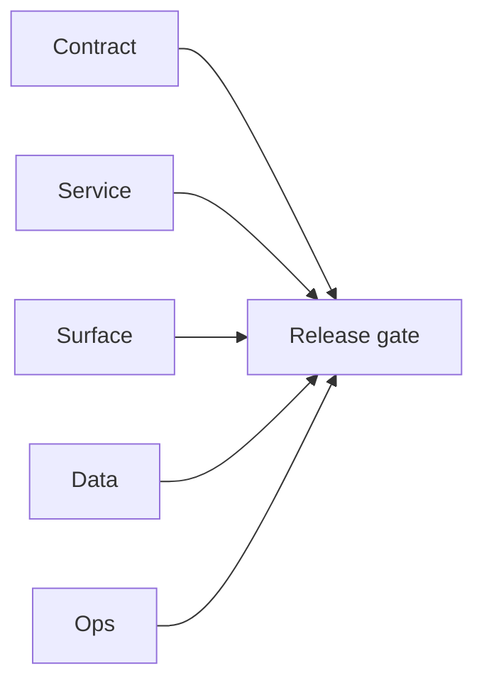

# 4.x Era Docs

Execution guide for Contact360 `4.x.x` era delivery.

## Era objective

- Define and deliver a stable era contract across Contract/Service/Surface/Data/Ops tracks.
- Ensure every patch packet carries closeout evidence before release handoff.

## Master plan artifact (`4.0`–`4.6`)

- [`MINORS_4.0-4.6_MASTER_PLAN_five_tracks.md`](MINORS_4.0-4.6_MASTER_PLAN_five_tracks.md) — scoped keys, rate limits, idempotency called out.

## Minor index

| Minor | Title | Status | Doc |
| --- | --- | --- | --- |
| `4.0` | Harbor | planned | [`4.0 - Harbor`](4.0%20—%20Harbor.md) |
| `4.1` | Auth & Session | planned | [`4.1 - Auth & Session`](4.1%20—%20Auth%20&%20Session.md) |
| `4.2` | Harvest | planned | [`4.2 - Harvest`](4.2%20—%20Harvest.md) |
| `4.3` | Sync Integrity | planned | [`4.3 - Sync Integrity`](4.3%20—%20Sync%20Integrity.md) |
| `4.4` | Extension Telemetry | planned | [`4.4 - Extension Telemetry`](4.4%20—%20Extension%20Telemetry.md) |
| `4.5` | Popup UX | planned | [`4.5 - Popup UX`](4.5%20—%20Popup%20UX.md) |
| `4.6` | Dashboard Integration | planned | [`4.6 - Dashboard Integration`](4.6%20—%20Dashboard%20Integration.md) |
| `4.7` | Campaign Audience | planned | [`4.7 - Campaign Audience`](4.7%20—%20Campaign%20Audience.md) |
| `4.8` | Lens | planned | [`4.8 - Lens`](4.8%20—%20Lens.md) |
| `4.9` | Extension Reliability | planned | [`4.9 - Extension Reliability`](4.9%20—%20Extension%20Reliability.md) |
| `4.10` | Exit Gate | planned | [`4.10 - Exit Gate`](4.10%20—%20Exit%20Gate.md) |

## Patch ladder overview

- `4.0.x`: Charter, Inventory, Drift-scan, Codebase-link, Governance, CI, Docs, Postman, Release-evidence, Seal
- `4.1.x`: Init, Hydrate, Check, Refresh, Persist, Expire, Recover, Revoke, Probe, Seal
- `4.2.x`: Contract, Scrape, Extract, Dedup, Map, Chunk, Connectra, Drift-fix, Load-test, Seal
- `4.3.x`: Chunk, Token, Detect, Merge, Resolve, Apply, Confirm, Report, Archive, Gate
- `4.4.x`: Emit, Ship, Route, Ingest, Alert, Triage, Replay, Report, Calibrate, Freeze
- `4.5.x`: Idle, Start, Extract, Dedup, Submit, Progress, Complete, Summary, Error, Retry
- `4.6.x`: Import, List, History, Stats, Source, Filter, Sort, Drill, Export, Sync
- `4.7.x`: Select, Resolve, Enrich, Suppress, Preview, Confirm, Schedule, Send, Report, Archive
- `4.8.x`: JSONB, Gateway, CSP, Optional-panel, UX, Privacy, Lineage, Ops, Load, Seal
- `4.9.x`: Retry, Backoff, Timeout, Batch, CORS, Rate, Clean, Harden, Certify, Gate
- `4.10.x`: Review, Evidence, Drift-fix, Postman, Docs-sync, Security, Perf, Compliance, RC, Sign-off

## Universal task breakdown

- `Task 1 - Contract`: freeze API contracts, auth boundaries, and error envelopes.
- `Task 2 - Service`: validate runtime health and integration behavior.
- `Task 3 - Surface`: verify UI/UX/admin/extension surface behavior.
- `Task 4 - Data`: verify migrations, index mappings, and lineage references.
- `Task 5 - Ops`: verify CI, rollback path, secrets, and runbooks.
- `Task 6 - Evidence`: close patch gates with links in era docs and versions index.

## Stack references

Framework and stack reference material (rename-safe paths under `docs/tech/`):

- [Go/Gin — why & practices](../tech/tech-go-gin-why-practices.md)
- [Go/Gin — 100-point checklist](../tech/tech-go-gin-checklist-100.md)
- [Next.js — why & practices](../tech/tech-nextjs-why-practices.md)
- [Next.js — 100-point checklist](../tech/tech-nextjs-checklist-100.md)
- [Browser extension — why & practices](../tech/tech-extension-why-practices.md)
- [Browser extension — 100-point checklist](../tech/tech-extension-checklist-100.md)

## Cross-links

- [`docs/README.md`](../README.md)
- [`docs/versions.md`](../versions.md)
- [`docs/architecture.md`](../architecture.md)
- [`contact360.io/root/docs/imported/analysis/README.md`](../../contact360.io/root/docs/imported/analysis/README.md)
## Tasks

### Contract

- ✅ Completed: ✅ Completed: 📌 Planned: **[salesnavigator]** — Diff and document schema for operations like ConnectraClient, LAMBDA_AI_API_URL, LAMBDA_CONNECTRA_API_URL; align with roadmap | area: `backend-api` | files: `docs/backend/apis/*.md`, `contact360.io/api/app/graphql/schema.py` | reason: Keep GraphQL/REST contracts aligned for era 4.0 patch 0.0.0

### Service

- ✅ Completed: ✅ Completed: 📌 Planned: **[salesnavigator]** — Service slice: Era 4 scope per docs/codebases/salesnavigator-codebase-analysis.md | area: `backend-api` | files: `contact360.io/api/app/graphql/modules/`, `contact360.io/api/app/clients/` | reason: Implement or verify runtime behavior for Era 4 scope per docs/codebases/salesnavigator-codebase-analysis.md
- ✅ Completed: ✅ Completed: 📌 Planned: **[appointment360]** — Harden primary worker/gateway integration and failure envelopes | area: `backend-api` | files: `docs/codebases/appointment360-codebase-analysis.md` | reason: P0 band: critical path and idempotency

### Surface

- ✅ Completed: ✅ Completed: 📌 Planned: **[extension]** — Verify UX for route `/email` and bindings (patch 0.0.0 band 0) | area: `frontend-page` | files: `contact360.io/app/...` | reason: Dashboard/extension surface for era 4 must match gateway contracts

### Data

- ✅ Completed: ✅ Completed: 📌 Planned: **[salesnavigator]** — Update PostgreSQL/ES/S3 lineage notes if this patch touches persistence or exports | area: `data-lineage` | files: `docs/backend/database/`, `migrations/` | reason: Migrations, indexes, and lineage evidence for this patch

### Ops

- ✅ Completed: ✅ Completed: 📌 Planned: **[platform]** — Record smoke evidence, rollback, and alerts (patch band 0: charter/P0) | area: `ops` | files: `docs/commands/`, `.github/workflows/` | reason: Smoke, rollback, and observability for patch 0.0.0

## Flowchart

Five-track delivery (contract / service / surface / data / ops) for this doc:

**Master hub:** [`docs/docs/flowchart.md`](../docs/flowchart.md) — cross-system diagrams and era strip (`0.x` → `10.x`).
