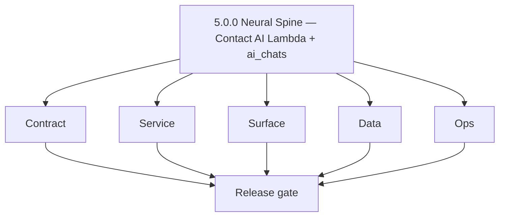
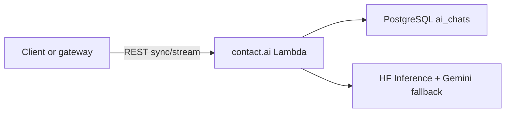

# Version 5.0 — Neural Spine

- **Codename:** Neural Spine
- **Status:** ✅ Completed
- **Target window:** TBD
- **Summary:** AI workflows era gate — `contact.ai` Lambda is wired end-to-end for chat persistence and inference with `HFService` + Gemini routing; shared `ai_chats` PostgreSQL table and REST chat CRUD are production-ready.
- **Scope:** Establish Contact AI service baseline (FastAPI Lambda), auth headers (`X-API-Key`, `X-User-ID`), sync message send, optional SSE stream path, 100-message cap enforcement, and documentation parity with gateway contracts.
- **Roadmap mapping:** `5.0.0` — umbrella / foundation for Era 5; aligns with `docs/versions.md` AI workflows introduction.
- **Owner:** AI Platform + Backend Gateway
- **Patch closure:** Every codenamed patch file includes **Micro-gate** + **Service task slices**. Era hub: [`versions.md`](../versions.md).

## Scope

- Target minor: `5.0.0`
- In scope: Contract, service, surface, data, and ops for **AI spine only** (Contact AI + minimal gateway readiness for AI chats).
- Primary owners: `backend(dev)/contact.ai`, `contact360.io/api` (Appointment360), `contact360.io/app`.
- Exclusions: Full dashboard UX polish (5.1), utility AI hardening (5.2), cost caps (5.3), prompt versioning (5.4).

## Flowchart

Delivery follows the five-track model through an AI-specific release gate.

### Runtime focus (unique to this minor)

See also: [`docs/flowchart.md`](../flowchart.md).

## Task tracks

### Contract

- 📌 Planned: **[contact-ai]** — refine duplicate task (was: 📌 planned: **[contact-ai]** — refine duplicate task (was: ✅ …) | patch `5.0.0` band `0` | reason: specialize this file vs sibling patches; see docs/codebases/contact-ai-codebase-analysis.md
- 📌 Planned: **[contact-ai]** — refine duplicate task (was: ✅ completed: 📌 planned: **appointment360**: document `lambda…) | patch `5.0.0` band `0` | reason: specialize this file vs sibling patches; see docs/codebases/contact-ai-codebase-analysis.md
- 📌 Planned: **[contact-ai]** — refine duplicate task (was: ✅ completed: 📌 planned: **app**: document minimal ai chat da…) | patch `5.0.0` band `0` | reason: specialize this file vs sibling patches; see docs/codebases/contact-ai-codebase-analysis.md

- 📌 Planned: **[contact-ai]** — refine duplicate task (was: 📌 planned: **[architecture]** — product **graphql** remains …) | patch `5.0.0` band `0` | reason: specialize this file vs sibling patches; see docs/codebases/contact-ai-codebase-analysis.md
### Service

- 📌 Planned: **[contact-ai]** — refine duplicate task (was: 📌 planned: **[contact-ai]** — refine duplicate task (was: ✅ …) | patch `5.0.0` band `0` | reason: specialize this file vs sibling patches; see docs/codebases/contact-ai-codebase-analysis.md
- 📌 Planned: **[contact-ai]** — refine duplicate task (was: ✅ completed: 📌 planned: **contact.ai**: implement or stub `p…) | patch `5.0.0` band `0` | reason: specialize this file vs sibling patches; see docs/codebases/contact-ai-codebase-analysis.md
- 📌 Planned: **[contact-ai]** — refine duplicate task (was: ✅ completed: 📌 planned: **appointment360**: wire internal cl…) | patch `5.0.0` band `0` | reason: specialize this file vs sibling patches; see docs/codebases/contact-ai-codebase-analysis.md

- 📌 Planned: **[contact-ai]** — refine duplicate task (was: 📌 planned: **[architecture]** — **go/gin satellites** in sco…) | patch `5.0.0` band `0` | reason: specialize this file vs sibling patches; see docs/codebases/contact-ai-codebase-analysis.md
### Surface

- 📌 Planned: **[contact-ai]** — refine duplicate task (was: ✅ completed: 📌 planned: **app**: optional dev-only or intern…) | patch `5.0.0` band `0` | reason: specialize this file vs sibling patches; see docs/codebases/contact-ai-codebase-analysis.md
- 📌 Planned: **[contact-ai]** — refine duplicate task (was: ✅ completed: 📌 planned: **admin/root**: no product ai surfac…) | patch `5.0.0` band `0` | reason: specialize this file vs sibling patches; see docs/codebases/contact-ai-codebase-analysis.md

- 📌 Planned: **[contact-ai]** — refine duplicate task (was: 📌 planned: **[architecture]** — **next.js** customer surface…) | patch `5.0.0` band `0` | reason: specialize this file vs sibling patches; see docs/codebases/contact-ai-codebase-analysis.md
### Data

- 📌 Planned: **[contact-ai]** — refine duplicate task (was: ✅ completed: 📌 planned: **postgresql**: confirm `ai_chats` c…) | patch `5.0.0` band `0` | reason: specialize this file vs sibling patches; see docs/codebases/contact-ai-codebase-analysis.md
- 📌 Planned: **[contact-ai]** — refine duplicate task (was: ✅ completed: 📌 planned: **jsonb messages**: document element…) | patch `5.0.0` band `0` | reason: specialize this file vs sibling patches; see docs/codebases/contact-ai-codebase-analysis.md

- 📌 Planned: **[contact-ai]** — refine duplicate task (was: 📌 planned: **[architecture]** — **postgresql-first** per `do…) | patch `5.0.0` band `0` | reason: specialize this file vs sibling patches; see docs/codebases/contact-ai-codebase-analysis.md
### Ops

- 📌 Planned: **[contact-ai]** — refine duplicate task (was: ✅ completed: 📌 planned: **contact.ai**: `/health`, `/health/…) | patch `5.0.0` band `0` | reason: specialize this file vs sibling patches; see docs/codebases/contact-ai-codebase-analysis.md
- 📌 Planned: **[contact-ai]** — refine duplicate task (was: ✅ completed: 📌 planned: **secrets**: `hf_api_key`, `gemini_a…) | patch `5.0.0` band `0` | reason: specialize this file vs sibling patches; see docs/codebases/contact-ai-codebase-analysis.md
- ✅ Completed: 📌 Planned: **Privacy (P0):** Implement aggressive PII payload redaction before dumping AI inference traces to `logs.api`.
- ✅ Completed: 📌 Planned: **Confidence:** Embed structured AI-confidence metadata and model origin tracking to all produced labels or drafts prior to storage.
- ✅ Completed: ⬜ Incomplete: **contact360.io/email (Mailhub)** — `src/components/app-sidebar.tsx` has an "Ask AI" nav item in `navSecondary` with `url: "#"` (unimplemented stub); the sidebar entry is user-visible but clicking it navigates nowhere — either wire it to the AI email writer route/modal or hide it behind a feature flag until the AI writer is built.
- ✅ Completed: 📌 Planned: **contact360.io/email (Mailhub)** — implement `AskAI` panel as a drawer or sidebar sheet: given the active email, call a `POST ${BACKEND_URL}/api/ai/draft-reply` endpoint (or the `contact.ai` Lambda URL) to generate a suggested reply draft; integrate with the compose sheet so the AI draft can be edited and sent.
- ✅ Completed: 📌 Planned: **contact360.io/email (Mailhub)** — implement AI-powered email subject-line summarization: in the `DataTable` email list, add an "AI Summary" column (opt-in) that calls a summarization endpoint for the email body preview; cache summaries in `localStorage` to avoid re-fetching on every render.
- ✅ Completed: ⬜ Incomplete: **contact360.io/app (Dashboard)** — `app/(dashboard)/ai-chat/page.tsx` uses a local `mockSend()` function that returns a hardcoded string `"Based on your CRM data, I can provide insights and recommendations. This is a simulated response from the Contact360 intelligence engine. Connect to the real API for live analysis."` — no real AI endpoint is called; wire the AI chat page to the `contact.ai` Lambda URL or the GraphQL AI module to enable real conversational intelligence.
- ✅ Completed: ⬜ Incomplete: **contact360.io/app (Dashboard)** — `app/(dashboard)/live-voice/page.tsx` uses hardcoded `MOCK_TRANSCRIPTIONS` with fake AI responses; the microphone toggle sets `isActive = true` and renders mock bars but never opens a WebRTC connection, WebSocket, or calls any speech-to-text API — implement a real Voice Link connection using the WebSpeech API or WebRTC to stream user audio to `contact.ai` and render live transcription.
- ✅ Completed: 📌 Planned: **contact360.io/app (Dashboard)** — implement conversation history persistence for AI Chat: `ai-chat/page.tsx` stores `chats` and `messages` in local component state only; sessions are lost on page reload — persist chat sessions to the backend (GraphQL AI module or `localStorage` with TTL) so users can resume previous conversations.
- ✅ Completed: 📌 Planned: **contact360.io/app (Dashboard)** — wire "Quick Prompts" in AI Chat page to real backend: the four quick prompts ("Analyze Q3 Revenue Velocity", "Extract Decision Maker Traces", "Draft Outreach Script", "Market Shift Predictions") currently call `mockSend()`; each should route to a specialized prompt template in `contact.ai` that has access to the user's CRM data context.

- 📌 Planned: **[contact-ai]** — refine duplicate task (was: 📌 planned: **[architecture]** — **observability**: correlate…) | patch `5.0.0` band `0` | reason: specialize this file vs sibling patches; see docs/codebases/contact-ai-codebase-analysis.md
## Task breakdown — version `5.0.0` per-service slices

### contact.ai

- Contract: Align `ModelSelection` / Pydantic schemas with documented HF router IDs; eliminate `/gemini/` path drift in code and docs.
- Service: Deterministic error envelopes for inference failures; timeout and retry policy in `HFService`.
- Data: User isolation on all chat routes via `X-User-ID`.
- Ops: Lambda cold-start and concurrency limits documented.

### appointment360 (contact360.io/api)

- Contract: Internal-only REST contract to Contact AI matches matrix file.
- Service: `LambdaAIClient` methods callable from resolvers (may ship in 5.0 or 5.1; document dependency).

### app (contact360.io/app)

- Surface: If any stub route exists, it must not ship broken GraphQL assumptions.

## Immediate next execution queue

- 📌 Planned: Run golden path: create chat → send sync message → verify `ai_chats.messages` append.
- 📌 Planned: Archive one SSE trace for `message/stream` if enabled.
- 📌 Planned: Cross-check `docs/backend/apis/17_AI_CHATS_MODULE.md` vs implemented REST.
- 📌 Planned: Add CI smoke for Contact AI health + DB connectivity.

## Cross-service ownership

| Service | 5.0.0 focus |
| --- | --- |
| `backend(dev)/contact.ai` | Chat CRUD + sync inference + SSE + DB |
| `contact360.io/api` | Lambda client + config for Contact AI |
| `contact360.io/app` | Minimal or deferred UI until 5.1 |

## References

- [`docs/versions.md`](../versions.md)
- [`docs/roadmap.md`](../roadmap.md)
- [`docs/version-policy.md`](../version-policy.md)
- [`docs/architecture.md`](../architecture.md)
- [`docs/codebases/contact-ai-codebase-analysis.md`](../codebases/contact-ai-codebase-analysis.md)
- [`docs/backend/apis/17_AI_CHATS_MODULE.md`](../backend/apis/17_AI_CHATS_MODULE.md)

## Backend API and endpoint scope

- Era: `5.x`
- Primary matrix: [`docs/backend/endpoints/contact_ai_endpoint_era_matrix.json`](../backend/endpoints/contact_ai_endpoint_era_matrix.json)
- Contract focus for `5.0.0`: chat list/create/get/put/delete + sync message (+ stream if live).

## Database and data lineage

- Table: `ai_chats` — see [`docs/backend/database/contact_ai_data_lineage.md`](../backend/database/contact_ai_data_lineage.md)

## Frontend UX surface scope

- Full dashboard journey: [`docs/frontend/pages/ai_chat_page.json`](../frontend/pages/ai_chat_page.json) (primary delivery **5.1.0**)
- UI binding reference: [`docs/frontend/docs/contact-ai-ui-bindings.md`](../frontend/docs/contact-ai-ui-bindings.md)

Frontend components and hooks (5.0 baseline):

- **Components:** `AIChatPage`, `StreamingText`, `AiConfidenceBadge`, `ModelSelector`, `AiRiskBadge`, `CompanySummaryCard`
- **Hooks:** `useAiChat`, `useAiChatList`, `useAiSendMessage`, `useAiStreamMessage`
- **Context:** `AiChatContext` (active chat state, model selection, streaming state)

## Release gate and evidence

- 📌 Planned: REST contract review vs matrix JSON
- 📌 Planned: DB migration / table present in target env
- 📌 Planned: At least one E2E trace: create → message → read chat
- 📌 Planned: Docs updated (`ai-workflows.md`, gateway docs)

## Master task checklist

### Backend

- 📌 Planned: All chat endpoints listed and authz verified
- 📌 Planned: Message cap and validation documented

### Data

- 📌 Planned: Lineage: API → `ai_chats` → UI (future)

### Frontend (5.0 optional)

- 📌 Planned: Any stub bound to correct types

### Validation

- 📌 Planned: Owner signoff + evidence links attached

### Micro-gate reference (apply at every `5.N.P`)

| Track | Gate question (must answer Yes or document waiver) |
| --- | --- |
| **Contract** | Contact AI REST, GraphQL AI module, model mapping — `docs/backend/apis/` + endpoint matrices updated? |
| **Service** | `contact.ai`, `LambdaAIClient`, jobs AI envelope — smoke + message caps / idempotency? |
| **Surface** | Dashboard `/ai-chat`, utilities, admin AI — user-visible delta? |
| **Frontend** | Routes/hooks per `contact-ai-ui-bindings.md` / pages JSON? |
| **Data** | `ai_chats`, prompts, S3 AI artifacts — migrations + lineage docs? |
| **Ops** | AI cost/telemetry in `logs.api`, alerts, runbooks — recorded? |
| **Architecture** | Go/Gin satellites only via Python GraphQL gateway (`contact360.io/api`); Next.js `NEXT_PUBLIC_GRAPHQL_URL`; Postgres-first / Redis exit per `docs/docs/data-stores-postgres.md`. |

**Patch ladder:** Codenames `Void` → `Bloom` per minor (`.0`–`.9`) — see patch table below.

## Patches

| Patch | Codename | Doc |
| --- | --- | --- |
| `5.0.0` | Void | [`5.0.0` — Void](5.0.0 — Void.md) |
| `5.0.1` | Seed | [`5.0.1` — Seed](5.0.1 — Seed.md) |
| `5.0.2` | Sprout | [`5.0.2` — Sprout](5.0.2 — Sprout.md) |
| `5.0.3` | Roots | [`5.0.3` — Roots](5.0.3 — Roots.md) |
| `5.0.4` | Soil | [`5.0.4` — Soil](5.0.4 — Soil.md) |
| `5.0.5` | Rain | [`5.0.5` — Rain](5.0.5 — Rain.md) |
| `5.0.6` | Stem | [`5.0.6` — Stem](5.0.6 — Stem.md) |
| `5.0.7` | Branch | [`5.0.7` — Branch](5.0.7 — Branch.md) |
| `5.0.8` | Leaf | [`5.0.8` — Leaf](5.0.8 — Leaf.md) |
| `5.0.9` | Bloom | [`5.0.9` — Bloom](5.0.9 — Bloom.md) |

## Patch ladder (5.0.0 - 5.0.9)

### Micro-gate reference (apply at every patch)

| Track | Gate question (must answer Yes or waiver) |
| --- | --- |
| **Contract** | Contract/API change captured with diff or explicit no-change note |
| **Service** | Service health and smoke for affected paths pass |
| **Surface** | UI/admin/extension impact documented or N/A |
| **Frontend** | Routes/components/hooks affected listed or N/A |
| **Data** | Migrations/index/lineage deltas linked or N/A |
| **Ops** | Rollback/secrets/CI/runbook delta linked or N/A |

**Patch intent bands:** `.0` charter, `.1-.2` scaffold, `.3-.5` hardening, `.6-.8` integration, `.9` freeze/handoff.

| Patch | Codename | Focus | Evidence gate |
| --- | --- | --- | --- |
| `5.0.0` | Void | Charter: AI service scope + auth model freeze | Charter artifact + REST path table linked |
| `5.0.1` | Seed | HFService model chain + Gemini fallback routing | Model selection smoke test passing |
| `5.0.2` | Sprout | SSE streaming: `POST .../message/stream` implementation | SSE stream produces `data: <chunk>` + `data: [DONE]` |
| `5.0.3` | Roots | Chat CRUD: create/list/get/update/delete endpoints | Chat CRUD golden path trace archived |
| `5.0.4` | Soil | Message persistence: `ai_chats.messages` JSONB append | 100-message cap enforced; JSONB validation passing |
| `5.0.5` | Rain | PII redaction: strip sensitive data before `logs.api` | Inference trace contains no PII fields |
| `5.0.6` | Stem | Confidence scoring: metadata + model origin tracking | AI response includes `confidence` + `model_id` fields |
| `5.0.7` | Branch | Gateway client: `LambdaAIClient` wiring in appointment360 | Gateway → Contact AI round-trip smoke passing |
| `5.0.8` | Leaf | Dashboard stub: `/ai-chat` route renders without errors | `AIChatPage` component loads with empty chat list |
| `5.0.9` | Bloom | Release gate: contract review + docs sync + handoff | Handoff documented for **5.1 Orchestration Live** |

## Release Gate and Evidence

### Master Task Checklist
- 📌 Planned: Track-level closure evidence linked

### Backend API and Endpoints
- 📌 Planned: Endpoint/contract parity verified
- ✅ Completed: **contact360.io/api** — `app/graphql/modules/ai_chats/` fully implemented: `createAIChat`, `sendMessage`, `updateAIChat`, `deleteAIChat`, `deleteAllAIChats`, `generateCompanySummary`, `analyzeEmailRisk`, `parseFilters` mutations + `aiChats`, `aiChat` queries — all backed by `LambdaAIClient`.
- ✅ Completed: **contact360.io/api** — `app/clients/lambda_ai_client.py` proxies to `LAMBDA_AI_API_URL` with `LAMBDA_AI_API_KEY`; supports `send_message`, `create_chat`, `generate_company_summary`, `analyze_email_risk`, `parse_filters` methods.
- ✅ Completed: **contact360.io/api** — `app/graphql/modules/resume/` implements `saveResume`, `deleteResume` mutations + `getResume`, `listResumes` queries — all proxied to `resume_ai_client.py` → `RESUME_AI_BASE_URL`.
- ⬜ Incomplete: **contact360.io/api** — `LAMBDA_AI_API_KEY` is `None` by default in `config.py` (`LAMBDA_AI_API_KEY: str | None = Field(None, ...)`); production `.env` also does not populate it (not visible in the 106-line `.env`) — verify the Lambda AI API key is provisioned and set before enabling AI features in production.
- 📌 Planned: **contact360.io/api** — `app/graphql/modules/ai_chats/mutations.py` has `parseFilters` mutation that converts natural language to VQL — add integration tests against the Lambda AI endpoint to validate VQL output correctness before exposing to production users.
- 📌 Planned: **contact360.io/api** — Resume AI microservice (`RESUME_AI_BASE_URL=http://127.0.0.1:8080/v1`) is configured as `localhost` — this means resume features only work when `resumeai` is co-deployed on the same host; containerize or expose as a separate service with proper DNS.

### Database and Data Lineage
- 📌 Planned: Migration and lineage references linked
- ✅ Completed: **contact360.io/api** — `app/models/user.py` includes `ai_chats` and `ai_chat_messages` tables (JSONB messages array) — AI chat history is persisted in PostgreSQL, not just Lambda state.

### Frontend UX
- 📌 Planned: UX/route behavior evidence linked
- ✅ Completed: **contact360.io/admin** — `ai_agent/views.py` implements `chat_view` (AI chat interface backed by `AIService`), `sessions_view` (list/manage AI chat sessions), `stream_message` (SSE streaming via Lambda AI), `analyze_codebase` — all protected by `@require_super_admin`.
- ✅ Completed: **contact360.io/admin** — `ai_agent/services/ai_service.py` routes messages to Lambda AI, OpenAI, or Gemini depending on which keys are configured (`LAMBDA_AI_API_URL`, `OPENAI_API_KEY`, `GEMINI_API_KEY`); `AISessionStorageService` persists sessions and messages to S3 (`S3_AUTH_STORAGE_ENABLED`).
- ✅ Completed: **contact360.io/admin** — `AILearningSession` model tracks AI learning jobs (patterns_learned, status, started_at/completed_at); backed by Django ORM + SQLite/PostgreSQL.
- ⬜ Incomplete: **contact360.io/admin** — `ai_agent` AI routing logic uses S3 (`S3_AUTH_STORAGE_ENABLED=True` in `.env`) but `USE_LOCAL_JSON_FILES=True` is also set — there is a potential conflict between local and S3 storage for AI session persistence; verify S3 session writes are working correctly in production and that sessions survive across Gunicorn worker restarts.
- 📌 Planned: **contact360.io/admin** — Admin AI agent `analyze_codebase` endpoint triggers AI analysis of the project codebase — add progress tracking (via `AILearningSession` model) with a real-time status page so SuperAdmins can monitor in-progress analyses without raw log polling.
- ✅ Completed: **backend(dev)/contact.ai** — FastAPI Lambda microservice implementing the full AI chat backend: `POST /api/v1/ai-chats/` (create chat), `GET /api/v1/ai-chats/` (list with pagination + filters), `GET /api/v1/ai-chats/{id}/` (get chat with messages), `PUT /api/v1/ai-chats/{id}/` (update title/messages), `DELETE /api/v1/ai-chats/{id}/` (delete), `POST /api/v1/ai-chats/{id}/message` (send message + get AI response), `POST /api/v1/ai-chats/{id}/message/stream` (SSE streaming) — all persisted to `ai_chats` PostgreSQL table.
- ✅ Completed: **backend(dev)/contact.ai** — `HFService` implements Hugging Face inference via `router.huggingface.co/v1/chat/completions` (OpenAI-compatible): multi-model fallback chain (`HF_FALLBACK_MODELS`), exponential backoff retry (up to `HF_MAX_RETRIES=3`), 503 model-loading wait, 429 rate-limit backoff, per-process model rejection tracking (unsupported models are permanently skipped for process lifetime).
- ✅ Completed: **backend(dev)/contact.ai** — SSE streaming via `POST /api/v1/ai-chats/{id}/message/stream` — user message and full assembled AI response are persisted to PostgreSQL after stream completes (lines 422–423 in `ai_chat_service.py`); streaming uses `generate_chat_response_stream()` with `text/event-stream` media type and `[DONE]` termination marker.
- ✅ Completed: **backend(dev)/contact.ai** — `NexusAI` system instruction configures the AI as a CRM assistant for Contact360: helps with finding contacts, searching leads, company insights, CRM data queries, and natural language criteria (set via `HF_SYSTEM_INSTRUCTION` env var — fully overridable per deployment).
- ⬜ Incomplete: **backend(dev)/contact.ai** — `HF_EMBED_MODEL=sentence-transformers/all-MiniLM-L6-v2` is configured in `.env` but there is **no embedding service, endpoint, or usage anywhere** in the codebase — the embedding model is provisioned but no semantic search, RAG, or vector embedding pipeline exists; implement an `/api/v1/ai/embed` endpoint or remove the unused config.
- ⬜ Incomplete: **backend(dev)/contact.ai** — `send_message_stream` endpoint does not update the chat `title` when the title is empty (new chat) — non-streaming `send_message` also does not auto-generate a title from the first user message; implement auto-title generation (first 6 words of first user message, or LLM-generated title) for untitled chats.
- 📌 Planned: **backend(dev)/contact.ai** — Add a `POST /api/v1/ai/embed` endpoint using `HF_EMBED_MODEL` (sentence-transformers) to generate vector embeddings for contact/company text — enables semantic similarity search, RAG pipelines, and "find contacts like this" features for Contact360.
- 📌 Planned: **backend(dev)/contact.ai** — Add a `POST /api/v1/ai/contacts/query` endpoint that accepts a natural language query, calls `parse_contact_filters`, and returns a structured VQL search object ready for `contact360.io/api` — closing the loop between NLP input and Connectra contact search.

### UI Elements
- 📌 Planned: Components/checklist closeout captured

### Flow and Graph
- 📌 Planned: Runtime graph reflects implementation

### Validation
- 📌 Planned: Smoke/CI/lint checks recorded

### Release Gate
- 📌 Planned: Minor ready for handoff to next minor
