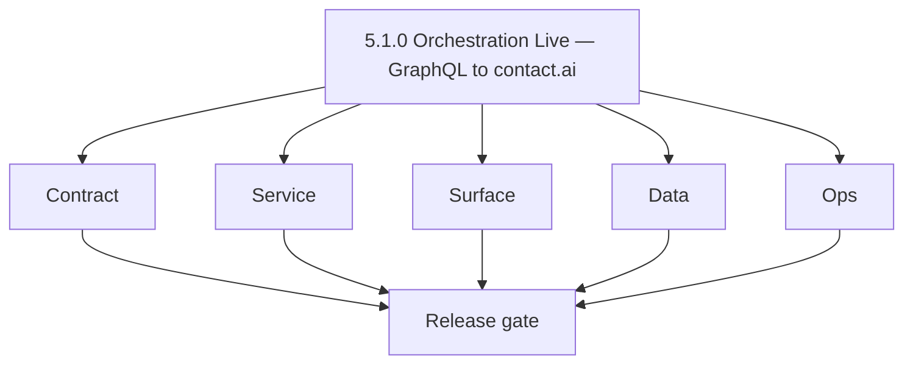
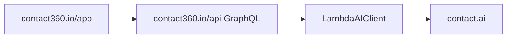

# Version 5.1 — Orchestration Live

- **Codename:** Orchestration Live
- **Status:** ✅ Completed
- **Target window:** TBD
- **Summary:** Contact AI is integrated into **dashboard journeys**: GraphQL `aiChats` / `aiChat`, `createAIChat`, `sendAiMessage` (and related mutations) call Contact AI via `LambdaAIClient`; `/ai-chat` experience is shippable with model selection and streaming readiness.
- **Scope:** End-user-visible AI chat in `contact360.io/app`; credit deduction and product rules at gateway; parity with [`17_AI_CHATS_MODULE.md`](../backend/apis/17_AI_CHATS_MODULE.md).
- **Roadmap mapping:** Stage **5.1** — Contact AI integration in dashboard journeys (`docs/roadmap.md`).
- **Owner:** Dashboard + API + AI Platform
- **Patch closure:** Every codenamed patch file includes **Micro-gate** + **Service task slices**. Era hub: [`versions.md`](../versions.md).

## Scope

- Target minor: `5.1.0`
- In scope: Graph ↔ Contact AI orchestration, dashboard page shell (sidebar, header, messages, input), model override wiring, SSE optional path via client.
- Depends on: `5.0.0` Neural Spine (Contact AI REST baseline).

## Flowchart

### Runtime focus

## Task tracks

### Contract

- 📌 Planned: **[contact-ai]** — refine duplicate task (was: 📌 planned: **[contact-ai]** — refine duplicate task (was: ✅ …) | patch `5.1.0` band `0` | reason: specialize this file vs sibling patches; see docs/codebases/contact-ai-codebase-analysis.md
- 📌 Planned: **[contact-ai]** — refine duplicate task (was: ✅ completed: 📌 planned: **appointment360**: credit mutation …) | patch `5.1.0` band `0` | reason: specialize this file vs sibling patches; see docs/codebases/contact-ai-codebase-analysis.md

- 📌 Planned: **[contact-ai]** — refine duplicate task (was: 📌 planned: **[architecture]** — product **graphql** remains …) | patch `5.1.0` band `0` | reason: specialize this file vs sibling patches; see docs/codebases/contact-ai-codebase-analysis.md
### Service

- 📌 Planned: **[contact-ai]** — refine duplicate task (was: 📌 planned: **[contact-ai]** — refine duplicate task (was: ✅ …) | patch `5.1.0` band `0` | reason: specialize this file vs sibling patches; see docs/codebases/contact-ai-codebase-analysis.md
- 📌 Planned: **[contact-ai]** — refine duplicate task (was: ✅ completed: 📌 planned: **contact.ai**: stable latency and e…) | patch `5.1.0` band `0` | reason: specialize this file vs sibling patches; see docs/codebases/contact-ai-codebase-analysis.md

- 📌 Planned: **[contact-ai]** — refine duplicate task (was: 📌 planned: **[architecture]** — **go/gin satellites** in sco…) | patch `5.1.0` band `0` | reason: specialize this file vs sibling patches; see docs/codebases/contact-ai-codebase-analysis.md
### Surface

- 📌 Planned: **[contact-ai]** — refine duplicate task (was: ✅ completed: 📌 planned: **app**: [`ai_chat_page.json`](../fr…) | patch `5.1.0` band `0` | reason: specialize this file vs sibling patches; see docs/codebases/contact-ai-codebase-analysis.md
- 📌 Planned: **[contact-ai]** — refine duplicate task (was: ✅ completed: 📌 planned: **app**: loading/error/toast pattern…) | patch `5.1.0` band `0` | reason: specialize this file vs sibling patches; see docs/codebases/contact-ai-codebase-analysis.md
- 📌 Planned: **[contact-ai]** — refine duplicate task (was: ✅ completed: 📌 planned: **bindings**: [`contact-ai-ui-bindin…) | patch `5.1.0` band `0` | reason: specialize this file vs sibling patches; see docs/codebases/contact-ai-codebase-analysis.md

- 📌 Planned: **[contact-ai]** — refine duplicate task (was: 📌 planned: **[architecture]** — **next.js** customer surface…) | patch `5.1.0` band `0` | reason: specialize this file vs sibling patches; see docs/codebases/contact-ai-codebase-analysis.md
### Data

- 📌 Planned: **[contact-ai]** — refine duplicate task (was: ✅ completed: 📌 planned: persisted chats remain user-scoped; …) | patch `5.1.0` band `0` | reason: specialize this file vs sibling patches; see docs/codebases/contact-ai-codebase-analysis.md

- 📌 Planned: **[contact-ai]** — refine duplicate task (was: 📌 planned: **[architecture]** — **postgresql-first** per `do…) | patch `5.1.0` band `0` | reason: specialize this file vs sibling patches; see docs/codebases/contact-ai-codebase-analysis.md
### Ops

- 📌 Planned: **[contact-ai]** — refine duplicate task (was: ✅ completed: 📌 planned: dashboard smoke: login → `/ai-chat` …) | patch `5.1.0` band `0` | reason: specialize this file vs sibling patches; see docs/codebases/contact-ai-codebase-analysis.md
- 📌 Planned: **[contact-ai]** — refine duplicate task (was: ✅ completed: 📌 planned: metrics: graphql error rate to conta…) | patch `5.1.0` band `0` | reason: specialize this file vs sibling patches; see docs/codebases/contact-ai-codebase-analysis.md

- 📌 Planned: **[contact-ai]** — refine duplicate task (was: 📌 planned: **[architecture]** — **observability**: correlate…) | patch `5.1.0` band `0` | reason: specialize this file vs sibling patches; see docs/codebases/contact-ai-codebase-analysis.md
## Per-service slices (5.1.0)

### appointment360

- Contract: `17_AI_CHATS_MODULE.md` parity.
- Service: Credit deduction hooks; no double-charge on retry idempotency (document behavior).

### app

- Surface: Model picker, new chat, delete chat, message list virtualization if needed.
- Hooks/services: align with [`hooks-services-contexts.md`](../frontend/hooks-services-contexts.md).

### contact.ai

- Service: Support production concurrency; optional streaming from UI if product chooses SSE path.

## Immediate next execution queue

- 📌 Planned: E2E: create chat from UI → message → refresh → history intact.
- 📌 Planned: Align `ModelSelection` enum across GraphQL schema and Contact AI (`contact-ai-codebase-analysis.md`).
- 📌 Planned: Update Postman / internal collections under `docs/backend/postman` if present.

## Cross-service ownership

| Service | 5.1.0 focus |
| --- | --- |
| `contact360.io/api` | GraphQL AI chat resolvers + credits |
| `contact360.io/app` | `/ai-chat` product-ready |
| `backend(dev)/contact.ai` | Production inference path |

## References

- [`docs/roadmap.md`](../roadmap.md) — Stage 5.1
- [`docs/frontend/contact-ai-ui-bindings.md`](../frontend/contact-ai-ui-bindings.md)
- [`docs/codebases/appointment360-codebase-analysis.md`](../codebases/appointment360-codebase-analysis.md)

## Backend API scope

- GraphQL: [`17_AI_CHATS_MODULE.md`](../backend/apis/17_AI_CHATS_MODULE.md)
- REST proxy targets: [`contact_ai_endpoint_era_matrix.json`](../backend/endpoints/contact_ai_endpoint_era_matrix.json)

## Database

- `ai_chats` — user isolation, messages JSONB.

## Frontend scope

- Primary: `/ai-chat` plus nav links from shell.

## Release gate

- 📌 Planned: GraphQL schema reviewed
- 📌 Planned: UI smoke with screenshots or video trace
- 📌 Planned: Credit behavior validated on staging

## Master checklist

- 📌 Planned: Mutations: createAIChat, sendAiMessage, utility mutations deferred to 5.2 or flagged
- 📌 Planned: RBAC: user sees only own chats
- 📌 Planned: Error states: inference failure copy and retry

### Micro-gate reference (apply at every `5.N.P`)

| Track | Gate question (must answer Yes or document waiver) |
| --- | --- |
| **Contract** | Contact AI REST, GraphQL AI module, model mapping — `docs/backend/apis/` + endpoint matrices updated? |
| **Service** | `contact.ai`, `LambdaAIClient`, jobs AI envelope — smoke + message caps / idempotency? |
| **Surface** | Dashboard `/ai-chat`, utilities, admin AI — user-visible delta? |
| **Frontend** | Routes/hooks per `contact-ai-ui-bindings.md` / pages JSON? |
| **Data** | `ai_chats`, prompts, S3 AI artifacts — migrations + lineage docs? |
| **Ops** | AI cost/telemetry in `logs.api`, alerts, runbooks — recorded? |
| **Architecture** | Go/Gin satellites only via Python GraphQL gateway (`contact360.io/api`); Next.js `NEXT_PUBLIC_GRAPHQL_URL`; Postgres-first / Redis exit per `docs/docs/data-stores-postgres.md`. |

**Patch ladder:** Codenames `Void` → `Bloom` per minor (`.0`–`.9`) — see patch table below.

## Patches

| Patch | Codename | Doc |
| --- | --- | --- |
| `5.1.0` | Void | [`5.1.0` — Void](5.1.0 — Void.md) |
| `5.1.1` | Seed | [`5.1.1` — Seed](5.1.1 — Seed.md) |
| `5.1.2` | Sprout | [`5.1.2` — Sprout](5.1.2 — Sprout.md) |
| `5.1.3` | Roots | [`5.1.3` — Roots](5.1.3 — Roots.md) |
| `5.1.4` | Soil | [`5.1.4` — Soil](5.1.4 — Soil.md) |
| `5.1.5` | Rain | [`5.1.5` — Rain](5.1.5 — Rain.md) |
| `5.1.6` | Stem | [`5.1.6` — Stem](5.1.6 — Stem.md) |
| `5.1.7` | Branch | [`5.1.7` — Branch](5.1.7 — Branch.md) |
| `5.1.8` | Leaf | [`5.1.8` — Leaf](5.1.8 — Leaf.md) |
| `5.1.9` | Bloom | [`5.1.9` — Bloom](5.1.9 — Bloom.md) |

## Patch ladder (5.1.0 - 5.1.9)

### Micro-gate reference (apply at every patch)

| Track | Gate question (must answer Yes or waiver) |
| --- | --- |
| **Contract** | Contract/API change captured with diff or explicit no-change note |
| **Service** | Service health and smoke for affected paths pass |
| **Surface** | UI/admin/extension impact documented or N/A |
| **Frontend** | Routes/components/hooks affected listed or N/A |
| **Data** | Migrations/index/lineage deltas linked or N/A |
| **Ops** | Rollback/secrets/CI/runbook delta linked or N/A |

**Patch intent bands:** `.0` charter, `.1-.2` scaffold, `.3-.5` hardening, `.6-.8` integration, `.9` freeze/handoff.

| Patch | Codename | Focus | Evidence gate |
| --- | --- | --- | --- |
| `5.1.0` | Void | patch focus | charter artifact linked |
| `5.1.1` | Seed | patch focus | closeout evidence attached |
| `5.1.2` | Sprout | patch focus | closeout evidence attached |
| `5.1.3` | Roots | patch focus | closeout evidence attached |
| `5.1.4` | Soil | patch focus | closeout evidence attached |
| `5.1.5` | Rain | patch focus | closeout evidence attached |
| `5.1.6` | Stem | patch focus | closeout evidence attached |
| `5.1.7` | Branch | patch focus | closeout evidence attached |
| `5.1.8` | Leaf | patch focus | closeout evidence attached |
| `5.1.9` | Bloom | patch focus | handoff documented |

## Release Gate and Evidence

### Master Task Checklist
- 📌 Planned: Track-level closure evidence linked

### Backend API and Endpoints
- 📌 Planned: Endpoint/contract parity verified

### Database and Data Lineage
- 📌 Planned: Migration and lineage references linked

### Frontend UX
- 📌 Planned: UX/route behavior evidence linked

### UI Elements
- 📌 Planned: Components/checklist closeout captured

### Flow and Graph
- 📌 Planned: Runtime graph reflects implementation

### Validation
- 📌 Planned: Smoke/CI/lint checks recorded

### Release Gate
- 📌 Planned: Minor ready for handoff to next minor
