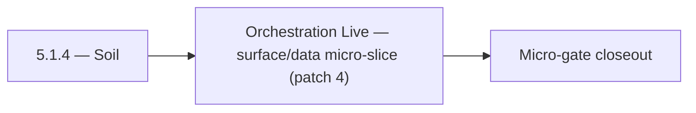

# 5.1.4 — Soil

- **Era:** `5.x` AI workflows — hub [`versions.md`](../versions.md) · minors start at [`5.0 — Neural Spine`](5.0%20%E2%80%94%20Neural%20Spine.md)
- **Minor:** [5.1 — Orchestration Live](./5.1 — Orchestration Live.md)
- **Codename:** Soil
- **Status:** planned

## Focus
Orchestration Live — surface/data micro-slice (patch 4)

## Flowchart

## Micro-gate

| Track | Gate question | Answer / Evidence (fill at patch closeout) |
| --- | --- | --- |
| **Contract** | Contact AI REST, GraphQL AI module, HF/model mapping — `docs/backend/apis/` + matrices updated? | Document at patch closeout. |
| **Service** | `contact.ai` inference, gateway `LambdaAIClient`, jobs AI path — smoke + caps documented? | Document smoke paths. |
| **Surface** | Dashboard AI chat, utilities, admin AI flows changed? | Document UX delta or N/A. |
| **Frontend** | Which routes/hooks (`contact-ai-ui-bindings`, pages JSON) for this patch? | `/ai-chat`, GraphQL AI chats, streaming client hooks. Document at closeout. |
| **Data** | `ai_chats`, prompts, S3 AI artifacts — migrations + lineage? | Document lineage or N/A. |
| **Ops** | `logs.api` AI events, cost/error alerts, runbooks — delta recorded? | Document ops delta or N/A. |

## Tasks
### Surface
- 📌 Planned: **app**: [`ai_chat_page.json`](../frontend/pages/ai_chat_page.json) components: `ChatSidebar`, `ChatHeader`, `ChatMessagesList`, `ChatWelcomeOrInput`.
- 📌 Planned: Build `AIChatPage` (`/app/ai-chat`): `ChatList` + `ChatThread` layout.
- 📌 Planned: Implement `ChatInput` textarea with send button; disabled while streaming.
- 📌 Planned: Implement `NewChatButton`: creates chat and redirects to `ChatThread`.

### Data
- 📌 Planned: Persisted chats remain user-scoped; title updates from UI reflected in `ai_chats`.
- 📌 Planned: **PostgreSQL authority:** Document which fields are authoritative vs search-only for AI grounding.
- 📌 Planned: Confirm `user_id` ownership check on every read/write/delete operation.
- 📌 Planned: Add retention policy for AI-derived summaries.

## Service task slices
> Merged from era `5.x` AI workflow task packs (P0→`.0`–`.2`, P1→`.3`–`.6`, Ops→`.7`–`.9`).

### contact.ai
- Build `AIChatPage` (`/app/ai-chat`): `ChatList` + `ChatThread` layout.
- Implement `ChatList` with pagination: uses `useChatList` hook.
- Implement `ChatThread` with message rendering: `ChatMessage` + `ContactsInMessage`.
- Implement `ChatInput` textarea with send button; disabled while streaming.
- Implement `StreamingText`: token-by-token rendering via SSE; cursor blink during stream.
- Implement `ModelSelector` dropdown with all 4 model options; persist choice in `AIModelContext`.
- Implement `NewChatButton`: creates chat and redirects to `ChatThread`.
- Implement `ChatContextMenu`: rename (PUT) and delete (DELETE) chat actions.
- Wire `EmailRiskBadge`, `CompanySummaryTab`, `AIFilterInput` to live endpoints.
- Loading states: skeleton for chat list, spinner for send, shimmer for utilities.
- Validate `messages` JSONB schema in `AIChatService` before persist: max 100 messages, valid sender, max text length.
- Add `model_version` field to AI message metadata in JSONB (for reproducibility).
- Confirm `user_id` ownership check on every read/write/delete operation.
- Test concurrent message send (two requests to same `chat_id`): document behavior; add optimistic lock if needed.
- Complete all chat CRUD endpoints: `GET/POST /api/v1/ai-chats/`, `GET/PUT/DELETE /api/v1/ai-chats/{id}/`.
- Implement `POST /api/v1/ai-chats/{id}/message` (sync) with full `AIChatService` orchestration.
- Implement `POST /api/v1/ai-chats/{id}/message/stream` (SSE streaming) via `HFService` async generator.
- Implement `HFService` model routing: `ModelSelection` enum → HF model ID; default from `HF_CHAT_MODEL` env.
- Implement Gemini fallback: if HF inference fails after N retries, call Gemini API.
- Enforce 100-message-per-chat cap in `AIChatService`.
- All utility endpoints fully implemented and tested: `analyzeEmailRisk`, `generateCompanySummary`, `parseContactFilters`.
- Implement `messages` JSONB strict validation (max text length, valid sender values, max contacts).

### Appointment360 (gateway)
- Document AI chats module in docs/backend/apis/17_AI_CHATS_MODULE.md
- Document resume module in docs/backend/apis/18_RESUME_MODULE.md
- Email campaign compose screen, risk analysis → mutation analyzeEmailRisk
- Filter builder natural-language input → mutation parseContactFilters
- Resume builder page → query resumes() + mutation createResume / updateResume
- SSE / streaming support for sendAiMessage (if contact.ai returns chunked response)
- Loading skeleton while AI response is streamed
- useCompanySummary hook: trigger + poll generation
- Create resumes table: uuid, user_uuid, content JSON, template_id, created_at
- Store parseContactFilters parsed VQL in saved_searches if user saves it
- Configure RESUME_AI_BASE_URL, RESUME_AI_API_KEY
- Write integration test: createAiChat → sendAiMessage → aiChat(uuid) round-trip
- Write contract test: generateCompanySummary → LambdaAI REST call

## Evidence gate
Patch closeout includes contract diff, smoke output, data lineage delta, and ops note
