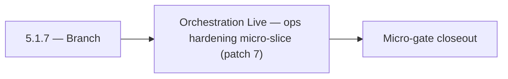

# 5.1.7 — Branch

- **Era:** `5.x` AI workflows — hub [`versions.md`](../versions.md) · minors start at [`5.0 — Neural Spine`](5.0%20%E2%80%94%20Neural%20Spine.md)
- **Minor:** [5.1 — Orchestration Live](./5.1 — Orchestration Live.md)
- **Codename:** Branch
- **Status:** planned

## Focus
Orchestration Live — ops hardening micro-slice (patch 7)

## Flowchart

## Micro-gate

| Track | Gate question | Answer / Evidence (fill at patch closeout) |
| --- | --- | --- |
| **Contract** | Contact AI REST, GraphQL AI module, HF/model mapping — `docs/backend/apis/` + matrices updated? | Document at patch closeout. |
| **Service** | `contact.ai` inference, gateway `LambdaAIClient`, jobs AI path — smoke + caps documented? | Document smoke paths. |
| **Surface** | Dashboard AI chat, utilities, admin AI flows changed? | Document UX delta or N/A. |
| **Frontend** | Which routes/hooks (`contact-ai-ui-bindings`, pages JSON) for this patch? | `/ai-chat`, GraphQL AI chats, streaming client hooks. Document at closeout. |
| **Data** | `ai_chats`, prompts, S3 AI artifacts — migrations + lineage? | Document lineage or N/A. |
| **Ops** | `logs.api` AI events, cost/error alerts, runbooks — delta recorded? | Document ops delta or N/A. |

## Tasks
### Ops
- 📌 Planned: Dashboard smoke: login → `/ai-chat` → send → reload thread.
- 📌 Planned: **AI query regression pack:** Golden VQL snippets from `parse-filters` → expected ES + hydrated results.
- 📌 Planned: **Release gate evidence:** Field coverage report, confidence field presence where promised, tenant isolation tests.
- 📌 Planned: Prometheus metrics wired: request count, latency histogram, error rate per endpoint.

## Service task slices
> Merged from era `5.x` AI workflow task packs (P0→`.0`–`.2`, P1→`.3`–`.6`, Ops→`.7`–`.9`).

### contact.ai
- Lambda provisioned concurrency for chat paths to reduce cold-start latency.
- Prometheus metrics wired: request count, latency histogram, error rate per endpoint.
- Alert on `503` / `429` rate spike from HF API.
- Update contact.ai Postman collection with all live endpoints and SSE streaming examples.
- Add contact.ai to production deployment checklist.

### Appointment360 (gateway)
- Configure RESUME_AI_BASE_URL, RESUME_AI_API_KEY
- Write integration test: createAiChat → sendAiMessage → aiChat(uuid) round-trip
- Write contract test: generateCompanySummary → LambdaAI REST call

## Evidence gate
Patch closeout includes contract diff, smoke output, data lineage delta, and ops note
