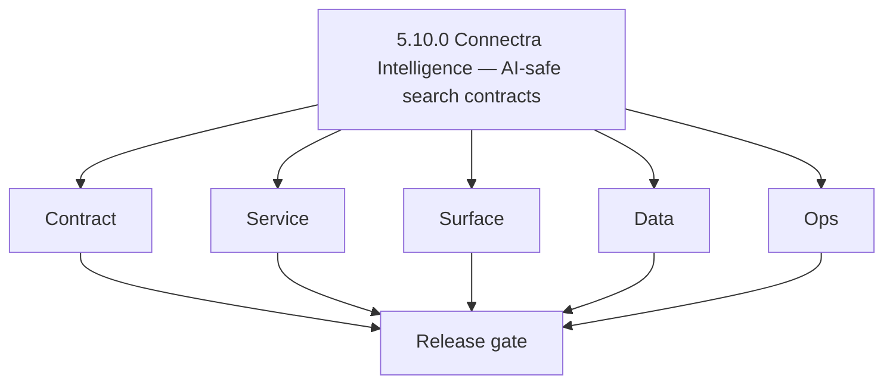
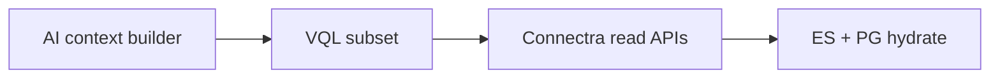

# Version 5.10 — Connectra Intelligence

- **Codename:** Connectra Intelligence
- **Status:** ✅ Completed
- **Target window:** TBD
- **Summary:** **Connectra** delivers **AI-readable attributes**, **field whitelists** for prompt/context assembly, **tenant-safe VQL** contracts for AI-initiated reads (no over-fetch), **enrichment artifact** lookup paths, and stored **confidence metadata** where enrichment pipelines produce it.
- **Scope:** Makes `3.x`/`4.x` data serve `5.x` AI reliably; pairs with `5.5` SN signal enrichment and `5.2` parse-filters.
- **Roadmap mapping:** Extension minor — [`connectra-codebase-analysis.md`](../codebases/connectra-codebase-analysis.md) Era `5.x`.
- **Owner:** Search/Data Engineering + AI Platform
- **Patch closure:** Every codenamed patch file includes **Micro-gate** + **Service task slices**. Era hub: [`versions.md`](../versions.md).

## Scope

- Target minor: `5.10.0`

## Flowchart

### Runtime focus

## Task tracks

### Contract

- 📌 Planned: **[contact-ai]** — refine duplicate task (was: 📌 planned: **[contact-ai]** — refine duplicate task (was: ✅ …) | patch `5.10.0` band `0` | reason: specialize this file vs sibling patches; see docs/codebases/contact-ai-codebase-analysis.md
- 📌 Planned: **[contact-ai]** — refine duplicate task (was: ✅ completed: 📌 planned: define maximum rows / default caps f…) | patch `5.10.0` band `0` | reason: specialize this file vs sibling patches; see docs/codebases/contact-ai-codebase-analysis.md
- 📌 Planned: **[contact-ai]** — refine duplicate task (was: ✅ completed: 📌 planned: vql operator allow-list for ai-gener…) | patch `5.10.0` band `0` | reason: specialize this file vs sibling patches; see docs/codebases/contact-ai-codebase-analysis.md

- 📌 Planned: **[contact-ai]** — refine duplicate task (was: 📌 planned: **[architecture]** — product **graphql** remains …) | patch `5.10.0` band `0` | reason: specialize this file vs sibling patches; see docs/codebases/contact-ai-codebase-analysis.md
### Service

- 📌 Planned: **[contact-ai]** — refine duplicate task (was: 📌 planned: **[contact-ai]** — refine duplicate task (was: ✅ …) | patch `5.10.0` band `0` | reason: specialize this file vs sibling patches; see docs/codebases/contact-ai-codebase-analysis.md
- 📌 Planned: **[contact-ai]** — refine duplicate task (was: ✅ completed: 📌 planned: validate tenant filters cannot be by…) | patch `5.10.0` band `0` | reason: specialize this file vs sibling patches; see docs/codebases/contact-ai-codebase-analysis.md

- 📌 Planned: **[contact-ai]** — refine duplicate task (was: 📌 planned: **[architecture]** — **go/gin satellites** in sco…) | patch `5.10.0` band `0` | reason: specialize this file vs sibling patches; see docs/codebases/contact-ai-codebase-analysis.md
### Surface

- ✅ Completed: 📌 Planned: **root/admin**: Storytelling / governance copy referencing data accuracy (**Service task slices** in `5.10.P` patch files (scope from former `connectra-ai-task-pack.md`)).
- 📌 Planned: **[contact-ai]** — refine duplicate task (was: ✅ completed: 📌 planned: **app**: any “preview” of ai-bound p…) | patch `5.10.0` band `0` | reason: specialize this file vs sibling patches; see docs/codebases/contact-ai-codebase-analysis.md

- 📌 Planned: **[contact-ai]** — refine duplicate task (was: 📌 planned: **[architecture]** — **next.js** customer surface…) | patch `5.10.0` band `0` | reason: specialize this file vs sibling patches; see docs/codebases/contact-ai-codebase-analysis.md
### Data

- 📌 Planned: **[contact-ai]** — refine duplicate task (was: ✅ completed: 📌 planned: lineage: enrichment artifact pointer…) | patch `5.10.0` band `0` | reason: specialize this file vs sibling patches; see docs/codebases/contact-ai-codebase-analysis.md
- 📌 Planned: **[contact-ai]** — refine duplicate task (was: ✅ completed: 📌 planned: es mappings support fields ai code d…) | patch `5.10.0` band `0` | reason: specialize this file vs sibling patches; see docs/codebases/contact-ai-codebase-analysis.md

- 📌 Planned: **[contact-ai]** — refine duplicate task (was: 📌 planned: **[architecture]** — **postgresql-first** per `do…) | patch `5.10.0` band `0` | reason: specialize this file vs sibling patches; see docs/codebases/contact-ai-codebase-analysis.md
### Ops

- 📌 Planned: **[contact-ai]** — refine duplicate task (was: ✅ completed: 📌 planned: ai query regression pack: representa…) | patch `5.10.0` band `0` | reason: specialize this file vs sibling patches; see docs/codebases/contact-ai-codebase-analysis.md
- 📌 Planned: **[contact-ai]** — refine duplicate task (was: ✅ completed: 📌 planned: cost-impact analysis for ai-driven q…) | patch `5.10.0` band `0` | reason: specialize this file vs sibling patches; see docs/codebases/contact-ai-codebase-analysis.md

- 📌 Planned: **[contact-ai]** — refine duplicate task (was: 📌 planned: **[architecture]** — **observability**: correlate…) | patch `5.10.0` band `0` | reason: specialize this file vs sibling patches; see docs/codebases/contact-ai-codebase-analysis.md
## Per-service slices (5.10.0)

### Connectra

- Contract-parity tests for allowed VQL shapes used by AI.

### Appointment360

- Composition layer that maps AI tool calls to Connectra reads remains tenant-scoped.

## References

- [`docs/codebases/connectra-codebase-analysis.md`](../codebases/connectra-codebase-analysis.md)
- **Service task slices** in `5.10.P` patch files (scope from former `connectra-ai-task-pack.md`)

## Release gate

- 📌 Planned: Whitelist doc + code enforcement
- 📌 Planned: Regression pack green
- 📌 Planned: Security review on tenant isolation

## Master checklist

- 📌 Planned: AI field whitelist published
- 📌 Planned: Over-fetch prevention verified
- 📌 Planned: Enrichment lineage documented

### Micro-gate reference (apply at every `5.N.P`)

| Track | Gate question (must answer Yes or document waiver) |
| --- | --- |
| **Contract** | Contact AI REST, GraphQL AI module, model mapping — `docs/backend/apis/` + endpoint matrices updated? |
| **Service** | `contact.ai`, `LambdaAIClient`, jobs AI envelope — smoke + message caps / idempotency? |
| **Surface** | Dashboard `/ai-chat`, utilities, admin AI — user-visible delta? |
| **Frontend** | Routes/hooks per `contact-ai-ui-bindings.md` / pages JSON? |
| **Data** | `ai_chats`, prompts, S3 AI artifacts — migrations + lineage docs? |
| **Ops** | AI cost/telemetry in `logs.api`, alerts, runbooks — recorded? |
| **Architecture** | Go/Gin satellites only via Python GraphQL gateway (`contact360.io/api`); Next.js `NEXT_PUBLIC_GRAPHQL_URL`; Postgres-first / Redis exit per `docs/docs/data-stores-postgres.md`. |

**Patch ladder:** Codenames `Void` → `Bloom` per minor (`.0`–`.9`) — see patch table below.

## Patches

| Patch | Codename | Doc |
| --- | --- | --- |
| `5.10.0` | Void | [`5.10.0` — Void](5.10.0 — Void.md) |
| `5.10.1` | Seed | [`5.10.1` — Seed](5.10.1 — Seed.md) |
| `5.10.2` | Sprout | [`5.10.2` — Sprout](5.10.2 — Sprout.md) |
| `5.10.3` | Roots | [`5.10.3` — Roots](5.10.3 — Roots.md) |
| `5.10.4` | Soil | [`5.10.4` — Soil](5.10.4 — Soil.md) |
| `5.10.5` | Rain | [`5.10.5` — Rain](5.10.5 — Rain.md) |
| `5.10.6` | Stem | [`5.10.6` — Stem](5.10.6 — Stem.md) |
| `5.10.7` | Branch | [`5.10.7` — Branch](5.10.7 — Branch.md) |
| `5.10.8` | Leaf | [`5.10.8` — Leaf](5.10.8 — Leaf.md) |
| `5.10.9` | Bloom | [`5.10.9` — Bloom](5.10.9 — Bloom.md) |

## Patch ladder (5.10.0 - 5.10.9)

### Micro-gate reference (apply at every patch)

| Track | Gate question (must answer Yes or waiver) |
| --- | --- |
| **Contract** | Contract/API change captured with diff or explicit no-change note |
| **Service** | Service health and smoke for affected paths pass |
| **Surface** | UI/admin/extension impact documented or N/A |
| **Frontend** | Routes/components/hooks affected listed or N/A |
| **Data** | Migrations/index/lineage deltas linked or N/A |
| **Ops** | Rollback/secrets/CI/runbook delta linked or N/A |

**Patch intent bands:** `.0` charter, `.1-.2` scaffold, `.3-.5` hardening, `.6-.8` integration, `.9` freeze/handoff.

| Patch | Codename | Focus | Evidence gate |
| --- | --- | --- | --- |
| `5.10.0` | Void | patch focus | charter artifact linked |
| `5.10.1` | Seed | patch focus | closeout evidence attached |
| `5.10.2` | Sprout | patch focus | closeout evidence attached |
| `5.10.3` | Roots | patch focus | closeout evidence attached |
| `5.10.4` | Soil | patch focus | closeout evidence attached |
| `5.10.5` | Rain | patch focus | closeout evidence attached |
| `5.10.6` | Stem | patch focus | closeout evidence attached |
| `5.10.7` | Branch | patch focus | closeout evidence attached |
| `5.10.8` | Leaf | patch focus | closeout evidence attached |
| `5.10.9` | Bloom | patch focus | handoff documented |

## Release Gate and Evidence

### Master Task Checklist
- 📌 Planned: Track-level closure evidence linked

### Backend API and Endpoints
- 📌 Planned: Endpoint/contract parity verified

### Database and Data Lineage
- 📌 Planned: Migration and lineage references linked

### Frontend UX
- 📌 Planned: UX/route behavior evidence linked

### UI Elements
- 📌 Planned: Components/checklist closeout captured

### Flow and Graph
- 📌 Planned: Runtime graph reflects implementation

### Validation
- 📌 Planned: Smoke/CI/lint checks recorded

### Release Gate
- 📌 Planned: Minor ready for handoff to next minor
