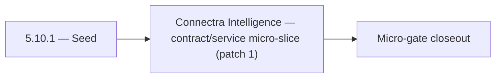

# 5.10.1 — Seed

- **Era:** `5.x` AI workflows — hub [`versions.md`](../versions.md) · minors start at [`5.0 — Neural Spine`](5.0%20%E2%80%94%20Neural%20Spine.md)
- **Minor:** [5.10 — Connectra Intelligence](./5.10 — Connectra Intelligence.md)
- **Codename:** Seed
- **Status:** ✅ Completed
## Focus
Connectra Intelligence — contract/service micro-slice (patch 1)

## Flowchart

## Micro-gate

| Track | Gate question | Answer / Evidence (fill at patch closeout) |
| --- | --- | --- |
| **Contract** | Contact AI REST, GraphQL AI module, HF/model mapping — `docs/backend/apis/` + matrices updated? | Document at patch closeout. |
| **Service** | `contact.ai` inference, gateway `LambdaAIClient`, jobs AI path — smoke + caps documented? | Document smoke paths. |
| **Surface** | Dashboard AI chat, utilities, admin AI flows changed? | Document UX delta or N/A. |
| **Frontend** | Which routes/hooks (`contact-ai-ui-bindings`, pages JSON) for this patch? | Connectra whitelist + VQL AI-safe subset in product. Document at closeout. |
| **Data** | `ai_chats`, prompts, S3 AI artifacts — migrations + lineage? | Document lineage or N/A. |
| **Ops** | `logs.api` AI events, cost/error alerts, runbooks — delta recorded? | Document ops delta or N/A. |

## Tasks
### Contract
- ✅ Completed: 📌 Planned: Define maximum rows / default caps for AI-sourced queries.
- ✅ Completed: 📌 Planned: **VQL AI-safe subset:** Allowlist operators and max row caps for filters produced by Contact AI `parse-filters` / NL → VQL (coordinate with [`5.2 — Explainability Plane.md`](5.2 — Explainability Plane.md) and [`5.10 — Connectra Intelligence.md`](5.10 — Connectra Intelligence.md)).
- ✅ Completed: 📌 Planned: Align `LambdaAIClient` paths to `/api/v1/ai/…` — remove any legacy `/gemini/…` references.
- ✅ Completed: 📌 Planned: Define explainability schema for AI consumption (`top_factors`, `risk_reason`, `confidence_band`).

### Service
- ✅ Completed: 📌 Planned: Validate tenant filters cannot be bypassed via NL → VQL pipeline.
- ✅ Completed: 📌 Planned: Performance guardrails: rate limits compatible with AI-driven query bursts ([`5.3 — Spend Guardrails.md`](5.3 — Spend Guardrails.md)).
- ✅ Completed: 📌 Planned: Implement `HFService` model routing: `ModelSelection` enum → HF model ID; default from `HF_CHAT_MODEL` env.
- ✅ Completed: 📌 Planned: Implement `messages` JSONB strict validation (max text length, valid sender values, max contacts).

### Surface

- ✅ Completed: 📌 Planned: **[appointment360]** — Verify UX for route `/email` and bindings (patch 5.10.1 band 1) | area: `frontend-page` | files: `contact360.io/app/...` | reason: Dashboard/extension surface for era 5 must match gateway contracts

### Data

- ✅ Completed: 📌 Planned: **[contact-ai]** — Update PostgreSQL/ES/S3 lineage notes if this patch touches persistence or exports | area: `data-lineage` | files: `docs/backend/database/`, `migrations/` | reason: Migrations, indexes, and lineage evidence for this patch

### Ops

- ✅ Completed: 📌 Planned: **[platform]** — Record smoke evidence, rollback, and alerts (patch band 1: charter/P0) | area: `ops` | files: `docs/commands/`, `.github/workflows/` | reason: Smoke, rollback, and observability for patch 5.10.1

## Service task slices
> Merged from era `5.x` AI workflow task packs (P0→`.0`–`.2`, P1→`.3`–`.6`, Ops→`.7`–`.9`).

### Appointment360 (gateway)
- Define AIChatQuery { aiChat(uuid), aiChats() }
- Define AIChatMutation { createAiChat, sendAiMessage, deleteAiChat, generateCompanySummary, analyzeEmailRisk, parseContactFilters }
- Define ResumeQuery { resumes(), resume(id) }
- Define ResumeMutation { createResume, updateResume, deleteResume }
- Define AIChatType, AIChatMessageType, ResumeType GraphQL output types
- Define AIChatInput, SendAiMessageInput, ResumeCreateInput input types
- Implement LambdaAIClient in app/clients/lambda_ai_client.py
- Wire createAiChat mutation → LambdaAIClient.create_chat(...)
- Wire sendAiMessage mutation → LambdaAIClient.send_message(chat_uuid, message)
- Wire generateCompanySummary mutation → LambdaAIClient.generate_company_summary(company_uuid)
- Wire analyzeEmailRisk mutation → LambdaAIClient.analyze_email_risk(email_input)
- Wire parseContactFilters mutation → LambdaAIClient.parse_filters(natural_language_query)
- Implement ResumeAIClient in app/clients/resume_ai_client.py
- Wire createResume → ResumeAIClient.create(...) + store reference in appointment360 DB
- Persist AI chat messages in appointment360 ai_chats / ai_chat_messages tables (or delegate to contact.ai)
- Deduct credits per AI chat message / company summary generation
- AI chat panel (sidebar or modal) → mutation createAiChat + mutation sendAiMessage
- AI chat history panel → query aiChats()
- Company detail page, AI summary tab → mutation generateCompanySummary
- useAiChat hook: manage chat state, send message, streaming tokens
- Create ai_chats table: uuid, user_uuid, title, created_at
- Create ai_chat_messages table: uuid, chat_uuid, role (user/assistant), content, created_at
- Track AI usage per feature in credits table
- Configure LAMBDA_AI_API_URL, LAMBDA_AI_API_KEY in .env.example
- Add AI chat cost estimates to billing plan limits

### Connectra
- **AI-facing field whitelist:** Document stable fields (names + types) for contacts/companies that may be embedded in prompts or tool results; exclude sensitive or volatile columns by default.
- **Confidence metadata expectations:** When enrichment or scoring produces confidence, define JSON shape and where it lives on hydrated records.
- **VQL AI-safe subset:** Allowlist operators and max row caps for filters produced by Contact AI `parse-filters` / NL → VQL (coordinate with [`version_5.2.md`](version_5.2.md) and [`version_5.10.md`](version_5.10.md)).
- **Tenant isolation:** Assert every AI-originated query path resolves through tenant-scoped API keys and cannot bypass filter predicates.
- Ensure **Connectra query outputs** include whitelist fields and optional confidence for AI chat/assist pipelines.
- Prevent **over-fetch** on AI tool calls: default pagination and field projection for AI profile.
- Validate **two-phase read** (ES ids → PG hydrate) returns consistent shapes for AI consumers.
- Performance guardrails: rate limits compatible with AI-driven query bursts ([`version_5.3.md`](version_5.3.md)).
- **Enrichment artifact lineage:** Link enrichment outputs to source entities (contact/company uuid) for audit and replay.
- **Elasticsearch mappings:** Confirm AI-dependent fields (e.g. `data_quality_score`, SN provenance) are indexed per [`version_5.5.md`](version_5.5.md).

### contact.ai
- Lock full REST API contract: all `/api/v1/ai-chats/` and `/api/v1/ai/` paths.
- Fix `ModelSelection` enum mapping shim: GraphQL enum values (`FLASH`, `PRO`, etc.) must map to HF model IDs in `LambdaAIClient` or Contact AI service.
- Align `LambdaAIClient` paths to `/api/v1/ai/…` — remove any legacy `/gemini/…` references.
- Lock `SendMessageInput.model` contract: accepted values and mapping documented in `17_AI_CHATS_MODULE.md`.
- Document `POST /api/v1/ai-chats/{id}/message/stream` SSE event format: `data: <token>\n\n`, `data: [DONE]\n\n`.
- Define API versioning strategy: all routes under `/api/v1/`; no unversioned routes in production.
- Complete all chat CRUD endpoints: `GET/POST /api/v1/ai-chats/`, `GET/PUT/DELETE /api/v1/ai-chats/{id}/`.
- Implement `POST /api/v1/ai-chats/{id}/message` (sync) with full `AIChatService` orchestration.
- Implement `POST /api/v1/ai-chats/{id}/message/stream` (SSE streaming) via `HFService` async generator.
- Implement `HFService` model routing: `ModelSelection` enum → HF model ID; default from `HF_CHAT_MODEL` env.
- Implement Gemini fallback: if HF inference fails after N retries, call Gemini API.
- Enforce 100-message-per-chat cap in `AIChatService`.
- All utility endpoints fully implemented and tested: `analyzeEmailRisk`, `generateCompanySummary`, `parseContactFilters`.
- Implement `messages` JSONB strict validation (max text length, valid sender values, max contacts).
- Validate `messages` JSONB schema in `AIChatService` before persist: max 100 messages, valid sender, max text length.
- Add `model_version` field to AI message metadata in JSONB (for reproducibility).
- Confirm `user_id` ownership check on every read/write/delete operation.

### emailapis / emailapigo
- Define **AI-assisted finder/verifier payload boundaries**: max list sizes, required identity keys (`first_name`, `last_name`, `domain`), and canonical status enum values shared with dashboard and Contact AI orchestration (`5.x` era freeze).
- Document **safe orchestration surface**: which operations AI may trigger (e.g. single verify vs bulk) vs require human confirmation; avoid exposing raw provider blobs to prompts.
- Update endpoint/reference matrix in `docs/backend/endpoints/emailapis_endpoint_era_matrix.json` when adding or changing AI-facing paths.
- Align **Python vs Go parity** on verifier provider priority (`mailvetter` vs `truelist` / `icypeas`) so AI-facing summaries do not drift by runtime.
- Expose **stable, minimal JSON** responses for paths consumed by Appointment360 / future AI tools; consistent error envelope for quota and provider failures.
- Verify auth, provider routing, error translation, and health diagnostics under AI-driven traffic (higher fan-out risk).
- Add contract tests: finder cache hit/miss, verifier status mapping, bulk partial failure semantics.
- Document `email_finder_cache` and `email_patterns` lineage impact for era `5.x` when AI triggers lookups (cache poisoning, attribution).
- Track **AI-assisted decision lineage**: link job or request id to finder/verifier outcome **with confidence mapping** where Mailvetter/Contact AI participates (`5.x` analysis).

### Emailcampaign
- "Generate with AI" produces a valid HTML template stored in S3.
- Personalization variables from Connectra contact fields render correctly in preview.
- Subject suggestions appear within 3 seconds in UI.

### Jobs
- Define **AI batch processor contract extensions**: envelope fields `model` (string id), `confidence` (nullable structured summary), `cost` (estimated units or currency minor units); JSON schema version.
- Define **quota-aware scheduling contract**: enqueue rejects or defers when user/org over AI budget or daily cap; error codes align with [`version_5.3.md`](version_5.3.md).
- Document **idempotency** for AI jobs: dedupe key scope (user + input hash + processor type).
- Register allowed **AI processor kinds** in a single registry (code or config) with validation tests.
- Add **AI processor stubs** and **registry validation tests** (unknown processor fails fast at enqueue).
- Enforce **quota/cost guardrails** during enqueue and execution (short-circuit before provider calls when possible).
- Share inference client patterns with `contact.ai` where feasible (single model id vocabulary).
- Tune worker concurrency for AI tasks separately from IO-bound jobs (timeouts, retries).
- Add **`job_response` conventions** for AI model metadata, token estimates, and confidence snapshot.
- Document **lineage** from AI input batch → scored output artifacts → optional S3 pointers ([`version_5.7.md`](version_5.7.md)).

### logs.api
- Define and freeze era `5.x` **AI logging schema additions**: event types for `ai.prompt`, `ai.tool_call`, `ai.response`, `ai.quota_denied`, `ai.provider_error` (names illustrative — finalize in schema doc); compatibility notes for consumers.
- Specify **PII minimization rules**: which fields are never written, which are hashed/truncated, optional debug tier with stricter RBAC.
- Update endpoint/reference matrix in `docs/backend/endpoints/logsapi_endpoint_era_matrix.json` when write/query paths change.
- Implement/validate behavior for era `5.x` **AI event sources** from `contact.ai`, `appointment360`, and `jobs`.
- Implement **log write guards** in emitting services (reject oversize or forbidden subfields before POST).
- Verify auth, error envelope, and health behavior for internal consumers; no public exposure of raw AI payloads by default.
- Document **S3 CSV** layout updates for AI events; partition strategy (date + service + schema version).
- **Retention segmentation**: AI-sensitive logs TTL vs general logs; legal hold procedure.

### Mailvetter
- Define explainability schema for AI consumption (`top_factors`, `risk_reason`, `confidence_band`).
- Define prompt-safe output contract (no sensitive raw SMTP payload).
- Add AI-friendly summarized reason generator from `score_details`.
- Add optional “recommend action” output (`send`, `retry`, `suppress`).
- Store normalized reason codes and factor vectors per result.
- Add retention policy for AI-derived summaries.

### S3Storage
- Define **four AI artifact classes** (stable enum):
- `prompt` — versioned system/user prompt text or hash references
- `input` — user/upload/context payload references (redacted index)
- `output` — model completions or structured AI results
- `intermediate` — chain-of-thought storage **disallowed by default**; only if policy explicitly allows with extra encryption
- Define **retention and access policy** per class (TTL, legal hold, tenant tier).
- Define **signed URL** rules: short TTL, role-scoped, auditable.
- **Immutability:** compliance bundles use write-once / object lock semantics where required.
- Enforce **object-class policy checks** for AI-related prefixes (deny wrong content-type or path).
- Implement **immutable write mode** for compliance-sensitive artifacts when `IMMUTABLE_AI_ARTIFACTS=true` (or equivalent env).
- Validate multipart upload lifecycle for large AI exports; abort stale sessions.
- Rate limit AI artifact writes per tenant to control cost.

### Salesnavigator
- Define minimum field requirements for a SN contact to be eligible for AI context:
- `title` present
- `data_quality_score >= 50`
- `about` present (for richer AI context)
- Define `parse-filters` payload contract compatibility: SN field names vs. AI filter schema
- Contract: `company/summary` calls can use company data from SN-sourced contacts
- Ensure `seniority` and `departments` inference outputs valid values for AI prompt construction
- Surface `data_quality_score` as a filterable field (confirm Connectra VQL supports `data_quality_score >= N`)
- Ensure `about` field passes through extraction without truncation (max length defined)
- Add test: SN-sourced contact with full `about` → valid AI company summary request
- Confirm `messages.contacts[]` JSONB sub-schema covers SN contact fields (`seniority`, `departments`, `linkedin_sales_url`)
- Confirm `data_quality_score` is indexed in Connectra for VQL filter queries

## Evidence gate
Patch closeout includes contract diff, smoke output, data lineage delta, and ops note
