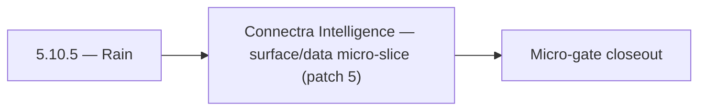

# 5.10.5 — Rain

- **Era:** `5.x` AI workflows — hub [`versions.md`](../versions.md) · minors start at [`5.0 — Neural Spine`](5.0%20%E2%80%94%20Neural%20Spine.md)
- **Minor:** [5.10 — Connectra Intelligence](./5.10 — Connectra Intelligence.md)
- **Codename:** Rain
- **Status:** ✅ Completed
## Focus
Connectra Intelligence — surface/data micro-slice (patch 5)

## Flowchart

## Micro-gate

| Track | Gate question | Answer / Evidence (fill at patch closeout) |
| --- | --- | --- |
| **Contract** | Contact AI REST, GraphQL AI module, HF/model mapping — `docs/backend/apis/` + matrices updated? | Document at patch closeout. |
| **Service** | `contact.ai` inference, gateway `LambdaAIClient`, jobs AI path — smoke + caps documented? | Document smoke paths. |
| **Surface** | Dashboard AI chat, utilities, admin AI flows changed? | Document UX delta or N/A. |
| **Frontend** | Which routes/hooks (`contact-ai-ui-bindings`, pages JSON) for this patch? | Connectra whitelist + VQL AI-safe subset in product. Document at closeout. |
| **Data** | `ai_chats`, prompts, S3 AI artifacts — migrations + lineage? | Document lineage or N/A. |
| **Ops** | `logs.api` AI events, cost/error alerts, runbooks — delta recorded? | Document ops delta or N/A. |

## Tasks
### Surface
- 📌 Planned: **[contact-ai]** — refine duplicate task (was: ✅ completed: 📌 planned: **app**: any “preview” of ai-bound p…) | patch `5.10.5` band `5` | reason: specialize this file vs sibling patches; see docs/codebases/contact-ai-codebase-analysis.md
- 📌 Planned: **[contact-ai]** — refine duplicate task (was: ✅ completed: 📌 planned: implement `chatthread` with message …) | patch `5.10.5` band `5` | reason: specialize this file vs sibling patches; see docs/codebases/contact-ai-codebase-analysis.md
- 📌 Planned: **[contact-ai]** — refine duplicate task (was: ✅ completed: 📌 planned: implement `modelselector` dropdown w…) | patch `5.10.5` band `5` | reason: specialize this file vs sibling patches; see docs/codebases/contact-ai-codebase-analysis.md
- 📌 Planned: **[contact-ai]** — refine duplicate task (was: ✅ completed: 📌 planned: wire `emailriskbadge`, `companysumma…) | patch `5.10.5` band `5` | reason: specialize this file vs sibling patches; see docs/codebases/contact-ai-codebase-analysis.md

### Data
- 📌 Planned: **[contact-ai]** — refine duplicate task (was: ✅ completed: 📌 planned: es mappings support fields ai code d…) | patch `5.10.5` band `5` | reason: specialize this file vs sibling patches; see docs/codebases/contact-ai-codebase-analysis.md
- 📌 Planned: **[contact-ai]** — refine duplicate task (was: ✅ completed: 📌 planned: **postgresql authority:** document w…) | patch `5.10.5` band `5` | reason: specialize this file vs sibling patches; see docs/codebases/contact-ai-codebase-analysis.md
- 📌 Planned: **[contact-ai]** — refine duplicate task (was: ✅ completed: 📌 planned: confirm `user_id` ownership check on…) | patch `5.10.5` band `5` | reason: specialize this file vs sibling patches; see docs/codebases/contact-ai-codebase-analysis.md
- 📌 Planned: **[contact-ai]** — refine duplicate task (was: ✅ completed: 📌 planned: add retention policy for ai-derived …) | patch `5.10.5` band `5` | reason: specialize this file vs sibling patches; see docs/codebases/contact-ai-codebase-analysis.md

### Contract

- ✅ Completed: 📌 Planned: **[contact-ai]** — Diff and document schema for operations like ConnectraClient, LAMBDA_AI_API_URL, LAMBDA_CONNECTRA_API_URL; align with roadmap | area: `backend-api` | files: `docs/backend/apis/*.md`, `contact360.io/api/app/graphql/schema.py` | reason: Keep GraphQL/REST contracts aligned for era 5.5 patch 5.10.5

### Service

- 📌 Planned: **[contact-ai]** — refine duplicate task (was: ✅ completed: 📌 planned: **[contact-ai]** — service slice: er…) | patch `5.10.5` band `5` | reason: specialize this file vs sibling patches; see docs/codebases/contact-ai-codebase-analysis.md

### Ops

- ✅ Completed: 📌 Planned: **[platform]** — Record smoke evidence, rollback, and alerts (patch band 5: surface/data) | area: `ops` | files: `docs/commands/`, `.github/workflows/` | reason: Smoke, rollback, and observability for patch 5.10.5

## Service task slices
> Merged from era `5.x` AI workflow task packs (P0→`.0`–`.2`, P1→`.3`–`.6`, Ops→`.7`–`.9`).

### Appointment360 (gateway)
- Document AI chats module in docs/backend/apis/17_AI_CHATS_MODULE.md
- Document resume module in docs/backend/apis/18_RESUME_MODULE.md
- Email campaign compose screen, risk analysis → mutation analyzeEmailRisk
- Filter builder natural-language input → mutation parseContactFilters
- Resume builder page → query resumes() + mutation createResume / updateResume
- SSE / streaming support for sendAiMessage (if contact.ai returns chunked response)
- Loading skeleton while AI response is streamed
- useCompanySummary hook: trigger + poll generation
- Create resumes table: uuid, user_uuid, content JSON, template_id, created_at
- Store parseContactFilters parsed VQL in saved_searches if user saves it
- Configure RESUME_AI_BASE_URL, RESUME_AI_API_KEY
- Write integration test: createAiChat → sendAiMessage → aiChat(uuid) round-trip
- Write contract test: generateCompanySummary → LambdaAI REST call

### Connectra
- **`contact360.io/root`:** AI workflow storytelling (accuracy, confidence positioning) referencing search-backed claims.
- **`contact360.io/admin`:** Governance views for data quality and AI eligibility where applicable.
- **`contact360.io/app`:** Contact/company rows expose only whitelist-backed data to AI side panels.
- **Enrichment artifact lineage:** Link enrichment outputs to source entities (contact/company uuid) for audit and replay.
- **Elasticsearch mappings:** Confirm AI-dependent fields (e.g. `data_quality_score`, SN provenance) are indexed per [`version_5.5.md`](version_5.5.md).
- **PostgreSQL authority:** Document which fields are authoritative vs search-only for AI grounding.
- Ensure **Connectra query outputs** include whitelist fields and optional confidence for AI chat/assist pipelines.
- Prevent **over-fetch** on AI tool calls: default pagination and field projection for AI profile.
- Validate **two-phase read** (ES ids → PG hydrate) returns consistent shapes for AI consumers.
- Performance guardrails: rate limits compatible with AI-driven query bursts ([`version_5.3.md`](version_5.3.md)).

### contact.ai
- Build `AIChatPage` (`/app/ai-chat`): `ChatList` + `ChatThread` layout.
- Implement `ChatList` with pagination: uses `useChatList` hook.
- Implement `ChatThread` with message rendering: `ChatMessage` + `ContactsInMessage`.
- Implement `ChatInput` textarea with send button; disabled while streaming.
- Implement `StreamingText`: token-by-token rendering via SSE; cursor blink during stream.
- Implement `ModelSelector` dropdown with all 4 model options; persist choice in `AIModelContext`.
- Implement `NewChatButton`: creates chat and redirects to `ChatThread`.
- Implement `ChatContextMenu`: rename (PUT) and delete (DELETE) chat actions.
- Wire `EmailRiskBadge`, `CompanySummaryTab`, `AIFilterInput` to live endpoints.
- Loading states: skeleton for chat list, spinner for send, shimmer for utilities.
- Validate `messages` JSONB schema in `AIChatService` before persist: max 100 messages, valid sender, max text length.
- Add `model_version` field to AI message metadata in JSONB (for reproducibility).
- Confirm `user_id` ownership check on every read/write/delete operation.
- Test concurrent message send (two requests to same `chat_id`): document behavior; add optimistic lock if needed.
- Complete all chat CRUD endpoints: `GET/POST /api/v1/ai-chats/`, `GET/PUT/DELETE /api/v1/ai-chats/{id}/`.
- Implement `POST /api/v1/ai-chats/{id}/message` (sync) with full `AIChatService` orchestration.
- Implement `POST /api/v1/ai-chats/{id}/message/stream` (SSE streaming) via `HFService` async generator.
- Implement `HFService` model routing: `ModelSelection` enum → HF model ID; default from `HF_CHAT_MODEL` env.
- Implement Gemini fallback: if HF inference fails after N retries, call Gemini API.
- Enforce 100-message-per-chat cap in `AIChatService`.
- All utility endpoints fully implemented and tested: `analyzeEmailRisk`, `generateCompanySummary`, `parseContactFilters`.
- Implement `messages` JSONB strict validation (max text length, valid sender values, max contacts).

### emailapis / emailapigo
- Document impacted pages/tabs/buttons/inputs for era `5.x` — especially assistant panels and email flows in [`docs/frontend/emailapis-ui-bindings.md`](../frontend/emailapis-ui-bindings.md).
- Document hooks/services/contexts and UX states (loading / error / progress / checkbox / radio) when AI suggests next actions on email results.
- Bind assistant panel results to **canonical email statuses** (no duplicate unofficial strings).
- Document `email_finder_cache` and `email_patterns` lineage impact for era `5.x` when AI triggers lookups (cache poisoning, attribution).
- Track **AI-assisted decision lineage**: link job or request id to finder/verifier outcome **with confidence mapping** where Mailvetter/Contact AI participates (`5.x` analysis).
- Record provider, status, and traceability expectations per response for downstream logs.api events.
- Expose **stable, minimal JSON** responses for paths consumed by Appointment360 / future AI tools; consistent error envelope for quota and provider failures.
- Verify auth, provider routing, error translation, and health diagnostics under AI-driven traffic (higher fan-out risk).
- Add contract tests: finder cache hit/miss, verifier status mapping, bulk partial failure semantics.

### Emailcampaign
- "Generate with AI" produces a valid HTML template stored in S3.
- Personalization variables from Connectra contact fields render correctly in preview.
- Subject suggestions appear within 3 seconds in UI.

### Jobs
- Document **AI batch execution cards**: model name, confidence display, retry UX, budget warnings ([`docs/frontend/jobs-ui-bindings.md`](../frontend/jobs-ui-bindings.md)).
- Document **model selection** and **budget-warning** control behavior for operators.
- Loading/progress patterns per design system for long AI batches.
- Add **`job_response` conventions** for AI model metadata, token estimates, and confidence snapshot.
- Document **lineage** from AI input batch → scored output artifacts → optional S3 pointers ([`version_5.7.md`](version_5.7.md)).
- Ensure correlation ids propagate to `logs.api` for AI job spans ([`version_5.8.md`](version_5.8.md)).
- Add **AI processor stubs** and **registry validation tests** (unknown processor fails fast at enqueue).
- Enforce **quota/cost guardrails** during enqueue and execution (short-circuit before provider calls when possible).
- Share inference client patterns with `contact.ai` where feasible (single model id vocabulary).
- Tune worker concurrency for AI tasks separately from IO-bound jobs (timeouts, retries).

### logs.api
- Document impacted pages/tabs/buttons/inputs for era `5.x` internal tooling ([`docs/frontend/logsapi-ui-bindings.md`](../frontend/logsapi-ui-bindings.md)).
- Document hooks/services/contexts and UX states (loading / error / progress / filter / export) with **role gating** (internal-only).
- Debug trace views: opt-in per incident, time-bounded.
- Document **S3 CSV** layout updates for AI events; partition strategy (date + service + schema version).
- **Retention segmentation**: AI-sensitive logs TTL vs general logs; legal hold procedure.
- **Trace correlation**: require `request_id` / `trace_id` alignment with upstream ([`contact-ai-codebase-analysis.md`](../codebases/contact-ai-codebase-analysis.md)).
- Implement/validate behavior for era `5.x` **AI event sources** from `contact.ai`, `appointment360`, and `jobs`.
- Implement **log write guards** in emitting services (reject oversize or forbidden subfields before POST).
- Verify auth, error envelope, and health behavior for internal consumers; no public exposure of raw AI payloads by default.

### Mailvetter
- Email verifier UI: AI explanation drawer on result row click.
- Campaign preflight: AI summary card for risky domains.
- Store normalized reason codes and factor vectors per result.
- Add retention policy for AI-derived summaries.
- Add AI-friendly summarized reason generator from `score_details`.
- Add optional “recommend action” output (`send`, `retry`, `suppress`).

### S3Storage
- Document **retrieval semantics** for AI consumers (dashboard vs internal tools) — [`docs/frontend/s3storage-ui-bindings.md`](../frontend/s3storage-ui-bindings.md).
- Explicit error codes: expired URL, forbidden class, policy violation.
- Enforce **object-class policy checks** for AI-related prefixes (deny wrong content-type or path).
- Implement **immutable write mode** for compliance-sensitive artifacts when `IMMUTABLE_AI_ARTIFACTS=true` (or equivalent env).
- Validate multipart upload lifecycle for large AI exports; abort stale sessions.
- Rate limit AI artifact writes per tenant to control cost.

### Salesnavigator
- `DataQualityBar` — thin progress bar on contact row showing AI-eligibility
- "AI-ready" indicator badge: displayed when `data_quality_score >= 50`
- AI chat panel: SN-sourced contacts can appear in `messages.contacts[]` payload
- "Recently saved from SN" filter chip in AI filter input context
- `AIFilterInput` parsing: NL → filter recognizes `source=sales_navigator` as a segment
- `CompanySummaryTab` can show summary for SN-imported companies
- Confirm `messages.contacts[]` JSONB sub-schema covers SN contact fields (`seniority`, `departments`, `linkedin_sales_url`)
- Confirm `data_quality_score` is indexed in Connectra for VQL filter queries
- Validate `about` field max length and encoding in SN extraction
- Ensure `seniority` and `departments` inference outputs valid values for AI prompt construction
- Surface `data_quality_score` as a filterable field (confirm Connectra VQL supports `data_quality_score >= N`)
- Ensure `about` field passes through extraction without truncation (max length defined)
- Add test: SN-sourced contact with full `about` → valid AI company summary request

## Evidence gate
Patch closeout includes contract diff, smoke output, data lineage delta, and ops note
