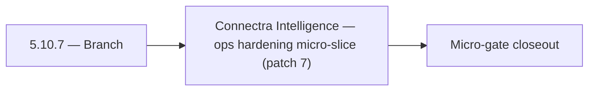

# 5.10.7 — Branch

- **Era:** `5.x` AI workflows — hub [`versions.md`](../versions.md) · minors start at [`5.0 — Neural Spine`](5.0%20%E2%80%94%20Neural%20Spine.md)
- **Minor:** [5.10 — Connectra Intelligence](./5.10 — Connectra Intelligence.md)
- **Codename:** Branch
- **Status:** ✅ Completed
## Focus
Connectra Intelligence — ops hardening micro-slice (patch 7)

## Flowchart

## Micro-gate

| Track | Gate question | Answer / Evidence (fill at patch closeout) |
| --- | --- | --- |
| **Contract** | Contact AI REST, GraphQL AI module, HF/model mapping — `docs/backend/apis/` + matrices updated? | Document at patch closeout. |
| **Service** | `contact.ai` inference, gateway `LambdaAIClient`, jobs AI path — smoke + caps documented? | Document smoke paths. |
| **Surface** | Dashboard AI chat, utilities, admin AI flows changed? | Document UX delta or N/A. |
| **Frontend** | Which routes/hooks (`contact-ai-ui-bindings`, pages JSON) for this patch? | Connectra whitelist + VQL AI-safe subset in product. Document at closeout. |
| **Data** | `ai_chats`, prompts, S3 AI artifacts — migrations + lineage? | Document lineage or N/A. |
| **Ops** | `logs.api` AI events, cost/error alerts, runbooks — delta recorded? | Document ops delta or N/A. |

## Tasks
### Ops
- 📌 Planned: **[contact-ai]** — refine duplicate task (was: ✅ completed: 📌 planned: ai query regression pack: representa…) | patch `5.10.7` band `7` | reason: specialize this file vs sibling patches; see docs/codebases/contact-ai-codebase-analysis.md
- 📌 Planned: **[contact-ai]** — refine duplicate task (was: ✅ completed: 📌 planned: **ai query regression pack:** golden…) | patch `5.10.7` band `7` | reason: specialize this file vs sibling patches; see docs/codebases/contact-ai-codebase-analysis.md
- 📌 Planned: **[contact-ai]** — refine duplicate task (was: ✅ completed: 📌 planned: **release gate evidence:** field cov…) | patch `5.10.7` band `7` | reason: specialize this file vs sibling patches; see docs/codebases/contact-ai-codebase-analysis.md
- 📌 Planned: **[contact-ai]** — refine duplicate task (was: ✅ completed: 📌 planned: prometheus metrics wired: request co…) | patch `5.10.7` band `7` | reason: specialize this file vs sibling patches; see docs/codebases/contact-ai-codebase-analysis.md

### Contract

- ✅ Completed: 📌 Planned: **[contact-ai]** — Diff and document schema for operations like ConnectraClient, LAMBDA_AI_API_URL, LAMBDA_CONNECTRA_API_URL; align with roadmap | area: `backend-api` | files: `docs/backend/apis/*.md`, `contact360.io/api/app/graphql/schema.py` | reason: Keep GraphQL/REST contracts aligned for era 5.7 patch 5.10.7

### Service

- 📌 Planned: **[contact-ai]** — refine duplicate task (was: ✅ completed: 📌 planned: **[contact-ai]** — service slice: er…) | patch `5.10.7` band `7` | reason: specialize this file vs sibling patches; see docs/codebases/contact-ai-codebase-analysis.md

### Surface

- ✅ Completed: 📌 Planned: **[appointment360]** — Verify UX for route `/email` and bindings (patch 5.10.7 band 7) | area: `frontend-page` | files: `contact360.io/app/...` | reason: Dashboard/extension surface for era 5 must match gateway contracts

### Data

- 📌 Planned: **[contact-ai]** — refine duplicate task (was: ✅ completed: 📌 planned: **[contact-ai]** — update postgresql…) | patch `5.10.7` band `7` | reason: specialize this file vs sibling patches; see docs/codebases/contact-ai-codebase-analysis.md

## Service task slices
> Merged from era `5.x` AI workflow task packs (P0→`.0`–`.2`, P1→`.3`–`.6`, Ops→`.7`–`.9`).

### Appointment360 (gateway)
- Configure RESUME_AI_BASE_URL, RESUME_AI_API_KEY
- Write integration test: createAiChat → sendAiMessage → aiChat(uuid) round-trip
- Write contract test: generateCompanySummary → LambdaAI REST call

### Connectra
- **AI query regression pack:** Golden VQL snippets from `parse-filters` → expected ES + hydrated results.
- **Cost-impact analysis:** Estimate extra Connectra load from AI features; tune quotas.
- **Release gate evidence:** Field coverage report, confidence field presence where promised, tenant isolation tests.

### contact.ai
- Lambda provisioned concurrency for chat paths to reduce cold-start latency.
- Prometheus metrics wired: request count, latency histogram, error rate per endpoint.
- Alert on `503` / `429` rate spike from HF API.
- Update contact.ai Postman collection with all live endpoints and SSE streaming examples.
- Add contact.ai to production deployment checklist.

### emailapis / emailapigo
- Add observability checks and release validation evidence for era `5.x` (dashboards for AI-assisted failure clusters).
- Capture rollback and incident-runbook notes for email-impacting releases touching AI paths.
- Monitor **AI-assisted quality regressions** (spike in `unknown` / mismatch between runtimes).

### Emailcampaign
- "Generate with AI" produces a valid HTML template stored in S3.
- Personalization variables from Connectra contact fields render correctly in preview.
- Subject suggestions appear within 3 seconds in UI.

### Jobs
- **Cost observability**: metrics for AI job duration, spend estimates, failure rate by model.
- **Alerts**: budget threshold, stuck jobs, provider outage patterns.
- **Runbook**: model degradation — disable processor kind, drain queue, fallback behavior.

### logs.api
- **Cost and error anomaly dashboards** from aggregates (spend spikes, 429 storms, provider latency).
- Observability checks and release validation evidence for era `5.x`.
- Capture rollback and incident-runbook notes for logging-impacting releases (schema version bumps).
- Load testing: burst AI traffic does not drop log writes silently.

### Mailvetter
- Add PII redaction in AI logs and traces.
- Add quality evaluation set for explanation correctness.

### S3Storage
- **Policy check coverage report** in CI or release checklist.
- **Lineage traceability** pass on representative workflows (upload → infer → export).
- **Audit trail** for sensitive AI artifact reads (who, when, key id).
- Cost monitoring: storage growth by artifact class.

### Salesnavigator
- Test: AI `parse-filters` with `source=sales_navigator` segment → correct VQL output
- Monitor: AI errors caused by low-quality SN contacts (missing title/company)
- Alert: high proportion of `data_quality_score < 30` from SN ingest sessions
- `docs/codebases/salesnavigator-codebase-analysis.md`
- `docs/codebases/contact-ai-codebase-analysis.md`
- `docs/backend/apis/SALESNAVIGATOR_ERA_TASK_PACKS.md`

## Evidence gate
Patch closeout includes contract diff, smoke output, data lineage delta, and ops note
