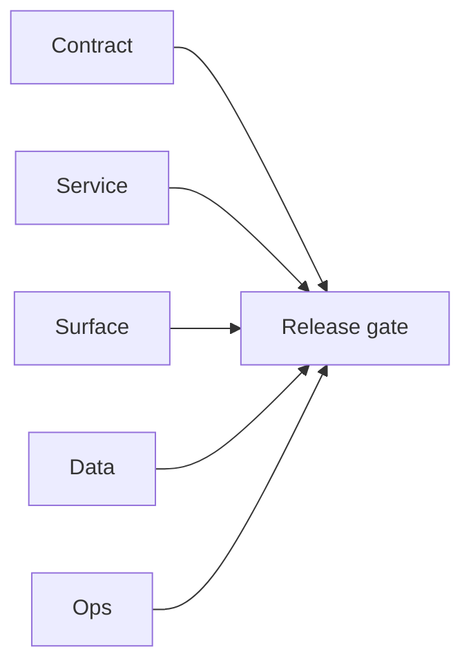

# 5.11.100 — EC2 email server ai-workflow patch linkage

## Scope

Patch linkage for AI-assisted email ranking/search flows depending on runtime stability.

## Included patch intents

- `006-error-handling.patch`: stable job status reads and queue writes.
- `004-endpoint-contract-fixes.patch`: consistent pattern input behavior.

## AI workflow outcome

- More deterministic upstream signals for AI ranking and fallback workflows.

## Flowchart

Five-track delivery (contract / service / surface / data / ops) for this doc:

**Master hub:** [`docs/docs/flowchart.md`](../docs/flowchart.md) — cross-system diagrams and era strip (`0.x` → `10.x`).
