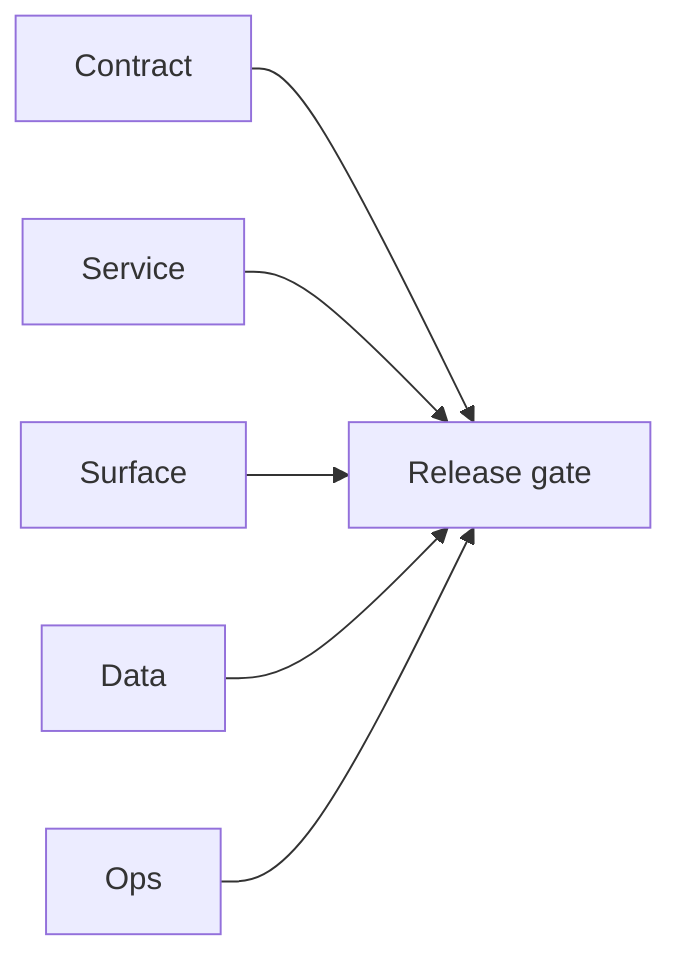

# 5.11.100 — EC2 email server ai-workflow patch linkage

## Scope

Patch linkage for AI-assisted email ranking/search flows depending on runtime stability.

## Included patch intents

- `006-error-handling.patch`: stable job status reads and queue writes.
- `004-endpoint-contract-fixes.patch`: consistent pattern input behavior.

## AI workflow outcome

- More deterministic upstream signals for AI ranking and fallback workflows.

## Flowchart

Five-track delivery (contract / service / surface / data / ops) for this doc:

**Master hub:** [`docs/docs/flowchart.md`](../docs/flowchart.md) — cross-system diagrams and era strip (`0.x` → `10.x`).

## Task tracks

### Contract

- ✅ Completed: AI-adjacent bulk/verify patch intents recorded; cross-link [`17_AI_CHATS_MODULE.md`](../backend/graphql.modules/17_AI_CHATS_MODULE.md) for product AI plane.

### Service

- ✅ Completed: Email server runtime improvements that stabilize upstream AI enrichment batches.

### Surface

- ✅ Completed: Dashboard AI surfaces indirect benefit only (fewer stuck verify jobs).

### Data

- ✅ Completed: `scheduler_jobs` / bulk payloads see improved error semantics per patches.

### Ops

- ✅ Completed: Monitor bulk failure rates after rollout.
