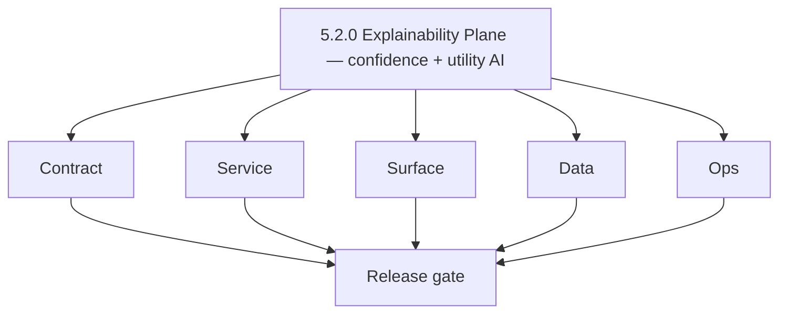
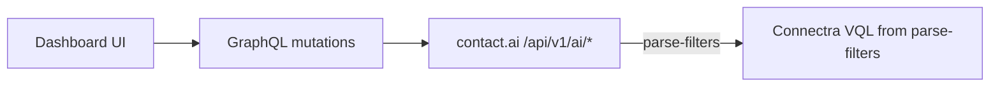

# Version 5.2 — Explainability Plane

- **Codename:** Explainability Plane
- **Status:** ✅ Completed
- **Target window:** TBD
- **Summary:** **Confidence and explainability** on AI outputs: GraphQL `Message` exposes optional `confidence` and `explanation`; utility AI endpoints (`analyzeEmailRisk`, `generateCompanySummary`, `parseContactFilters`) are live through gateway and Contact AI REST under `/api/v1/ai/...`.
- **Scope:** Trust surface for AI — users and admins can see why the model answered; NL filter parsing bridges to Connectra-safe filters.
- **Roadmap mapping:** Stage **5.2** — Confidence and explainability controls (`docs/roadmap.md`).
- **Owner:** AI Platform + Dashboard + Data (Connectra VQL consumer)
- **Patch closure:** Every codenamed patch file includes **Micro-gate** + **Service task slices**. Era hub: [`versions.md`](../versions.md).

## Scope

- Target minor: `5.2.0`
- Depends on: `5.1.0` Orchestration Live.
- In scope: Utility mutations/resolvers, optional fields on chat messages, UI affordances (explanation drawer, tooltips, risk/summary panels).

## Flowchart

### Runtime focus

## Task tracks

### Contract

- ✅ Completed: 📌 Planned: **GraphQL**: `Message.confidence`, `Message.explanation` nullable strings documented in `17_AI_CHATS_MODULE.md`.
- ✅ Completed: 📌 Planned: **REST**: Utility paths per [`contact_ai_endpoint_era_matrix.json`](../backend/endpoints/contact_ai_endpoint_era_matrix.json) — email analyze, company summary, parse-filters.
- ✅ Completed: 📌 Planned: **parse-filters**: Output schema maps to tenant-safe VQL (coordinate with Connectra).

### Service

- ✅ Completed: 📌 Planned: **contact.ai**: Populate confidence/explanation in persisted JSON when model layer supports it.
- ✅ Completed: 📌 Planned: **appointment360**: `LambdaAIClient` methods for each utility; error mapping for stubs → live.

### Surface

- ✅ Completed: 📌 Planned: **app**: Email risk UI, company summary tab/panel, AI filter input with parsed filter preview ([`contact-ai-ui-bindings.md`](../frontend/contact-ai-ui-bindings.md)).
- ✅ Completed: 📌 Planned: **components**: `EmailAssistantPanel` / related dual-era components per [`components.md`](../frontend/components.md).

### Data

- ✅ Completed: 📌 Planned: **messages JSONB**: Document optional keys on AI messages (`confidence`, `explanation`).
- ✅ Completed: 📌 Planned: **contacts[]**: Ensure SN-enriched fields can ride in context where applicable (see 5.5).

### Ops

- ✅ Completed: 📌 Planned: Log utility calls with **redacted** payloads to `logs.api` (prep for 5.8 schema).

## Per-service slices (5.2.0)

### contact.ai

- Implement or harden Gemini/HF utilities with consistent JSON response shapes.
- Stateless email analyze: no DB write; document caching policy if any.

### appointment360

- Wire `analyzeEmailRisk`, `generateCompanySummary`, `parseContactFilters` resolvers.

### app

- Progressive disclosure: “Why this answer?” for chat + verifier-style summaries for utilities.

## Immediate next execution queue

- 📌 Planned: Golden path: parse NL filter → validate VQL against Connectra in staging.
- 📌 Planned: Contract test: company summary with SN-sourced company context.
- 📌 Planned: Accessibility review for explanation text blocks.

## Cross-service ownership

| Service | 5.2.0 focus |
| --- | --- |
| `backend(dev)/contact.ai` | Utility endpoints + message metadata |
| `contact360.io/api` | GraphQL surface + client calls |
| `contact360.io/app` | Trust UI |
| `contact360.io/sync` | VQL consumption from parse-filters |

## References

- [`docs/audit-compliance.md`](../audit-compliance.md) — PII and AI era controls
- [`docs/codebases/contact-ai-codebase-analysis.md`](../codebases/contact-ai-codebase-analysis.md)

## Backend scope

- [`17_AI_CHATS_MODULE.md`](../backend/apis/17_AI_CHATS_MODULE.md) — utility mutations
- Matrix JSON — `/api/v1/ai/email/analyze`, `/api/v1/ai/company/summary`, `/api/v1/ai/parse-filters`

## Release gate

- 📌 Planned: Utilities return stable schemas in staging
- 📌 Planned: No raw PII in logs for utilities
- 📌 Planned: UI empty/error states documented

## Master checklist

- 📌 Planned: Chat messages optionally show confidence/explanation
- 📌 Planned: parse-filters produces valid Connectra filters for golden queries
- 📌 Planned: Email risk and company summary linked from relevant journeys

### Micro-gate reference (apply at every `5.N.P`)

| Track | Gate question (must answer Yes or document waiver) |
| --- | --- |
| **Contract** | Contact AI REST, GraphQL AI module, model mapping — `docs/backend/apis/` + endpoint matrices updated? |
| **Service** | `contact.ai`, `LambdaAIClient`, jobs AI envelope — smoke + message caps / idempotency? |
| **Surface** | Dashboard `/ai-chat`, utilities, admin AI — user-visible delta? |
| **Frontend** | Routes/hooks per `contact-ai-ui-bindings.md` / pages JSON? |
| **Data** | `ai_chats`, prompts, S3 AI artifacts — migrations + lineage docs? |
| **Ops** | AI cost/telemetry in `logs.api`, alerts, runbooks — recorded? |

**Patch ladder:** Codenames `Void` → `Bloom` per minor (`.0`–`.9`) — see patch table below.

## Patches

| Patch | Codename | Doc |
| --- | --- | --- |
| `5.2.0` | Void | [`5.2.0` — Void](5.2.0 — Void.md) |
| `5.2.1` | Seed | [`5.2.1` — Seed](5.2.1 — Seed.md) |
| `5.2.2` | Sprout | [`5.2.2` — Sprout](5.2.2 — Sprout.md) |
| `5.2.3` | Roots | [`5.2.3` — Roots](5.2.3 — Roots.md) |
| `5.2.4` | Soil | [`5.2.4` — Soil](5.2.4 — Soil.md) |
| `5.2.5` | Rain | [`5.2.5` — Rain](5.2.5 — Rain.md) |
| `5.2.6` | Stem | [`5.2.6` — Stem](5.2.6 — Stem.md) |
| `5.2.7` | Branch | [`5.2.7` — Branch](5.2.7 — Branch.md) |
| `5.2.8` | Leaf | [`5.2.8` — Leaf](5.2.8 — Leaf.md) |
| `5.2.9` | Bloom | [`5.2.9` — Bloom](5.2.9 — Bloom.md) |

## Patch ladder (5.2.0 - 5.2.9)

### Micro-gate reference (apply at every patch)

| Track | Gate question (must answer Yes or waiver) |
| --- | --- |
| **Contract** | Contract/API change captured with diff or explicit no-change note |
| **Service** | Service health and smoke for affected paths pass |
| **Surface** | UI/admin/extension impact documented or N/A |
| **Frontend** | Routes/components/hooks affected listed or N/A |
| **Data** | Migrations/index/lineage deltas linked or N/A |
| **Ops** | Rollback/secrets/CI/runbook delta linked or N/A |

**Patch intent bands:** `.0` charter, `.1-.2` scaffold, `.3-.5` hardening, `.6-.8` integration, `.9` freeze/handoff.

| Patch | Codename | Focus | Evidence gate |
| --- | --- | --- | --- |
| `5.2.0` | Void | patch focus | charter artifact linked |
| `5.2.1` | Seed | patch focus | closeout evidence attached |
| `5.2.2` | Sprout | patch focus | closeout evidence attached |
| `5.2.3` | Roots | patch focus | closeout evidence attached |
| `5.2.4` | Soil | patch focus | closeout evidence attached |
| `5.2.5` | Rain | patch focus | closeout evidence attached |
| `5.2.6` | Stem | patch focus | closeout evidence attached |
| `5.2.7` | Branch | patch focus | closeout evidence attached |
| `5.2.8` | Leaf | patch focus | closeout evidence attached |
| `5.2.9` | Bloom | patch focus | handoff documented |

## Release Gate and Evidence

### Master Task Checklist
- 📌 Planned: Track-level closure evidence linked

### Backend API and Endpoints
- 📌 Planned: Endpoint/contract parity verified

### Database and Data Lineage
- 📌 Planned: Migration and lineage references linked

### Frontend UX
- 📌 Planned: UX/route behavior evidence linked

### UI Elements
- 📌 Planned: Components/checklist closeout captured

### Flow and Graph
- 📌 Planned: Runtime graph reflects implementation

### Validation
- 📌 Planned: Smoke/CI/lint checks recorded

### Release Gate
- 📌 Planned: Minor ready for handoff to next minor
