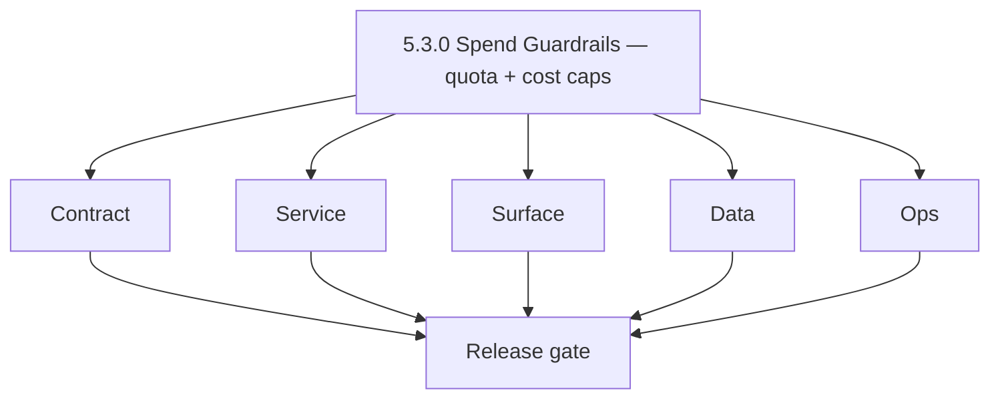
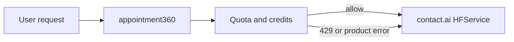

# Version 5.3 — Spend Guardrails

- **Codename:** Spend Guardrails
- **Status:** ✅ Completed
- **Target window:** TBD
- **Summary:** **AI usage limits and cost controls** — per-user quotas, provider cost caps, rate limiting, credit deduction alignment, and cost signals to observability (`logs.api` / metrics).
- **Scope:** Prevent runaway spend and abuse while keeping product usable; gateway-first enforcement with optional duplication in Contact AI.
- **Roadmap mapping:** Stage **5.3** — AI usage limits and cost controls (`docs/roadmap.md`).
- **Owner:** Platform + Billing + AI Platform
- **Patch closure:** Every codenamed patch file includes **Micro-gate** + **Service task slices**. Era hub: [`versions.md`](../versions.md).

## Scope

- Target minor: `5.3.0`
- Depends on: `5.1.0`–`5.2.0` live traffic paths.
- In scope: Quotas, throttles, budget alerts, UX for limit exceeded, env-driven caps in inference layer.

## Flowchart

### Runtime focus

## Task tracks

### Contract

- ✅ Completed: 📌 Planned: **[contact-ai]** — refine duplicate task (was: 📌 planned: **[contact-ai]** — refine duplicate task (was: 📌 …) | patch `5.3.0` band `0` | reason: specialize this file vs sibling patches; see docs/codebases/contact-ai-codebase-analysis.md
- ✅ Completed: 📌 Planned: **[contact-ai]** — refine duplicate task (was: ✅ completed: 📌 planned: define provider budget: soft alert v…) | patch `5.3.0` band `0` | reason: specialize this file vs sibling patches; see docs/codebases/contact-ai-codebase-analysis.md

- ✅ Completed: 📌 Planned: **[contact-ai]** — refine duplicate task (was: 📌 planned: **[architecture]** — product **graphql** remains …) | patch `5.3.0` band `0` | reason: specialize this file vs sibling patches; see docs/codebases/contact-ai-codebase-analysis.md
### Service

- ✅ Completed: 📌 Planned: **[contact-ai]** — refine duplicate task (was: 📌 planned: **[contact-ai]** — refine duplicate task (was: 📌 …) | patch `5.3.0` band `0` | reason: specialize this file vs sibling patches; see docs/codebases/contact-ai-codebase-analysis.md
- ✅ Completed: 📌 Planned: **[contact-ai]** — refine duplicate task (was: ✅ completed: 📌 planned: **contact.ai**: `tokenbucketratelimi…) | patch `5.3.0` band `0` | reason: specialize this file vs sibling patches; see docs/codebases/contact-ai-codebase-analysis.md

- ✅ Completed: 📌 Planned: **[contact-ai]** — refine duplicate task (was: 📌 planned: **[architecture]** — **go/gin satellites** in sco…) | patch `5.3.0` band `0` | reason: specialize this file vs sibling patches; see docs/codebases/contact-ai-codebase-analysis.md
### Surface

- ✅ Completed: 📌 Planned: **[contact-ai]** — refine duplicate task (was: ✅ completed: 📌 planned: **app**: credit/quota depleted state…) | patch `5.3.0` band `0` | reason: specialize this file vs sibling patches; see docs/codebases/contact-ai-codebase-analysis.md
- ✅ Completed: 📌 Planned: **[contact-ai]** — refine duplicate task (was: ✅ completed: 📌 planned: **admin**: internal quota overview (…) | patch `5.3.0` band `0` | reason: specialize this file vs sibling patches; see docs/codebases/contact-ai-codebase-analysis.md

- ✅ Completed: 📌 Planned: **[contact-ai]** — refine duplicate task (was: 📌 planned: **[architecture]** — **next.js** customer surface…) | patch `5.3.0` band `0` | reason: specialize this file vs sibling patches; see docs/codebases/contact-ai-codebase-analysis.md
### Data

- ✅ Completed: 📌 Planned: **[contact-ai]** — refine duplicate task (was: ✅ completed: 📌 planned: usage ledger source of truth (table …) | patch `5.3.0` band `0` | reason: specialize this file vs sibling patches; see docs/codebases/contact-ai-codebase-analysis.md

- ✅ Completed: 📌 Planned: **[contact-ai]** — refine duplicate task (was: 📌 planned: **[architecture]** — **postgresql-first** per `do…) | patch `5.3.0` band `0` | reason: specialize this file vs sibling patches; see docs/codebases/contact-ai-codebase-analysis.md
### Ops

- ✅ Completed: 📌 Planned: **[contact-ai]** — refine duplicate task (was: ✅ completed: 📌 planned: dashboards: cost/token estimates, 42…) | patch `5.3.0` band `0` | reason: specialize this file vs sibling patches; see docs/codebases/contact-ai-codebase-analysis.md
- ✅ Completed: 📌 Planned: **[contact-ai]** — refine duplicate task (was: ✅ completed: 📌 planned: runbook: disable ai feature flag / l…) | patch `5.3.0` band `0` | reason: specialize this file vs sibling patches; see docs/codebases/contact-ai-codebase-analysis.md

- ✅ Completed: 📌 Planned: **[contact-ai]** — refine duplicate task (was: 📌 planned: **[architecture]** — **observability**: correlate…) | patch `5.3.0` band `0` | reason: specialize this file vs sibling patches; see docs/codebases/contact-ai-codebase-analysis.md
## Per-service slices (5.3.0)

### appointment360

- Billing/credits integration: single charge path per successful inference or per policy.
- Idempotency: retries must not double-charge.

### contact.ai

- Export metrics compatible with cost aggregation (per route, per model).

### logs.api

- Structured events for `ai_quota_denied`, `ai_provider_cap` (schema refined in 5.8).

## Immediate next execution queue

- 📌 Planned: Load test: quota triggers at expected thresholds.
- 📌 Planned: Verify free vs paid plan behavior in staging.
- 📌 Planned: Document env vars in [`ai-cost-governance.md`](ai-cost-governance.md).

## Cross-service ownership

| Service | 5.3.0 focus |
| --- | --- |
| `contact360.io/api` | Quota + credits |
| `backend(dev)/contact.ai` | Rate limits + provider caps |
| `lambda/logs.api` | Cost/quota telemetry |
| `contact360.io/app` | UX for limits |

## References

- [`docs/governance.md`](../governance.md)
- [`docs/audit-compliance.md`](../audit-compliance.md)

## Release gate

- 📌 Planned: No silent fallback that bypasses billing
- 📌 Planned: Alerts wired for budget threshold
- 📌 Planned: User-visible error copy approved

## Master checklist

- 📌 Planned: Per-user AI quota enforced
- 📌 Planned: Provider cost cap behavior documented
- 📌 Planned: Metrics emitted for finance review

### Micro-gate reference (apply at every `5.N.P`)

| Track | Gate question (must answer Yes or document waiver) |
| --- | --- |
| **Contract** | Contact AI REST, GraphQL AI module, model mapping — `docs/backend/apis/` + endpoint matrices updated? |
| **Service** | `contact.ai`, `LambdaAIClient`, jobs AI envelope — smoke + message caps / idempotency? |
| **Surface** | Dashboard `/ai-chat`, utilities, admin AI — user-visible delta? |
| **Frontend** | Routes/hooks per `contact-ai-ui-bindings.md` / pages JSON? |
| **Data** | `ai_chats`, prompts, S3 AI artifacts — migrations + lineage docs? |
| **Ops** | AI cost/telemetry in `logs.api`, alerts, runbooks — recorded? |
| **Architecture** | Go/Gin satellites only via Python GraphQL gateway (`contact360.io/api`); Next.js `NEXT_PUBLIC_GRAPHQL_URL`; Postgres-first / Redis exit per `docs/docs/data-stores-postgres.md`. |

**Patch ladder:** Codenames `Void` → `Bloom` per minor (`.0`–`.9`) — see patch table below.

## Patches

| Patch | Codename | Doc |
| --- | --- | --- |
| `5.3.0` | Void | [`5.3.0` — Void](5.3.0 — Void.md) |
| `5.3.1` | Seed | [`5.3.1` — Seed](5.3.1 — Seed.md) |
| `5.3.2` | Sprout | [`5.3.2` — Sprout](5.3.2 — Sprout.md) |
| `5.3.3` | Roots | [`5.3.3` — Roots](5.3.3 — Roots.md) |
| `5.3.4` | Soil | [`5.3.4` — Soil](5.3.4 — Soil.md) |
| `5.3.5` | Rain | [`5.3.5` — Rain](5.3.5 — Rain.md) |
| `5.3.6` | Stem | [`5.3.6` — Stem](5.3.6 — Stem.md) |
| `5.3.7` | Branch | [`5.3.7` — Branch](5.3.7 — Branch.md) |
| `5.3.8` | Leaf | [`5.3.8` — Leaf](5.3.8 — Leaf.md) |
| `5.3.9` | Bloom | [`5.3.9` — Bloom](5.3.9 — Bloom.md) |

## Patch ladder (5.3.0 - 5.3.9)

### Micro-gate reference (apply at every patch)

| Track | Gate question (must answer Yes or waiver) |
| --- | --- |
| **Contract** | Contract/API change captured with diff or explicit no-change note |
| **Service** | Service health and smoke for affected paths pass |
| **Surface** | UI/admin/extension impact documented or N/A |
| **Frontend** | Routes/components/hooks affected listed or N/A |
| **Data** | Migrations/index/lineage deltas linked or N/A |
| **Ops** | Rollback/secrets/CI/runbook delta linked or N/A |

**Patch intent bands:** `.0` charter, `.1-.2` scaffold, `.3-.5` hardening, `.6-.8` integration, `.9` freeze/handoff.

| Patch | Codename | Focus | Evidence gate |
| --- | --- | --- | --- |
| `5.3.0` | Void | patch focus | charter artifact linked |
| `5.3.1` | Seed | patch focus | closeout evidence attached |
| `5.3.2` | Sprout | patch focus | closeout evidence attached |
| `5.3.3` | Roots | patch focus | closeout evidence attached |
| `5.3.4` | Soil | patch focus | closeout evidence attached |
| `5.3.5` | Rain | patch focus | closeout evidence attached |
| `5.3.6` | Stem | patch focus | closeout evidence attached |
| `5.3.7` | Branch | patch focus | closeout evidence attached |
| `5.3.8` | Leaf | patch focus | closeout evidence attached |
| `5.3.9` | Bloom | patch focus | handoff documented |

## Release Gate and Evidence

### Master Task Checklist
- 📌 Planned: Track-level closure evidence linked

### Backend API and Endpoints
- 📌 Planned: Endpoint/contract parity verified

### Database and Data Lineage
- 📌 Planned: Migration and lineage references linked

### Frontend UX
- 📌 Planned: UX/route behavior evidence linked

### UI Elements
- 📌 Planned: Components/checklist closeout captured

### Flow and Graph
- 📌 Planned: Runtime graph reflects implementation

### Validation
- 📌 Planned: Smoke/CI/lint checks recorded

### Release Gate
- 📌 Planned: Minor ready for handoff to next minor
