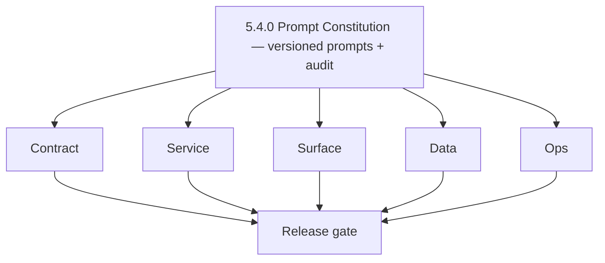
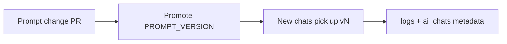

# Version 5.4 — Prompt Constitution

- **Codename:** Prompt Constitution
- **Status:** planned
- **Target window:** TBD
- **Summary:** **Prompt versioning and governance** — reproducible audits, rollback of system prompts, `prompt_version` (or equivalent) on chat metadata / activity records, and alignment with repo governance and DocsAI sync.
- **Scope:** Operational safety and compliance for AI content; change control for prompts used in production.
- **Roadmap mapping:** Stage **5.4** — Prompt versioning and governance (`docs/roadmap.md`).
- **Owner:** AI Platform + Security/Compliance + DocsAI
- **Patch closure:** Every codenamed patch file includes **Micro-gate** + **Service task slices**. Era hub: [`versions.md`](../versions.md).

## Scope

- Target minor: `5.4.0`
- Depends on: `5.2.0`–`5.3.0` stable traffic.
- In scope: Version IDs embedded in prompts, storage on `ai_chats` or related audit store, admin visibility, rollback procedure.

## Flowchart

### Runtime focus

## Task tracks

### Contract

- 📌 Planned: Define `prompt_version` field semantics (string or semver) and where it is stored (Postgres column vs JSONB vs separate table).
- 📌 Planned: Map to [`docsai-sync.md`](../docsai-sync.md) if AI policy constants are mirrored in DocsAI.

### Service

- 📌 Planned: **contact.ai**: Centralize system prompts; read version from config/env; include version in internal logs (non-PII).
- 📌 Planned: **appointment360**: Pass through or stamp version on GraphQL mutations if required for audit export.

### Surface

- 📌 Planned: **admin**: Optional internal page listing active prompt version and history (per `admin-codebase-analysis.md`).
- 📌 Planned: **app**: Developer-only or support-only badge suppressed from end users unless product requires “AI policy updated” notice.

### Data

- 📌 Planned: Migration plan for new column(s) on `ai_chats` or audit sidecar.
- 📌 Planned: Retention: prompt text vs version id (avoid storing secrets in DB).

### Ops

- 📌 Planned: Runbook: rollback prompt — deploy previous `PROMPT_VERSION`, drain inflight, verify samples.
- 📌 Planned: CI check: prompt change requires changelog + version bump per `governance.md`.

## Per-service slices (5.4.0)

### contact.ai

- Single source of truth for prompt templates per utility and chat system message.

### appointment360

- Audit events for prompt version at mutation time if compliance mandates.

### DocsAI / admin

- Sync markdown AI policy docs to Django constants where applicable.

## Immediate next execution queue

- 📌 Planned: Define migration: add `prompt_version` to `ai_chats` or messages envelope.
- 📌 Planned: Incident drill: roll back one version in staging.
- 📌 Planned: Legal/compliance signoff on logged metadata.

## Cross-service ownership

| Service | 5.4.0 focus |
| --- | --- |
| `backend(dev)/contact.ai` | Prompt modules + version stamping |
| `contact360.io/api` | Audit propagation |
| `contact360.io/admin` | Ops visibility |
| Docs | [`docsai-sync.md`](../docsai-sync.md) |

## References

- [`docs/governance.md`](../governance.md)
- [`ai-cost-governance.md`](ai-cost-governance.md)

## Release gate

- 📌 Planned: Every production prompt change has version id
- 📌 Planned: Rollback tested
- 📌 Planned: Docs and constants in sync

## Master checklist

- 📌 Planned: `PROMPT_VERSION` (or equivalent) in config
- 📌 Planned: No unversioned ad-hoc prompts in hot paths
- 📌 Planned: Audit trail exportable for one chat/thread

### Micro-gate reference (apply at every `5.N.P`)

| Track | Gate question (must answer Yes or document waiver) |
| --- | --- |
| **Contract** | Contact AI REST, GraphQL AI module, model mapping — `docs/backend/apis/` + endpoint matrices updated? |
| **Service** | `contact.ai`, `LambdaAIClient`, jobs AI envelope — smoke + message caps / idempotency? |
| **Surface** | Dashboard `/ai-chat`, utilities, admin AI — user-visible delta? |
| **Frontend** | Routes/hooks per `contact-ai-ui-bindings.md` / pages JSON? |
| **Data** | `ai_chats`, prompts, S3 AI artifacts — migrations + lineage docs? |
| **Ops** | AI cost/telemetry in `logs.api`, alerts, runbooks — recorded? |

**Patch ladder:** Codenames `Void` → `Bloom` per minor (`.0`–`.9`) — see patch table below.

## Patches

| Patch | Codename | Doc |
| --- | --- | --- |
| `5.4.0` | Void | [`5.4.0` — Void](5.4.0 — Void.md) |
| `5.4.1` | Seed | [`5.4.1` — Seed](5.4.1 — Seed.md) |
| `5.4.2` | Sprout | [`5.4.2` — Sprout](5.4.2 — Sprout.md) |
| `5.4.3` | Roots | [`5.4.3` — Roots](5.4.3 — Roots.md) |
| `5.4.4` | Soil | [`5.4.4` — Soil](5.4.4 — Soil.md) |
| `5.4.5` | Rain | [`5.4.5` — Rain](5.4.5 — Rain.md) |
| `5.4.6` | Stem | [`5.4.6` — Stem](5.4.6 — Stem.md) |
| `5.4.7` | Branch | [`5.4.7` — Branch](5.4.7 — Branch.md) |
| `5.4.8` | Leaf | [`5.4.8` — Leaf](5.4.8 — Leaf.md) |
| `5.4.9` | Bloom | [`5.4.9` — Bloom](5.4.9 — Bloom.md) |

## Patch ladder (5.4.0 - 5.4.9)

### Micro-gate reference (apply at every patch)

| Track | Gate question (must answer Yes or waiver) |
| --- | --- |
| **Contract** | Contract/API change captured with diff or explicit no-change note |
| **Service** | Service health and smoke for affected paths pass |
| **Surface** | UI/admin/extension impact documented or N/A |
| **Frontend** | Routes/components/hooks affected listed or N/A |
| **Data** | Migrations/index/lineage deltas linked or N/A |
| **Ops** | Rollback/secrets/CI/runbook delta linked or N/A |

**Patch intent bands:** `.0` charter, `.1-.2` scaffold, `.3-.5` hardening, `.6-.8` integration, `.9` freeze/handoff.

| Patch | Codename | Focus | Evidence gate |
| --- | --- | --- | --- |
| `5.4.0` | Void | patch focus | charter artifact linked |
| `5.4.1` | Seed | patch focus | closeout evidence attached |
| `5.4.2` | Sprout | patch focus | closeout evidence attached |
| `5.4.3` | Roots | patch focus | closeout evidence attached |
| `5.4.4` | Soil | patch focus | closeout evidence attached |
| `5.4.5` | Rain | patch focus | closeout evidence attached |
| `5.4.6` | Stem | patch focus | closeout evidence attached |
| `5.4.7` | Branch | patch focus | closeout evidence attached |
| `5.4.8` | Leaf | patch focus | closeout evidence attached |
| `5.4.9` | Bloom | patch focus | handoff documented |

## Release Gate and Evidence

### Master Task Checklist
- 📌 Planned: Track-level closure evidence linked

### Backend API and Endpoints
- 📌 Planned: Endpoint/contract parity verified

### Database and Data Lineage
- 📌 Planned: Migration and lineage references linked

### Frontend UX
- 📌 Planned: UX/route behavior evidence linked

### UI Elements
- 📌 Planned: Components/checklist closeout captured

### Flow and Graph
- 📌 Planned: Runtime graph reflects implementation

### Validation
- 📌 Planned: Smoke/CI/lint checks recorded

### Release Gate
- 📌 Planned: Minor ready for handoff to next minor
