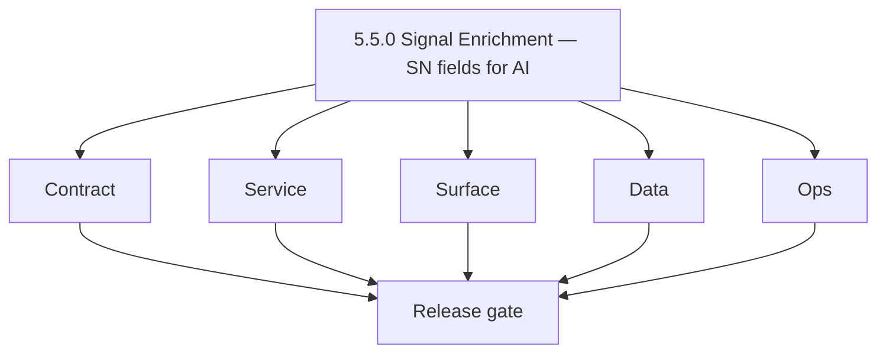
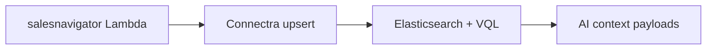

# Version 5.5 — Signal Enrichment

- **Codename:** Signal Enrichment
- **Status:** ✅ Completed
- **Target window:** TBD
- **Summary:** **Sales Navigator and contact-quality fields** required for high-quality AI context: `data_quality_score`, `about`, `seniority`, `departments`, provenance for SN-sourced contacts; UI signals (“AI-ready” badge, data-quality affordances) so users know when AI summaries and filters are reliable.
- **Scope:** Extends Era 5 after canonical roadmap minors `5.1`–`5.4`; aligns with **Service task slices** in `5.5.P` patch files (scope from former `salesnavigator-ai-workflows-task-pack.md`) and Connectra indexing.
- **Roadmap mapping:** Extension minor — **not** core `docs/versions.md` baseline; tracks codebase-analysis backlog for AI-grade data.
- **Owner:** SN Ingest + Search + Dashboard
- **Patch closure:** Every codenamed patch file includes **Micro-gate** + **Service task slices**. Era hub: [`versions.md`](../versions.md).

## Scope

- Target minor: `5.5.0`
- In scope: Ingest quality, field completeness, dashboard indicators, `parse-filters` segment for `source=sales_navigator` where applicable.

## Flowchart

### Runtime focus

## Task tracks

### Contract

- ✅ Completed: ✅ Completed: 📌 Planned: Minimum SN contact eligibility for AI: title, `data_quality_score` threshold, `about` presence (**Service task slices** in `5.5.P` patch files (scope from former `salesnavigator-ai-workflows-task-pack.md`)).
- ✅ Completed: 📌 Planned: **[contact-ai]** — refine duplicate task (was: ✅ completed: 📌 planned: jsonb `messages.contacts[]` includes…) | patch `5.5.0` band `0` | reason: specialize this file vs sibling patches; see docs/codebases/contact-ai-codebase-analysis.md

- ✅ Completed: 📌 Planned: **[contact-ai]** — refine duplicate task (was: 📌 planned: **[architecture]** — product **graphql** remains …) | patch `5.5.0` band `0` | reason: specialize this file vs sibling patches; see docs/codebases/contact-ai-codebase-analysis.md
### Service

- ✅ Completed: 📌 Planned: **[contact-ai]** — refine duplicate task (was: 📌 planned: **[contact-ai]** — refine duplicate task (was: 📌 …) | patch `5.5.0` band `0` | reason: specialize this file vs sibling patches; see docs/codebases/contact-ai-codebase-analysis.md
- ✅ Completed: 📌 Planned: **[contact-ai]** — refine duplicate task (was: ✅ completed: 📌 planned: **connectra**: index `data_quality_s…) | patch `5.5.0` band `0` | reason: specialize this file vs sibling patches; see docs/codebases/contact-ai-codebase-analysis.md

- ✅ Completed: 📌 Planned: **[contact-ai]** — refine duplicate task (was: 📌 planned: **[architecture]** — **go/gin satellites** in sco…) | patch `5.5.0` band `0` | reason: specialize this file vs sibling patches; see docs/codebases/contact-ai-codebase-analysis.md
### Surface

- ✅ Completed: 📌 Planned: **[contact-ai]** — refine duplicate task (was: ✅ completed: 📌 planned: **app**: `dataqualitybar`, “ai-ready…) | patch `5.5.0` band `0` | reason: specialize this file vs sibling patches; see docs/codebases/contact-ai-codebase-analysis.md
- ✅ Completed: 📌 Planned: **[contact-ai]** — refine duplicate task (was: ✅ completed: 📌 planned: **extension**: profiles feed connect…) | patch `5.5.0` band `0` | reason: specialize this file vs sibling patches; see docs/codebases/contact-ai-codebase-analysis.md

- ✅ Completed: 📌 Planned: **[contact-ai]** — refine duplicate task (was: 📌 planned: **[architecture]** — **next.js** customer surface…) | patch `5.5.0` band `0` | reason: specialize this file vs sibling patches; see docs/codebases/contact-ai-codebase-analysis.md
### Data

- ✅ Completed: 📌 Planned: **[contact-ai]** — refine duplicate task (was: ✅ completed: 📌 planned: confirm field coverage in es mapping…) | patch `5.5.0` band `0` | reason: specialize this file vs sibling patches; see docs/codebases/contact-ai-codebase-analysis.md

- ✅ Completed: 📌 Planned: **[contact-ai]** — refine duplicate task (was: 📌 planned: **[architecture]** — **postgresql-first** per `do…) | patch `5.5.0` band `0` | reason: specialize this file vs sibling patches; see docs/codebases/contact-ai-codebase-analysis.md
### Ops

- ✅ Completed: 📌 Planned: **[contact-ai]** — refine duplicate task (was: ✅ completed: 📌 planned: monitor ai errors correlated with lo…) | patch `5.5.0` band `0` | reason: specialize this file vs sibling patches; see docs/codebases/contact-ai-codebase-analysis.md
- ✅ Completed: 📌 Planned: **[contact-ai]** — refine duplicate task (was: ✅ completed: 📌 planned: alert on high share of score &lt; 30…) | patch `5.5.0` band `0` | reason: specialize this file vs sibling patches; see docs/codebases/contact-ai-codebase-analysis.md

- ✅ Completed: 📌 Planned: **[contact-ai]** — refine duplicate task (was: 📌 planned: **[architecture]** — **observability**: correlate…) | patch `5.5.0` band `0` | reason: specialize this file vs sibling patches; see docs/codebases/contact-ai-codebase-analysis.md
## Per-service slices (5.5.0)

### salesnavigator

- Tests: full `about` → valid downstream `generate_company_summary` request.

### Connectra

- VQL: `data_quality_score` range queries documented.

### app

- Filter chips: “Recently saved from SN” in AI filter context where designed.

## Immediate next execution queue

- 📌 Planned: Regression: `parse-filters` with SN segment → expected VQL.
- 📌 Planned: Sample dataset: 100 SN contacts with scores distributed.

## Cross-service ownership

| Service | 5.5.0 focus |
| --- | --- |
| `backend(dev)/salesnavigator` | Field quality |
| `contact360.io/sync` | Index + VQL |
| `contact360.io/app` | Quality UI |

## References

- [`docs/codebases/salesnavigator-codebase-analysis.md`](../codebases/salesnavigator-codebase-analysis.md)
- [`docs/frontend/salesnavigator-ui-bindings.md`](../frontend/salesnavigator-ui-bindings.md)

## Release gate

- 📌 Planned: AI eligibility rules documented
- 📌 Planned: Index + UI aligned on thresholds

## Master checklist

- 📌 Planned: `data_quality_score` filterable in Connectra
- 📌 Planned: SN `about` truncation policy explicit
- 📌 Planned: Dashboard shows quality affordances

### Micro-gate reference (apply at every `5.N.P`)

| Track | Gate question (must answer Yes or document waiver) |
| --- | --- |
| **Contract** | Contact AI REST, GraphQL AI module, model mapping — `docs/backend/apis/` + endpoint matrices updated? |
| **Service** | `contact.ai`, `LambdaAIClient`, jobs AI envelope — smoke + message caps / idempotency? |
| **Surface** | Dashboard `/ai-chat`, utilities, admin AI — user-visible delta? |
| **Frontend** | Routes/hooks per `contact-ai-ui-bindings.md` / pages JSON? |
| **Data** | `ai_chats`, prompts, S3 AI artifacts — migrations + lineage docs? |
| **Ops** | AI cost/telemetry in `logs.api`, alerts, runbooks — recorded? |
| **Architecture** | Go/Gin satellites only via Python GraphQL gateway (`contact360.io/api`); Next.js `NEXT_PUBLIC_GRAPHQL_URL`; Postgres-first / Redis exit per `docs/docs/data-stores-postgres.md`. |

**Patch ladder:** Codenames `Void` → `Bloom` per minor (`.0`–`.9`) — see patch table below.

## Patches

| Patch | Codename | Doc |
| --- | --- | --- |
| `5.5.0` | Void | [`5.5.0` — Void](5.5.0 — Void.md) |
| `5.5.1` | Seed | [`5.5.1` — Seed](5.5.1 — Seed.md) |
| `5.5.2` | Sprout | [`5.5.2` — Sprout](5.5.2 — Sprout.md) |
| `5.5.3` | Roots | [`5.5.3` — Roots](5.5.3 — Roots.md) |
| `5.5.4` | Soil | [`5.5.4` — Soil](5.5.4 — Soil.md) |
| `5.5.5` | Rain | [`5.5.5` — Rain](5.5.5 — Rain.md) |
| `5.5.6` | Stem | [`5.5.6` — Stem](5.5.6 — Stem.md) |
| `5.5.7` | Branch | [`5.5.7` — Branch](5.5.7 — Branch.md) |
| `5.5.8` | Leaf | [`5.5.8` — Leaf](5.5.8 — Leaf.md) |
| `5.5.9` | Bloom | [`5.5.9` — Bloom](5.5.9 — Bloom.md) |

## Patch ladder (5.5.0 - 5.5.9)

### Micro-gate reference (apply at every patch)

| Track | Gate question (must answer Yes or waiver) |
| --- | --- |
| **Contract** | Contract/API change captured with diff or explicit no-change note |
| **Service** | Service health and smoke for affected paths pass |
| **Surface** | UI/admin/extension impact documented or N/A |
| **Frontend** | Routes/components/hooks affected listed or N/A |
| **Data** | Migrations/index/lineage deltas linked or N/A |
| **Ops** | Rollback/secrets/CI/runbook delta linked or N/A |

**Patch intent bands:** `.0` charter, `.1-.2` scaffold, `.3-.5` hardening, `.6-.8` integration, `.9` freeze/handoff.

| Patch | Codename | Focus | Evidence gate |
| --- | --- | --- | --- |
| `5.5.0` | Void | patch focus | charter artifact linked |
| `5.5.1` | Seed | patch focus | closeout evidence attached |
| `5.5.2` | Sprout | patch focus | closeout evidence attached |
| `5.5.3` | Roots | patch focus | closeout evidence attached |
| `5.5.4` | Soil | patch focus | closeout evidence attached |
| `5.5.5` | Rain | patch focus | closeout evidence attached |
| `5.5.6` | Stem | patch focus | closeout evidence attached |
| `5.5.7` | Branch | patch focus | closeout evidence attached |
| `5.5.8` | Leaf | patch focus | closeout evidence attached |
| `5.5.9` | Bloom | patch focus | handoff documented |

## Release Gate and Evidence

### Master Task Checklist
- 📌 Planned: Track-level closure evidence linked

### Backend API and Endpoints
- 📌 Planned: Endpoint/contract parity verified

### Database and Data Lineage
- 📌 Planned: Migration and lineage references linked

### Frontend UX
- 📌 Planned: UX/route behavior evidence linked

### UI Elements
- 📌 Planned: Components/checklist closeout captured

### Flow and Graph
- 📌 Planned: Runtime graph reflects implementation

### Validation
- 📌 Planned: Smoke/CI/lint checks recorded

### Release Gate
- 📌 Planned: Minor ready for handoff to next minor
