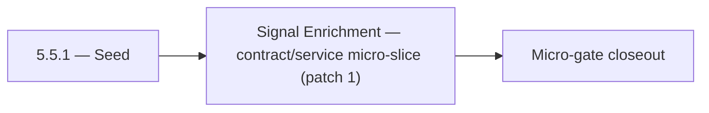

# 5.5.1 — Seed

- **Era:** `5.x` AI workflows — hub [`versions.md`](../versions.md) · minors start at [`5.0 — Neural Spine`](5.0%20%E2%80%94%20Neural%20Spine.md)
- **Minor:** [5.5 — Signal Enrichment](./5.5 — Signal Enrichment.md)
- **Codename:** Seed
- **Status:** ✅ Completed
## Focus
Signal Enrichment — contract/service micro-slice (patch 1)

## Flowchart

## Micro-gate

| Track | Gate question | Answer / Evidence (fill at patch closeout) |
| --- | --- | --- |
| **Contract** | Contact AI REST, GraphQL AI module, HF/model mapping — `docs/backend/apis/` + matrices updated? | Document at patch closeout. |
| **Service** | `contact.ai` inference, gateway `LambdaAIClient`, jobs AI path — smoke + caps documented? | Document smoke paths. |
| **Surface** | Dashboard AI chat, utilities, admin AI flows changed? | Document UX delta or N/A. |
| **Frontend** | Which routes/hooks (`contact-ai-ui-bindings`, pages JSON) for this patch? | SN / Connectra field quality for AI filters. Document at closeout. |
| **Data** | `ai_chats`, prompts, S3 AI artifacts — migrations + lineage? | Document lineage or N/A. |
| **Ops** | `logs.api` AI events, cost/error alerts, runbooks — delta recorded? | Document ops delta or N/A. |

## Tasks
### Contract
- ✅ Completed: 📌 Planned: JSONB `messages.contacts[]` includes `seniority`, `departments`, SN URL fields where available.
- ✅ Completed: 📌 Planned: **Tenant isolation:** Assert every AI-originated query path resolves through tenant-scoped API keys and cannot bypass filter predicates.
- ✅ Completed: 📌 Planned: Lock `SendMessageInput.model` contract: accepted values and mapping documented in `17_AI_CHATS_MODULE.md`.
- ✅ Completed: 📌 Planned: Define prompt-safe output contract (no sensitive raw SMTP payload).

### Service
- ✅ Completed: 📌 Planned: **Connectra**: Index `data_quality_score` for VQL; validate filter operators.
- ✅ Completed: 📌 Planned: Performance guardrails: rate limits compatible with AI-driven query bursts ([`5.3 — Spend Guardrails.md`](5.3 — Spend Guardrails.md)).
- ✅ Completed: 📌 Planned: Implement `HFService` model routing: `ModelSelection` enum → HF model ID; default from `HF_CHAT_MODEL` env.
- ✅ Completed: 📌 Planned: Implement `messages` JSONB strict validation (max text length, valid sender values, max contacts).

### Surface

- ✅ Completed: 📌 Planned: **[appointment360]** — Verify UX for route `/email` and bindings (patch 5.5.1 band 1) | area: `frontend-page` | files: `contact360.io/app/...` | reason: Dashboard/extension surface for era 5 must match gateway contracts

### Data

- ✅ Completed: 📌 Planned: **[contact-ai]** — Update PostgreSQL/ES/S3 lineage notes if this patch touches persistence or exports | area: `data-lineage` | files: `docs/backend/database/`, `migrations/` | reason: Migrations, indexes, and lineage evidence for this patch

### Ops

- ✅ Completed: 📌 Planned: **[platform]** — Record smoke evidence, rollback, and alerts (patch band 1: charter/P0) | area: `ops` | files: `docs/commands/`, `.github/workflows/` | reason: Smoke, rollback, and observability for patch 5.5.1

## Service task slices
> Merged from era `5.x` AI workflow task packs (P0→`.0`–`.2`, P1→`.3`–`.6`, Ops→`.7`–`.9`).

### Salesnavigator
- Define minimum field requirements for a SN contact to be eligible for AI context:
- `title` present
- `data_quality_score >= 50`
- `about` present (for richer AI context)
- Define `parse-filters` payload contract compatibility: SN field names vs. AI filter schema
- Contract: `company/summary` calls can use company data from SN-sourced contacts
- Ensure `seniority` and `departments` inference outputs valid values for AI prompt construction
- Surface `data_quality_score` as a filterable field (confirm Connectra VQL supports `data_quality_score >= N`)
- Ensure `about` field passes through extraction without truncation (max length defined)
- Add test: SN-sourced contact with full `about` → valid AI company summary request
- Confirm `messages.contacts[]` JSONB sub-schema covers SN contact fields (`seniority`, `departments`, `linkedin_sales_url`)
- Confirm `data_quality_score` is indexed in Connectra for VQL filter queries

### Connectra
- **AI-facing field whitelist:** Document stable fields (names + types) for contacts/companies that may be embedded in prompts or tool results; exclude sensitive or volatile columns by default.
- **Confidence metadata expectations:** When enrichment or scoring produces confidence, define JSON shape and where it lives on hydrated records.
- **VQL AI-safe subset:** Allowlist operators and max row caps for filters produced by Contact AI `parse-filters` / NL → VQL (coordinate with [`version_5.2.md`](version_5.2.md) and [`version_5.10.md`](version_5.10.md)).
- **Tenant isolation:** Assert every AI-originated query path resolves through tenant-scoped API keys and cannot bypass filter predicates.
- Ensure **Connectra query outputs** include whitelist fields and optional confidence for AI chat/assist pipelines.
- Prevent **over-fetch** on AI tool calls: default pagination and field projection for AI profile.
- Validate **two-phase read** (ES ids → PG hydrate) returns consistent shapes for AI consumers.
- Performance guardrails: rate limits compatible with AI-driven query bursts ([`version_5.3.md`](version_5.3.md)).
- **Enrichment artifact lineage:** Link enrichment outputs to source entities (contact/company uuid) for audit and replay.
- **Elasticsearch mappings:** Confirm AI-dependent fields (e.g. `data_quality_score`, SN provenance) are indexed per [`version_5.5.md`](version_5.5.md).

### contact.ai
- Lock full REST API contract: all `/api/v1/ai-chats/` and `/api/v1/ai/` paths.
- Fix `ModelSelection` enum mapping shim: GraphQL enum values (`FLASH`, `PRO`, etc.) must map to HF model IDs in `LambdaAIClient` or Contact AI service.
- Align `LambdaAIClient` paths to `/api/v1/ai/…` — remove any legacy `/gemini/…` references.
- Lock `SendMessageInput.model` contract: accepted values and mapping documented in `17_AI_CHATS_MODULE.md`.
- Document `POST /api/v1/ai-chats/{id}/message/stream` SSE event format: `data: <token>\n\n`, `data: [DONE]\n\n`.
- Define API versioning strategy: all routes under `/api/v1/`; no unversioned routes in production.
- Complete all chat CRUD endpoints: `GET/POST /api/v1/ai-chats/`, `GET/PUT/DELETE /api/v1/ai-chats/{id}/`.
- Implement `POST /api/v1/ai-chats/{id}/message` (sync) with full `AIChatService` orchestration.
- Implement `POST /api/v1/ai-chats/{id}/message/stream` (SSE streaming) via `HFService` async generator.
- Implement `HFService` model routing: `ModelSelection` enum → HF model ID; default from `HF_CHAT_MODEL` env.
- Implement Gemini fallback: if HF inference fails after N retries, call Gemini API.
- Enforce 100-message-per-chat cap in `AIChatService`.
- All utility endpoints fully implemented and tested: `analyzeEmailRisk`, `generateCompanySummary`, `parseContactFilters`.
- Implement `messages` JSONB strict validation (max text length, valid sender values, max contacts).
- Validate `messages` JSONB schema in `AIChatService` before persist: max 100 messages, valid sender, max text length.
- Add `model_version` field to AI message metadata in JSONB (for reproducibility).
- Confirm `user_id` ownership check on every read/write/delete operation.

## Evidence gate
Patch closeout includes contract diff, smoke output, data lineage delta, and ops note
