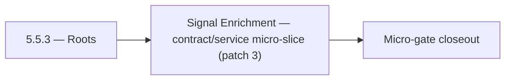

# 5.5.3 — Roots

- **Era:** `5.x` AI workflows — hub [`versions.md`](../versions.md) · minors start at [`5.0 — Neural Spine`](5.0%20%E2%80%94%20Neural%20Spine.md)
- **Minor:** [5.5 — Signal Enrichment](./5.5 — Signal Enrichment.md)
- **Codename:** Roots
- **Status:** ✅ Completed
## Focus
Signal Enrichment — contract/service micro-slice (patch 3)

## Flowchart

## Micro-gate

| Track | Gate question | Answer / Evidence (fill at patch closeout) |
| --- | --- | --- |
| **Contract** | Contact AI REST, GraphQL AI module, HF/model mapping — `docs/backend/apis/` + matrices updated? | Document at patch closeout. |
| **Service** | `contact.ai` inference, gateway `LambdaAIClient`, jobs AI path — smoke + caps documented? | Document smoke paths. |
| **Surface** | Dashboard AI chat, utilities, admin AI flows changed? | Document UX delta or N/A. |
| **Frontend** | Which routes/hooks (`contact-ai-ui-bindings`, pages JSON) for this patch? | SN / Connectra field quality for AI filters. Document at closeout. |
| **Data** | `ai_chats`, prompts, S3 AI artifacts — migrations + lineage? | Document lineage or N/A. |
| **Ops** | `logs.api` AI events, cost/error alerts, runbooks — delta recorded? | Document ops delta or N/A. |

## Tasks
### Contract
- 📌 Planned: **[contact-ai]** — refine duplicate task (was: ✅ completed: 📌 planned: **confidence metadata expectations:*…) | patch `5.5.3` band `3` | reason: specialize this file vs sibling patches; see docs/codebases/contact-ai-codebase-analysis.md
- 📌 Planned: **[contact-ai]** — refine duplicate task (was: ✅ completed: 📌 planned: fix `modelselection` enum mapping sh…) | patch `5.5.3` band `3` | reason: specialize this file vs sibling patches; see docs/codebases/contact-ai-codebase-analysis.md
- 📌 Planned: **[contact-ai]** — refine duplicate task (was: ✅ completed: 📌 planned: define api versioning strategy: all …) | patch `5.5.3` band `3` | reason: specialize this file vs sibling patches; see docs/codebases/contact-ai-codebase-analysis.md
- 📌 Planned: **[contact-ai]** — refine duplicate task (was: ✅ completed: `prompt` — versioned system/user prompt text or…) | patch `5.5.3` band `3` | reason: specialize this file vs sibling patches; see docs/codebases/contact-ai-codebase-analysis.md

### Service
- 📌 Planned: **[contact-ai]** — refine duplicate task (was: ✅ completed: 📌 planned: prevent **over-fetch** on ai tool ca…) | patch `5.5.3` band `3` | reason: specialize this file vs sibling patches; see docs/codebases/contact-ai-codebase-analysis.md
- 📌 Planned: **[contact-ai]** — refine duplicate task (was: ✅ completed: 📌 planned: implement `post /api/v1/ai-chats/{id…) | patch `5.5.3` band `3` | reason: specialize this file vs sibling patches; see docs/codebases/contact-ai-codebase-analysis.md
- 📌 Planned: **[contact-ai]** — refine duplicate task (was: ✅ completed: 📌 planned: enforce 100-message-per-chat cap in …) | patch `5.5.3` band `3` | reason: specialize this file vs sibling patches; see docs/codebases/contact-ai-codebase-analysis.md
- 📌 Planned: **[contact-ai]** — refine duplicate task (was: ✅ completed: 📌 planned: add optional “recommend action” outp…) | patch `5.5.3` band `3` | reason: specialize this file vs sibling patches; see docs/codebases/contact-ai-codebase-analysis.md

### Surface

- ✅ Completed: 📌 Planned: **[appointment360]** — Verify UX for route `/email` and bindings (patch 5.5.3 band 3) | area: `frontend-page` | files: `contact360.io/app/...` | reason: Dashboard/extension surface for era 5 must match gateway contracts

### Data

- 📌 Planned: **[contact-ai]** — refine duplicate task (was: ✅ completed: 📌 planned: **[contact-ai]** — update postgresql…) | patch `5.5.3` band `3` | reason: specialize this file vs sibling patches; see docs/codebases/contact-ai-codebase-analysis.md

### Ops

- ✅ Completed: 📌 Planned: **[platform]** — Record smoke evidence, rollback, and alerts (patch band 3: surface/data) | area: `ops` | files: `docs/commands/`, `.github/workflows/` | reason: Smoke, rollback, and observability for patch 5.5.3

## Service task slices
> Merged from era `5.x` AI workflow task packs (P0→`.0`–`.2`, P1→`.3`–`.6`, Ops→`.7`–`.9`).

### Salesnavigator
- `DataQualityBar` — thin progress bar on contact row showing AI-eligibility
- "AI-ready" indicator badge: displayed when `data_quality_score >= 50`
- AI chat panel: SN-sourced contacts can appear in `messages.contacts[]` payload
- "Recently saved from SN" filter chip in AI filter input context
- `AIFilterInput` parsing: NL → filter recognizes `source=sales_navigator` as a segment
- `CompanySummaryTab` can show summary for SN-imported companies
- Confirm `messages.contacts[]` JSONB sub-schema covers SN contact fields (`seniority`, `departments`, `linkedin_sales_url`)
- Confirm `data_quality_score` is indexed in Connectra for VQL filter queries
- Validate `about` field max length and encoding in SN extraction
- Ensure `seniority` and `departments` inference outputs valid values for AI prompt construction
- Surface `data_quality_score` as a filterable field (confirm Connectra VQL supports `data_quality_score >= N`)
- Ensure `about` field passes through extraction without truncation (max length defined)
- Add test: SN-sourced contact with full `about` → valid AI company summary request

### Connectra
- **`contact360.io/root`:** AI workflow storytelling (accuracy, confidence positioning) referencing search-backed claims.
- **`contact360.io/admin`:** Governance views for data quality and AI eligibility where applicable.
- **`contact360.io/app`:** Contact/company rows expose only whitelist-backed data to AI side panels.
- **Enrichment artifact lineage:** Link enrichment outputs to source entities (contact/company uuid) for audit and replay.
- **Elasticsearch mappings:** Confirm AI-dependent fields (e.g. `data_quality_score`, SN provenance) are indexed per [`version_5.5.md`](version_5.5.md).
- **PostgreSQL authority:** Document which fields are authoritative vs search-only for AI grounding.
- Ensure **Connectra query outputs** include whitelist fields and optional confidence for AI chat/assist pipelines.
- Prevent **over-fetch** on AI tool calls: default pagination and field projection for AI profile.
- Validate **two-phase read** (ES ids → PG hydrate) returns consistent shapes for AI consumers.
- Performance guardrails: rate limits compatible with AI-driven query bursts ([`version_5.3.md`](version_5.3.md)).

### contact.ai
- Build `AIChatPage` (`/app/ai-chat`): `ChatList` + `ChatThread` layout.
- Implement `ChatList` with pagination: uses `useChatList` hook.
- Implement `ChatThread` with message rendering: `ChatMessage` + `ContactsInMessage`.
- Implement `ChatInput` textarea with send button; disabled while streaming.
- Implement `StreamingText`: token-by-token rendering via SSE; cursor blink during stream.
- Implement `ModelSelector` dropdown with all 4 model options; persist choice in `AIModelContext`.
- Implement `NewChatButton`: creates chat and redirects to `ChatThread`.
- Implement `ChatContextMenu`: rename (PUT) and delete (DELETE) chat actions.
- Wire `EmailRiskBadge`, `CompanySummaryTab`, `AIFilterInput` to live endpoints.
- Loading states: skeleton for chat list, spinner for send, shimmer for utilities.
- Validate `messages` JSONB schema in `AIChatService` before persist: max 100 messages, valid sender, max text length.
- Add `model_version` field to AI message metadata in JSONB (for reproducibility).
- Confirm `user_id` ownership check on every read/write/delete operation.
- Test concurrent message send (two requests to same `chat_id`): document behavior; add optimistic lock if needed.
- Complete all chat CRUD endpoints: `GET/POST /api/v1/ai-chats/`, `GET/PUT/DELETE /api/v1/ai-chats/{id}/`.
- Implement `POST /api/v1/ai-chats/{id}/message` (sync) with full `AIChatService` orchestration.
- Implement `POST /api/v1/ai-chats/{id}/message/stream` (SSE streaming) via `HFService` async generator.
- Implement `HFService` model routing: `ModelSelection` enum → HF model ID; default from `HF_CHAT_MODEL` env.
- Implement Gemini fallback: if HF inference fails after N retries, call Gemini API.
- Enforce 100-message-per-chat cap in `AIChatService`.
- All utility endpoints fully implemented and tested: `analyzeEmailRisk`, `generateCompanySummary`, `parseContactFilters`.
- Implement `messages` JSONB strict validation (max text length, valid sender values, max contacts).

## Evidence gate
Patch closeout includes contract diff, smoke output, data lineage delta, and ops note
