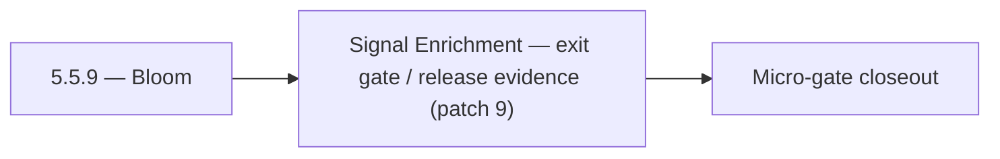

# 5.5.9 — Bloom

- **Era:** `5.x` AI workflows — hub [`versions.md`](../versions.md) · minors start at [`5.0 — Neural Spine`](5.0%20%E2%80%94%20Neural%20Spine.md)
- **Minor:** [5.5 — Signal Enrichment](./5.5 — Signal Enrichment.md)
- **Codename:** Bloom
- **Status:** ✅ Completed
## Focus
Signal Enrichment — exit gate / release evidence (patch 9)

## Flowchart

## Micro-gate

| Track | Gate question | Answer / Evidence (fill at patch closeout) |
| --- | --- | --- |
| **Contract** | Contact AI REST, GraphQL AI module, HF/model mapping — `docs/backend/apis/` + matrices updated? | Document at patch closeout. |
| **Service** | `contact.ai` inference, gateway `LambdaAIClient`, jobs AI path — smoke + caps documented? | Document smoke paths. |
| **Surface** | Dashboard AI chat, utilities, admin AI flows changed? | Document UX delta or N/A. |
| **Frontend** | Which routes/hooks (`contact-ai-ui-bindings`, pages JSON) for this patch? | SN / Connectra field quality for AI filters. Document at closeout. |
| **Data** | `ai_chats`, prompts, S3 AI artifacts — migrations + lineage? | Document lineage or N/A. |
| **Ops** | `logs.api` AI events, cost/error alerts, runbooks — delta recorded? | Document ops delta or N/A. |

## Tasks
### Ops
- 📌 Planned: **[contact-ai]** — refine duplicate task (was: ✅ completed: 📌 planned: test: ai `parse-filters` with `sourc…) | patch `5.5.9` band `9` | reason: specialize this file vs sibling patches; see docs/codebases/contact-ai-codebase-analysis.md
- 📌 Planned: **[contact-ai]** — refine duplicate task (was: ✅ completed: 📌 planned: monitor: ai errors caused by low-qua…) | patch `5.5.9` band `9` | reason: specialize this file vs sibling patches; see docs/codebases/contact-ai-codebase-analysis.md
- 📌 Planned: **[contact-ai]** — refine duplicate task (was: ✅ completed: 📌 planned: alert: high proportion of `data_qual…) | patch `5.5.9` band `9` | reason: specialize this file vs sibling patches; see docs/codebases/contact-ai-codebase-analysis.md
- 📌 Planned: **[contact-ai]** — refine duplicate task (was: ✅ completed: `docs/codebases/salesnavigator-codebase-analysi…) | patch `5.5.9` band `9` | reason: specialize this file vs sibling patches; see docs/codebases/contact-ai-codebase-analysis.md
- 📌 Planned: **[contact-ai]** — refine duplicate task (was: ✅ completed: `docs/codebases/contact-ai-codebase-analysis.md…) | patch `5.5.9` band `9` | reason: specialize this file vs sibling patches; see docs/codebases/contact-ai-codebase-analysis.md
- 📌 Planned: **[contact-ai]** — refine duplicate task (was: ✅ completed: `docs/backend/apis/salesnavigator_era_task_pack…) | patch `5.5.9` band `9` | reason: specialize this file vs sibling patches; see docs/codebases/contact-ai-codebase-analysis.md

### Contract

- ✅ Completed: 📌 Planned: **[contact-ai]** — Diff and document schema for operations like ConnectraClient, LAMBDA_AI_API_URL, LAMBDA_CONNECTRA_API_URL; align with roadmap | area: `backend-api` | files: `docs/backend/apis/*.md`, `contact360.io/api/app/graphql/schema.py` | reason: Keep GraphQL/REST contracts aligned for era 5.9 patch 5.5.9

### Service

- 📌 Planned: **[contact-ai]** — refine duplicate task (was: ✅ completed: 📌 planned: **[contact-ai]** — service slice: er…) | patch `5.5.9` band `9` | reason: specialize this file vs sibling patches; see docs/codebases/contact-ai-codebase-analysis.md

### Surface

- ✅ Completed: 📌 Planned: **[appointment360]** — Verify UX for route `/email` and bindings (patch 5.5.9 band 9) | area: `frontend-page` | files: `contact360.io/app/...` | reason: Dashboard/extension surface for era 5 must match gateway contracts

### Data

- 📌 Planned: **[contact-ai]** — refine duplicate task (was: ✅ completed: 📌 planned: **[contact-ai]** — update postgresql…) | patch `5.5.9` band `9` | reason: specialize this file vs sibling patches; see docs/codebases/contact-ai-codebase-analysis.md

## Service task slices
> Merged from era `5.x` AI workflow task packs (P0→`.0`–`.2`, P1→`.3`–`.6`, Ops→`.7`–`.9`).

### Salesnavigator
- Test: AI `parse-filters` with `source=sales_navigator` segment → correct VQL output
- Monitor: AI errors caused by low-quality SN contacts (missing title/company)
- Alert: high proportion of `data_quality_score < 30` from SN ingest sessions
- `docs/codebases/salesnavigator-codebase-analysis.md`
- `docs/codebases/contact-ai-codebase-analysis.md`
- `docs/backend/apis/SALESNAVIGATOR_ERA_TASK_PACKS.md`

### Connectra
- **AI query regression pack:** Golden VQL snippets from `parse-filters` → expected ES + hydrated results.
- **Cost-impact analysis:** Estimate extra Connectra load from AI features; tune quotas.
- **Release gate evidence:** Field coverage report, confidence field presence where promised, tenant isolation tests.

### contact.ai
- Lambda provisioned concurrency for chat paths to reduce cold-start latency.
- Prometheus metrics wired: request count, latency histogram, error rate per endpoint.
- Alert on `503` / `429` rate spike from HF API.
- Update contact.ai Postman collection with all live endpoints and SSE streaming examples.
- Add contact.ai to production deployment checklist.

## Evidence gate
Micro-gate table filled and handoff note to `5.6.0` recorded
