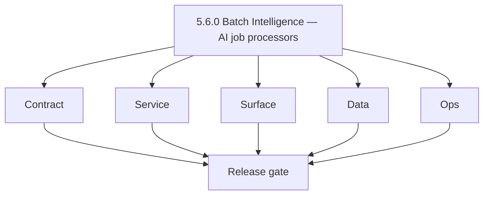
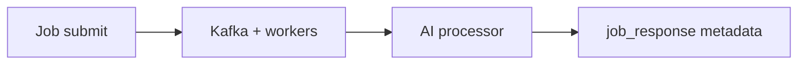

# Version 5.6 — Batch Intelligence

- **Codename:** Batch Intelligence
- **Status:** planned
- **Target window:** TBD
- **Summary:** **TKD Jobs** support for AI batch workloads: job envelope fields (`model`, `confidence`, `cost`), AI processor registry stubs, **quota-aware scheduling**, and operator-facing progress/explanation patterns.
- **Scope:** Async AI at orchestration scale; bridges interactive Contact AI with bulk/platform jobs.
- **Roadmap mapping:** Extension minor — from [`jobs-codebase-analysis.md`](../codebases/jobs-codebase-analysis.md) Era `5.x`.
- **Owner:** Jobs Platform + AI Platform
- **Patch closure:** Every codenamed patch file includes **Micro-gate** + **Service task slices**. Era hub: [`versions.md`](../versions.md).

## Scope

- Target minor: `5.6.0`
- Depends on: `5.3.0` Spend Guardrails (shared quota concepts).

## Flowchart

### Runtime focus

## Task tracks

### Contract

- 📌 Planned: AI batch envelope: `model`, `confidence`, `cost` fields and validation.
- 📌 Planned: Quota-aware enqueue: reject or defer when user/org over AI budget.

### Service

- 📌 Planned: Processor stubs + registry tests for AI task kinds.
- 📌 Planned: Execution path calls Contact AI or inline HF with same contracts as REST gateway where possible.

### Surface

- 📌 Planned: Document job cards: model name, confidence summary, retry UX ([`jobs-ui-bindings.md`](../frontend/jobs-ui-bindings.md)).

### Data

- 📌 Planned: `job_response` conventions for model run metadata and lineage to input batch ids.

### Ops

- 📌 Planned: Cost observability, alerts, budget enforcement checks.
- 📌 Planned: Runbook: model degradation and fallback processors.

## Per-service slices (5.6.0)

### contact360.io/jobs

- Implement envelope validation and quota hooks at enqueue.

### contact.ai

- Optional batch-optimized routes or shared inference client library.

## Immediate next execution queue

- 📌 Planned: Define one reference AI job type (e.g. bulk summarize) end-to-end in dev.
- 📌 Planned: Load test: fair scheduling under concurrent AI jobs.

## References

- [`docs/codebases/jobs-codebase-analysis.md`](../codebases/jobs-codebase-analysis.md)
- **Service task slices** in `5.6.P` patch files (scope from former `jobs-ai-workflows-task-pack.md`)

## Release gate

- 📌 Planned: Envelope schema frozen
- 📌 Planned: Quota integration tested
- 📌 Planned: Runbook published

## Master checklist

- 📌 Planned: AI processors registered and tested
- 📌 Planned: `job_response` includes model/confidence/cost
- 📌 Planned: Cost anomalies alertable

### Micro-gate reference (apply at every `5.N.P`)

| Track | Gate question (must answer Yes or document waiver) |
| --- | --- |
| **Contract** | Contact AI REST, GraphQL AI module, model mapping — `docs/backend/apis/` + endpoint matrices updated? |
| **Service** | `contact.ai`, `LambdaAIClient`, jobs AI envelope — smoke + message caps / idempotency? |
| **Surface** | Dashboard `/ai-chat`, utilities, admin AI — user-visible delta? |
| **Frontend** | Routes/hooks per `contact-ai-ui-bindings.md` / pages JSON? |
| **Data** | `ai_chats`, prompts, S3 AI artifacts — migrations + lineage docs? |
| **Ops** | AI cost/telemetry in `logs.api`, alerts, runbooks — recorded? |

**Patch ladder:** Codenames `Void` → `Bloom` per minor (`.0`–`.9`) — see patch table below.

## Patches

| Patch | Codename | Doc |
| --- | --- | --- |
| `5.6.0` | Void | [`5.6.0` — Void](5.6.0 — Void.md) |
| `5.6.1` | Seed | [`5.6.1` — Seed](5.6.1 — Seed.md) |
| `5.6.2` | Sprout | [`5.6.2` — Sprout](5.6.2 — Sprout.md) |
| `5.6.3` | Roots | [`5.6.3` — Roots](5.6.3 — Roots.md) |
| `5.6.4` | Soil | [`5.6.4` — Soil](5.6.4 — Soil.md) |
| `5.6.5` | Rain | [`5.6.5` — Rain](5.6.5 — Rain.md) |
| `5.6.6` | Stem | [`5.6.6` — Stem](5.6.6 — Stem.md) |
| `5.6.7` | Branch | [`5.6.7` — Branch](5.6.7 — Branch.md) |
| `5.6.8` | Leaf | [`5.6.8` — Leaf](5.6.8 — Leaf.md) |
| `5.6.9` | Bloom | [`5.6.9` — Bloom](5.6.9 — Bloom.md) |

## Patch ladder (5.6.0 - 5.6.9)

### Micro-gate reference (apply at every patch)

| Track | Gate question (must answer Yes or waiver) |
| --- | --- |
| **Contract** | Contract/API change captured with diff or explicit no-change note |
| **Service** | Service health and smoke for affected paths pass |
| **Surface** | UI/admin/extension impact documented or N/A |
| **Frontend** | Routes/components/hooks affected listed or N/A |
| **Data** | Migrations/index/lineage deltas linked or N/A |
| **Ops** | Rollback/secrets/CI/runbook delta linked or N/A |

**Patch intent bands:** `.0` charter, `.1-.2` scaffold, `.3-.5` hardening, `.6-.8` integration, `.9` freeze/handoff.

| Patch | Codename | Focus | Evidence gate |
| --- | --- | --- | --- |
| `5.6.0` | Void | patch focus | charter artifact linked |
| `5.6.1` | Seed | patch focus | closeout evidence attached |
| `5.6.2` | Sprout | patch focus | closeout evidence attached |
| `5.6.3` | Roots | patch focus | closeout evidence attached |
| `5.6.4` | Soil | patch focus | closeout evidence attached |
| `5.6.5` | Rain | patch focus | closeout evidence attached |
| `5.6.6` | Stem | patch focus | closeout evidence attached |
| `5.6.7` | Branch | patch focus | closeout evidence attached |
| `5.6.8` | Leaf | patch focus | closeout evidence attached |
| `5.6.9` | Bloom | patch focus | handoff documented |

## Release Gate and Evidence

### Master Task Checklist
- 📌 Planned: Track-level closure evidence linked

### Backend API and Endpoints
- 📌 Planned: Endpoint/contract parity verified

### Database and Data Lineage
- 📌 Planned: Migration and lineage references linked

### Frontend UX
- 📌 Planned: UX/route behavior evidence linked

### UI Elements
- 📌 Planned: Components/checklist closeout captured

### Flow and Graph
- 📌 Planned: Runtime graph reflects implementation

### Validation
- 📌 Planned: Smoke/CI/lint checks recorded

### Release Gate
- 📌 Planned: Minor ready for handoff to next minor
