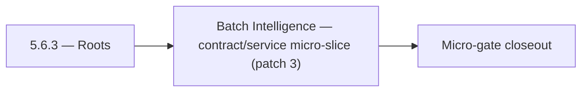

# 5.6.3 — Roots

- **Era:** `5.x` AI workflows — hub [`versions.md`](../versions.md) · minors start at [`5.0 — Neural Spine`](5.0%20%E2%80%94%20Neural%20Spine.md)
- **Minor:** [5.6 — Batch Intelligence](./5.6 — Batch Intelligence.md)
- **Codename:** Roots
- **Status:** ✅ Completed
## Focus
Batch Intelligence — contract/service micro-slice (patch 3)

## Flowchart

## Micro-gate

| Track | Gate question | Answer / Evidence (fill at patch closeout) |
| --- | --- | --- |
| **Contract** | Contact AI REST, GraphQL AI module, HF/model mapping — `docs/backend/apis/` + matrices updated? | Document at patch closeout. |
| **Service** | `contact.ai` inference, gateway `LambdaAIClient`, jobs AI path — smoke + caps documented? | Document smoke paths. |
| **Surface** | Dashboard AI chat, utilities, admin AI flows changed? | Document UX delta or N/A. |
| **Frontend** | Which routes/hooks (`contact-ai-ui-bindings`, pages JSON) for this patch? | Jobs AI envelope UI / ops for batch inference. Document at closeout. |
| **Data** | `ai_chats`, prompts, S3 AI artifacts — migrations + lineage? | Document lineage or N/A. |
| **Ops** | `logs.api` AI events, cost/error alerts, runbooks — delta recorded? | Document ops delta or N/A. |

## Tasks
### Contract
- 📌 Planned: **[contact-ai]** — refine duplicate task (was: ✅ completed: 📌 planned: **confidence metadata expectations:*…) | patch `5.6.3` band `3` | reason: specialize this file vs sibling patches; see docs/codebases/contact-ai-codebase-analysis.md
- 📌 Planned: **[contact-ai]** — refine duplicate task (was: ✅ completed: 📌 planned: fix `modelselection` enum mapping sh…) | patch `5.6.3` band `3` | reason: specialize this file vs sibling patches; see docs/codebases/contact-ai-codebase-analysis.md
- 📌 Planned: **[contact-ai]** — refine duplicate task (was: ✅ completed: 📌 planned: define api versioning strategy: all …) | patch `5.6.3` band `3` | reason: specialize this file vs sibling patches; see docs/codebases/contact-ai-codebase-analysis.md
- 📌 Planned: **[contact-ai]** — refine duplicate task (was: ✅ completed: `prompt` — versioned system/user prompt text or…) | patch `5.6.3` band `3` | reason: specialize this file vs sibling patches; see docs/codebases/contact-ai-codebase-analysis.md

### Service
- 📌 Planned: **[contact-ai]** — refine duplicate task (was: ✅ completed: 📌 planned: prevent **over-fetch** on ai tool ca…) | patch `5.6.3` band `3` | reason: specialize this file vs sibling patches; see docs/codebases/contact-ai-codebase-analysis.md
- 📌 Planned: **[contact-ai]** — refine duplicate task (was: ✅ completed: 📌 planned: implement `post /api/v1/ai-chats/{id…) | patch `5.6.3` band `3` | reason: specialize this file vs sibling patches; see docs/codebases/contact-ai-codebase-analysis.md
- 📌 Planned: **[contact-ai]** — refine duplicate task (was: ✅ completed: 📌 planned: enforce 100-message-per-chat cap in …) | patch `5.6.3` band `3` | reason: specialize this file vs sibling patches; see docs/codebases/contact-ai-codebase-analysis.md
- 📌 Planned: **[contact-ai]** — refine duplicate task (was: ✅ completed: 📌 planned: add optional “recommend action” outp…) | patch `5.6.3` band `3` | reason: specialize this file vs sibling patches; see docs/codebases/contact-ai-codebase-analysis.md

### Surface

- ✅ Completed: 📌 Planned: **[appointment360]** — Verify UX for route `/email` and bindings (patch 5.6.3 band 3) | area: `frontend-page` | files: `contact360.io/app/...` | reason: Dashboard/extension surface for era 5 must match gateway contracts

### Data

- 📌 Planned: **[contact-ai]** — refine duplicate task (was: ✅ completed: 📌 planned: **[contact-ai]** — update postgresql…) | patch `5.6.3` band `3` | reason: specialize this file vs sibling patches; see docs/codebases/contact-ai-codebase-analysis.md

### Ops

- ✅ Completed: 📌 Planned: **[platform]** — Record smoke evidence, rollback, and alerts (patch band 3: surface/data) | area: `ops` | files: `docs/commands/`, `.github/workflows/` | reason: Smoke, rollback, and observability for patch 5.6.3

## Service task slices
> Merged from era `5.x` AI workflow task packs (P0→`.0`–`.2`, P1→`.3`–`.6`, Ops→`.7`–`.9`).

### Jobs
- Document **AI batch execution cards**: model name, confidence display, retry UX, budget warnings ([`docs/frontend/jobs-ui-bindings.md`](../frontend/jobs-ui-bindings.md)).
- Document **model selection** and **budget-warning** control behavior for operators.
- Loading/progress patterns per design system for long AI batches.
- Add **`job_response` conventions** for AI model metadata, token estimates, and confidence snapshot.
- Document **lineage** from AI input batch → scored output artifacts → optional S3 pointers ([`version_5.7.md`](version_5.7.md)).
- Ensure correlation ids propagate to `logs.api` for AI job spans ([`version_5.8.md`](version_5.8.md)).
- Add **AI processor stubs** and **registry validation tests** (unknown processor fails fast at enqueue).
- Enforce **quota/cost guardrails** during enqueue and execution (short-circuit before provider calls when possible).
- Share inference client patterns with `contact.ai` where feasible (single model id vocabulary).
- Tune worker concurrency for AI tasks separately from IO-bound jobs (timeouts, retries).

### contact.ai
- Build `AIChatPage` (`/app/ai-chat`): `ChatList` + `ChatThread` layout.
- Implement `ChatList` with pagination: uses `useChatList` hook.
- Implement `ChatThread` with message rendering: `ChatMessage` + `ContactsInMessage`.
- Implement `ChatInput` textarea with send button; disabled while streaming.
- Implement `StreamingText`: token-by-token rendering via SSE; cursor blink during stream.
- Implement `ModelSelector` dropdown with all 4 model options; persist choice in `AIModelContext`.
- Implement `NewChatButton`: creates chat and redirects to `ChatThread`.
- Implement `ChatContextMenu`: rename (PUT) and delete (DELETE) chat actions.
- Wire `EmailRiskBadge`, `CompanySummaryTab`, `AIFilterInput` to live endpoints.
- Loading states: skeleton for chat list, spinner for send, shimmer for utilities.
- Validate `messages` JSONB schema in `AIChatService` before persist: max 100 messages, valid sender, max text length.
- Add `model_version` field to AI message metadata in JSONB (for reproducibility).
- Confirm `user_id` ownership check on every read/write/delete operation.
- Test concurrent message send (two requests to same `chat_id`): document behavior; add optimistic lock if needed.
- Complete all chat CRUD endpoints: `GET/POST /api/v1/ai-chats/`, `GET/PUT/DELETE /api/v1/ai-chats/{id}/`.
- Implement `POST /api/v1/ai-chats/{id}/message` (sync) with full `AIChatService` orchestration.
- Implement `POST /api/v1/ai-chats/{id}/message/stream` (SSE streaming) via `HFService` async generator.
- Implement `HFService` model routing: `ModelSelection` enum → HF model ID; default from `HF_CHAT_MODEL` env.
- Implement Gemini fallback: if HF inference fails after N retries, call Gemini API.
- Enforce 100-message-per-chat cap in `AIChatService`.
- All utility endpoints fully implemented and tested: `analyzeEmailRisk`, `generateCompanySummary`, `parseContactFilters`.
- Implement `messages` JSONB strict validation (max text length, valid sender values, max contacts).

### logs.api
- Document impacted pages/tabs/buttons/inputs for era `5.x` internal tooling ([`docs/frontend/logsapi-ui-bindings.md`](../frontend/logsapi-ui-bindings.md)).
- Document hooks/services/contexts and UX states (loading / error / progress / filter / export) with **role gating** (internal-only).
- Debug trace views: opt-in per incident, time-bounded.
- Document **S3 CSV** layout updates for AI events; partition strategy (date + service + schema version).
- **Retention segmentation**: AI-sensitive logs TTL vs general logs; legal hold procedure.
- **Trace correlation**: require `request_id` / `trace_id` alignment with upstream ([`contact-ai-codebase-analysis.md`](../codebases/contact-ai-codebase-analysis.md)).
- Implement/validate behavior for era `5.x` **AI event sources** from `contact.ai`, `appointment360`, and `jobs`.
- Implement **log write guards** in emitting services (reject oversize or forbidden subfields before POST).
- Verify auth, error envelope, and health behavior for internal consumers; no public exposure of raw AI payloads by default.

### S3Storage
- Document **retrieval semantics** for AI consumers (dashboard vs internal tools) — [`docs/frontend/s3storage-ui-bindings.md`](../frontend/s3storage-ui-bindings.md).
- Explicit error codes: expired URL, forbidden class, policy violation.
- Enforce **object-class policy checks** for AI-related prefixes (deny wrong content-type or path).
- Implement **immutable write mode** for compliance-sensitive artifacts when `IMMUTABLE_AI_ARTIFACTS=true` (or equivalent env).
- Validate multipart upload lifecycle for large AI exports; abort stale sessions.
- Rate limit AI artifact writes per tenant to control cost.

## Evidence gate
Patch closeout includes contract diff, smoke output, data lineage delta, and ops note
