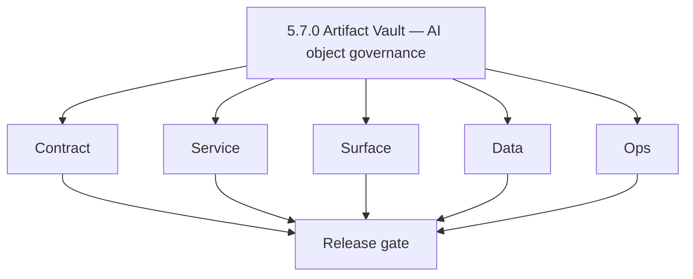
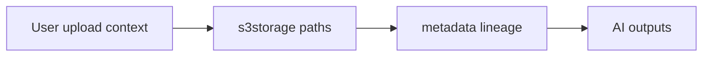

# Version 5.7 — Artifact Vault

- **Codename:** Artifact Vault
- **Status:** ✅ Completed
- **Target window:** TBD
- **Summary:** **`lambda/s3storage`** policies for **AI artifacts**: classes (prompt, input, output, intermediate), retention and access control, object-level policy guards, optional **immutable** writes for compliance-sensitive outputs, lineage from source upload → model run → derived files.
- **Scope:** Durable evidence and reproducibility without leaking PII; supports audits tied to `5.4` prompt versions.
- **Roadmap mapping:** Extension minor — [`s3storage-codebase-analysis.md`](../codebases/s3storage-codebase-analysis.md) `5.x.x` section.
- **Owner:** Storage Platform + Security + AI Platform
- **Patch closure:** Every codenamed patch file includes **Micro-gate** + **Service task slices**. Era hub: [`versions.md`](../versions.md).

## Scope

- Target minor: `5.7.0`

## Flowchart

### Runtime focus

## Task tracks

### Contract

- ✅ Completed: 📌 Planned: Define four artifact classes: `prompt`, `input`, `output`, `intermediate`.
- ✅ Completed: 📌 Planned: Retention TTL per class and per tenant tier.
- ✅ Completed: 📌 Planned: Signed URL policies for AI consumers only.

### Service

- ✅ Completed: 📌 Planned: Enforce path prefixes and object-class checks on write/read.
- ✅ Completed: 📌 Planned: Immutable write mode flag for compliance bundles.

### Surface

- ✅ Completed: 📌 Planned: Document retrieval semantics for internal tools ([`s3storage-ui-bindings.md`](../frontend/s3storage-ui-bindings.md)).

### Data

- ✅ Completed: 📌 Planned: Link `source_file_id` → `run_id` → `output_artifact_id` in metadata conventions.

### Ops

- ✅ Completed: 📌 Planned: Audit trail for sensitive artifact reads.
- ✅ Completed: 📌 Planned: Lifecycle transitions (Glacier, deletion) documented.

## Per-service slices (5.7.0)

### s3storage

- Policy tests: deny WRITE to wrong prefix; allow read with scoped role.

### contact.ai / jobs

- Write outputs only through approved storage API with lineage headers.

## References

- [`docs/codebases/s3storage-codebase-analysis.md`](../codebases/s3storage-codebase-analysis.md)
- **Service task slices** in `5.7.P` patch files (scope from former `s3storage-ai-task-pack.md`)

## Release gate

- 📌 Planned: Policy coverage report
- 📌 Planned: Lineage trace on sample workflow

## Master checklist

- 📌 Planned: Artifact class taxonomy documented
- 📌 Planned: Immutability path validated
- 📌 Planned: PII not stored in open buckets

### Micro-gate reference (apply at every `5.N.P`)

| Track | Gate question (must answer Yes or document waiver) |
| --- | --- |
| **Contract** | Contact AI REST, GraphQL AI module, model mapping — `docs/backend/apis/` + endpoint matrices updated? |
| **Service** | `contact.ai`, `LambdaAIClient`, jobs AI envelope — smoke + message caps / idempotency? |
| **Surface** | Dashboard `/ai-chat`, utilities, admin AI — user-visible delta? |
| **Frontend** | Routes/hooks per `contact-ai-ui-bindings.md` / pages JSON? |
| **Data** | `ai_chats`, prompts, S3 AI artifacts — migrations + lineage docs? |
| **Ops** | AI cost/telemetry in `logs.api`, alerts, runbooks — recorded? |

**Patch ladder:** Codenames `Void` → `Bloom` per minor (`.0`–`.9`) — see patch table below.

## Patches

| Patch | Codename | Doc |
| --- | --- | --- |
| `5.7.0` | Void | [`5.7.0` — Void](5.7.0 — Void.md) |
| `5.7.1` | Seed | [`5.7.1` — Seed](5.7.1 — Seed.md) |
| `5.7.2` | Sprout | [`5.7.2` — Sprout](5.7.2 — Sprout.md) |
| `5.7.3` | Roots | [`5.7.3` — Roots](5.7.3 — Roots.md) |
| `5.7.4` | Soil | [`5.7.4` — Soil](5.7.4 — Soil.md) |
| `5.7.5` | Rain | [`5.7.5` — Rain](5.7.5 — Rain.md) |
| `5.7.6` | Stem | [`5.7.6` — Stem](5.7.6 — Stem.md) |
| `5.7.7` | Branch | [`5.7.7` — Branch](5.7.7 — Branch.md) |
| `5.7.8` | Leaf | [`5.7.8` — Leaf](5.7.8 — Leaf.md) |
| `5.7.9` | Bloom | [`5.7.9` — Bloom](5.7.9 — Bloom.md) |

## Patch ladder (5.7.0 - 5.7.9)

### Micro-gate reference (apply at every patch)

| Track | Gate question (must answer Yes or waiver) |
| --- | --- |
| **Contract** | Contract/API change captured with diff or explicit no-change note |
| **Service** | Service health and smoke for affected paths pass |
| **Surface** | UI/admin/extension impact documented or N/A |
| **Frontend** | Routes/components/hooks affected listed or N/A |
| **Data** | Migrations/index/lineage deltas linked or N/A |
| **Ops** | Rollback/secrets/CI/runbook delta linked or N/A |

**Patch intent bands:** `.0` charter, `.1-.2` scaffold, `.3-.5` hardening, `.6-.8` integration, `.9` freeze/handoff.

| Patch | Codename | Focus | Evidence gate |
| --- | --- | --- | --- |
| `5.7.0` | Void | patch focus | charter artifact linked |
| `5.7.1` | Seed | patch focus | closeout evidence attached |
| `5.7.2` | Sprout | patch focus | closeout evidence attached |
| `5.7.3` | Roots | patch focus | closeout evidence attached |
| `5.7.4` | Soil | patch focus | closeout evidence attached |
| `5.7.5` | Rain | patch focus | closeout evidence attached |
| `5.7.6` | Stem | patch focus | closeout evidence attached |
| `5.7.7` | Branch | patch focus | closeout evidence attached |
| `5.7.8` | Leaf | patch focus | closeout evidence attached |
| `5.7.9` | Bloom | patch focus | handoff documented |

## Release Gate and Evidence

### Master Task Checklist
- 📌 Planned: Track-level closure evidence linked

### Backend API and Endpoints
- 📌 Planned: Endpoint/contract parity verified

### Database and Data Lineage
- 📌 Planned: Migration and lineage references linked

### Frontend UX
- 📌 Planned: UX/route behavior evidence linked

### UI Elements
- 📌 Planned: Components/checklist closeout captured

### Flow and Graph
- 📌 Planned: Runtime graph reflects implementation

### Validation
- 📌 Planned: Smoke/CI/lint checks recorded

### Release Gate
- 📌 Planned: Minor ready for handoff to next minor
