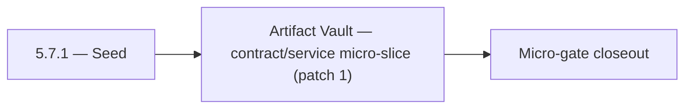

# 5.7.1 — Seed

- **Era:** `5.x` AI workflows — hub [`versions.md`](../versions.md) · minors start at [`5.0 — Neural Spine`](5.0%20%E2%80%94%20Neural%20Spine.md)
- **Minor:** [5.7 — Artifact Vault](./5.7 — Artifact Vault.md)
- **Codename:** Seed
- **Status:** ✅ Completed
## Focus
Artifact Vault — contract/service micro-slice (patch 1)

## Flowchart

## Micro-gate

| Track | Gate question | Answer / Evidence (fill at patch closeout) |
| --- | --- | --- |
| **Contract** | Contact AI REST, GraphQL AI module, HF/model mapping — `docs/backend/apis/` + matrices updated? | Document at patch closeout. |
| **Service** | `contact.ai` inference, gateway `LambdaAIClient`, jobs AI path — smoke + caps documented? | Document smoke paths. |
| **Surface** | Dashboard AI chat, utilities, admin AI flows changed? | Document UX delta or N/A. |
| **Frontend** | Which routes/hooks (`contact-ai-ui-bindings`, pages JSON) for this patch? | S3 artifact retention / governance UX if any. Document at closeout. |
| **Data** | `ai_chats`, prompts, S3 AI artifacts — migrations + lineage? | Document lineage or N/A. |
| **Ops** | `logs.api` AI events, cost/error alerts, runbooks — delta recorded? | Document ops delta or N/A. |

## Tasks
### Contract
- ✅ Completed: 📌 Planned: Retention TTL per class and per tenant tier.
- ✅ Completed: 📌 Planned: **VQL AI-safe subset:** Allowlist operators and max row caps for filters produced by Contact AI `parse-filters` / NL → VQL (coordinate with [`5.2 — Explainability Plane.md`](5.2 — Explainability Plane.md) and [`5.10 — Connectra Intelligence.md`](5.10 — Connectra Intelligence.md)).
- ✅ Completed: 📌 Planned: Align `LambdaAIClient` paths to `/api/v1/ai/…` — remove any legacy `/gemini/…` references.
- ✅ Completed: 📌 Planned: Define explainability schema for AI consumption (`top_factors`, `risk_reason`, `confidence_band`).

### Service
- ✅ Completed: 📌 Planned: Immutable write mode flag for compliance bundles.
- ✅ Completed: 📌 Planned: Performance guardrails: rate limits compatible with AI-driven query bursts ([`5.3 — Spend Guardrails.md`](5.3 — Spend Guardrails.md)).
- ✅ Completed: 📌 Planned: Implement `HFService` model routing: `ModelSelection` enum → HF model ID; default from `HF_CHAT_MODEL` env.
- ✅ Completed: 📌 Planned: Implement `messages` JSONB strict validation (max text length, valid sender values, max contacts).

### Surface

- ✅ Completed: 📌 Planned: **[appointment360]** — Verify UX for route `/email` and bindings (patch 5.7.1 band 1) | area: `frontend-page` | files: `contact360.io/app/...` | reason: Dashboard/extension surface for era 5 must match gateway contracts

### Data

- ✅ Completed: 📌 Planned: **[contact-ai]** — Update PostgreSQL/ES/S3 lineage notes if this patch touches persistence or exports | area: `data-lineage` | files: `docs/backend/database/`, `migrations/` | reason: Migrations, indexes, and lineage evidence for this patch

### Ops

- ✅ Completed: 📌 Planned: **[platform]** — Record smoke evidence, rollback, and alerts (patch band 1: charter/P0) | area: `ops` | files: `docs/commands/`, `.github/workflows/` | reason: Smoke, rollback, and observability for patch 5.7.1

## Service task slices
> Merged from era `5.x` AI workflow task packs (P0→`.0`–`.2`, P1→`.3`–`.6`, Ops→`.7`–`.9`).

### S3Storage
- Define **four AI artifact classes** (stable enum):
- `prompt` — versioned system/user prompt text or hash references
- `input` — user/upload/context payload references (redacted index)
- `output` — model completions or structured AI results
- `intermediate` — chain-of-thought storage **disallowed by default**; only if policy explicitly allows with extra encryption
- Define **retention and access policy** per class (TTL, legal hold, tenant tier).
- Define **signed URL** rules: short TTL, role-scoped, auditable.
- **Immutability:** compliance bundles use write-once / object lock semantics where required.
- Enforce **object-class policy checks** for AI-related prefixes (deny wrong content-type or path).
- Implement **immutable write mode** for compliance-sensitive artifacts when `IMMUTABLE_AI_ARTIFACTS=true` (or equivalent env).
- Validate multipart upload lifecycle for large AI exports; abort stale sessions.
- Rate limit AI artifact writes per tenant to control cost.

### contact.ai
- Lock full REST API contract: all `/api/v1/ai-chats/` and `/api/v1/ai/` paths.
- Fix `ModelSelection` enum mapping shim: GraphQL enum values (`FLASH`, `PRO`, etc.) must map to HF model IDs in `LambdaAIClient` or Contact AI service.
- Align `LambdaAIClient` paths to `/api/v1/ai/…` — remove any legacy `/gemini/…` references.
- Lock `SendMessageInput.model` contract: accepted values and mapping documented in `17_AI_CHATS_MODULE.md`.
- Document `POST /api/v1/ai-chats/{id}/message/stream` SSE event format: `data: <token>\n\n`, `data: [DONE]\n\n`.
- Define API versioning strategy: all routes under `/api/v1/`; no unversioned routes in production.
- Complete all chat CRUD endpoints: `GET/POST /api/v1/ai-chats/`, `GET/PUT/DELETE /api/v1/ai-chats/{id}/`.
- Implement `POST /api/v1/ai-chats/{id}/message` (sync) with full `AIChatService` orchestration.
- Implement `POST /api/v1/ai-chats/{id}/message/stream` (SSE streaming) via `HFService` async generator.
- Implement `HFService` model routing: `ModelSelection` enum → HF model ID; default from `HF_CHAT_MODEL` env.
- Implement Gemini fallback: if HF inference fails after N retries, call Gemini API.
- Enforce 100-message-per-chat cap in `AIChatService`.
- All utility endpoints fully implemented and tested: `analyzeEmailRisk`, `generateCompanySummary`, `parseContactFilters`.
- Implement `messages` JSONB strict validation (max text length, valid sender values, max contacts).
- Validate `messages` JSONB schema in `AIChatService` before persist: max 100 messages, valid sender, max text length.
- Add `model_version` field to AI message metadata in JSONB (for reproducibility).
- Confirm `user_id` ownership check on every read/write/delete operation.

### Jobs
- Define **AI batch processor contract extensions**: envelope fields `model` (string id), `confidence` (nullable structured summary), `cost` (estimated units or currency minor units); JSON schema version.
- Define **quota-aware scheduling contract**: enqueue rejects or defers when user/org over AI budget or daily cap; error codes align with [`version_5.3.md`](version_5.3.md).
- Document **idempotency** for AI jobs: dedupe key scope (user + input hash + processor type).
- Register allowed **AI processor kinds** in a single registry (code or config) with validation tests.
- Add **AI processor stubs** and **registry validation tests** (unknown processor fails fast at enqueue).
- Enforce **quota/cost guardrails** during enqueue and execution (short-circuit before provider calls when possible).
- Share inference client patterns with `contact.ai` where feasible (single model id vocabulary).
- Tune worker concurrency for AI tasks separately from IO-bound jobs (timeouts, retries).
- Add **`job_response` conventions** for AI model metadata, token estimates, and confidence snapshot.
- Document **lineage** from AI input batch → scored output artifacts → optional S3 pointers ([`version_5.7.md`](version_5.7.md)).

## Evidence gate
Patch closeout includes contract diff, smoke output, data lineage delta, and ops note
