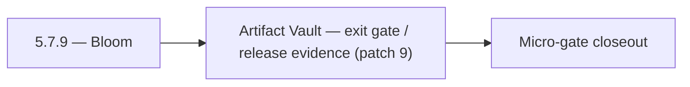

# 5.7.9 — Bloom

- **Era:** `5.x` AI workflows — hub [`versions.md`](../versions.md) · minors start at [`5.0 — Neural Spine`](5.0%20%E2%80%94%20Neural%20Spine.md)
- **Minor:** [5.7 — Artifact Vault](./5.7 — Artifact Vault.md)
- **Codename:** Bloom
- **Status:** planned

## Focus
Artifact Vault — exit gate / release evidence (patch 9)

## Flowchart

## Micro-gate

| Track | Gate question | Answer / Evidence (fill at patch closeout) |
| --- | --- | --- |
| **Contract** | Contact AI REST, GraphQL AI module, HF/model mapping — `docs/backend/apis/` + matrices updated? | Document at patch closeout. |
| **Service** | `contact.ai` inference, gateway `LambdaAIClient`, jobs AI path — smoke + caps documented? | Document smoke paths. |
| **Surface** | Dashboard AI chat, utilities, admin AI flows changed? | Document UX delta or N/A. |
| **Frontend** | Which routes/hooks (`contact-ai-ui-bindings`, pages JSON) for this patch? | S3 artifact retention / governance UX if any. Document at closeout. |
| **Data** | `ai_chats`, prompts, S3 AI artifacts — migrations + lineage? | Document lineage or N/A. |
| **Ops** | `logs.api` AI events, cost/error alerts, runbooks — delta recorded? | Document ops delta or N/A. |

## Tasks
### Ops
- 📌 Planned: Test: AI `parse-filters` with `source=sales_navigator` segment → correct VQL output
- 📌 Planned: Monitor: AI errors caused by low-quality SN contacts (missing title/company)
- 📌 Planned: Alert: high proportion of `data_quality_score < 30` from SN ingest sessions
- `docs/codebases/salesnavigator-codebase-analysis.md`
- `docs/codebases/contact-ai-codebase-analysis.md`
- `docs/backend/apis/SALESNAVIGATOR_ERA_TASK_PACKS.md`

## Service task slices
> Merged from era `5.x` AI workflow task packs (P0→`.0`–`.2`, P1→`.3`–`.6`, Ops→`.7`–`.9`).

### S3Storage
- **Policy check coverage report** in CI or release checklist.
- **Lineage traceability** pass on representative workflows (upload → infer → export).
- **Audit trail** for sensitive AI artifact reads (who, when, key id).
- Cost monitoring: storage growth by artifact class.

### contact.ai
- Lambda provisioned concurrency for chat paths to reduce cold-start latency.
- Prometheus metrics wired: request count, latency histogram, error rate per endpoint.
- Alert on `503` / `429` rate spike from HF API.
- Update contact.ai Postman collection with all live endpoints and SSE streaming examples.
- Add contact.ai to production deployment checklist.

### Jobs
- **Cost observability**: metrics for AI job duration, spend estimates, failure rate by model.
- **Alerts**: budget threshold, stuck jobs, provider outage patterns.
- **Runbook**: model degradation — disable processor kind, drain queue, fallback behavior.

## Evidence gate
Micro-gate table filled and handoff note to `5.8.0` recorded
