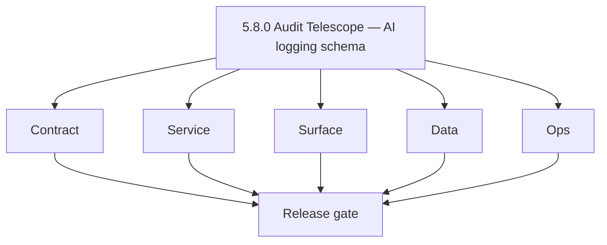
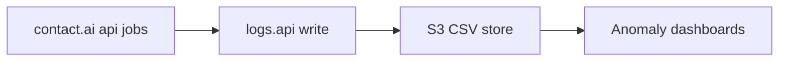

# Version 5.8 — Audit Telescope

- **Codename:** Audit Telescope
- **Status:** ✅ Completed
- **Target window:** TBD
- **Summary:** **`lambda/logs.api`** telemetry for AI: **prompt / tool / response** event schema (minimized payloads), **PII write guards**, internal debug traces, retention segmentation for AI-sensitive rows, and **cost/error anomaly** dashboards from aggregates.
- **Scope:** Operational visibility for Era 5 without violating compliance; pairs with `5.3` cost controls.
- **Roadmap mapping:** Extension minor — [`logsapi-codebase-analysis.md`](../codebases/logsapi-codebase-analysis.md) Era `5.x`.
- **Owner:** Observability + AI Platform + Security
- **Patch closure:** Every codenamed patch file includes **Micro-gate** + **Service task slices**. Era hub: [`versions.md`](../versions.md).

## Scope

- Target minor: `5.8.0`

## Flowchart

### Runtime focus

## Task tracks

### Contract

- ✅ Completed: 📌 Planned: Freeze era `5.x` AI event types and field dictionary (no raw prompts in prod tier if policy forbids).
- ✅ Completed: 📌 Planned: Update [`logsapi_endpoint_era_matrix.json`](../backend/endpoints/logsapi_endpoint_era_matrix.json) if new write paths.

### Service

- ✅ Completed: 📌 Planned: Implement redaction/minimization before persist.
- ✅ Completed: 📌 Planned: Authz on query paths for internal roles only.

### Surface

- ✅ Completed: 📌 Planned: Internal troubleshooting views ([`logsapi-ui-bindings.md`](../frontend/logsapi-ui-bindings.md)); no customer PII in default admin grids.

### Data

- ✅ Completed: 📌 Planned: S3 CSV layout for AI events; retention vs general logs.
- ✅ Completed: 📌 Planned: Trace correlation: `request_id` / `trace_id` with Appointment360 and Contact AI.

### Ops

- ✅ Completed: 📌 Planned: Dashboards: cost spikes, error codes, provider latency.
- ✅ Completed: 📌 Planned: Runbook: log partition hot-spot mitigation.

## Per-service slices (5.8.0)

### logs.api

- Add/validate schema version bump for AI fields.

### contact.ai + appointment360

- Emit events at inference start/stop with allowed metadata only.

## References

- [`docs/codebases/logsapi-codebase-analysis.md`](../codebases/logsapi-codebase-analysis.md)
- **Service task slices** in `5.8.P` patch files (scope from former `logsapi-ai-workflows-task-pack.md`)

## Release gate

- 📌 Planned: PII scan on sample exports
- 📌 Planned: Schema reviewed by security
- 📌 Planned: Dashboards usable by on-call

## Master checklist

- 📌 Planned: AI telemetry schema versioned
- 📌 Planned: Write guards enforced in code paths
- 📌 Planned: Retention policy documented

### Micro-gate reference (apply at every `5.N.P`)

| Track | Gate question (must answer Yes or document waiver) |
| --- | --- |
| **Contract** | Contact AI REST, GraphQL AI module, model mapping — `docs/backend/apis/` + endpoint matrices updated? |
| **Service** | `contact.ai`, `LambdaAIClient`, jobs AI envelope — smoke + message caps / idempotency? |
| **Surface** | Dashboard `/ai-chat`, utilities, admin AI — user-visible delta? |
| **Frontend** | Routes/hooks per `contact-ai-ui-bindings.md` / pages JSON? |
| **Data** | `ai_chats`, prompts, S3 AI artifacts — migrations + lineage docs? |
| **Ops** | AI cost/telemetry in `logs.api`, alerts, runbooks — recorded? |

**Patch ladder:** Codenames `Void` → `Bloom` per minor (`.0`–`.9`) — see patch table below.

## Patches

| Patch | Codename | Doc |
| --- | --- | --- |
| `5.8.0` | Void | [`5.8.0` — Void](5.8.0 — Void.md) |
| `5.8.1` | Seed | [`5.8.1` — Seed](5.8.1 — Seed.md) |
| `5.8.2` | Sprout | [`5.8.2` — Sprout](5.8.2 — Sprout.md) |
| `5.8.3` | Roots | [`5.8.3` — Roots](5.8.3 — Roots.md) |
| `5.8.4` | Soil | [`5.8.4` — Soil](5.8.4 — Soil.md) |
| `5.8.5` | Rain | [`5.8.5` — Rain](5.8.5 — Rain.md) |
| `5.8.6` | Stem | [`5.8.6` — Stem](5.8.6 — Stem.md) |
| `5.8.7` | Branch | [`5.8.7` — Branch](5.8.7 — Branch.md) |
| `5.8.8` | Leaf | [`5.8.8` — Leaf](5.8.8 — Leaf.md) |
| `5.8.9` | Bloom | [`5.8.9` — Bloom](5.8.9 — Bloom.md) |

## Patch ladder (5.8.0 - 5.8.9)

### Micro-gate reference (apply at every patch)

| Track | Gate question (must answer Yes or waiver) |
| --- | --- |
| **Contract** | Contract/API change captured with diff or explicit no-change note |
| **Service** | Service health and smoke for affected paths pass |
| **Surface** | UI/admin/extension impact documented or N/A |
| **Frontend** | Routes/components/hooks affected listed or N/A |
| **Data** | Migrations/index/lineage deltas linked or N/A |
| **Ops** | Rollback/secrets/CI/runbook delta linked or N/A |

**Patch intent bands:** `.0` charter, `.1-.2` scaffold, `.3-.5` hardening, `.6-.8` integration, `.9` freeze/handoff.

| Patch | Codename | Focus | Evidence gate |
| --- | --- | --- | --- |
| `5.8.0` | Void | patch focus | charter artifact linked |
| `5.8.1` | Seed | patch focus | closeout evidence attached |
| `5.8.2` | Sprout | patch focus | closeout evidence attached |
| `5.8.3` | Roots | patch focus | closeout evidence attached |
| `5.8.4` | Soil | patch focus | closeout evidence attached |
| `5.8.5` | Rain | patch focus | closeout evidence attached |
| `5.8.6` | Stem | patch focus | closeout evidence attached |
| `5.8.7` | Branch | patch focus | closeout evidence attached |
| `5.8.8` | Leaf | patch focus | closeout evidence attached |
| `5.8.9` | Bloom | patch focus | handoff documented |

## Release Gate and Evidence

### Master Task Checklist
- 📌 Planned: Track-level closure evidence linked

### Backend API and Endpoints
- 📌 Planned: Endpoint/contract parity verified

### Database and Data Lineage
- 📌 Planned: Migration and lineage references linked

### Frontend UX
- 📌 Planned: UX/route behavior evidence linked

### UI Elements
- 📌 Planned: Components/checklist closeout captured

### Flow and Graph
- 📌 Planned: Runtime graph reflects implementation

### Validation
- 📌 Planned: Smoke/CI/lint checks recorded

### Release Gate
- 📌 Planned: Minor ready for handoff to next minor
