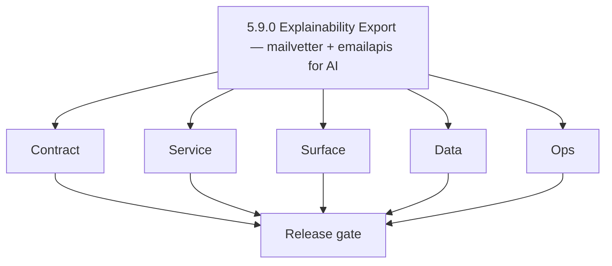
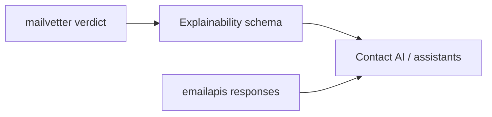

# Version 5.9 — Explainability Export

- **Codename:** Explainability Export
- **Status:** ✅ Completed
- **Target window:** TBD
- **Summary:** **Mailvetter** exposes **AI-consumable explainability** (`top_factors`, `risk_reason`, `confidence_band`, prompt-safe summaries); **`emailapis` / `emailapigo`** define **AI-assisted finder/verifier payload boundaries** and **safe utility surfaces** for orchestration — assistant panels bind to canonical email statuses with confidence mapping.
- **Scope:** Close the loop between verification quality and AI narratives; reduce hallucination risk by grounding AI on structured verifier outputs.
- **Roadmap mapping:** Extension minor — [`mailvetter-codebase-analysis.md`](../codebases/mailvetter-codebase-analysis.md) and [`emailapis-codebase-analysis.md`](../codebases/emailapis-codebase-analysis.md) Era `5.x`.
- **Owner:** Email Runtime + AI Platform
- **Patch closure:** Every codenamed patch file includes **Micro-gate** + **Service task slices**. Era hub: [`versions.md`](../versions.md).

## Scope

- Target minor: `5.9.0`
- Depends on: `5.2.0` Explainability Plane (shared UX patterns).

## Flowchart

### Runtime focus

## Task tracks

### Contract

- 📌 Planned: **[contact-ai]** — refine duplicate task (was: 📌 planned: **[contact-ai]** — refine duplicate task (was: ✅ …) | patch `5.9.0` band `0` | reason: specialize this file vs sibling patches; see docs/codebases/contact-ai-codebase-analysis.md
- 📌 Planned: **[contact-ai]** — refine duplicate task (was: ✅ completed: 📌 planned: emailapis: max payload shapes for fi…) | patch `5.9.0` band `0` | reason: specialize this file vs sibling patches; see docs/codebases/contact-ai-codebase-analysis.md

- 📌 Planned: **[contact-ai]** — refine duplicate task (was: 📌 planned: **[architecture]** — product **graphql** remains …) | patch `5.9.0` band `0` | reason: specialize this file vs sibling patches; see docs/codebases/contact-ai-codebase-analysis.md
### Service

- 📌 Planned: **[contact-ai]** — refine duplicate task (was: 📌 planned: **[contact-ai]** — refine duplicate task (was: ✅ …) | patch `5.9.0` band `0` | reason: specialize this file vs sibling patches; see docs/codebases/contact-ai-codebase-analysis.md
- 📌 Planned: **[contact-ai]** — refine duplicate task (was: ✅ completed: 📌 planned: **emailapis**: optional thin http ut…) | patch `5.9.0` band `0` | reason: specialize this file vs sibling patches; see docs/codebases/contact-ai-codebase-analysis.md

- 📌 Planned: **[contact-ai]** — refine duplicate task (was: 📌 planned: **[architecture]** — **go/gin satellites** in sco…) | patch `5.9.0` band `0` | reason: specialize this file vs sibling patches; see docs/codebases/contact-ai-codebase-analysis.md
### Surface

- ✅ Completed: 📌 Planned: Verifier UI: explanation drawer on row click (**Service task slices** in `5.9.P` patch files (scope from former `mailvetter-ai-task-pack.md`)).
- 📌 Planned: **[contact-ai]** — refine duplicate task (was: ✅ completed: 📌 planned: **app**: assistant panel shows canon…) | patch `5.9.0` band `0` | reason: specialize this file vs sibling patches; see docs/codebases/contact-ai-codebase-analysis.md

- 📌 Planned: **[contact-ai]** — refine duplicate task (was: 📌 planned: **[architecture]** — **next.js** customer surface…) | patch `5.9.0` band `0` | reason: specialize this file vs sibling patches; see docs/codebases/contact-ai-codebase-analysis.md
### Data

- 📌 Planned: **[contact-ai]** — refine duplicate task (was: ✅ completed: 📌 planned: normalized reason codes and optional…) | patch `5.9.0` band `0` | reason: specialize this file vs sibling patches; see docs/codebases/contact-ai-codebase-analysis.md
- 📌 Planned: **[contact-ai]** — refine duplicate task (was: ✅ completed: 📌 planned: retention for ai-derived summaries.) | patch `5.9.0` band `0` | reason: specialize this file vs sibling patches; see docs/codebases/contact-ai-codebase-analysis.md

- 📌 Planned: **[contact-ai]** — refine duplicate task (was: 📌 planned: **[architecture]** — **postgresql-first** per `do…) | patch `5.9.0` band `0` | reason: specialize this file vs sibling patches; see docs/codebases/contact-ai-codebase-analysis.md
### Ops

- 📌 Planned: **[contact-ai]** — refine duplicate task (was: ✅ completed: 📌 planned: pii redaction in ai logs/traces for …) | patch `5.9.0` band `0` | reason: specialize this file vs sibling patches; see docs/codebases/contact-ai-codebase-analysis.md
- 📌 Planned: **[contact-ai]** — refine duplicate task (was: ✅ completed: 📌 planned: quality eval set for explanation cor…) | patch `5.9.0` band `0` | reason: specialize this file vs sibling patches; see docs/codebases/contact-ai-codebase-analysis.md

- 📌 Planned: **[contact-ai]** — refine duplicate task (was: 📌 planned: **[architecture]** — **observability**: correlate…) | patch `5.9.0` band `0` | reason: specialize this file vs sibling patches; see docs/codebases/contact-ai-codebase-analysis.md
## Per-service slices (5.9.0)

### mailvetter

- Optional “recommend action” output (`send`, `retry`, `suppress`) if product approves.

### emailapis / emailapigo

- Parity tests on status semantics (`valid` / `invalid` / `catch-all` / `unknown`).

## References

- [`docs/codebases/mailvetter-codebase-analysis.md`](../codebases/mailvetter-codebase-analysis.md)
- [`docs/codebases/emailapis-codebase-analysis.md`](../codebases/emailapis-codebase-analysis.md)
- **Service task slices** in `5.9.P` patch files (scope from former `emailapis-ai-workflows-task-pack.md`)

## Release gate

- 📌 Planned: Schema reviewed for prompt injection
- 📌 Planned: Golden-path: verdict → AI summary → UI

## Master checklist

- 📌 Planned: Explainability JSON versioned
- 📌 Planned: Email assistant uses canonical statuses only
- 📌 Planned: Regression monitoring for AI quality on verifier changes

### Micro-gate reference (apply at every `5.N.P`)

| Track | Gate question (must answer Yes or document waiver) |
| --- | --- |
| **Contract** | Contact AI REST, GraphQL AI module, model mapping — `docs/backend/apis/` + endpoint matrices updated? |
| **Service** | `contact.ai`, `LambdaAIClient`, jobs AI envelope — smoke + message caps / idempotency? |
| **Surface** | Dashboard `/ai-chat`, utilities, admin AI — user-visible delta? |
| **Frontend** | Routes/hooks per `contact-ai-ui-bindings.md` / pages JSON? |
| **Data** | `ai_chats`, prompts, S3 AI artifacts — migrations + lineage docs? |
| **Ops** | AI cost/telemetry in `logs.api`, alerts, runbooks — recorded? |
| **Architecture** | Go/Gin satellites only via Python GraphQL gateway (`contact360.io/api`); Next.js `NEXT_PUBLIC_GRAPHQL_URL`; Postgres-first / Redis exit per `docs/docs/data-stores-postgres.md`. |

**Patch ladder:** Codenames `Void` → `Bloom` per minor (`.0`–`.9`) — see patch table below.

## Patches

| Patch | Codename | Doc |
| --- | --- | --- |
| `5.9.0` | Void | [`5.9.0` — Void](5.9.0 — Void.md) |
| `5.9.1` | Seed | [`5.9.1` — Seed](5.9.1 — Seed.md) |
| `5.9.2` | Sprout | [`5.9.2` — Sprout](5.9.2 — Sprout.md) |
| `5.9.3` | Roots | [`5.9.3` — Roots](5.9.3 — Roots.md) |
| `5.9.4` | Soil | [`5.9.4` — Soil](5.9.4 — Soil.md) |
| `5.9.5` | Rain | [`5.9.5` — Rain](5.9.5 — Rain.md) |
| `5.9.6` | Stem | [`5.9.6` — Stem](5.9.6 — Stem.md) |
| `5.9.7` | Branch | [`5.9.7` — Branch](5.9.7 — Branch.md) |
| `5.9.8` | Leaf | [`5.9.8` — Leaf](5.9.8 — Leaf.md) |
| `5.9.9` | Bloom | [`5.9.9` — Bloom](5.9.9 — Bloom.md) |

## Patch ladder (5.9.0 - 5.9.9)

### Micro-gate reference (apply at every patch)

| Track | Gate question (must answer Yes or waiver) |
| --- | --- |
| **Contract** | Contract/API change captured with diff or explicit no-change note |
| **Service** | Service health and smoke for affected paths pass |
| **Surface** | UI/admin/extension impact documented or N/A |
| **Frontend** | Routes/components/hooks affected listed or N/A |
| **Data** | Migrations/index/lineage deltas linked or N/A |
| **Ops** | Rollback/secrets/CI/runbook delta linked or N/A |

**Patch intent bands:** `.0` charter, `.1-.2` scaffold, `.3-.5` hardening, `.6-.8` integration, `.9` freeze/handoff.

| Patch | Codename | Focus | Evidence gate |
| --- | --- | --- | --- |
| `5.9.0` | Void | patch focus | charter artifact linked |
| `5.9.1` | Seed | patch focus | closeout evidence attached |
| `5.9.2` | Sprout | patch focus | closeout evidence attached |
| `5.9.3` | Roots | patch focus | closeout evidence attached |
| `5.9.4` | Soil | patch focus | closeout evidence attached |
| `5.9.5` | Rain | patch focus | closeout evidence attached |
| `5.9.6` | Stem | patch focus | closeout evidence attached |
| `5.9.7` | Branch | patch focus | closeout evidence attached |
| `5.9.8` | Leaf | patch focus | closeout evidence attached |
| `5.9.9` | Bloom | patch focus | handoff documented |

## Release Gate and Evidence

### Master Task Checklist
- 📌 Planned: Track-level closure evidence linked

### Backend API and Endpoints
- 📌 Planned: Endpoint/contract parity verified

### Database and Data Lineage
- 📌 Planned: Migration and lineage references linked

### Frontend UX
- 📌 Planned: UX/route behavior evidence linked

### UI Elements
- 📌 Planned: Components/checklist closeout captured

### Flow and Graph
- 📌 Planned: Runtime graph reflects implementation

### Validation
- 📌 Planned: Smoke/CI/lint checks recorded

### Release Gate
- 📌 Planned: Minor ready for handoff to next minor
