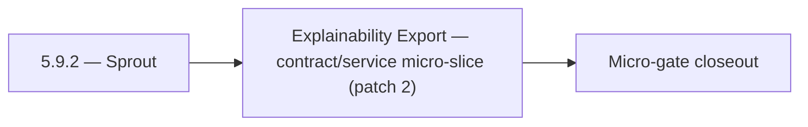

# 5.9.2 — Sprout

- **Era:** `5.x` AI workflows — hub [`versions.md`](../versions.md) · minors start at [`5.0 — Neural Spine`](5.0%20%E2%80%94%20Neural%20Spine.md)
- **Minor:** [5.9 — Explainability Export](./5.9 — Explainability Export.md)
- **Codename:** Sprout
- **Status:** ✅ Completed
## Focus
Explainability Export — contract/service micro-slice (patch 2)

## Flowchart

## Micro-gate

| Track | Gate question | Answer / Evidence (fill at patch closeout) |
| --- | --- | --- |
| **Contract** | Contact AI REST, GraphQL AI module, HF/model mapping — `docs/backend/apis/` + matrices updated? | Document at patch closeout. |
| **Service** | `contact.ai` inference, gateway `LambdaAIClient`, jobs AI path — smoke + caps documented? | Document smoke paths. |
| **Surface** | Dashboard AI chat, utilities, admin AI flows changed? | Document UX delta or N/A. |
| **Frontend** | Which routes/hooks (`contact-ai-ui-bindings`, pages JSON) for this patch? | Mailvetter / email API AI explanation surfaces. Document at closeout. |
| **Data** | `ai_chats`, prompts, S3 AI artifacts — migrations + lineage? | Document lineage or N/A. |
| **Ops** | `logs.api` AI events, cost/error alerts, runbooks — delta recorded? | Document ops delta or N/A. |

## Tasks
### Contract
- 📌 Planned: **[contact-ai]** — refine duplicate task (was: ✅ completed: 📌 planned: **ai-facing field whitelist:** docum…) | patch `5.9.2` band `2` | reason: specialize this file vs sibling patches; see docs/codebases/contact-ai-codebase-analysis.md
- 📌 Planned: **[contact-ai]** — refine duplicate task (was: ✅ completed: 📌 planned: lock full rest api contract: all `/a…) | patch `5.9.2` band `2` | reason: specialize this file vs sibling patches; see docs/codebases/contact-ai-codebase-analysis.md
- 📌 Planned: **[contact-ai]** — refine duplicate task (was: ✅ completed: 📌 planned: document `post /api/v1/ai-chats/{id}…) | patch `5.9.2` band `2` | reason: specialize this file vs sibling patches; see docs/codebases/contact-ai-codebase-analysis.md
- 📌 Planned: **[contact-ai]** — refine duplicate task (was: ✅ completed: 📌 planned: define **four ai artifact classes** …) | patch `5.9.2` band `2` | reason: specialize this file vs sibling patches; see docs/codebases/contact-ai-codebase-analysis.md

### Service
- 📌 Planned: **[contact-ai]** — refine duplicate task (was: ✅ completed: 📌 planned: ensure **connectra query outputs** i…) | patch `5.9.2` band `2` | reason: specialize this file vs sibling patches; see docs/codebases/contact-ai-codebase-analysis.md
- 📌 Planned: **[contact-ai]** — refine duplicate task (was: ✅ completed: 📌 planned: complete all chat crud endpoints: `g…) | patch `5.9.2` band `2` | reason: specialize this file vs sibling patches; see docs/codebases/contact-ai-codebase-analysis.md
- 📌 Planned: **[contact-ai]** — refine duplicate task (was: ✅ completed: 📌 planned: implement gemini fallback: if hf inf…) | patch `5.9.2` band `2` | reason: specialize this file vs sibling patches; see docs/codebases/contact-ai-codebase-analysis.md
- 📌 Planned: **[contact-ai]** — refine duplicate task (was: ✅ completed: 📌 planned: add ai-friendly summarized reason ge…) | patch `5.9.2` band `2` | reason: specialize this file vs sibling patches; see docs/codebases/contact-ai-codebase-analysis.md

### Surface

- ✅ Completed: 📌 Planned: **[appointment360]** — Verify UX for route `/email` and bindings (patch 5.9.2 band 2) | area: `frontend-page` | files: `contact360.io/app/...` | reason: Dashboard/extension surface for era 5 must match gateway contracts

### Data

- 📌 Planned: **[contact-ai]** — refine duplicate task (was: ✅ completed: 📌 planned: **[contact-ai]** — update postgresql…) | patch `5.9.2` band `2` | reason: specialize this file vs sibling patches; see docs/codebases/contact-ai-codebase-analysis.md

### Ops

- ✅ Completed: 📌 Planned: **[platform]** — Record smoke evidence, rollback, and alerts (patch band 2: charter/P0) | area: `ops` | files: `docs/commands/`, `.github/workflows/` | reason: Smoke, rollback, and observability for patch 5.9.2

## Service task slices
> Merged from era `5.x` AI workflow task packs (P0→`.0`–`.2`, P1→`.3`–`.6`, Ops→`.7`–`.9`).

### Mailvetter
- Define explainability schema for AI consumption (`top_factors`, `risk_reason`, `confidence_band`).
- Define prompt-safe output contract (no sensitive raw SMTP payload).
- Add AI-friendly summarized reason generator from `score_details`.
- Add optional “recommend action” output (`send`, `retry`, `suppress`).
- Store normalized reason codes and factor vectors per result.
- Add retention policy for AI-derived summaries.

### emailapis / emailapigo
- Define **AI-assisted finder/verifier payload boundaries**: max list sizes, required identity keys (`first_name`, `last_name`, `domain`), and canonical status enum values shared with dashboard and Contact AI orchestration (`5.x` era freeze).
- Document **safe orchestration surface**: which operations AI may trigger (e.g. single verify vs bulk) vs require human confirmation; avoid exposing raw provider blobs to prompts.
- Update endpoint/reference matrix in `docs/backend/endpoints/emailapis_endpoint_era_matrix.json` when adding or changing AI-facing paths.
- Align **Python vs Go parity** on verifier provider priority (`mailvetter` vs `truelist` / `icypeas`) so AI-facing summaries do not drift by runtime.
- Expose **stable, minimal JSON** responses for paths consumed by Appointment360 / future AI tools; consistent error envelope for quota and provider failures.
- Verify auth, provider routing, error translation, and health diagnostics under AI-driven traffic (higher fan-out risk).
- Add contract tests: finder cache hit/miss, verifier status mapping, bulk partial failure semantics.
- Document `email_finder_cache` and `email_patterns` lineage impact for era `5.x` when AI triggers lookups (cache poisoning, attribution).
- Track **AI-assisted decision lineage**: link job or request id to finder/verifier outcome **with confidence mapping** where Mailvetter/Contact AI participates (`5.x` analysis).

### contact.ai
- Lock full REST API contract: all `/api/v1/ai-chats/` and `/api/v1/ai/` paths.
- Fix `ModelSelection` enum mapping shim: GraphQL enum values (`FLASH`, `PRO`, etc.) must map to HF model IDs in `LambdaAIClient` or Contact AI service.
- Align `LambdaAIClient` paths to `/api/v1/ai/…` — remove any legacy `/gemini/…` references.
- Lock `SendMessageInput.model` contract: accepted values and mapping documented in `17_AI_CHATS_MODULE.md`.
- Document `POST /api/v1/ai-chats/{id}/message/stream` SSE event format: `data: <token>\n\n`, `data: [DONE]\n\n`.
- Define API versioning strategy: all routes under `/api/v1/`; no unversioned routes in production.
- Complete all chat CRUD endpoints: `GET/POST /api/v1/ai-chats/`, `GET/PUT/DELETE /api/v1/ai-chats/{id}/`.
- Implement `POST /api/v1/ai-chats/{id}/message` (sync) with full `AIChatService` orchestration.
- Implement `POST /api/v1/ai-chats/{id}/message/stream` (SSE streaming) via `HFService` async generator.
- Implement `HFService` model routing: `ModelSelection` enum → HF model ID; default from `HF_CHAT_MODEL` env.
- Implement Gemini fallback: if HF inference fails after N retries, call Gemini API.
- Enforce 100-message-per-chat cap in `AIChatService`.
- All utility endpoints fully implemented and tested: `analyzeEmailRisk`, `generateCompanySummary`, `parseContactFilters`.
- Implement `messages` JSONB strict validation (max text length, valid sender values, max contacts).
- Validate `messages` JSONB schema in `AIChatService` before persist: max 100 messages, valid sender, max text length.
- Add `model_version` field to AI message metadata in JSONB (for reproducibility).
- Confirm `user_id` ownership check on every read/write/delete operation.

### logs.api
- Define and freeze era `5.x` **AI logging schema additions**: event types for `ai.prompt`, `ai.tool_call`, `ai.response`, `ai.quota_denied`, `ai.provider_error` (names illustrative — finalize in schema doc); compatibility notes for consumers.
- Specify **PII minimization rules**: which fields are never written, which are hashed/truncated, optional debug tier with stricter RBAC.
- Update endpoint/reference matrix in `docs/backend/endpoints/logsapi_endpoint_era_matrix.json` when write/query paths change.
- Implement/validate behavior for era `5.x` **AI event sources** from `contact.ai`, `appointment360`, and `jobs`.
- Implement **log write guards** in emitting services (reject oversize or forbidden subfields before POST).
- Verify auth, error envelope, and health behavior for internal consumers; no public exposure of raw AI payloads by default.
- Document **S3 CSV** layout updates for AI events; partition strategy (date + service + schema version).
- **Retention segmentation**: AI-sensitive logs TTL vs general logs; legal hold procedure.

## Evidence gate
Patch closeout includes contract diff, smoke output, data lineage delta, and ops note
