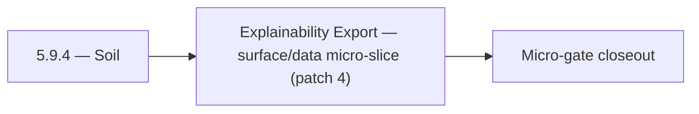

# 5.9.4 — Soil

- **Era:** `5.x` AI workflows — hub [`versions.md`](../versions.md) · minors start at [`5.0 — Neural Spine`](5.0%20%E2%80%94%20Neural%20Spine.md)
- **Minor:** [5.9 — Explainability Export](./5.9 — Explainability Export.md)
- **Codename:** Soil
- **Status:** planned

## Focus
Explainability Export — surface/data micro-slice (patch 4)

## Flowchart

## Micro-gate

| Track | Gate question | Answer / Evidence (fill at patch closeout) |
| --- | --- | --- |
| **Contract** | Contact AI REST, GraphQL AI module, HF/model mapping — `docs/backend/apis/` + matrices updated? | Document at patch closeout. |
| **Service** | `contact.ai` inference, gateway `LambdaAIClient`, jobs AI path — smoke + caps documented? | Document smoke paths. |
| **Surface** | Dashboard AI chat, utilities, admin AI flows changed? | Document UX delta or N/A. |
| **Frontend** | Which routes/hooks (`contact-ai-ui-bindings`, pages JSON) for this patch? | Mailvetter / email API AI explanation surfaces. Document at closeout. |
| **Data** | `ai_chats`, prompts, S3 AI artifacts — migrations + lineage? | Document lineage or N/A. |
| **Ops** | `logs.api` AI events, cost/error alerts, runbooks — delta recorded? | Document ops delta or N/A. |

## Tasks
### Surface
- 📌 Planned: Verifier UI: explanation drawer on row click (**Service task slices** below (includes former `mailvetter-ai-task-pack.md` scope)).
- 📌 Planned: Implement `ChatList` with pagination: uses `useChatList` hook.
- 📌 Planned: Implement `StreamingText`: token-by-token rendering via SSE; cursor blink during stream.
- 📌 Planned: Implement `ChatContextMenu`: rename (PUT) and delete (DELETE) chat actions.

### Data
- 📌 Planned: Normalized reason codes and optional factor vectors per result.
- 📌 Planned: **Elasticsearch mappings:** Confirm AI-dependent fields (e.g. `data_quality_score`, SN provenance) are indexed per [`5.5 — Signal Enrichment.md`](5.5 — Signal Enrichment.md).
- 📌 Planned: Add `model_version` field to AI message metadata in JSONB (for reproducibility).
- 📌 Planned: Store normalized reason codes and factor vectors per result.

## Service task slices
> Merged from era `5.x` AI workflow task packs (P0→`.0`–`.2`, P1→`.3`–`.6`, Ops→`.7`–`.9`).

### Mailvetter
- Email verifier UI: AI explanation drawer on result row click.
- Campaign preflight: AI summary card for risky domains.
- Store normalized reason codes and factor vectors per result.
- Add retention policy for AI-derived summaries.
- Add AI-friendly summarized reason generator from `score_details`.
- Add optional “recommend action” output (`send`, `retry`, `suppress`).

### emailapis / emailapigo
- Document impacted pages/tabs/buttons/inputs for era `5.x` — especially assistant panels and email flows in [`docs/frontend/emailapis-ui-bindings.md`](../frontend/emailapis-ui-bindings.md).
- Document hooks/services/contexts and UX states (loading / error / progress / checkbox / radio) when AI suggests next actions on email results.
- Bind assistant panel results to **canonical email statuses** (no duplicate unofficial strings).
- Document `email_finder_cache` and `email_patterns` lineage impact for era `5.x` when AI triggers lookups (cache poisoning, attribution).
- Track **AI-assisted decision lineage**: link job or request id to finder/verifier outcome **with confidence mapping** where Mailvetter/Contact AI participates (`5.x` analysis).
- Record provider, status, and traceability expectations per response for downstream logs.api events.
- Expose **stable, minimal JSON** responses for paths consumed by Appointment360 / future AI tools; consistent error envelope for quota and provider failures.
- Verify auth, provider routing, error translation, and health diagnostics under AI-driven traffic (higher fan-out risk).
- Add contract tests: finder cache hit/miss, verifier status mapping, bulk partial failure semantics.

### contact.ai
- Build `AIChatPage` (`/app/ai-chat`): `ChatList` + `ChatThread` layout.
- Implement `ChatList` with pagination: uses `useChatList` hook.
- Implement `ChatThread` with message rendering: `ChatMessage` + `ContactsInMessage`.
- Implement `ChatInput` textarea with send button; disabled while streaming.
- Implement `StreamingText`: token-by-token rendering via SSE; cursor blink during stream.
- Implement `ModelSelector` dropdown with all 4 model options; persist choice in `AIModelContext`.
- Implement `NewChatButton`: creates chat and redirects to `ChatThread`.
- Implement `ChatContextMenu`: rename (PUT) and delete (DELETE) chat actions.
- Wire `EmailRiskBadge`, `CompanySummaryTab`, `AIFilterInput` to live endpoints.
- Loading states: skeleton for chat list, spinner for send, shimmer for utilities.
- Validate `messages` JSONB schema in `AIChatService` before persist: max 100 messages, valid sender, max text length.
- Add `model_version` field to AI message metadata in JSONB (for reproducibility).
- Confirm `user_id` ownership check on every read/write/delete operation.
- Test concurrent message send (two requests to same `chat_id`): document behavior; add optimistic lock if needed.
- Complete all chat CRUD endpoints: `GET/POST /api/v1/ai-chats/`, `GET/PUT/DELETE /api/v1/ai-chats/{id}/`.
- Implement `POST /api/v1/ai-chats/{id}/message` (sync) with full `AIChatService` orchestration.
- Implement `POST /api/v1/ai-chats/{id}/message/stream` (SSE streaming) via `HFService` async generator.
- Implement `HFService` model routing: `ModelSelection` enum → HF model ID; default from `HF_CHAT_MODEL` env.
- Implement Gemini fallback: if HF inference fails after N retries, call Gemini API.
- Enforce 100-message-per-chat cap in `AIChatService`.
- All utility endpoints fully implemented and tested: `analyzeEmailRisk`, `generateCompanySummary`, `parseContactFilters`.
- Implement `messages` JSONB strict validation (max text length, valid sender values, max contacts).

### logs.api
- Document impacted pages/tabs/buttons/inputs for era `5.x` internal tooling ([`docs/frontend/logsapi-ui-bindings.md`](../frontend/logsapi-ui-bindings.md)).
- Document hooks/services/contexts and UX states (loading / error / progress / filter / export) with **role gating** (internal-only).
- Debug trace views: opt-in per incident, time-bounded.
- Document **S3 CSV** layout updates for AI events; partition strategy (date + service + schema version).
- **Retention segmentation**: AI-sensitive logs TTL vs general logs; legal hold procedure.
- **Trace correlation**: require `request_id` / `trace_id` alignment with upstream ([`contact-ai-codebase-analysis.md`](../codebases/contact-ai-codebase-analysis.md)).
- Implement/validate behavior for era `5.x` **AI event sources** from `contact.ai`, `appointment360`, and `jobs`.
- Implement **log write guards** in emitting services (reject oversize or forbidden subfields before POST).
- Verify auth, error envelope, and health behavior for internal consumers; no public exposure of raw AI payloads by default.

## Evidence gate
Patch closeout includes contract diff, smoke output, data lineage delta, and ops note
