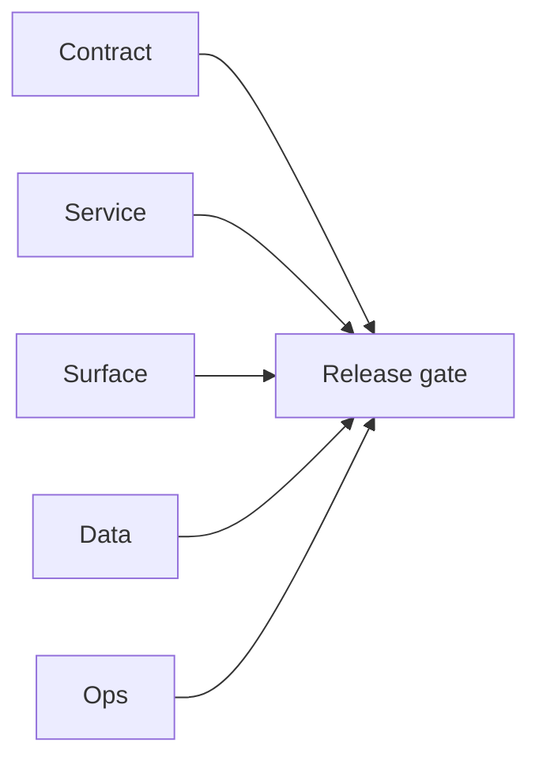

# 5.x Era Docs

Execution guide for Contact360 `5.x.x` era delivery.

## Era objective

- Define and deliver a stable era contract across Contract/Service/Surface/Data/Ops tracks.
- Ensure every patch packet carries closeout evidence before release handoff.

## As-is snapshot (surfaces)

- **`contact360.io/admin` (DocsAI):** AI assistant and related ops flows are **wired and usable** for admins.
- **`contact360.io/app` dashboard AI chat:** Treat as **not product-complete** until it calls Appointment360 **`aiChat` / `sendAiMessage`** (or equivalent) instead of any **mock** client — confirm against [`docs/codebases/app-codebase-analysis.md`](../codebases/app-codebase-analysis.md) before marking Era **5.x** chat UX done.

## Minor index

| Minor | Title | Status | Doc |
| --- | --- | --- | --- |
| `5.0` | Neural Spine | planned | [`5.0 - Neural Spine`](5.0%20—%20Neural%20Spine.md) |
| `5.1` | Orchestration Live | planned | [`5.1 - Orchestration Live`](5.1%20—%20Orchestration%20Live.md) |
| `5.2` | Explainability Plane | planned | [`5.2 - Explainability Plane`](5.2%20—%20Explainability%20Plane.md) |
| `5.3` | Spend Guardrails | planned | [`5.3 - Spend Guardrails`](5.3%20—%20Spend%20Guardrails.md) |
| `5.4` | Prompt Constitution | planned | [`5.4 - Prompt Constitution`](5.4%20—%20Prompt%20Constitution.md) |
| `5.5` | Signal Enrichment | planned | [`5.5 - Signal Enrichment`](5.5%20—%20Signal%20Enrichment.md) |
| `5.6` | Batch Intelligence | planned | [`5.6 - Batch Intelligence`](5.6%20—%20Batch%20Intelligence.md) |
| `5.7` | Artifact Vault | planned | [`5.7 - Artifact Vault`](5.7%20—%20Artifact%20Vault.md) |
| `5.8` | Audit Telescope | planned | [`5.8 - Audit Telescope`](5.8%20—%20Audit%20Telescope.md) |
| `5.9` | Explainability Export | planned | [`5.9 - Explainability Export`](5.9%20—%20Explainability%20Export.md) |
| `5.10` | Connectra Intelligence | planned | [`5.10 - Connectra Intelligence`](5.10%20—%20Connectra%20Intelligence.md) |

## Patch ladder overview

- `5.0.x`: Void, Seed, Sprout, Roots, Soil, Rain, Stem, Branch, Leaf, Bloom
- `5.1.x`: Void, Seed, Sprout, Roots, Soil, Rain, Stem, Branch, Leaf, Bloom
- `5.2.x`: Void, Seed, Sprout, Roots, Soil, Rain, Stem, Branch, Leaf, Bloom
- `5.3.x`: Void, Seed, Sprout, Roots, Soil, Rain, Stem, Branch, Leaf, Bloom
- `5.4.x`: Void, Seed, Sprout, Roots, Soil, Rain, Stem, Branch, Leaf, Bloom
- `5.5.x`: Void, Seed, Sprout, Roots, Soil, Rain, Stem, Branch, Leaf, Bloom
- `5.6.x`: Void, Seed, Sprout, Roots, Soil, Rain, Stem, Branch, Leaf, Bloom
- `5.7.x`: Void, Seed, Sprout, Roots, Soil, Rain, Stem, Branch, Leaf, Bloom
- `5.8.x`: Void, Seed, Sprout, Roots, Soil, Rain, Stem, Branch, Leaf, Bloom
- `5.9.x`: Void, Seed, Sprout, Roots, Soil, Rain, Stem, Branch, Leaf, Bloom
- `5.10.x`: Void, Seed, Sprout, Roots, Soil, Rain, Stem, Branch, Leaf, Bloom

## Universal task breakdown

- `Task 1 - Contract`: freeze API contracts, auth boundaries, and error envelopes.
- `Task 2 - Service`: validate runtime health and integration behavior.
- `Task 3 - Surface`: verify UI/UX/admin/extension surface behavior.
- `Task 4 - Data`: verify migrations, index mappings, and lineage references.
- `Task 5 - Ops`: verify CI, rollback path, secrets, and runbooks.
- `Task 6 - Evidence`: close patch gates with links in era docs and versions index.

## Stack references

Framework and stack reference material (rename-safe paths under `docs/tech/`):

- [Go/Gin — why & practices](../tech/tech-go-gin-why-practices.md)
- [Go/Gin — 100-point checklist](../tech/tech-go-gin-checklist-100.md)
- [Next.js — why & practices](../tech/tech-nextjs-why-practices.md)
- [Next.js — 100-point checklist](../tech/tech-nextjs-checklist-100.md)

## Cross-links

- [`docs/README.md`](../README.md)
- [`docs/versions.md`](../versions.md)
- [`docs/architecture.md`](../architecture.md)
- [`contact360.io/root/docs/imported/analysis/README.md`](../../contact360.io/root/docs/imported/analysis/README.md)
## Tasks

### Contract

- ✅ Completed: ✅ Completed: 📌 Planned: **[contact-ai]** — Diff and document schema for operations like ConnectraClient, LAMBDA_AI_API_URL, LAMBDA_CONNECTRA_API_URL; align with roadmap | area: `backend-api` | files: `docs/backend/apis/*.md`, `contact360.io/api/app/graphql/schema.py` | reason: Keep GraphQL/REST contracts aligned for era 5.0 patch 0.0.0

### Service

- ✅ Completed: ✅ Completed: 📌 Planned: **[contact-ai]** — Service slice: Era 5 scope per docs/codebases/contact-ai-codebase-analysis.md | area: `backend-api` | files: `contact360.io/api/app/graphql/modules/`, `contact360.io/api/app/clients/` | reason: Implement or verify runtime behavior for Era 5 scope per docs/codebases/contact-ai-codebase-analysis.md
- ✅ Completed: ✅ Completed: 📌 Planned: **[jobs]** — Harden primary worker/gateway integration and failure envelopes | area: `backend-api` | files: `docs/codebases/jobs-codebase-analysis.md` | reason: P0 band: critical path and idempotency

### Surface

- ✅ Completed: ✅ Completed: 📌 Planned: **[appointment360]** — Verify UX for route `/email` and bindings (patch 0.0.0 band 0) | area: `frontend-page` | files: `contact360.io/app/...` | reason: Dashboard/extension surface for era 5 must match gateway contracts

### Data

- ✅ Completed: ✅ Completed: 📌 Planned: **[contact-ai]** — Update PostgreSQL/ES/S3 lineage notes if this patch touches persistence or exports | area: `data-lineage` | files: `docs/backend/database/`, `migrations/` | reason: Migrations, indexes, and lineage evidence for this patch

### Ops

- ✅ Completed: ✅ Completed: 📌 Planned: **[platform]** — Record smoke evidence, rollback, and alerts (patch band 0: charter/P0) | area: `ops` | files: `docs/commands/`, `.github/workflows/` | reason: Smoke, rollback, and observability for patch 0.0.0

## Flowchart

Five-track delivery (contract / service / surface / data / ops) for this doc:

**Master hub:** [`docs/docs/flowchart.md`](../docs/flowchart.md) — cross-system diagrams and era strip (`0.x` → `10.x`).
