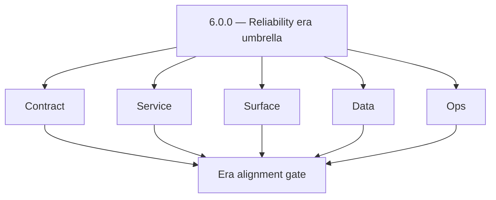
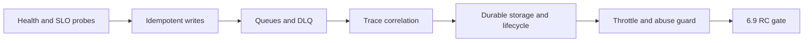

# Version 6.0

- **Status:** planned
- **Target window:** TBD
- **Summary:** Reliability and Scaling era umbrella — coordinates SLOs, idempotency, queue resilience, observability, performance, storage lifecycle, cost guardrails, and abuse resilience across Contact360 before the 7.x deployment era.
- **Scope:** Cross-service reliability program alignment (Stages 6.1–6.9); no standalone 7.x RBAC/audit themes (those belong in `7.x`).
- **Roadmap mapping:** `6.x` stage group (`docs/roadmap.md` — VERSION 6.x)
- **Owner:** Platform Engineering
- **Patch closure:** Every codenamed patch file includes **Micro-gate** + **Service task slices**. Era hub: [`versions.md`](../versions.md).

## Scope

- **In scope:** Program charter, dependency order (6.1 → 6.9), shared vocabulary (SLO, error budget, idempotency, DLQ, trace correlation), and pointers to per-minor `version_6.N.md` files and task packs.
- **Out of scope:** RBAC matrix, immutable audit event product schema, tenant deployment governance (defer to `docs/7. Contact360 deployment/` and Stage 7.x).
- **Canonical theme source:** `docs/roadmap.md` Stages 6.1–6.9 and `docs/versions.md` release entries for `6.1.0`–`6.9.0`.

## Flowchart — five-track delivery

### Runtime focus — reliability spine

See also: [`docs/flowchart.md`](../flowchart.md).

## Task tracks — program level

### Contract
- 📌 Planned: Publish era-wide definitions: SLO vs SLI, error budget, idempotency key TTL, DLQ message envelope, `X-Trace-Id` propagation contract.
- 📌 Planned: Map each Stage 6.N to owning service scope in **Service task slices** inside `6.N.P — *.md` patch files in this folder.

### Service
- 📌 Planned: Confirm Appointment360 middleware readiness: RED metrics, `/health/slo`, idempotency, abuse guard, body size, rate limit (`docs/codebases/appointment360-codebase-analysis.md`).
- 📌 Planned: Confirm async plane ownership: tkdjob (`contact360.io/jobs`), Mailvetter queue, email campaign Asynq, Kafka consumers — DLQ/replay runbooks started.

### Surface
- 📌 Planned: Dashboard cross-cutting patterns: loading skeletons, error `Alert` + retry, optional offline/degraded banners (`docs/frontend/components.md` Era 6).
- 🔵 Planned: Planned public status surface: `docs/frontend/pages/status_page.json` (`/status` on marketing).

### Data
- 📌 Planned: Lineage inventory: optional `idempotency_keys` table, `job_events`, Redis-backed idempotency/abuse state, S3 multipart session durability.

### Ops
- 📌 Planned: SLO dashboard placeholders per environment; incident commander runbook index; `reliability-rc-hardening.md` as 6.9 exit gate.

## Cross-minor index

| Minor | File | Codename |
| --- | --- | --- |
| 6.1 | `6.1 — SLO and error-budget baseline.md` | SLO and error-budget baseline |
| 6.2 | `6.2 — Idempotent writes and reconciliation.md` | Idempotent writes and reconciliation |
| 6.3 | `6.3 — Queue DLQ and worker resilience.md` | Queue DLQ and worker resilience |
| 6.4 | `6.4 — Observability and correlated telemetry.md` | Observability and correlated telemetry |
| 6.5 | `6.5 — Performance and latency wave.md` | Performance and latency wave |
| 6.6 | `6.6 — Storage lifecycle and artifact integrity.md` | Storage lifecycle and artifact integrity |
| 6.7 | `6.7 — Cost reliability and budget guardrails.md` | Cost and budget guardrails |
| 6.8 | `6.8 — Security and abuse resilience at scale.md` | Abuse resilience at scale |
| 6.9 | `6.9 — Release candidate hardening for 700.md` | Reliability RC (pre–7.0) |

## Immediate next execution queue

- 📌 Planned: Socialize Stage 6.1–6.9 acceptance criteria from `docs/roadmap.md` with service owners.
- 📌 Planned: Ensure `docs/versions.md` 6.x entries match roadmap stage IDs.
- 📌 Planned: Open backlog epics per minor; link each epic to the matching `version_6.N.md` and task packs.

## References

- [docs/versions.md](../versions.md)
- [docs/roadmap.md](../roadmap.md) — VERSION 6.x
- [docs/version-policy.md](../version-policy.md)
- [docs/architecture.md](../architecture.md) — Planning horizon, execution architecture
- [docs/governance.md](../governance.md) — SLO/idempotency pointers
- [slo-idempotency.md](slo-idempotency.md), [queue-observability.md](queue-observability.md), [performance-storage-abuse.md](performance-storage-abuse.md), [reliability-rc-hardening.md](reliability-rc-hardening.md)

## Backend API and Endpoint Scope

- Era: `6.x` (umbrella). Per-minor endpoint deltas live in `6.1 — SLO and error-budget baseline.md`–`6.9 — Release candidate hardening for 700.md`.
- Gateway health family: `GET /health`, `GET /health/db`, `GET /health/logging`, `GET /health/slo` — [`appointment360_endpoint_era_matrix.json`](../backend/endpoints/appointment360_endpoint_era_matrix.json).

## Database and Data Lineage Scope

- Cross-era: PostgreSQL (Appointment360, Mailvetter jobs/results), jobs scheduler DB, Connectra PG+ES, logs.api S3 CSV, campaign DB — lineage updates when 6.x hardening touches persistence.

## Frontend UX Surface Scope

- Cross-era reliability UX: `docs/frontend/README.md` Era `6.x`, `docs/frontend/components.md` Era 6 patterns, planned `status_page`.

## UI Elements Checklist (era-wide)

- Retry buttons, error alerts, skeleton loaders, job progress bars, optional rate-limit / degraded-mode copy — applied per feature as minors land.

## Flow/Graph Delta

## Release Gate and Evidence

- 📌 Planned: Roadmap Stages 6.1–6.9 each have an owner and backlog link.
- 📌 Planned: No `version_6.N.md` content conflates 6.x with 7.x RBAC/audit themes.

### Micro-gate reference (apply at every `6.N.P`)

| Track | Gate question (must answer Yes or document waiver) |
| --- | --- |
| **Contract** | SLO/SLI, idempotency, DLQ envelope, trace headers — `docs/backend/apis/` + endpoint matrices updated? |
| **Service** | Retry/DLQ, rate limits, provider degradation — smoke paths + idempotency stores documented? |
| **Surface** | Ops dashboards, `/status`, degraded UX — user/operator-visible delta? |
| **Frontend** | Era 6 patterns in `docs/frontend/components.md` / pages JSON — delta? |
| **Data** | Lineage docs, Redis/DB idempotency, retention — migrations recorded? |
| **Ops** | SLO panels, alerts, chaos/runbooks (`queue-observability.md`, RC) — recorded? |

**Patch ladder:** Codenames `Void` → `Bloom` per minor (`.0`–`.9`) — see patch table below.

## Patches

| Patch | Codename | Doc |
| --- | --- | --- |
| `6.0.0` | Void | [`6.0.0` — Void](6.0.0 — Void.md) |
| `6.0.1` | Seed | [`6.0.1` — Seed](6.0.1 — Seed.md) |
| `6.0.2` | Sprout | [`6.0.2` — Sprout](6.0.2 — Sprout.md) |
| `6.0.3` | Roots | [`6.0.3` — Roots](6.0.3 — Roots.md) |
| `6.0.4` | Soil | [`6.0.4` — Soil](6.0.4 — Soil.md) |
| `6.0.5` | Rain | [`6.0.5` — Rain](6.0.5 — Rain.md) |
| `6.0.6` | Stem | [`6.0.6` — Stem](6.0.6 — Stem.md) |
| `6.0.7` | Branch | [`6.0.7` — Branch](6.0.7 — Branch.md) |
| `6.0.8` | Leaf | [`6.0.8` — Leaf](6.0.8 — Leaf.md) |
| `6.0.9` | Bloom | [`6.0.9` — Bloom](6.0.9 — Bloom.md) |

## Patch ladder (6.0.0 - 6.0.9)

### Micro-gate reference (apply at every patch)

| Track | Gate question (must answer Yes or waiver) |
| --- | --- |
| **Contract** | Contract/API change captured with diff or explicit no-change note |
| **Service** | Service health and smoke for affected paths pass |
| **Surface** | UI/admin/extension impact documented or N/A |
| **Frontend** | Routes/components/hooks affected listed or N/A |
| **Data** | Migrations/index/lineage deltas linked or N/A |
| **Ops** | Rollback/secrets/CI/runbook delta linked or N/A |

**Patch intent bands:** `.0` charter, `.1-.2` scaffold, `.3-.5` hardening, `.6-.8` integration, `.9` freeze/handoff.

| Patch | Codename | Focus | Evidence gate |
| --- | --- | --- | --- |
| `6.0.0` | Void | Charter: SLO/error-budget vocabulary + cross-service reliability scope | Charter + SLO definition doc linked |
| `6.0.1` | Seed | Health probe standardization: `/health`, `/health/db`, `/health/slo` across all services | Health endpoint inventory table complete |
| `6.0.2` | Sprout | Idempotency key foundation: Redis-backed store design for appointment360 | Idempotency key TTL policy documented |
| `6.0.3` | Roots | DLQ envelope: standard dead-letter message schema for Kafka/Asynq workers | DLQ message schema frozen + sample linked |
| `6.0.4` | Soil | `s3storage` multipart session: migrate in-memory state to Redis/Postgres | Multipart sessions survive Lambda cold restart |
| `6.0.5` | Rain | `X-Trace-Id` propagation contract across gateway → services → logs.api | Trace ID appears in logs.api CSV for cross-service call |
| `6.0.6` | Stem | Jobs DAG fix: blocked-edge degree-decrement stalling downstream tasks | DAG with blocked node still completes downstream |
| `6.0.7` | Branch | Cost guardrails: AI inference + email provider spend alert thresholds | Alert fires when daily spend exceeds threshold |
| `6.0.8` | Leaf | Abuse guard: appointment360 rate-limit toggle + body-size limits | Rate-limit returns 429 with proper headers |
| `6.0.9` | Bloom | RC hardening gate: regression suite + sign-off for 7.0 | Handoff documented for **7.0** |
## Tasks

### Contract

- 📌 Planned: **[appointment360]** — Diff and document schema for operations like ConnectraClient, LAMBDA_AI_API_URL, LAMBDA_CONNECTRA_API_URL; align with roadmap | area: `backend-api` | files: `docs/backend/apis/*.md`, `contact360.io/api/app/graphql/schema.py` | reason: Keep GraphQL/REST contracts aligned for era 6.0 patch 6.0.0

### Service

- 📌 Planned: **[appointment360]** — refine duplicate task (was: 📌 planned: **[appointment360]** — service slice: - [x] ✅ com…) | patch `6.0.0` band `0` | reason: specialize this file vs sibling patches; see docs/codebases/appointment360-codebase-analysis.md
- 📌 Planned: **[appointment360]** — refine duplicate task (was: 📌 planned: **[emailapis]** — harden primary worker/gateway i…) | patch `6.0.0` band `0` | reason: specialize this file vs sibling patches; see docs/codebases/appointment360-codebase-analysis.md

### Surface

- 📌 Planned: **[appointment360]** — refine duplicate task (was: 📌 planned: **[appointment360]** — refine duplicate task (was…) | patch `6.0.0` band `0` | reason: specialize this file vs sibling patches; see docs/codebases/appointment360-codebase-analysis.md

### Data

- 📌 Planned: **[appointment360]** — refine duplicate task (was: 📌 planned: **[appointment360]** — refine duplicate task (was…) | patch `6.0.0` band `0` | reason: specialize this file vs sibling patches; see docs/codebases/appointment360-codebase-analysis.md

### Ops

- 📌 Planned: **[appointment360]** — refine duplicate task (was: 📌 planned: **[appointment360]** — refine duplicate task (was…) | patch `6.0.0` band `0` | reason: specialize this file vs sibling patches; see docs/codebases/appointment360-codebase-analysis.md

