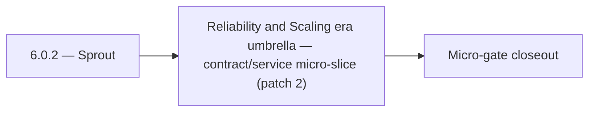

# 6.0.2 — Sprout

- **Era:** `6.x` Reliability and Scaling — hub [`versions.md`](../versions.md) · minors start at [`6.0 — Reliability and Scaling era umbrella`](6.0%20%E2%80%94%20Reliability%20and%20Scaling%20era%20umbrella.md)
- **Minor:** [6.0 — Reliability and Scaling era umbrella](./6.0 — Reliability and Scaling era umbrella.md)
- **Codename:** Sprout
- **Status:** planned

## Focus
Reliability and Scaling era umbrella — contract/service micro-slice (patch 2)

## Flowchart

## Micro-gate

| Track | Gate question | Answer / Evidence (fill at patch closeout) |
| --- | --- | --- |
| **Contract** | SLO/SLI, idempotency, DLQ envelope, trace propagation — `docs/backend/apis/` + matrices updated? | Document at patch closeout. |
| **Service** | Retry/DLQ, rate limits, abuse guards, HF/SMTP/provider paths — smoke + caps documented? | Document smoke paths. |
| **Surface** | Ops dashboards, `/status`, degraded-mode UX — delta for this patch? | Document UX delta or N/A. |
| **Frontend** | Dashboard/extension reliability patterns (`components.md` Era 6) touched? | Era umbrella / program charter; cross-service vocabulary. Document at closeout. |
| **Data** | Lineage, retention, Redis/DB-backed idempotency state — migrations recorded? | Document lineage or N/A. |
| **Ops** | SLO panels, alerts, chaos/runbook refs (`queue-observability.md`, RC) — delta? | Document ops delta or N/A. |

## Tasks
### Contract
- 📌 Planned: **[appointment360]** — refine duplicate task (was: sse first-token latency p95 < 1s) | patch `6.0.2` band `2` | reason: specialize this file vs sibling patches; see docs/codebases/appointment360-codebase-analysis.md
- 📌 Planned: **[appointment360]** — refine duplicate task (was: 📌 planned: define sse stream error format: `data: {"error": …) | patch `6.0.2` band `2` | reason: specialize this file vs sibling patches; see docs/codebases/appointment360-codebase-analysis.md
- 📌 Planned: **[appointment360]** — refine duplicate task (was: 📌 planned: define slos for `save-profiles`:) | patch `6.0.2` band `2` | reason: specialize this file vs sibling patches; see docs/codebases/appointment360-codebase-analysis.md
- 📌 Planned: Define `Retry-After` header semantics on `429` rate-limit responses

### Service
- 📌 Planned: **[appointment360]** — refine duplicate task (was: 📌 planned: add optimistic lock (version column or etag) to `…) | patch `6.0.2` band `2` | reason: specialize this file vs sibling patches; see docs/codebases/appointment360-codebase-analysis.md
- 📌 Planned: **[appointment360]** — refine duplicate task (was: 📌 planned: health endpoint improvements: `/health/db` must r…) | patch `6.0.2` band `2` | reason: specialize this file vs sibling patches; see docs/codebases/appointment360-codebase-analysis.md
- 📌 Planned: **[appointment360]** — refine duplicate task (was: 📌 planned: add clear `processing` and `failed` transitions f…) | patch `6.0.2` band `2` | reason: specialize this file vs sibling patches; see docs/codebases/appointment360-codebase-analysis.md
- 📌 Planned: **[appointment360]** — refine duplicate task (was: 📌 planned: add chunk-level idempotency token: generate per s…) | patch `6.0.2` band `2` | reason: specialize this file vs sibling patches; see docs/codebases/appointment360-codebase-analysis.md

### Surface

- 📌 Planned: **[connectra]** — Verify UX for route `/` and bindings (patch 6.0.2 band 2) | area: `frontend-page` | files: `contact360/dashboard/app/page.tsx` | reason: Dashboard/extension surface for era 6 must match gateway contracts

### Data

- 📌 Planned: **[appointment360]** — refine duplicate task (was: 📌 planned: **[appointment360]** — update postgresql/es/s3 li…) | patch `6.0.2` band `2` | reason: specialize this file vs sibling patches; see docs/codebases/appointment360-codebase-analysis.md

### Ops

- 📌 Planned: **[platform]** — Record smoke evidence, rollback, and alerts (patch band 2: charter/P0) | area: `ops` | files: `docs/commands/`, `.github/workflows/` | reason: Smoke, rollback, and observability for patch 6.0.2

## Service task slices
> Merged from era `6.x` reliability/scaling task packs (P0→`.0`–`.2`, P1→`.3`–`.6`, Ops→`.7`–`.9`).

### contact.ai
- Define SLO targets for contact.ai:
- Sync message response p95 < 3s
- SSE first-token latency p95 < 1s
- Utility AI endpoints p95 < 2s
- Availability target: 99.5%
- Document retry and timeout contract: max retries, backoff policy, `Retry-After` header behavior.
- Define SSE stream error format: `data: {"error": "<message>", "code": "<code>"}\n\n`.
- Document idempotency contract for `POST /message`: repeated calls with same payload must not create duplicate messages.
- Add SSE stream error handling: catch Lambda timeout, HF stream abort; emit error event and close stream cleanly.
- Implement SSE client reconnect logic: `Last-Event-ID` support or state-based resume.
- Add optimistic lock (version column or ETag) to `ai_chats` to prevent concurrent message append races.
- Implement chat archival TTL: define max chat age; background Lambda to soft-delete stale chats.
- Add distributed tracing: AWS X-Ray or OTEL context propagation across Lambda invocations.
- Tune HF + Gemini retry budgets: max 2 retries on HF, then 1 Gemini attempt, then 503.
- Health endpoint improvements: `/health/db` must report connection pool state; add `/health/hf` for HF API reachability.
- Add `version` column to `ai_chats` for optimistic concurrency control.
- Define and document TTL / archival strategy: chats older than N days → archived or deleted.
- Add lineage note to `contact_ai_data_lineage.md`: archival lifecycle and compliance retention.

### Appointment360 (gateway)
- Document SLO targets (error budget 1.0%, latency p99 < 2s) in docs/governance.md
- Define /health/slo endpoint contract: returns current error rate, budget consumed
- Define /health/db response schema: pool size, overflow, active connections
- Enable GraphQLRateLimitMiddleware: set GRAPHQL_RATE_LIMIT_REQUESTS_PER_MINUTE > 0 in production
- Enable GraphQLMutationAbuseGuardMiddleware: set ABUSE_GUARDED_MUTATIONS list
- Enable GraphQLIdempotencyMiddleware: set IDEMPOTENCY_REQUIRED_MUTATIONS list
- Enable QueryComplexityExtension: set GRAPHQL_COMPLEXITY_LIMIT to 100
- Enable QueryTimeoutExtension: set GRAPHQL_QUERY_TIMEOUT to 30s
- Add get_pool_stats() to db/session.py and expose via /health/db
- Add check_pool_health() and alert if overflow > 0
- Configure database pool: DATABASE_POOL_SIZE=25, DATABASE_MAX_OVERFLOW=50
- Retry-safe mutations: ensure billing/payment mutations send X-Idempotency-Key
- Instrument DB session events: log slow queries (> 500ms)
- Add request_id + trace_id to all log lines for correlation
- Add RED metrics (rate, error, duration) aggregation store
- Set GRAPHQL_MAX_BODY_BYTES=2097152 (2MB) in production

### logs.api
- Query/cache SLO evidence captured for staging + production baseline.
- Hot-partition and cache-churn runbooks tabletop-approved.
- Dashboard spec implemented or exported to Grafana/Datadog.
- `logsapi_endpoint_era_matrix.json` updated for era `6.x`.

### Jobs
- Idempotent create proven by duplicate POST test (staging).
- At least one DLQ message successfully replayed with audit trail.
- Stale-processing sweeper verified in soak test.
- SLO panels + alert routes live; chaos drill documented.

## Evidence gate
Patch closeout includes contract diff, smoke output, data lineage delta, and ops note
