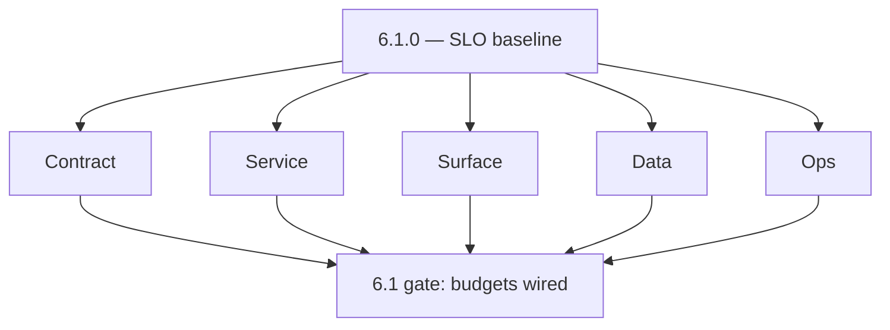
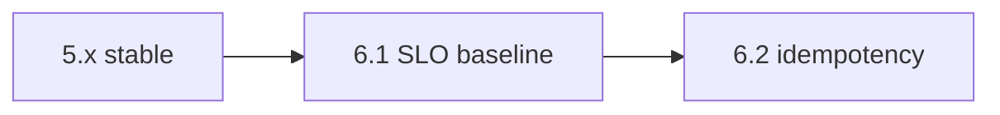

# Version 6.1

- **Status:** ✅ Completed
- **Target window:** TBD
- **Summary:** SLO and error-budget baseline — document and monitor SLOs with RED metrics, `/health/slo`, configurable error budget, and govern the budget in operational docs.
- **Scope:** Reliability baseline only — **no** RBAC policy checks or tenant deployment separation (7.x).
- **Roadmap mapping:** Stage 6.1 — Reliability baseline and SLO definition (`6.1.0` — `docs/roadmap.md`)
- **Owner:** Platform / SRE
- **Patch closure:** Every codenamed patch file includes **Micro-gate** + **Service task slices**. Era hub: [`versions.md`](../versions.md).

## Scope

- **In scope:** SLO targets per critical service, `SLO_ERROR_BUDGET_PERCENT`, `GET /health/slo` and related health routes, RED metric wiring (request rate, errors, duration), dashboards and alerting hooks.
- **Out of scope:** Idempotency enforcement depth (6.2), queue DLQ (6.3), full distributed tracing rollout (6.4+).

## Flowchart — five-track delivery

### Runtime focus — SLO probes

## Task tracks

### Contract
- ✅ Completed: 📌 Planned: **[appointment360]** — refine duplicate task (was: 📌 planned: **[appointment360]** — refine duplicate task (was…) | patch `6.1.0` band `0` | reason: specialize this file vs sibling patches; see docs/codebases/appointment360-codebase-analysis.md
- ✅ Completed: 📌 Planned: **[appointment360]** — refine duplicate task (was: 📌 planned: document `slo_error_budget_percent` semantics and…) | patch `6.1.0` band `0` | reason: specialize this file vs sibling patches; see docs/codebases/appointment360-codebase-analysis.md

### Service — Appointment360
- ✅ Completed: 📌 Planned: **[appointment360]** — refine duplicate task (was: 📌 planned: ensure `/health/slo` and related health family ar…) | patch `6.1.0` band `0` | reason: specialize this file vs sibling patches; see docs/codebases/appointment360-codebase-analysis.md
- ✅ Completed: 📌 Planned: **[appointment360]** — refine duplicate task (was: 📌 planned: wire red metrics at the graphql layer where appli…) | patch `6.1.0` band `0` | reason: specialize this file vs sibling patches; see docs/codebases/appointment360-codebase-analysis.md

### Service — Connectra, jobs, logs.api, others
- ✅ Completed: 📌 Planned: **[appointment360]** — refine duplicate task (was: 📌 planned: **[appointment360]** — refine duplicate task (was…) | patch `6.1.0` band `0` | reason: specialize this file vs sibling patches; see docs/codebases/appointment360-codebase-analysis.md

### Surface
- ✅ Completed: 📌 Planned: **[appointment360]** — refine duplicate task (was: 📌 planned: internal ops views: link slo dashboards from runb…) | patch `6.1.0` band `0` | reason: specialize this file vs sibling patches; see docs/codebases/appointment360-codebase-analysis.md

### Data
- ✅ Completed: 📌 Planned: **[appointment360]** — refine duplicate task (was: 📌 planned: slo time-series retention policy defined (metrics…) | patch `6.1.0` band `0` | reason: specialize this file vs sibling patches; see docs/codebases/appointment360-codebase-analysis.md

### Ops
- ✅ Completed: 📌 Planned: **[appointment360]** — refine duplicate task (was: 📌 planned: error budget policy: who gets paged, when budget …) | patch `6.1.0` band `0` | reason: specialize this file vs sibling patches; see docs/codebases/appointment360-codebase-analysis.md

### Service

- ✅ Completed: 📌 Planned: **[appointment360]** — refine duplicate task (was: 📌 planned: **[appointment360]** — service slice: - [x] ✅ com…) | patch `6.1.0` band `0` | reason: specialize this file vs sibling patches; see docs/codebases/appointment360-codebase-analysis.md
- ✅ Completed: 📌 Planned: **[appointment360]** — refine duplicate task (was: 📌 planned: **[emailapis]** — harden primary worker/gateway i…) | patch `6.1.0` band `0` | reason: specialize this file vs sibling patches; see docs/codebases/appointment360-codebase-analysis.md

## Task Breakdown — per service (acceptance hints)

| Service | Acceptance (6.1) |
| --- | --- |
| Appointment360 | `/health/slo` green in staging; RED dashboard stub exists |
| Connectra | Query latency SLI named; baseline captured |
| jobs | Job completion/error SLI named |
| Mailvetter / emailapis | Outbound delay/error SLIs named |
| logs.api | Query latency/availability SLI named |
| S3 storage | Upload success SLI named |

## Immediate next execution queue

- 📌 Planned: Fill **per-service SLO table** in `slo-idempotency.md`.
- 📌 Planned: Add `6.x` notes to `appointment360_endpoint_era_matrix.json` for health/SLO routes.
- 📌 Planned: Create Grafana/Datadog dashboard checklist (screenshots in governance optional).

## Cross-service ownership table

| Workstream | DRI | Backup |
| --- | --- | --- |
| Gateway SLO | Platform | API |
| Connectra & search | Search | Platform |
| Jobs & queues | Jobs | Platform |
| Logs & storage | Data | Platform |

## References

- [docs/roadmap.md](../roadmap.md) — Stage 6.1
- [slo-idempotency.md](slo-idempotency.md)
- [docs/codebases/appointment360-codebase-analysis.md](../codebases/appointment360-codebase-analysis.md)

## Backend API and Endpoint Scope

- `GET /health`, `GET /health/db`, `GET /health/logging`, `GET /health/slo` — see `appointment360_endpoint_era_matrix.json` `6.x`.

## Database and Data Lineage Scope

- None required for 6.1 beyond metrics; lineage updates when SLIs tie to new aggregates.

## Frontend UX Surface Scope

- Ops-facing only for 6.1; product UX for budget burn optional later.

## UI Elements Checklist

- Dashboard widgets (ops), optional status page placeholders.

## Flow/Graph Delta

## Release Gate and Evidence

- 📌 Planned: Roadmap 6.1 Definition of done met: SLOs documented and monitored — **KPI:** SLO attainment rate tracked.
- 📌 Planned: `docs/versions.md` `6.1.0` scope matches this file.

### Micro-gate reference (apply at every `6.N.P`)

| Track | Gate question (must answer Yes or document waiver) |
| --- | --- |
| **Contract** | SLO/SLI, idempotency, DLQ envelope, trace headers — `docs/backend/apis/` + endpoint matrices updated? |
| **Service** | Retry/DLQ, rate limits, provider degradation — smoke paths + idempotency stores documented? |
| **Surface** | Ops dashboards, `/status`, degraded UX — user/operator-visible delta? |
| **Frontend** | Era 6 patterns in `docs/frontend/components.md` / pages JSON — delta? |
| **Data** | Lineage docs, Redis/DB idempotency, retention — migrations recorded? |
| **Ops** | SLO panels, alerts, chaos/runbooks (`queue-observability.md`, RC) — recorded? |

**Patch ladder:** Codenames `Void` → `Bloom` per minor (`.0`–`.9`) — see patch table below.

## Patches

| Patch | Codename | Doc |
| --- | --- | --- |
| `6.1.0` | Void | [`6.1.0` — Void](6.1.0 — Void.md) |
| `6.1.1` | Seed | [`6.1.1` — Seed](6.1.1 — Seed.md) |
| `6.1.2` | Sprout | [`6.1.2` — Sprout](6.1.2 — Sprout.md) |
| `6.1.3` | Roots | [`6.1.3` — Roots](6.1.3 — Roots.md) |
| `6.1.4` | Soil | [`6.1.4` — Soil](6.1.4 — Soil.md) |
| `6.1.5` | Rain | [`6.1.5` — Rain](6.1.5 — Rain.md) |
| `6.1.6` | Stem | [`6.1.6` — Stem](6.1.6 — Stem.md) |
| `6.1.7` | Branch | [`6.1.7` — Branch](6.1.7 — Branch.md) |
| `6.1.8` | Leaf | [`6.1.8` — Leaf](6.1.8 — Leaf.md) |
| `6.1.9` | Bloom | [`6.1.9` — Bloom](6.1.9 — Bloom.md) |

## Patch ladder (6.1.0 - 6.1.9)

### Micro-gate reference (apply at every patch)

| Track | Gate question (must answer Yes or waiver) |
| --- | --- |
| **Contract** | Contract/API change captured with diff or explicit no-change note |
| **Service** | Service health and smoke for affected paths pass |
| **Surface** | UI/admin/extension impact documented or N/A |
| **Frontend** | Routes/components/hooks affected listed or N/A |
| **Data** | Migrations/index/lineage deltas linked or N/A |
| **Ops** | Rollback/secrets/CI/runbook delta linked or N/A |

**Patch intent bands:** `.0` charter, `.1-.2` scaffold, `.3-.5` hardening, `.6-.8` integration, `.9` freeze/handoff.

| Patch | Codename | Focus | Evidence gate |
| --- | --- | --- | --- |
| `6.1.0` | Void | patch focus | charter artifact linked |
| `6.1.1` | Seed | patch focus | closeout evidence attached |
| `6.1.2` | Sprout | patch focus | closeout evidence attached |
| `6.1.3` | Roots | patch focus | closeout evidence attached |
| `6.1.4` | Soil | patch focus | closeout evidence attached |
| `6.1.5` | Rain | patch focus | closeout evidence attached |
| `6.1.6` | Stem | patch focus | closeout evidence attached |
| `6.1.7` | Branch | patch focus | closeout evidence attached |
| `6.1.8` | Leaf | patch focus | closeout evidence attached |
| `6.1.9` | Bloom | patch focus | handoff documented |
