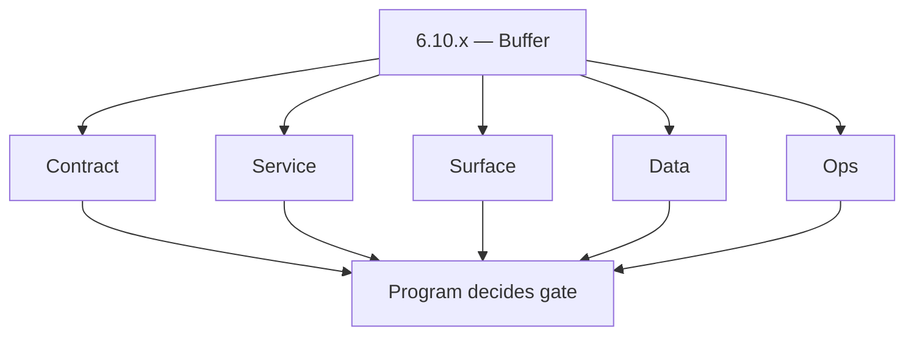
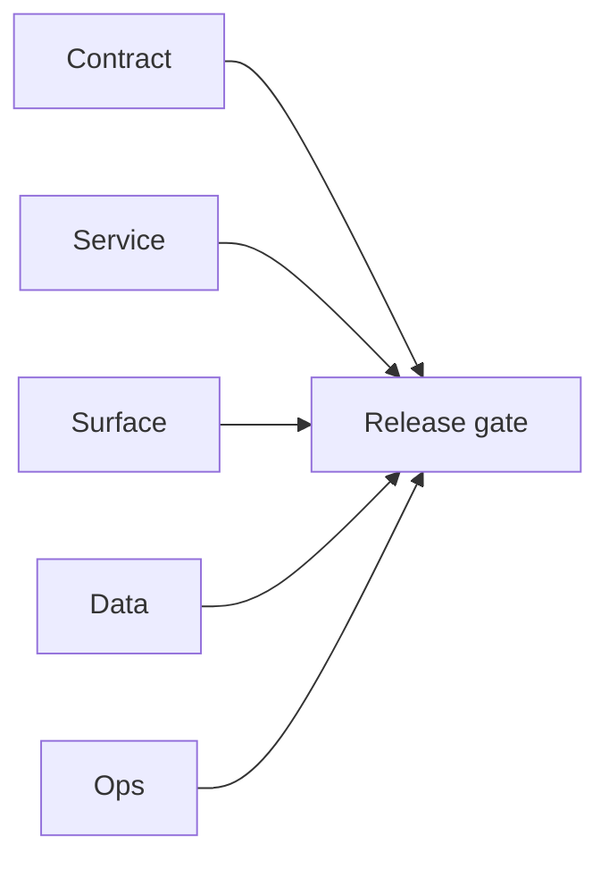

# Version 6.10

- **Status:** ✅ Completed
- **Target window:** TBD
- **Summary:** **Buffer / placeholder** minor within the 6.x reliability era — reserved for scope promoted from roadmap or emergency hardening patches that do not warrant renumbering prior stages. **No RBAC/deployment-era themes** belong here until the program explicitly promotes them.
- **Scope:** Timeboxed reliability patches or doc-only errata — otherwise treat as **unscoped** until `docs/roadmap.md` assigns a Stage.
- **Roadmap mapping:** Not currently mapped to a Stage 6.10 in `docs/roadmap.md`; align with `docs/version-policy.md` if a patch line is added.
- **Owner:** TBD — assign when scope lands.
- **Patch closure:** Every codenamed patch file includes **Micro-gate** + **Service task slices**. Era hub: [`versions.md`](../versions.md).

## Scope

- **In scope (when used):** Cherry-pick reliability fixes (SLO regressions, hotfix idempotency, one-off DLQ tooling) documented as addenda to relevant `6.1 — SLO and error-budget baseline.md`–`6.9 — Release candidate hardening for 700.md` themes.
- **Out of scope:** Defining new major governance paradigms; 7.x deployment work.

## Flowchart — five-track delivery

### Runtime focus — optional hotfix rail

## Task tracks

### Contract
- ✅ Completed: 📌 Planned: **[appointment360]** — refine duplicate task (was: 📌 planned: **[appointment360]** — refine duplicate task (was…) | patch `6.10.0` band `0` | reason: specialize this file vs sibling patches; see docs/codebases/appointment360-codebase-analysis.md

- ✅ Completed: 📌 Planned: **[appointment360]** — refine duplicate task (was: 📌 planned: **[architecture]** — product **graphql** remains …) | patch `6.10.0` band `0` | reason: specialize this file vs sibling patches; see docs/codebases/appointment360-codebase-analysis.md
### Service / Surface / Data / Ops
- ✅ Completed: ✅ Completed: 📌 Planned: **[appointment360]** — refine duplicate task (was: 📌 planned: mirror the structure of other minors once scope e…) | patch `6.10.0` band `0` | reason: specialize this file vs sibling patches; see docs/codebases/appointment360-codebase-analysis.md

### Service

- ✅ Completed: ✅ Completed: 📌 Planned: **[appointment360]** — refine duplicate task (was: 📌 planned: **[appointment360]** — service slice: - [x] ✅ com…) | patch `6.10.0` band `0` | reason: specialize this file vs sibling patches; see docs/codebases/appointment360-codebase-analysis.md
- ✅ Completed: ✅ Completed: 📌 Planned: **[appointment360]** — refine duplicate task (was: 📌 planned: **[emailapis]** — harden primary worker/gateway i…) | patch `6.10.0` band `0` | reason: specialize this file vs sibling patches; see docs/codebases/appointment360-codebase-analysis.md

- ✅ Completed: 📌 Planned: **[appointment360]** — refine duplicate task (was: 📌 planned: **[architecture]** — **go/gin satellites** in sco…) | patch `6.10.0` band `0` | reason: specialize this file vs sibling patches; see docs/codebases/appointment360-codebase-analysis.md
### Surface

- ✅ Completed: 📌 Planned: **[appointment360]** — refine duplicate task (was: 📌 planned: **[appointment360]** — refine duplicate task (was…) | patch `6.10.0` band `0` | reason: specialize this file vs sibling patches; see docs/codebases/appointment360-codebase-analysis.md

### Data

- ✅ Completed: 📌 Planned: **[appointment360]** — refine duplicate task (was: 📌 planned: **[appointment360]** — refine duplicate task (was…) | patch `6.10.0` band `0` | reason: specialize this file vs sibling patches; see docs/codebases/appointment360-codebase-analysis.md

- ✅ Completed: 📌 Planned: **[appointment360]** — refine duplicate task (was: 📌 planned: **[architecture]** — **postgresql-first** per `do…) | patch `6.10.0` band `0` | reason: specialize this file vs sibling patches; see docs/codebases/appointment360-codebase-analysis.md
- ✅ Completed: 📌 Planned: **[appointment360]** — refine duplicate task (was: 📌 planned: **[architecture]** — **redis exit**: campaign (as…) | patch `6.10.0` band `0` | reason: specialize this file vs sibling patches; see docs/codebases/appointment360-codebase-analysis.md
### Ops

- ✅ Completed: 📌 Planned: **[appointment360]** — refine duplicate task (was: 📌 planned: **[appointment360]** — refine duplicate task (was…) | patch `6.10.0` band `0` | reason: specialize this file vs sibling patches; see docs/codebases/appointment360-codebase-analysis.md

- ✅ Completed: 📌 Planned: **[appointment360]** — refine duplicate task (was: 📌 planned: **[architecture]** — **observability**: correlate…) | patch `6.10.0` band `0` | reason: specialize this file vs sibling patches; see docs/codebases/appointment360-codebase-analysis.md
## Task Breakdown

| When | Action |
| --- | --- |
| No charter | Keep this file minimal; link readers to `6.9 — Release candidate hardening for 700.md` for RC |
| Charter filed | Copy task-track pattern from closest upstream minor |

## Immediate next execution queue

- 📌 Planned: **None** until Stage 6.10 is promoted in `docs/roadmap.md` and `docs/versions.md`.

## Cross-service ownership table

| Workstream | DRI |
| --- | --- |
| Unassigned | — |

## References

- [docs/roadmap.md](../roadmap.md)
- [docs/versions.md](../versions.md)
- [6.9 — Release candidate hardening for 700.md](6.9 — Release candidate hardening for 700.md)

## Backend API and Endpoint Scope

- TBD — document deltas when `6.10.x` ships.

## Database and Data Lineage Scope

- TBD.

## Frontend UX Surface Scope

- TBD.

## UI Elements Checklist

- TBD.

## Flow/Graph Delta

## Release Gate and Evidence

- 📌 Planned: Defined only when `6.10.x` scope exists — otherwise N/A.

### Micro-gate reference (apply at every `6.N.P`)

| Track | Gate question (must answer Yes or document waiver) |
| --- | --- |
| **Contract** | SLO/SLI, idempotency, DLQ envelope, trace headers — `docs/backend/apis/` + endpoint matrices updated? |
| **Service** | Retry/DLQ, rate limits, provider degradation — smoke paths + idempotency stores documented? |
| **Surface** | Ops dashboards, `/status`, degraded UX — user/operator-visible delta? |
| **Frontend** | Era 6 patterns in `docs/frontend/components.md` / pages JSON — delta? |
| **Data** | Lineage docs, Redis/DB idempotency, retention — migrations recorded? |
| **Ops** | SLO panels, alerts, chaos/runbooks (`queue-observability.md`, RC) — recorded? |
| **Architecture** | Go/Gin satellites only via Python GraphQL gateway (`contact360.io/api`); Next.js `NEXT_PUBLIC_GRAPHQL_URL`; Postgres-first / Redis exit per `docs/docs/data-stores-postgres.md`. |

**Patch ladder:** Codenames `Void` → `Bloom` per minor (`.0`–`.9`) — see patch table below.

## Patches

| Patch | Codename | Doc |
| --- | --- | --- |
| `6.10.0` | Void | [`6.10.0` — Void](6.10.0 — Void.md) |
| `6.10.1` | Seed | [`6.10.1` — Seed](6.10.1 — Seed.md) |
| `6.10.2` | Sprout | [`6.10.2` — Sprout](6.10.2 — Sprout.md) |
| `6.10.3` | Roots | [`6.10.3` — Roots](6.10.3 — Roots.md) |
| `6.10.4` | Soil | [`6.10.4` — Soil](6.10.4 — Soil.md) |
| `6.10.5` | Rain | [`6.10.5` — Rain](6.10.5 — Rain.md) |
| `6.10.6` | Stem | [`6.10.6` — Stem](6.10.6 — Stem.md) |
| `6.10.7` | Branch | [`6.10.7` — Branch](6.10.7 — Branch.md) |
| `6.10.8` | Leaf | [`6.10.8` — Leaf](6.10.8 — Leaf.md) |
| `6.10.9` | Bloom | [`6.10.9` — Bloom](6.10.9 — Bloom.md) |

## Patch ladder (6.10.0 - 6.10.9)

### Micro-gate reference (apply at every patch)

| Track | Gate question (must answer Yes or waiver) |
| --- | --- |
| **Contract** | Contract/API change captured with diff or explicit no-change note |
| **Service** | Service health and smoke for affected paths pass |
| **Surface** | UI/admin/extension impact documented or N/A |
| **Frontend** | Routes/components/hooks affected listed or N/A |
| **Data** | Migrations/index/lineage deltas linked or N/A |
| **Ops** | Rollback/secrets/CI/runbook delta linked or N/A |

**Patch intent bands:** `.0` charter, `.1-.2` scaffold, `.3-.5` hardening, `.6-.8` integration, `.9` freeze/handoff.

| Patch | Codename | Focus | Evidence gate |
| --- | --- | --- | --- |
| `6.10.0` | Void | patch focus | charter artifact linked |
| `6.10.1` | Seed | patch focus | closeout evidence attached |
| `6.10.2` | Sprout | patch focus | closeout evidence attached |
| `6.10.3` | Roots | patch focus | closeout evidence attached |
| `6.10.4` | Soil | patch focus | closeout evidence attached |
| `6.10.5` | Rain | patch focus | closeout evidence attached |
| `6.10.6` | Stem | patch focus | closeout evidence attached |
| `6.10.7` | Branch | patch focus | closeout evidence attached |
| `6.10.8` | Leaf | patch focus | closeout evidence attached |
| `6.10.9` | Bloom | patch focus | handoff documented |

## Flowchart

Five-track delivery (contract / service / surface / data / ops) for this doc:

**Master hub:** [`docs/docs/flowchart.md`](../docs/flowchart.md) — cross-system diagrams and era strip (`0.x` → `10.x`).
