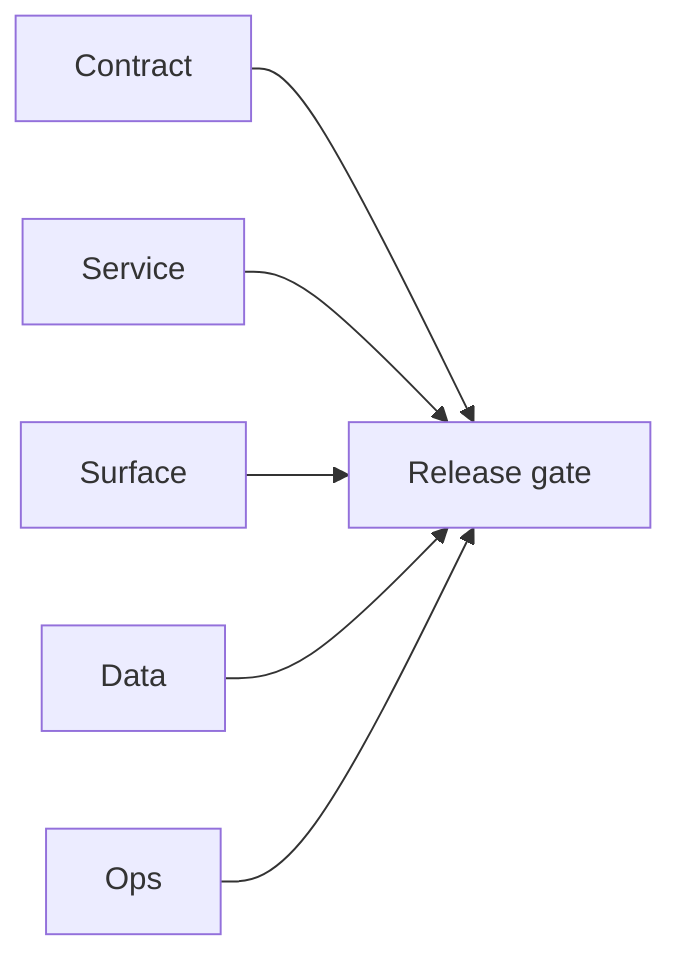

# 6.11.100 — EC2 email server reliability patch linkage

## Scope

Reliability/scaling patch mapping for EC2 email runtime.

## Included patch intents

- `003-parallel-bulk-verification.patch`: concurrency restore for bulk path.
- `006-error-handling.patch`: safer runtime fault handling and metrics visibility.

## Reliability outcome

- Lower risk of silent failures and stronger support for high-volume verifier workloads.

## Flowchart

Five-track delivery (contract / service / surface / data / ops) for this doc:

**Master hub:** [`docs/docs/flowchart.md`](../docs/flowchart.md) — cross-system diagrams and era strip (`0.x` → `10.x`).

## Task tracks

### Contract

- ✅ Completed: Reliability patch intent list documented; failure envelopes align with [`15_EMAIL_MODULE.md`](../backend/graphql.modules/15_EMAIL_MODULE.md) expectations.

### Service

- ✅ Completed: Concurrency restore (`003`) + safer fault handling (`006`) on email.server.

### Surface

- ✅ Completed: No dedicated UI file; bulk UX improves via job stability.

### Data

- ✅ Completed: Checkpoint/job rows stay authoritative; runtime writes safer under errors.

### Ops

- ✅ Completed: Metrics visibility for verifier spikes; add alerts per `6.x` roadmap.
