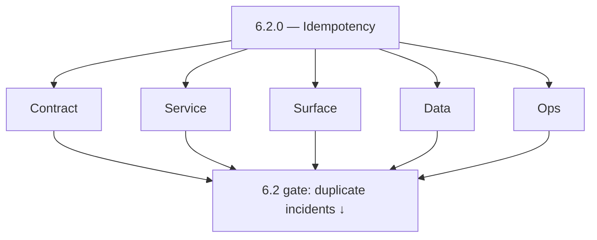
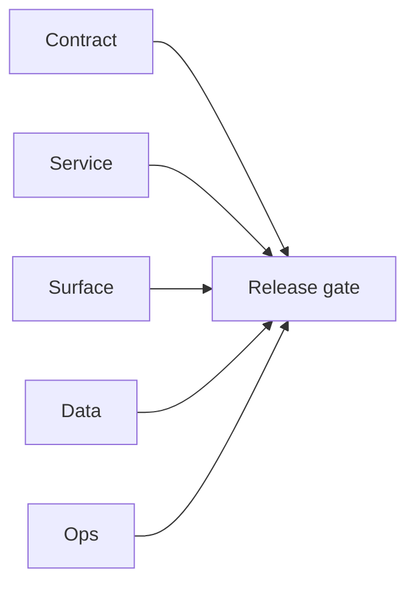

# Version 6.2

- **Status:** ✅ Completed
- **Target window:** TBD
- **Summary:** Idempotent writes and reconciliation — critical mutations enforce `X-Idempotency-Key`, GraphQL idempotency middleware, configurable required mutations list; Redis-backed vs in-process stores documented; reconciliation evidence for duplicates.
- **Scope:** Write-path safety — **not** queue DLQ (6.3) or RBAC approvals (7.x).
- **Roadmap mapping:** Stage 6.2 — Idempotency and consistency hardening (`6.2.0`)
- **Owner:** Platform / API
- **Patch closure:** Every codenamed patch file includes **Micro-gate** + **Service task slices**. Era hub: [`versions.md`](../versions.md).

## Scope

- **In scope:** `GraphQLIdempotencyMiddleware`, `IDEMPOTENCY_REQUIRED_MUTATIONS`, optional `idempotency_keys` table, Mailvetter bulk-create idempotency, SalesNavigator chunk keys, duplicate side-effect KPI reduction.
- **Out of scope:** Full DLQ semantics (6.3); distributed tracing depth (6.4).

## Flowchart — five-track delivery

### Runtime focus — idempotency

## Task tracks

### Contract
- ✅ Completed: 📌 Planned: **[appointment360]** — refine duplicate task (was: 📌 planned: **[appointment360]** — refine duplicate task (was…) | patch `6.2.0` band `0` | reason: specialize this file vs sibling patches; see docs/codebases/appointment360-codebase-analysis.md
- ✅ Completed: ✅ Completed: 📌 Planned: **[appointment360]** — refine duplicate task (was: 📌 planned: list **required** mutations in config (`idempoten…) | patch `6.2.0` band `0` | reason: specialize this file vs sibling patches; see docs/codebases/appointment360-codebase-analysis.md

- ✅ Completed: 📌 Planned: **[appointment360]** — refine duplicate task (was: 📌 planned: **[architecture]** — product **graphql** remains …) | patch `6.2.0` band `0` | reason: specialize this file vs sibling patches; see docs/codebases/appointment360-codebase-analysis.md
### Service — Appointment360
- ✅ Completed: ✅ Completed: 📌 Planned: **[appointment360]** — refine duplicate task (was: 📌 planned: enforce middleware on billing/job-triggering muta…) | patch `6.2.0` band `0` | reason: specialize this file vs sibling patches; see docs/codebases/appointment360-codebase-analysis.md
- ✅ Completed: ✅ Completed: 📌 Planned: **[appointment360]** — refine duplicate task (was: 📌 planned: **redis migration checklist** in `slo-idempotency…) | patch `6.2.0` band `0` | reason: specialize this file vs sibling patches; see docs/codebases/appointment360-codebase-analysis.md

### Service — Mailvetter / SalesNavigator / jobs
- ✅ Completed: 📌 Planned: **[appointment360]** — refine duplicate task (was: 📌 planned: **[appointment360]** — refine duplicate task (was…) | patch `6.2.0` band `0` | reason: specialize this file vs sibling patches; see docs/codebases/appointment360-codebase-analysis.md

### Surface
- ✅ Completed: ✅ Completed: 📌 Planned: **[appointment360]** — refine duplicate task (was: 📌 planned: clients: retry after network failure must replay …) | patch `6.2.0` band `0` | reason: specialize this file vs sibling patches; see docs/codebases/appointment360-codebase-analysis.md

### Data
- ✅ Completed: ✅ Completed: 📌 Planned: **[appointment360]** — refine duplicate task (was: 📌 planned: optional `idempotency_keys` table ddl and retenti…) | patch `6.2.0` band `0` | reason: specialize this file vs sibling patches; see docs/codebases/appointment360-codebase-analysis.md

- ✅ Completed: 📌 Planned: **[appointment360]** — refine duplicate task (was: 📌 planned: **[architecture]** — **postgresql-first** per `do…) | patch `6.2.0` band `0` | reason: specialize this file vs sibling patches; see docs/codebases/appointment360-codebase-analysis.md
- ✅ Completed: 📌 Planned: **[appointment360]** — refine duplicate task (was: 📌 planned: **[architecture]** — **redis exit**: campaign (as…) | patch `6.2.0` band `0` | reason: specialize this file vs sibling patches; see docs/codebases/appointment360-codebase-analysis.md
### Ops
- ✅ Completed: ✅ Completed: 📌 Planned: **[appointment360]** — refine duplicate task (was: 📌 planned: runbook: “duplicate charge” triage — check idempo…) | patch `6.2.0` band `0` | reason: specialize this file vs sibling patches; see docs/codebases/appointment360-codebase-analysis.md

- ✅ Completed: 📌 Planned: **[appointment360]** — refine duplicate task (was: 📌 planned: **[architecture]** — **observability**: correlate…) | patch `6.2.0` band `0` | reason: specialize this file vs sibling patches; see docs/codebases/appointment360-codebase-analysis.md
### Service

- ✅ Completed: ✅ Completed: 📌 Planned: **[appointment360]** — refine duplicate task (was: 📌 planned: **[appointment360]** — service slice: - [x] ✅ com…) | patch `6.2.0` band `0` | reason: specialize this file vs sibling patches; see docs/codebases/appointment360-codebase-analysis.md
- ✅ Completed: ✅ Completed: 📌 Planned: **[appointment360]** — refine duplicate task (was: 📌 planned: **[emailapis]** — harden primary worker/gateway i…) | patch `6.2.0` band `0` | reason: specialize this file vs sibling patches; see docs/codebases/appointment360-codebase-analysis.md

- ✅ Completed: 📌 Planned: **[appointment360]** — refine duplicate task (was: 📌 planned: **[architecture]** — **go/gin satellites** in sco…) | patch `6.2.0` band `0` | reason: specialize this file vs sibling patches; see docs/codebases/appointment360-codebase-analysis.md
## Task Breakdown — acceptance

| Path | Criteria |
| --- | --- |
| GraphQL mutations (billing) | 100% of listed mutations reject missing key in prod |
| Mailvetter bulk | Replay does not double-send |
| Jobs create | Idempotent job create contract — **Service task slices** in `6.x` patches (jobs / `6.2`–`6.3`) |

## Immediate next execution queue

- 📌 Planned: Complete Redis vs in-process checklist in `slo-idempotency.md`.
- 📌 Planned: Audit `IDEMPOTENCY_REQUIRED_MUTATIONS` against highest-risk operations.

## Cross-service ownership table

| Workstream | DRI |
| --- | --- |
| Gateway idempotency | API |
| Mailvetter / campaign | Messaging |
| Jobs | Jobs |

## References

- [docs/roadmap.md](../roadmap.md) — Stage 6.2
- [slo-idempotency.md](slo-idempotency.md)
- [jobs-codebase-analysis.md](../codebases/jobs-codebase-analysis.md)

## Backend API and Endpoint Scope

- GraphQL mutations under idempotency middleware; REST bulk endpoints where keys apply.

## Database and Data Lineage Scope

- `idempotency_keys` (if enabled); job rows must not duplicate on replay.

## Frontend UX Surface Scope

- Preserve and resend idempotency key on user retry; surface duplicate-operation friendly errors.

## UI Elements Checklist

- Error Alert with “safe to retry” vs “duplicate operation” copy.

## Flow/Graph Delta

## Release Gate and Evidence

- 📌 Planned: **KPI:** Duplicate side-effect incident count tracked week-over-week.
- 📌 Planned: Evidence: sample reconciliation report or dashboard panel.

### Micro-gate reference (apply at every `6.N.P`)

| Track | Gate question (must answer Yes or document waiver) |
| --- | --- |
| **Contract** | SLO/SLI, idempotency, DLQ envelope, trace headers — `docs/backend/apis/` + endpoint matrices updated? |
| **Service** | Retry/DLQ, rate limits, provider degradation — smoke paths + idempotency stores documented? |
| **Surface** | Ops dashboards, `/status`, degraded UX — user/operator-visible delta? |
| **Frontend** | Era 6 patterns in `docs/frontend/components.md` / pages JSON — delta? |
| **Data** | Lineage docs, Redis/DB idempotency, retention — migrations recorded? |
| **Ops** | SLO panels, alerts, chaos/runbooks (`queue-observability.md`, RC) — recorded? |
| **Architecture** | Go/Gin satellites only via Python GraphQL gateway (`contact360.io/api`); Next.js `NEXT_PUBLIC_GRAPHQL_URL`; Postgres-first / Redis exit per `docs/docs/data-stores-postgres.md`. |

**Patch ladder:** Codenames `Void` → `Bloom` per minor (`.0`–`.9`) — see patch table below.

## Patches

| Patch | Codename | Doc |
| --- | --- | --- |
| `6.2.0` | Void | [`6.2.0` — Void](6.2.0 — Void.md) |
| `6.2.1` | Seed | [`6.2.1` — Seed](6.2.1 — Seed.md) |
| `6.2.2` | Sprout | [`6.2.2` — Sprout](6.2.2 — Sprout.md) |
| `6.2.3` | Roots | [`6.2.3` — Roots](6.2.3 — Roots.md) |
| `6.2.4` | Soil | [`6.2.4` — Soil](6.2.4 — Soil.md) |
| `6.2.5` | Rain | [`6.2.5` — Rain](6.2.5 — Rain.md) |
| `6.2.6` | Stem | [`6.2.6` — Stem](6.2.6 — Stem.md) |
| `6.2.7` | Branch | [`6.2.7` — Branch](6.2.7 — Branch.md) |
| `6.2.8` | Leaf | [`6.2.8` — Leaf](6.2.8 — Leaf.md) |
| `6.2.9` | Bloom | [`6.2.9` — Bloom](6.2.9 — Bloom.md) |

## Patch ladder (6.2.0 - 6.2.9)

### Micro-gate reference (apply at every patch)

| Track | Gate question (must answer Yes or waiver) |
| --- | --- |
| **Contract** | Contract/API change captured with diff or explicit no-change note |
| **Service** | Service health and smoke for affected paths pass |
| **Surface** | UI/admin/extension impact documented or N/A |
| **Frontend** | Routes/components/hooks affected listed or N/A |
| **Data** | Migrations/index/lineage deltas linked or N/A |
| **Ops** | Rollback/secrets/CI/runbook delta linked or N/A |

**Patch intent bands:** `.0` charter, `.1-.2` scaffold, `.3-.5` hardening, `.6-.8` integration, `.9` freeze/handoff.

| Patch | Codename | Focus | Evidence gate |
| --- | --- | --- | --- |
| `6.2.0` | Void | patch focus | charter artifact linked |
| `6.2.1` | Seed | patch focus | closeout evidence attached |
| `6.2.2` | Sprout | patch focus | closeout evidence attached |
| `6.2.3` | Roots | patch focus | closeout evidence attached |
| `6.2.4` | Soil | patch focus | closeout evidence attached |
| `6.2.5` | Rain | patch focus | closeout evidence attached |
| `6.2.6` | Stem | patch focus | closeout evidence attached |
| `6.2.7` | Branch | patch focus | closeout evidence attached |
| `6.2.8` | Leaf | patch focus | closeout evidence attached |
| `6.2.9` | Bloom | patch focus | handoff documented |

## Flowchart

Five-track delivery (contract / service / surface / data / ops) for this doc:

**Master hub:** [`docs/docs/flowchart.md`](../docs/flowchart.md) — cross-system diagrams and era strip (`0.x` → `10.x`).
