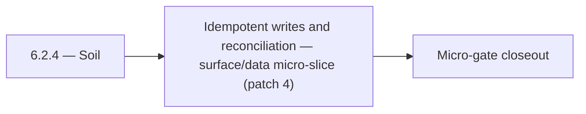

# 6.2.4 — Soil

- **Era:** `6.x` Reliability and Scaling — hub [`versions.md`](../versions.md) · minors start at [`6.0 — Reliability and Scaling era umbrella`](6.0%20%E2%80%94%20Reliability%20and%20Scaling%20era%20umbrella.md)
- **Minor:** [6.2 — Idempotent writes and reconciliation](./6.2 — Idempotent writes and reconciliation.md)
- **Codename:** Soil
- **Status:** ✅ Completed
## Focus
Idempotent writes and reconciliation — surface/data micro-slice (patch 4)

## Flowchart

## Micro-gate

| Track | Gate question | Answer / Evidence (fill at patch closeout) |
| --- | --- | --- |
| **Contract** | SLO/SLI, idempotency, DLQ envelope, trace propagation — `docs/backend/apis/` + matrices updated? | Document at patch closeout. |
| **Service** | Retry/DLQ, rate limits, abuse guards, HF/SMTP/provider paths — smoke + caps documented? | Document smoke paths. |
| **Surface** | Ops dashboards, `/status`, degraded-mode UX — delta for this patch? | Document UX delta or N/A. |
| **Frontend** | Dashboard/extension reliability patterns (`components.md` Era 6) touched? | Idempotent writes + reconciliation evidence across hot paths. Document at closeout. |
| **Data** | Lineage, retention, Redis/DB-backed idempotency state — migrations recorded? | Document lineage or N/A. |
| **Ops** | SLO panels, alerts, chaos/runbook refs (`queue-observability.md`, RC) — delta? | Document ops delta or N/A. |

## Tasks
### Surface
- ✅ Completed: 📌 Planned: **[appointment360]** — refine duplicate task (was: 📌 planned: clients: retry after network failure must replay …) | patch `6.2.4` band `4` | reason: specialize this file vs sibling patches; see docs/codebases/appointment360-codebase-analysis.md
- ✅ Completed: 📌 Planned: **[appointment360]** — refine duplicate task (was: 📌 planned: implement sse reconnect in `usestreammessage`: re…) | patch `6.2.4` band `4` | reason: specialize this file vs sibling patches; see docs/codebases/appointment360-codebase-analysis.md
- ✅ Completed: 📌 Planned: **[appointment360]** — refine duplicate task (was: 🟡 in progress: add retry-state indicators in progress ui.) | patch `6.2.4` band `4` | reason: specialize this file vs sibling patches; see docs/codebases/appointment360-codebase-analysis.md
- ✅ Completed: 📌 Planned: **[appointment360]** — refine duplicate task (was: 📌 planned: `snretrybutton` — re-attempt only failed profiles…) | patch `6.2.4` band `4` | reason: specialize this file vs sibling patches; see docs/codebases/appointment360-codebase-analysis.md

### Data
- ✅ Completed: 📌 Planned: **[appointment360]** — refine duplicate task (was: 📌 planned: optional `idempotency_keys` table ddl and retenti…) | patch `6.2.4` band `4` | reason: specialize this file vs sibling patches; see docs/codebases/appointment360-codebase-analysis.md
- ✅ Completed: 📌 Planned: **[appointment360]** — refine duplicate task (was: 📌 planned: add lineage note to `contact_ai_data_lineage.md`:…) | patch `6.2.4` band `4` | reason: specialize this file vs sibling patches; see docs/codebases/appointment360-codebase-analysis.md
- ✅ Completed: 📌 Planned: **[appointment360]** — refine duplicate task (was: 📌 planned: add correlation ids in job/result rows for tracea…) | patch `6.2.4` band `4` | reason: specialize this file vs sibling patches; see docs/codebases/appointment360-codebase-analysis.md
- ✅ Completed: 📌 Planned: **[appointment360]** — refine duplicate task (was: 📌 planned: partial success tracking: log `{session_id, total…) | patch `6.2.4` band `4` | reason: specialize this file vs sibling patches; see docs/codebases/appointment360-codebase-analysis.md

### Contract

- ✅ Completed: 📌 Planned: **[appointment360]** — Diff and document schema for operations like ConnectraClient, LAMBDA_AI_API_URL, LAMBDA_CONNECTRA_API_URL; align with roadmap | area: `backend-api` | files: `docs/backend/apis/*.md`, `contact360.io/api/app/graphql/schema.py` | reason: Keep GraphQL/REST contracts aligned for era 6.4 patch 6.2.4

### Service

- ✅ Completed: 📌 Planned: **[appointment360]** — refine duplicate task (was: 📌 planned: **[appointment360]** — service slice: - [x] ✅ com…) | patch `6.2.4` band `4` | reason: specialize this file vs sibling patches; see docs/codebases/appointment360-codebase-analysis.md

### Ops

- ✅ Completed: 📌 Planned: **[platform]** — Record smoke evidence, rollback, and alerts (patch band 4: surface/data) | area: `ops` | files: `docs/commands/`, `.github/workflows/` | reason: Smoke, rollback, and observability for patch 6.2.4

## Service task slices
> Merged from era `6.x` reliability/scaling task packs (P0→`.0`–`.2`, P1→`.3`–`.6`, Ops→`.7`–`.9`).

### Jobs
- Idempotent create proven by duplicate POST test (staging).
- At least one DLQ message successfully replayed with audit trail.
- Stale-processing sweeper verified in soak test.
- SLO panels + alert routes live; chaos drill documented.

### Connectra
- Query P95 SLO baseline captured in dashboards.
- Batch-upsert idempotency test passes (duplicate submission).
- Drift detector runs on schedule with last success timestamp exported.
- CORS + per-tenant rate limit reviewed by security; no wildcard prod misconfig.

### contact.ai
- Implement `AIErrorState` component: shows error type (timeout, rate limit, service unavailable) with retry CTA.
- Implement retry button: re-sends last failed message (cached in `AIChatContext`).
- Implement SSE reconnect in `useStreamMessage`: reconnect on stream abort with exponential backoff.
- Show `Retry-After` countdown in rate limit error state (use `RateLimitError.retryAfter`).
- Loading progress for long-running requests: indeterminate progress bar above chat input.
- Add `version` column to `ai_chats` for optimistic concurrency control.
- Define and document TTL / archival strategy: chats older than N days → archived or deleted.
- Add lineage note to `contact_ai_data_lineage.md`: archival lifecycle and compliance retention.
- Confirm `updated_at` timestamp is updated atomically with `messages` JSONB on every write.
- Add SSE stream error handling: catch Lambda timeout, HF stream abort; emit error event and close stream cleanly.
- Implement SSE client reconnect logic: `Last-Event-ID` support or state-based resume.
- Add optimistic lock (version column or ETag) to `ai_chats` to prevent concurrent message append races.
- Implement chat archival TTL: define max chat age; background Lambda to soft-delete stale chats.
- Add distributed tracing: AWS X-Ray or OTEL context propagation across Lambda invocations.
- Tune HF + Gemini retry budgets: max 2 retries on HF, then 1 Gemini attempt, then 503.
- Health endpoint improvements: `/health/db` must report connection pool state; add `/health/hf` for HF API reachability.

### Appointment360 (gateway)
- Specify rate limit headers: X-RateLimit-Remaining, X-RateLimit-Reset
- Document idempotency contract: X-Idempotency-Key header, 24h TTL, replay semantics
- Move idempotency state to Redis for multi-replica shared state
- Move abuse guard sliding window to Redis for multi-replica
- Add TTLCache for user object with USER_CACHE_TTL (300s default)
- Add DataLoaders for all foreign-key fetches to eliminate N+1
- Add query depth limit extension
- Dashboard status bar shows GraphQL latency from X-Process-Time header
- Rate limit exceeded modal — parse X-RateLimit-Remaining: 0 response and display warning
- Connection pool exhaustion banner: surface when /health/db shows pool full
- Create idempotency_keys table (fallback if Redis unavailable): key, response_hash, expires_at
- Configure REDIS_URL, ENABLE_REDIS_CACHE=true for production
- Load test: 500 concurrent query contacts(query) requests through gateway
- Load test: 50 concurrent billing mutations with idempotency keys
- Add alert: error rate > 1% in 5-minute window → PagerDuty
- Add alert: DB pool overflow > 0 for > 60s → PagerDuty
- Document SLO dashboard in ops runbook

### emailapis / emailapigo
- SLO table row for Emailapis added in [`slo-idempotency.md`](slo-idempotency.md).
- `emailapis_endpoint_era_matrix.json` includes era `6.x` reliability notes (timeouts, circuits, concurrency).
- Provider degradation runbook reviewed in tabletop exercise.
- Staging load test: bulk job completes within **P95** target without OOM or goroutine leak.

## Evidence gate
Patch closeout includes contract diff, smoke output, data lineage delta, and ops note
