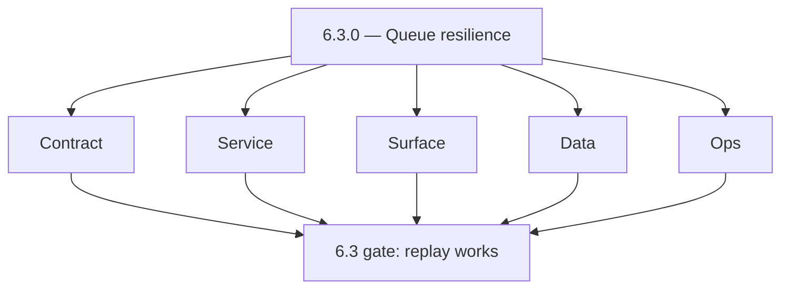
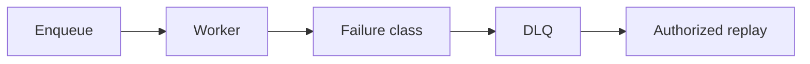
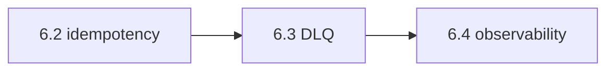
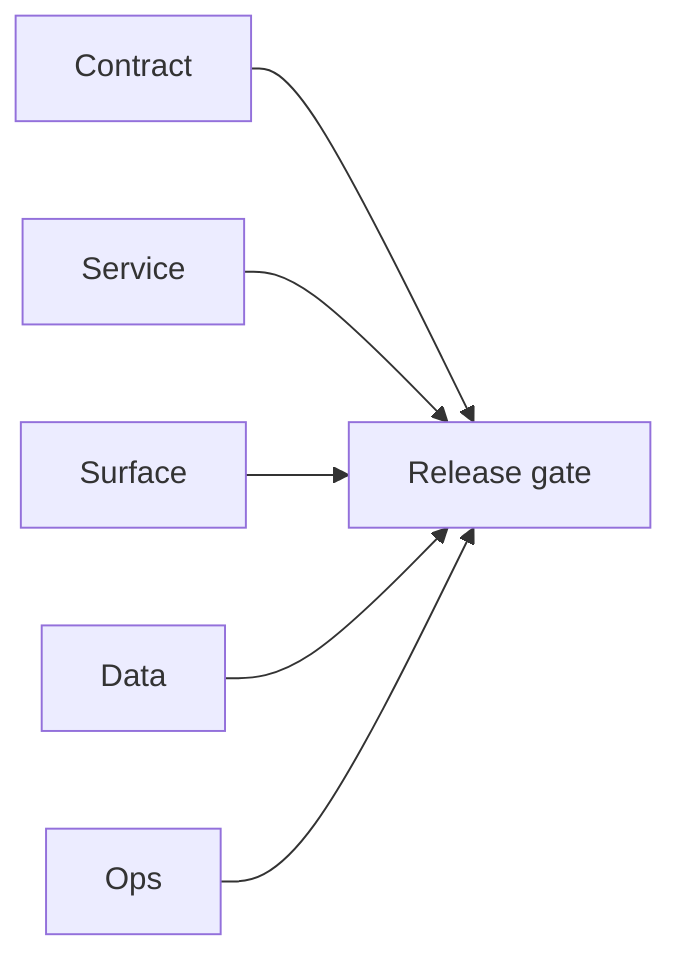

# Version 6.3

- **Status:** ✅ Completed
- **Target window:** TBD
- **Summary:** Queue DLQ and worker resilience — Kafka/Asynq dead-letter handling, poison message classification, authorized replay, `X-Trace-Id` (or trace context) in queued payloads, stale `processing` recovery.
- **Scope:** Async plane — **not** SLO definition (6.1) or observability dashboards (6.4+ depth).
- **Roadmap mapping:** Stage 6.3 — Queue and worker resilience (`6.3.0`)
- **Owner:** Platform / Jobs owners
- **Patch closure:** Every codenamed patch file includes **Micro-gate** + **Service task slices**. Era hub: [`versions.md`](../versions.md).

## Scope

- **In scope:** DLQ topics/queues, replay APIs and auth, worker backoff, stuck-job sweeps, email campaign Asynq patterns, jobs service DLQ/replay (`jobs-codebase-analysis.md`, `emailcampaign-codebase-analysis.md`).
- **Out of scope:** Full tracing UI (6.4); cost throttles (6.7).

## Flowchart — five-track delivery

### Runtime focus — DLQ

## Task tracks

### Contract
- ✅ Completed: 📌 Planned: **[appointment360]** — refine duplicate task (was: 📌 planned: **[appointment360]** — refine duplicate task (was…) | patch `6.3.0` band `0` | reason: specialize this file vs sibling patches; see docs/codebases/appointment360-codebase-analysis.md
- ✅ Completed: ✅ Completed: 📌 Planned: **[appointment360]** — refine duplicate task (was: 📌 planned: transient vs permanent failure taxonomy — see `qu…) | patch `6.3.0` band `0` | reason: specialize this file vs sibling patches; see docs/codebases/appointment360-codebase-analysis.md

- ✅ Completed: 📌 Planned: **[appointment360]** — refine duplicate task (was: 📌 planned: **[architecture]** — product **graphql** remains …) | patch `6.3.0` band `0` | reason: specialize this file vs sibling patches; see docs/codebases/appointment360-codebase-analysis.md
### Service — async jobs (email / sync satellites)
- ✅ Completed: ✅ Completed: 📌 Planned: **[appointment360]** — refine duplicate task (was: 📌 planned: dlq and replay endpoints documented; `job_events`…) | patch `6.3.0` band `0` | reason: specialize this file vs sibling patches; see docs/codebases/appointment360-codebase-analysis.md

### Service — email campaign (Asynq)
- ✅ Completed: ✅ Completed: 📌 Planned: **[appointment360]** — refine duplicate task (was: 📌 planned: graceful shutdown, dlq queue naming, redelivery p…) | patch `6.3.0` band `0` | reason: specialize this file vs sibling patches; see docs/codebases/appointment360-codebase-analysis.md

### Service — Kafka consumers (Mailvetter / others)
- ✅ Completed: 📌 Planned: **[appointment360]** — refine duplicate task (was: 📌 planned: **[appointment360]** — refine duplicate task (was…) | patch `6.3.0` band `0` | reason: specialize this file vs sibling patches; see docs/codebases/appointment360-codebase-analysis.md

### Surface
- ✅ Completed: ✅ Completed: 📌 Planned: **[appointment360]** — refine duplicate task (was: 📌 planned: admin or cli-only replay first; ui for replay def…) | patch `6.3.0` band `0` | reason: specialize this file vs sibling patches; see docs/codebases/appointment360-codebase-analysis.md

### Data
- ✅ Completed: ✅ Completed: 📌 Planned: **[appointment360]** — refine duplicate task (was: 📌 planned: scheduler db + `job_events`; dlq storage (topic v…) | patch `6.3.0` band `0` | reason: specialize this file vs sibling patches; see docs/codebases/appointment360-codebase-analysis.md

- ✅ Completed: 📌 Planned: **[appointment360]** — refine duplicate task (was: 📌 planned: **[architecture]** — **postgresql-first** per `do…) | patch `6.3.0` band `0` | reason: specialize this file vs sibling patches; see docs/codebases/appointment360-codebase-analysis.md
- ✅ Completed: 📌 Planned: **[appointment360]** — refine duplicate task (was: 📌 planned: **[architecture]** — **redis exit**: campaign (as…) | patch `6.3.0` band `0` | reason: specialize this file vs sibling patches; see docs/codebases/appointment360-codebase-analysis.md
### Ops
- ✅ Completed: ✅ Completed: 📌 Planned: **[appointment360]** — refine duplicate task (was: 📌 planned: runbooks: queue lag p95, dlq depth alerts, replay…) | patch `6.3.0` band `0` | reason: specialize this file vs sibling patches; see docs/codebases/appointment360-codebase-analysis.md

- ✅ Completed: 📌 Planned: **[appointment360]** — refine duplicate task (was: 📌 planned: **[architecture]** — **observability**: correlate…) | patch `6.3.0` band `0` | reason: specialize this file vs sibling patches; see docs/codebases/appointment360-codebase-analysis.md
### Service

- ✅ Completed: ✅ Completed: 📌 Planned: **[appointment360]** — refine duplicate task (was: 📌 planned: **[appointment360]** — service slice: - [x] ✅ com…) | patch `6.3.0` band `0` | reason: specialize this file vs sibling patches; see docs/codebases/appointment360-codebase-analysis.md
- ✅ Completed: ✅ Completed: 📌 Planned: **[appointment360]** — refine duplicate task (was: 📌 planned: **[emailapis]** — harden primary worker/gateway i…) | patch `6.3.0` band `0` | reason: specialize this file vs sibling patches; see docs/codebases/appointment360-codebase-analysis.md

- ✅ Completed: 📌 Planned: **[appointment360]** — refine duplicate task (was: 📌 planned: **[architecture]** — **go/gin satellites** in sco…) | patch `6.3.0` band `0` | reason: specialize this file vs sibling patches; see docs/codebases/appointment360-codebase-analysis.md
## Task Breakdown — acceptance

| Metric | Target |
| --- | --- |
| Queue lag P95 | Within SLO from 6.1 program |
| Successful replay rate | Documented and monitored |

## Immediate next execution queue

- 📌 Planned: Expand **Service task slices** (`6.x` jobs patches) with DLQ/replay/stale-recovery sections.
- 📌 Planned: Implement DLQ runbook section in `queue-observability.md`.

## Cross-service ownership table

| Workstream | DRI |
| --- | --- |
| email.server / sync.server | Jobs (via gateway) |
| Campaign Asynq | Campaign |
| Mailvetter Kafka | Messaging |

## References

- [docs/roadmap.md](../roadmap.md) — Stage 6.3
- [queue-observability.md](queue-observability.md)
- [jobs-codebase-analysis.md](../codebases/jobs-codebase-analysis.md)

## Backend API and Endpoint Scope

- Internal job APIs: create, status, DLQ inspect, replay (document in jobs pack + endpoint matrix when public).

## Database and Data Lineage Scope

- `job_events`; DLQ message refs; idempotent replays must not double-apply.

## Frontend UX Surface Scope

- Minimal; ops tooling first.

## UI Elements Checklist

- Job status polling, progress bars where user-visible jobs exist.

## Flow/Graph Delta

## Release Gate and Evidence

- 📌 Planned: Staging drill: force poison message → lands in DLQ → authorized replay succeeds.
- 📌 Planned: **KPIs:** queue lag P95, replay success rate on dashboard.

### Micro-gate reference (apply at every `6.N.P`)

| Track | Gate question (must answer Yes or document waiver) |
| --- | --- |
| **Contract** | SLO/SLI, idempotency, DLQ envelope, trace headers — `docs/backend/apis/` + endpoint matrices updated? |
| **Service** | Retry/DLQ, rate limits, provider degradation — smoke paths + idempotency stores documented? |
| **Surface** | Ops dashboards, `/status`, degraded UX — user/operator-visible delta? |
| **Frontend** | Era 6 patterns in `docs/frontend/components.md` / pages JSON — delta? |
| **Data** | Lineage docs, Redis/DB idempotency, retention — migrations recorded? |
| **Ops** | SLO panels, alerts, chaos/runbooks (`queue-observability.md`, RC) — recorded? |
| **Architecture** | Go/Gin satellites only via Python GraphQL gateway (`contact360.io/api`); Next.js `NEXT_PUBLIC_GRAPHQL_URL`; Postgres-first / Redis exit per `docs/docs/data-stores-postgres.md`. |

**Patch ladder:** Codenames `Void` → `Bloom` per minor (`.0`–`.9`) — see patch table below.

## Patches

| Patch | Codename | Doc |
| --- | --- | --- |
| `6.3.0` | Void | [`6.3.0` — Void](6.3.0 — Void.md) |
| `6.3.1` | Seed | [`6.3.1` — Seed](6.3.1 — Seed.md) |
| `6.3.2` | Sprout | [`6.3.2` — Sprout](6.3.2 — Sprout.md) |
| `6.3.3` | Roots | [`6.3.3` — Roots](6.3.3 — Roots.md) |
| `6.3.4` | Soil | [`6.3.4` — Soil](6.3.4 — Soil.md) |
| `6.3.5` | Rain | [`6.3.5` — Rain](6.3.5 — Rain.md) |
| `6.3.6` | Stem | [`6.3.6` — Stem](6.3.6 — Stem.md) |
| `6.3.7` | Branch | [`6.3.7` — Branch](6.3.7 — Branch.md) |
| `6.3.8` | Leaf | [`6.3.8` — Leaf](6.3.8 — Leaf.md) |
| `6.3.9` | Bloom | [`6.3.9` — Bloom](6.3.9 — Bloom.md) |

## Patch ladder (6.3.0 - 6.3.9)

### Micro-gate reference (apply at every patch)

| Track | Gate question (must answer Yes or waiver) |
| --- | --- |
| **Contract** | Contract/API change captured with diff or explicit no-change note |
| **Service** | Service health and smoke for affected paths pass |
| **Surface** | UI/admin/extension impact documented or N/A |
| **Frontend** | Routes/components/hooks affected listed or N/A |
| **Data** | Migrations/index/lineage deltas linked or N/A |
| **Ops** | Rollback/secrets/CI/runbook delta linked or N/A |

**Patch intent bands:** `.0` charter, `.1-.2` scaffold, `.3-.5` hardening, `.6-.8` integration, `.9` freeze/handoff.

| Patch | Codename | Focus | Evidence gate |
| --- | --- | --- | --- |
| `6.3.0` | Void | patch focus | charter artifact linked |
| `6.3.1` | Seed | patch focus | closeout evidence attached |
| `6.3.2` | Sprout | patch focus | closeout evidence attached |
| `6.3.3` | Roots | patch focus | closeout evidence attached |
| `6.3.4` | Soil | patch focus | closeout evidence attached |
| `6.3.5` | Rain | patch focus | closeout evidence attached |
| `6.3.6` | Stem | patch focus | closeout evidence attached |
| `6.3.7` | Branch | patch focus | closeout evidence attached |
| `6.3.8` | Leaf | patch focus | closeout evidence attached |
| `6.3.9` | Bloom | patch focus | handoff documented |

## Flowchart

Five-track delivery (contract / service / surface / data / ops) for this doc:

**Master hub:** [`docs/docs/flowchart.md`](../docs/flowchart.md) — cross-system diagrams and era strip (`0.x` → `10.x`).
