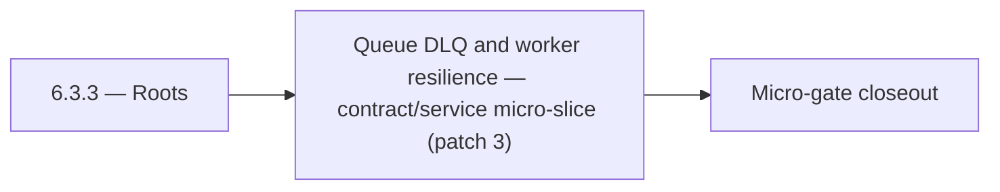

# 6.3.3 — Roots

- **Era:** `6.x` Reliability and Scaling — hub [`versions.md`](../versions.md) · minors start at [`6.0 — Reliability and Scaling era umbrella`](6.0%20%E2%80%94%20Reliability%20and%20Scaling%20era%20umbrella.md)
- **Minor:** [6.3 — Queue DLQ and worker resilience](./6.3 — Queue DLQ and worker resilience.md)
- **Codename:** Roots
- **Status:** planned

## Focus
Queue DLQ and worker resilience — contract/service micro-slice (patch 3)

## Flowchart

## Micro-gate

| Track | Gate question | Answer / Evidence (fill at patch closeout) |
| --- | --- | --- |
| **Contract** | SLO/SLI, idempotency, DLQ envelope, trace propagation — `docs/backend/apis/` + matrices updated? | Document at patch closeout. |
| **Service** | Retry/DLQ, rate limits, abuse guards, HF/SMTP/provider paths — smoke + caps documented? | Document smoke paths. |
| **Surface** | Ops dashboards, `/status`, degraded-mode UX — delta for this patch? | Document UX delta or N/A. |
| **Frontend** | Dashboard/extension reliability patterns (`components.md` Era 6) touched? | DLQ, replay authorization, worker graceful shutdown / stale recovery. Document at closeout. |
| **Data** | Lineage, retention, Redis/DB-backed idempotency state — migrations recorded? | Document lineage or N/A. |
| **Ops** | SLO panels, alerts, chaos/runbook refs (`queue-observability.md`, RC) — delta? | Document ops delta or N/A. |

## Tasks
### Contract
- 📌 Planned: **[appointment360]** — refine duplicate task (was: 📌 planned: graceful shutdown, dlq queue naming, redelivery p…) | patch `6.3.3` band `3` | reason: specialize this file vs sibling patches; see docs/codebases/appointment360-codebase-analysis.md
- 📌 Planned: **[appointment360]** — refine duplicate task (was: sse first-token latency p95 < 1s) | patch `6.3.3` band `3` | reason: specialize this file vs sibling patches; see docs/codebases/appointment360-codebase-analysis.md
- 📌 Planned: **[appointment360]** — refine duplicate task (was: 📌 planned: define sse stream error format: `data: {"error": …) | patch `6.3.3` band `3` | reason: specialize this file vs sibling patches; see docs/codebases/appointment360-codebase-analysis.md
- 📌 Planned: **[appointment360]** — refine duplicate task (was: 📌 planned: define slos for `save-profiles`:) | patch `6.3.3` band `3` | reason: specialize this file vs sibling patches; see docs/codebases/appointment360-codebase-analysis.md

### Service
- 📌 Planned: **[appointment360]** — refine duplicate task (was: 📌 planned: implement chat archival ttl: define max chat age;…) | patch `6.3.3` band `3` | reason: specialize this file vs sibling patches; see docs/codebases/appointment360-codebase-analysis.md
- 📌 Planned: **[appointment360]** — refine duplicate task (was: 📌 planned: move rate limiter to redis-backed distributed imp…) | patch `6.3.3` band `3` | reason: specialize this file vs sibling patches; see docs/codebases/appointment360-codebase-analysis.md
- 📌 Planned: **[appointment360]** — refine duplicate task (was: 📌 planned: implement `tokenbucketratelimiter` middleware (or…) | patch `6.3.3` band `3` | reason: specialize this file vs sibling patches; see docs/codebases/appointment360-codebase-analysis.md
- 📌 Planned: **[appointment360]** — refine duplicate task (was: 📌 planned: add circuit breaker / retry budget around connect…) | patch `6.3.3` band `3` | reason: specialize this file vs sibling patches; see docs/codebases/appointment360-codebase-analysis.md

### Surface

- 📌 Planned: **[connectra]** — Verify UX for route `/` and bindings (patch 6.3.3 band 3) | area: `frontend-page` | files: `contact360/dashboard/app/page.tsx` | reason: Dashboard/extension surface for era 6 must match gateway contracts

### Data

- 📌 Planned: **[appointment360]** — refine duplicate task (was: 📌 planned: **[appointment360]** — update postgresql/es/s3 li…) | patch `6.3.3` band `3` | reason: specialize this file vs sibling patches; see docs/codebases/appointment360-codebase-analysis.md

### Ops

- 📌 Planned: **[platform]** — Record smoke evidence, rollback, and alerts (patch band 3: surface/data) | area: `ops` | files: `docs/commands/`, `.github/workflows/` | reason: Smoke, rollback, and observability for patch 6.3.3

## Service task slices
> Merged from era `6.x` reliability/scaling task packs (P0→`.0`–`.2`, P1→`.3`–`.6`, Ops→`.7`–`.9`).

### Jobs
- Idempotent create proven by duplicate POST test (staging).
- At least one DLQ message successfully replayed with audit trail.
- Stale-processing sweeper verified in soak test.
- SLO panels + alert routes live; chaos drill documented.

### Emailcampaign
- Campaign of 100k recipients completes within SLO on staging environment.
- Duplicate campaign enqueue is silently deduplicated.
- Failed campaigns can be resumed from last checkpoint without re-sending to already-sent recipients.
- Prometheus endpoint exposes campaign metrics.

### Mailvetter
- Add retry-state indicators in progress UI.
- Add per-job error summary panel.
- Add `job_events` and `job_failures` tables.
- Add correlation IDs in job/result rows for traceability.
- Move rate limiter to Redis-backed distributed implementation.
- Add idempotency key support on bulk create endpoint.
- Add worker retry + dead-letter queue.
- Add clear `processing` and `failed` transitions for jobs.

### contact.ai
- Implement `AIErrorState` component: shows error type (timeout, rate limit, service unavailable) with retry CTA.
- Implement retry button: re-sends last failed message (cached in `AIChatContext`).
- Implement SSE reconnect in `useStreamMessage`: reconnect on stream abort with exponential backoff.
- Show `Retry-After` countdown in rate limit error state (use `RateLimitError.retryAfter`).
- Loading progress for long-running requests: indeterminate progress bar above chat input.
- Add `version` column to `ai_chats` for optimistic concurrency control.
- Define and document TTL / archival strategy: chats older than N days → archived or deleted.
- Add lineage note to `contact_ai_data_lineage.md`: archival lifecycle and compliance retention.
- Confirm `updated_at` timestamp is updated atomically with `messages` JSONB on every write.
- Add SSE stream error handling: catch Lambda timeout, HF stream abort; emit error event and close stream cleanly.
- Implement SSE client reconnect logic: `Last-Event-ID` support or state-based resume.
- Add optimistic lock (version column or ETag) to `ai_chats` to prevent concurrent message append races.
- Implement chat archival TTL: define max chat age; background Lambda to soft-delete stale chats.
- Add distributed tracing: AWS X-Ray or OTEL context propagation across Lambda invocations.
- Tune HF + Gemini retry budgets: max 2 retries on HF, then 1 Gemini attempt, then 503.
- Health endpoint improvements: `/health/db` must report connection pool state; add `/health/hf` for HF API reachability.

## Evidence gate
Patch closeout includes contract diff, smoke output, data lineage delta, and ops note
