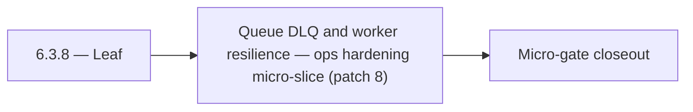

# 6.3.8 — Leaf

- **Era:** `6.x` Reliability and Scaling — hub [`versions.md`](../versions.md) · minors start at [`6.0 — Reliability and Scaling era umbrella`](6.0%20%E2%80%94%20Reliability%20and%20Scaling%20era%20umbrella.md)
- **Minor:** [6.3 — Queue DLQ and worker resilience](./6.3 — Queue DLQ and worker resilience.md)
- **Codename:** Leaf
- **Status:** planned

## Focus
Queue DLQ and worker resilience — ops hardening micro-slice (patch 8)

## Flowchart

## Micro-gate

| Track | Gate question | Answer / Evidence (fill at patch closeout) |
| --- | --- | --- |
| **Contract** | SLO/SLI, idempotency, DLQ envelope, trace propagation — `docs/backend/apis/` + matrices updated? | Document at patch closeout. |
| **Service** | Retry/DLQ, rate limits, abuse guards, HF/SMTP/provider paths — smoke + caps documented? | Document smoke paths. |
| **Surface** | Ops dashboards, `/status`, degraded-mode UX — delta for this patch? | Document UX delta or N/A. |
| **Frontend** | Dashboard/extension reliability patterns (`components.md` Era 6) touched? | DLQ, replay authorization, worker graceful shutdown / stale recovery. Document at closeout. |
| **Data** | Lineage, retention, Redis/DB-backed idempotency state — migrations recorded? | Document lineage or N/A. |
| **Ops** | SLO panels, alerts, chaos/runbook refs (`queue-observability.md`, RC) — delta? | Document ops delta or N/A. |

## Tasks
### Ops
- 📌 Planned: **[appointment360]** — refine duplicate task (was: 📌 planned: wire distributed tracing: x-ray sdk in lambda, tr…) | patch `6.3.8` band `8` | reason: specialize this file vs sibling patches; see docs/codebases/appointment360-codebase-analysis.md
- 📌 Planned: **[appointment360]** — refine duplicate task (was: 📌 planned: lambda memory and timeout tuning: benchmark with …) | patch `6.3.8` band `8` | reason: specialize this file vs sibling patches; see docs/codebases/appointment360-codebase-analysis.md
- 📌 Planned: **[appointment360]** — refine duplicate task (was: 📌 planned: runbook: steps to handle hf api outage (switch to…) | patch `6.3.8` band `8` | reason: specialize this file vs sibling patches; see docs/codebases/appointment360-codebase-analysis.md
- 📌 Planned: **[appointment360]** — refine duplicate task (was: 📌 planned: alerts on queue lag, error rate, webhook failure …) | patch `6.3.8` band `8` | reason: specialize this file vs sibling patches; see docs/codebases/appointment360-codebase-analysis.md

### Contract

- 📌 Planned: **[appointment360]** — Diff and document schema for operations like ConnectraClient, LAMBDA_AI_API_URL, LAMBDA_CONNECTRA_API_URL; align with roadmap | area: `backend-api` | files: `docs/backend/apis/*.md`, `contact360.io/api/app/graphql/schema.py` | reason: Keep GraphQL/REST contracts aligned for era 6.8 patch 6.3.8

### Service

- 📌 Planned: **[appointment360]** — refine duplicate task (was: 📌 planned: **[appointment360]** — service slice: - [x] ✅ com…) | patch `6.3.8` band `8` | reason: specialize this file vs sibling patches; see docs/codebases/appointment360-codebase-analysis.md

### Surface

- 📌 Planned: **[connectra]** — Verify UX for route `/` and bindings (patch 6.3.8 band 8) | area: `frontend-page` | files: `contact360/dashboard/app/page.tsx` | reason: Dashboard/extension surface for era 6 must match gateway contracts

### Data

- 📌 Planned: **[appointment360]** — refine duplicate task (was: 📌 planned: **[appointment360]** — update postgresql/es/s3 li…) | patch `6.3.8` band `8` | reason: specialize this file vs sibling patches; see docs/codebases/appointment360-codebase-analysis.md

## Service task slices
> Merged from era `6.x` reliability/scaling task packs (P0→`.0`–`.2`, P1→`.3`–`.6`, Ops→`.7`–`.9`).

### Jobs
- Idempotent create proven by duplicate POST test (staging).
- At least one DLQ message successfully replayed with audit trail.
- Stale-processing sweeper verified in soak test.
- SLO panels + alert routes live; chaos drill documented.

### Emailcampaign
- Campaign of 100k recipients completes within SLO on staging environment.
- Duplicate campaign enqueue is silently deduplicated.
- Failed campaigns can be resumed from last checkpoint without re-sending to already-sent recipients.
- Prometheus endpoint exposes campaign metrics.

### Mailvetter
- Autoscaling policy based on Redis queue depth.
- Alerts on queue lag, error rate, webhook failure rate.
- Chaos test for Redis outage and DB transient failures.

### contact.ai
- Wire distributed tracing: X-Ray SDK in Lambda, trace propagation to HF/Gemini calls.
- Add alerting: PagerDuty/SNS alert on p95 latency breach and `503` rate spike.
- Lambda memory and timeout tuning: benchmark with production-scale message histories.
- Add contact.ai to the SLO dashboard (alongside jobs, emailapis, connectra).
- Runbook: steps to handle HF API outage (switch to Gemini-only mode, disable streaming).

## Evidence gate
Patch closeout includes contract diff, smoke output, data lineage delta, and ops note
