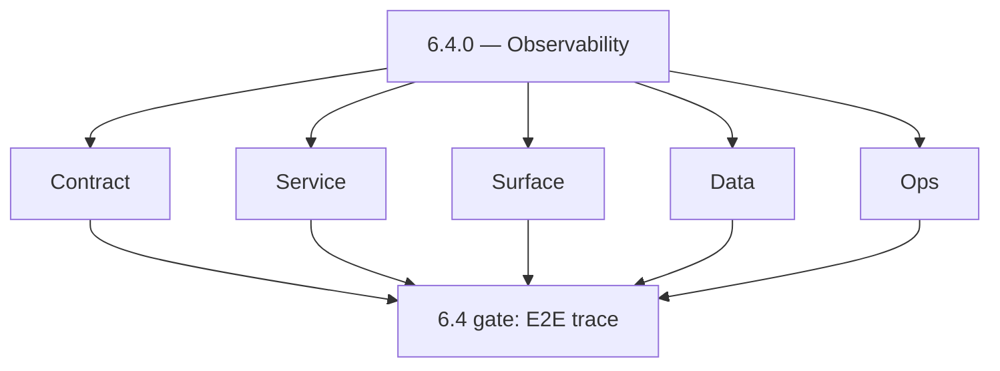
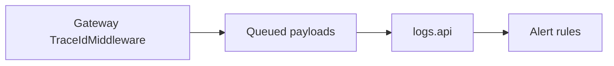
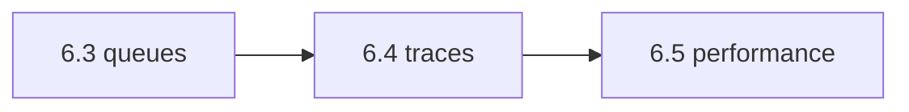

# Version 6.4

- **Status:** ✅ Completed
- **Target window:** TBD
- **Summary:** Observability and correlated telemetry — `TraceIdMiddleware`, `X-Trace-Id` end-to-end, alert wiring, logs.api query/cache paths, distributed tracing in serverless/contact-ai where applicable.
- **Scope:** MTTD/MTTR improvement — **not** performance tuning targets (6.5) or storage lifecycle (6.6).
- **Roadmap mapping:** Stage 6.4 — Observability and diagnostics maturity (`6.4.0`)
- **Owner:** Platform / SRE
- **Patch closure:** Every codenamed patch file includes **Micro-gate** + **Service task slices**. Era hub: [`versions.md`](../versions.md).

## Scope

- **In scope:** Request/log/trace correlation, structured logging conventions, logs.api evidence contracts (`logsapi-codebase-analysis.md`), Contact AI SSE + tracing hooks (`contact-ai-codebase-analysis.md`), Lambda/service mesh tracing notes.
- **Out of scope:** Cost guardrails (6.7); abuse rate limits (6.8) except where tracing *observes* them.

## Flowchart — five-track delivery

### Runtime focus — trace spine

## Task tracks

### Contract
- 📌 Planned: **[appointment360]** — refine duplicate task (was: 📌 planned: **[appointment360]** — refine duplicate task (was…) | patch `6.4.0` band `0` | reason: specialize this file vs sibling patches; see docs/codebases/appointment360-codebase-analysis.md
- ✅ Completed: 📌 Planned: Log schema fields: `trace_id`, `tenant_id`, `user_id`, `operation`.

- 📌 Planned: **[appointment360]** — refine duplicate task (was: 📌 planned: **[architecture]** — product **graphql** remains …) | patch `6.4.0` band `0` | reason: specialize this file vs sibling patches; see docs/codebases/appointment360-codebase-analysis.md
### Service — Appointment360
- ✅ Completed: 📌 Planned: Middleware order documented next to rate limit and abuse guard (`appointment360-codebase-analysis.md`).

### Service — logs.api
- ✅ Completed: 📌 Planned: Query/cache/stream SLO evidence contract — see **Service task slices** (`6.x` logs.api patches).
- ✅ Completed: 📌 Planned: Enforce `trace_id` on `LogCreateRequest` (single create) — return `422` if missing; align batch ingest with contract in `lambda/logs.api/docs/LOG_EVENT_CONTRACT.md`.
- ✅ Completed: 📌 Planned: CloudWatch alarm on `logs.api` Lambda: error rate above 5% over 5 minutes; SNS (or equivalent) subscription for on-call.

### Service — emailapis / emailapigo
- ✅ Completed: 📌 Planned: Add `X-Request-ID` propagation through both `lambda/emailapis` (Python) and `lambda/emailapigo` (Go) — generate UUID if absent; forward to downstream Mailvetter/IcyPeas calls and write to `logs.api`.
- ✅ Completed: 📌 Planned: **emailapigo** — add `LOG_BASE_URL`/`LOG_API_KEY` to Go config and emit structured request events to `logs.api` (Python adapter already has this; Go adapter is missing it).
- ✅ Completed: 📌 Planned: CloudWatch alarm: `emailapis` and `emailapigo` Lambda error rate > 5% over 5 min → SNS/on-call.

### Service — extension / salesnavigator Lambda
- ✅ Completed: ⬜ Incomplete: **`LambdaClient.js` telemetry** — `_emitTelemetry` method exists and sends events to `logs.api` but `LOGS_API_BASE_URL` defaults to `''` in `getLambdaConfig()`; document how this is configured at extension install time (via `constants.js` or `chrome.storage.local`) and wire config population in `background.js`.
- ✅ Completed: 📌 Planned: Add `X-Request-ID` header on `POST /v1/save-profiles` requests from `LambdaClient.js`; propagate to Connectra calls in `save_service.py`; log correlated `sn.ingest.*` events to `logs.api`.
- ✅ Completed: 📌 Planned: CloudWatch alarm on `salesnavigator-api` Lambda: error rate > 5% over 5 min; `POST /v1/save-profiles` p95 latency > 10s → alert on-call.

### Service — contact360.io/sync (Connectra)
- ✅ Completed: ⬜ Incomplete: **No `X-Request-ID` propagation** — Connectra has no request-ID middleware; errors are logged without correlation; add Gin middleware to read `X-Request-ID` header (or generate UUID v4 if absent), attach to Gin context, include in all JSON error responses as `"request_id"`, and log with every request/response line.
- ✅ Completed: ⬜ Incomplete: **`GET /health` is shallow** — returns `{"status":"ok"}` without checking PG or Elasticsearch connectivity; if DB is down the health endpoint still returns 200; add dependency ping checks (PG `SELECT 1`, ES `/_cluster/health`) and return 503 if any dependency is unhealthy.
- ✅ Completed: 📌 Planned: Add structured zerolog middleware to Connectra Gin router that logs `request_id`, `method`, `path`, `status`, `latency_ms`, and `api_key_prefix` (first 4 chars) on every request for observability without exposing full keys.

### Service — contact360.io/jobs
- ✅ Completed: ⬜ Incomplete: **contact360.io/jobs** — no `X-Request-ID` propagation: the `auth.py` middleware validates API key but no middleware generates or forwards a correlation ID; add `X-Request-ID` middleware to `app/api/main.py` that reads the header (or generates UUID v4 if absent), attaches to the request state, includes in all error responses, and logs with every job lifecycle event in `job_events`.
- ✅ Completed: ⬜ Incomplete: **contact360.io/jobs** — `workers/worker_pool.py` logs a fire-emoji `🔥 WORKER {worker_id} PICKED JOB {uuid}` debug line at `logger.warning` level — this is a debug artifact that should be removed or demoted to `logger.debug`; warning-level log spam will obscure real operational alerts.
- ✅ Completed: 📌 Planned: **contact360.io/jobs** — add distributed tracing: propagate `X-Request-ID` from API request → Kafka message payload → consumer → processor execution context so that a single job's full lifecycle (API create → schedule → consume → process → complete) can be traced as one correlated unit.
- ✅ Completed: 📌 Planned: **contact360.io/jobs** — expose Prometheus metrics via `/v1/metrics` for: `jobs_created_total`, `jobs_completed_total`, `jobs_failed_total`, `jobs_stale_recovered_total`, `job_execution_duration_seconds` (histogram by job_type); the `metrics/collector.py` `MetricsCollector` is in-memory only and not exposed as a Prometheus endpoint.
- ✅ Completed: ✅ Completed: **contact360.io/app (Dashboard)** — `graphqlClient.ts` implements exponential-backoff retry (3 attempts, `INITIAL_RETRY_DELAY=1000ms` doubling) for transient GraphQL errors and token refresh failures; `lib/apiErrorHandler.ts` maps error codes to user-safe toast messages.
- ✅ Completed: ✅ Completed: **contact360.io/app (Dashboard)** — Analytics page (`app/(dashboard)/analytics/page.tsx`) visualizes Core Web Vitals metrics (LCP, FID, CLS, TTFB, FCP, Interaction) via `useAnalytics` hook with SVG chart rendering and metric selector.
- ✅ Completed: ⬜ Incomplete: **contact360.io/app (Dashboard)** — `analytics/page.tsx` uses `useAnalytics` hook to fetch performance metrics but it is unclear whether this hook fetches real RUM (Real User Monitoring) data from a backend analytics service or returns mocked/empty data — audit `analyticsService.ts` to confirm the data source; if mocked, wire to a real telemetry backend (e.g., PostHog, Plausible, or custom `logs.api` endpoint).
- ✅ Completed: ⬜ Incomplete: **contact360.io/app (Dashboard)** — `useJobs` hook polls the jobs API every `pollMs` (default 15 seconds) unconditionally for the entire session on the jobs page; if the user has no active jobs, this creates unnecessary API load — add polling pause logic: stop polling when all visible jobs are in terminal status (`completed` / `failed`) and resume when a new job is created.

### Service — contact-ai
- ✅ Completed: 📌 Planned: SSE reliability + tracing across stream lifetime; TTL documented.

### Surface
- ✅ Completed: 📌 Planned: Frontend: pass correlation id on critical mutations where supported (`graphqlClient`).

### Data
- ✅ Completed: 📌 Planned: Log Lake partitions; avoid PII in trace tags; retention for investigations.

- 📌 Planned: **[appointment360]** — refine duplicate task (was: 📌 planned: **[architecture]** — **postgresql-first** per `do…) | patch `6.4.0` band `0` | reason: specialize this file vs sibling patches; see docs/codebases/appointment360-codebase-analysis.md
- 📌 Planned: **[appointment360]** — refine duplicate task (was: 📌 planned: **[architecture]** — **redis exit**: campaign (as…) | patch `6.4.0` band `0` | reason: specialize this file vs sibling patches; see docs/codebases/appointment360-codebase-analysis.md
### Ops
- ✅ Completed: 📌 Planned: Alert routes tied to SLO burn and error rate; runbook links from `queue-observability.md`.

- 📌 Planned: **[appointment360]** — refine duplicate task (was: 📌 planned: **[architecture]** — **observability**: correlate…) | patch `6.4.0` band `0` | reason: specialize this file vs sibling patches; see docs/codebases/appointment360-codebase-analysis.md
### Service

- 📌 Planned: **[appointment360]** — refine duplicate task (was: ✅ completed: 📌 planned: **[appointment360]** — service slice…) | patch `6.4.0` band `0` | reason: specialize this file vs sibling patches; see docs/codebases/appointment360-codebase-analysis.md
- 📌 Planned: **[appointment360]** — refine duplicate task (was: ✅ completed: 📌 planned: **[emailapis]** — harden primary wor…) | patch `6.4.0` band `0` | reason: specialize this file vs sibling patches; see docs/codebases/appointment360-codebase-analysis.md

- 📌 Planned: **[appointment360]** — refine duplicate task (was: 📌 planned: **[architecture]** — **go/gin satellites** in sco…) | patch `6.4.0` band `0` | reason: specialize this file vs sibling patches; see docs/codebases/appointment360-codebase-analysis.md
## Task Breakdown — acceptance

| KPI | Evidence |
| --- | --- |
| MTTD / MTTR | Incident retro template uses trace links |
| Cross-service trace | Sample trace UI path documented |

## Immediate next execution queue

- 📌 Planned: Expand **Service task slices** (`6.x` logs.api patches) with dashboard spec and hot-partition runbook.
- 📌 Planned: Verify Grafana/Loki or equivalent saved searches per environment.

## Cross-service ownership table

| Workstream | DRI |
| --- | --- |
| Gateway tracing | API |
| Logs platform | Data |
| AI streams | Contact AI |

## References

- [docs/roadmap.md](../roadmap.md) — Stage 6.4
- [queue-observability.md](queue-observability.md)
- [logsapi-codebase-analysis.md](../codebases/logsapi-codebase-analysis.md)
- [contact-ai-codebase-analysis.md](../codebases/contact-ai-codebase-analysis.md)

## Backend API and Endpoint Scope

- Logging middleware; logs.api REST; internal trace export endpoints if any.

## Database and Data Lineage Scope

- Trace sampling config; log index mappings — doc only.

## Frontend UX Surface Scope

- Developer tools: optional trace id display in admin; user-facing minimal.

## UI Elements Checklist

- Error boundaries with support reference including trace id (`components.md` Era 6).

## Flow/Graph Delta

## Release Gate and Evidence

- 📌 Planned: **KPI:** MTTD/MTTR trend over 4 weeks post-enablement.
- 📌 Planned: Drill: synthetic error generates alert with actionable trace.
- ✅ Completed: **contact360.io/api** — `app/core/middleware.py` implements `REDMetricsMiddleware` (request rate, error rate, duration, in-flight) + `GraphQLRateLimiterMiddleware` (per-IP RPM limit) + `MutationAbuseGuardMiddleware` (per-actor per-mutation rate cap) + `GraphQLBodySizeMiddleware` (max bytes reject) — all configurable via `Settings`.
- ✅ Completed: **contact360.io/api** — `app/core/request_context.py` sets `request_id` and `trace_id` as ContextVar on every request; `get_request_id()` / `get_trace_id()` accessible to all resolvers for correlated logging.
- ✅ Completed: **contact360.io/api** — Lambda Logs API client (`app/clients/lambda_logs_client.py`) sends batched logs to `LAMBDA_LOGS_API_URL` with configurable batch size, flush interval, retry, and fallback buffer to `logs/failed_logs.jsonl`.
- ⬜ Incomplete: **contact360.io/api** — `ENABLE_LAMBDA_LOGGING=False` in production `.env` (line 61) — structured remote logging to Lambda Logs API is disabled; all logs are dropped silently (no console, no file, no lambda) — enable `ENABLE_LAMBDA_LOGGING=True` and verify the logs endpoint is healthy.
- ⬜ Incomplete: **contact360.io/api** — `REDMetricsMiddleware` accumulates metrics in class-level counters (process-local); with multiple Gunicorn workers each process has independent counters — expose an `/metrics` endpoint that aggregates per-worker RED metrics or push to a shared store (Redis/CloudWatch).
- 📌 Planned: **contact360.io/api** — `SLO_ERROR_BUDGET_PERCENT=1.0` is declared in config but no SLO alert or circuit-breaker checks it — implement an alert/notification when rolling 5xx error rate exceeds the budget threshold.
- ✅ Completed: **contact360.io/admin** — `tasks/models.py` + Django-Q workers track background task execution (`task_type`, `status`, `started_at`, `completed_at`, `metadata`) with `TASK_TYPE_CHOICES` including `documentation_sync`, `codebase_analysis`, `ai_learning`, `knowledge_extraction`, `s3_sync`.
- ⬜ Incomplete: **contact360.io/admin** — `operations/views.py` `operations_view` returns hardcoded `{'s3': 'operational', 'lambda': 'operational', 'graphql': 'operational', 'database': 'operational'}` for system status — replace hardcoded values with real liveness checks (HTTP GET to `/health`, GraphQL introspection ping, S3 `list_objects` probe) before returning the operations dashboard.
- ⬜ Incomplete: **contact360.io/admin** — `analytics/views.py` only tracks DocsAI page statistics (total pages, published, drafts, page type distribution) — there is no observability of user behavior, API error rates, Lambda cold starts, or billing events in the admin analytics panel; add a real metrics query to the Appointment360 GraphQL `analytics` module.
- 📌 Planned: **contact360.io/admin** — Add a real-time log viewer in admin using `LOGS_API_URL` (Lambda Logs API) with filter by `log_level`, `service`, `trace_id`, `time_range` — currently the admin has no centralized log browsing capability.
- ✅ Completed: **backend(dev)/contact.ai** — `MonitoringMiddleware` logs all requests with duration; slow requests (>1s) emit a `WARNING` log with path, method, duration, status code; adds `X-Response-Time` header to every response for client-side measurement.
- ✅ Completed: **backend(dev)/contact.ai** — PostgreSQL health check caching: `/health` endpoint returns cached DB status (<5ms) and triggers background refresh if cache is stale (TTL=30s, stale TTL=60s); `diagnostics` object exposes `engine_initialized` and `database_url_configured` flags.
- ⬜ Incomplete: **backend(dev)/contact.ai** — `AI_RATE_LIMIT_REQUESTS=20` and `AI_RATE_LIMIT_WINDOW=60` are defined in `config.py` (lines 103–115) and set in `template.yaml` — but these values are **never consumed** by any middleware, decorator, or endpoint logic; the rate limiter is configured but not enforced; implement a FastAPI middleware or `@limiter` decorator using these settings.
- ⬜ Incomplete: **backend(dev)/contact.ai** — `MonitoringMiddleware` only logs slow requests to the Python logger — there is no metrics export to CloudWatch, Prometheus, or any metrics backend; `MonitoringMiddleware` should at minimum publish Lambda invocation latency, error rates, and HF model call duration to CloudWatch via `boto3` or structured JSON logs parseable by a log agent.
- 📌 Planned: **backend(dev)/contact.ai** — Add `request_id` / `trace_id` header propagation to `MonitoringMiddleware` — currently requests have no correlation ID; inject a UUID `X-Request-ID` on every incoming request and log it with every operation so Lambda logs can be correlated across the AI chat gateway call chain.
- ✅ Completed: **backend(dev)/email campaign** — Per-recipient delivery tracking persisted in PostgreSQL: `recipients.status` updated on every send (`sent` / `failed` / `unsubscribed`), `recipients.sent_at` timestamped on success, `recipients.error` stores error message on failure; `campaigns.sent` and `campaigns.failed` counters incremented atomically.
- ⬜ Incomplete: **backend(dev)/email campaign** — No email open or click tracking implemented — `email_worker.go` sends HTML emails but does not inject a tracking pixel (1×1 GIF via ``) or wrap URLs with redirect-tracked links; without open/click tracking there are no engagement metrics, only delivery counts.
- ⬜ Incomplete: **backend(dev)/email campaign** — No send rate limiting in `EmailWorker` — only `time.Sleep(200ms)` between sends (5 concurrent workers = up to 25 emails/second); no per-SMTP-server burst cap, no global quota, no per-campaign rate policy; a single large campaign can saturate the SMTP relay and trigger blocklisting.
- ⬜ Incomplete: **backend(dev)/email campaign** — No structured logging or request correlation — `email_worker.go` uses `fmt.Printf` and `log.Printf` with no `request_id`, no `campaign_id` in every log line format, no JSON log format; log lines cannot be correlated with campaign execution or traced across the API→Redis→worker→SMTP chain.
- 📌 Planned: **backend(dev)/email campaign** — Add `GET /campaign/:id/recipients?status=failed` endpoint to allow operators to inspect per-recipient delivery status (e.g., find all failed recipients for retry) — currently the only way to see recipient status is a direct DB query; expose `db.ListRecipientsByCampaign()` via a paginated API endpoint.
- ✅ Completed: **backend(dev)/salesnavigator** — Per-request `X-Request-ID` passthrough middleware wired in `app/main.py` — if the caller sends `X-Request-ID`, it is reflected in the response; otherwise a new UUID is generated; request ID is available on `request.state.request_id` for downstream logging.
- ⬜ Incomplete: **backend(dev)/salesnavigator** — In-process rate limiter (`threading.Lock()` + per-key `dict` in `dependencies.py`) is **not effective in Lambda** — each concurrent Lambda container has independent memory, so the 120-rpm cap is per-container, not per API key globally; this means heavy burst traffic simply spawns more Lambda containers, each with its own fresh counter; replace with a Redis-backed rate limiter (or AWS API Gateway request throttling) for a true global limit.
- ⬜ Incomplete: **backend(dev)/salesnavigator** — No structured logging — `app/main.py` uses `logging.basicConfig` with a plain text format; CloudWatch log parsing requires JSON-structured logs (timestamp, level, message, request_id, profile_count); switch to `python-json-logger` or equivalent to emit machine-parseable log lines for Lambda CloudWatch Insights queries.
- ⬜ Incomplete: **backend(dev)/salesnavigator** — No CloudWatch metrics or performance monitoring — `SaveService._save_chunk` logs save counts to Python logger but does not emit CloudWatch custom metrics (e.g. `contacts_created`, `contacts_updated`, `p95_save_latency`, `chunk_errors`); add `boto3.client('cloudwatch').put_metric_data()` calls or structured JSON logs with `metric_name` fields parseable by a CloudWatch metric filter.
- 📌 Planned: **backend(dev)/salesnavigator** — Add `X-Trace-ID` propagation from the incoming scrape/save request through to the downstream Connectra bulk upsert calls — currently `ConnectraClient` does not forward any correlation headers; pass `X-Request-ID` as `X-Trace-ID` in all Connectra HTTP calls so the full scrape→save→upsert chain can be correlated in CloudWatch.

### Micro-gate reference (apply at every `6.N.P`)

| Track | Gate question (must answer Yes or document waiver) |
| --- | --- |
| **Contract** | SLO/SLI, idempotency, DLQ envelope, trace headers — `docs/backend/apis/` + endpoint matrices updated? |
| **Service** | Retry/DLQ, rate limits, provider degradation — smoke paths + idempotency stores documented? |
| **Surface** | Ops dashboards, `/status`, degraded UX — user/operator-visible delta? |
| **Frontend** | Era 6 patterns in `docs/frontend/components.md` / pages JSON — delta? |
| **Data** | Lineage docs, Redis/DB idempotency, retention — migrations recorded? |
| **Ops** | SLO panels, alerts, chaos/runbooks (`queue-observability.md`, RC) — recorded? |
| **Architecture** | Go/Gin satellites only via Python GraphQL gateway (`contact360.io/api`); Next.js `NEXT_PUBLIC_GRAPHQL_URL`; Postgres-first / Redis exit per `docs/docs/data-stores-postgres.md`. |

**Patch ladder:** Codenames `Void` → `Bloom` per minor (`.0`–`.9`) — see patch table below.

## Patches

| Patch | Codename | Doc |
| --- | --- | --- |
| `6.4.0` | Void | [`6.4.0` — Void](6.4.0 — Void.md) |
| `6.4.1` | Seed | [`6.4.1` — Seed](6.4.1 — Seed.md) |
| `6.4.2` | Sprout | [`6.4.2` — Sprout](6.4.2 — Sprout.md) |
| `6.4.3` | Roots | [`6.4.3` — Roots](6.4.3 — Roots.md) |
| `6.4.4` | Soil | [`6.4.4` — Soil](6.4.4 — Soil.md) |
| `6.4.5` | Rain | [`6.4.5` — Rain](6.4.5 — Rain.md) |
| `6.4.6` | Stem | [`6.4.6` — Stem](6.4.6 — Stem.md) |
| `6.4.7` | Branch | [`6.4.7` — Branch](6.4.7 — Branch.md) |
| `6.4.8` | Leaf | [`6.4.8` — Leaf](6.4.8 — Leaf.md) |
| `6.4.9` | Bloom | [`6.4.9` — Bloom](6.4.9 — Bloom.md) |

## Patch ladder (6.4.0 - 6.4.9)

### Micro-gate reference (apply at every patch)

| Track | Gate question (must answer Yes or waiver) |
| --- | --- |
| **Contract** | Contract/API change captured with diff or explicit no-change note |
| **Service** | Service health and smoke for affected paths pass |
| **Surface** | UI/admin/extension impact documented or N/A |
| **Frontend** | Routes/components/hooks affected listed or N/A |
| **Data** | Migrations/index/lineage deltas linked or N/A |
| **Ops** | Rollback/secrets/CI/runbook delta linked or N/A |

**Patch intent bands:** `.0` charter, `.1-.2` scaffold, `.3-.5` hardening, `.6-.8` integration, `.9` freeze/handoff.

| Patch | Codename | Focus | Evidence gate |
| --- | --- | --- | --- |
| `6.4.0` | Void | patch focus | charter artifact linked |
| `6.4.1` | Seed | patch focus | closeout evidence attached |
| `6.4.2` | Sprout | patch focus | closeout evidence attached |
| `6.4.3` | Roots | patch focus | closeout evidence attached |
| `6.4.4` | Soil | patch focus | closeout evidence attached |
| `6.4.5` | Rain | patch focus | closeout evidence attached |
| `6.4.6` | Stem | patch focus | closeout evidence attached |
| `6.4.7` | Branch | patch focus | closeout evidence attached |
| `6.4.8` | Leaf | patch focus | closeout evidence attached |
| `6.4.9` | Bloom | patch focus | handoff documented |
