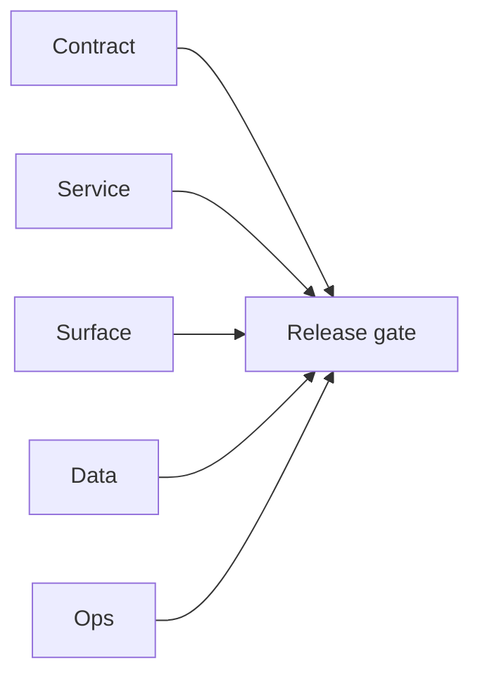

# 6.4.100 - Docker Go readiness smoke evidence

## Focus

Docker runtime readiness verification for `s3storage`, `ai`, and `logsapi` services under era `6.4`.

## Micro-gate

- `s3storage`:
  - `GET /api/v1/health` => `200` in `0.033908s`
  - `GET /api/v1/health/ready` => `503` in `0.012579s` (`S3STORAGE_BUCKET not set`)
- `ai`:
  - `GET /health` => `200` in `0.019502s`
  - `GET /health/ready` => `503` in `0.014414s` (`HF_API_KEY not configured`)
- `logsapi`:
  - `GET /health` => `200` in `0.020882s`
  - `GET /logs?limit=5` => `200` in `0.024331s` (empty data payload)

## Tasks

### Contract

- [ ] Treat readiness env requirements as release gates in docker profiles (`S3STORAGE_BUCKET`, `HF_API_KEY`).

### Service

- [ ] Improve readiness responses with explicit remediation hint links for missing env values.

### Surface

- [ ] Display readiness dependency state in operator panel with direct env key references.

### Data

- [ ] Add deterministic seed bucket for `s3storage` docker profile to avoid `NoSuchBucket` follow-up errors.

### Ops

- [ ] Introduce docker smoke stage that fails CI when liveness is green but readiness remains red for missing mandatory envs.

## Evidence gate

- `tmp/evidence/docker-go/s3-health.txt`
- `tmp/evidence/docker-go/s3-ready.txt`
- `tmp/evidence/docker-go/ai-health.txt`
- `tmp/evidence/docker-go/ai-ready.txt`
- `tmp/evidence/docker-go/log-health.txt`
- `tmp/evidence/docker-go/log-list.txt`

## Flowchart

Five-track delivery (contract / service / surface / data / ops) for this doc:

**Master hub:** [`docs/docs/flowchart.md`](../docs/flowchart.md) — cross-system diagrams and era strip (`0.x` → `10.x`).
