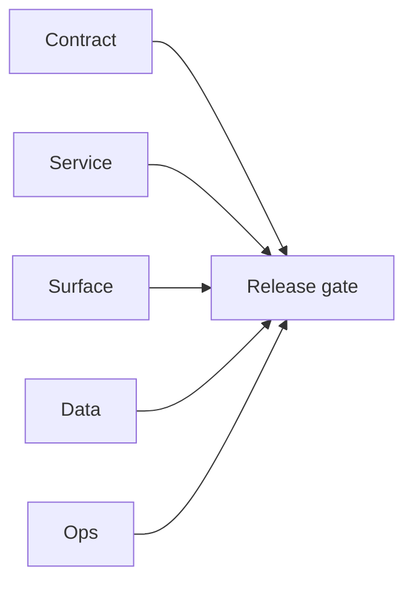

## Focus

Local reliability smoke evidence for `s3storage`, `logsapi`, and `ai` services tied to era `6.4` observability readiness.

## Micro-gate

- `s3storage`:
  - `/api/v1/health` => `200`
  - `/api/v1/health/ready` => `503` (`S3STORAGE_BUCKET not set`)
  - `/api/v1/analysis/schema` => `500` (`NoSuchBucket`)
  - `/api/v1/analysis/stats` => `500` (`NoSuchBucket`)
- `logsapi`:
  - `/logs?limit=5&level=info` => `200` with empty data
  - `/logs/search?...` => `200` with empty data
- `ai`:
  - `/health` => `200`
  - `/health/ready` => `503` (`HF_API_KEY not configured`)
  - `/ai-chats/` => `200` (empty list)

## Tasks

### Contract

- [ ] Document readiness dependencies as hard requirements (`S3STORAGE_BUCKET`, `HF_API_KEY`).

### Service

- [ ] Ensure readiness failures are mirrored in runbooks and startup checks for local/CI envs.

### Surface

- [ ] Expose readiness failure reasons in operator UI panels so teams can distinguish config gaps from runtime regressions.

### Data

- [ ] Provision dev bucket and verify S3 object introspection endpoints return deterministic empty-but-valid responses.

### Ops

- [ ] Add preflight config validator to block smoke runs when mandatory readiness env vars are absent.

## Evidence gate

- `tmp/evidence/s3storage/health.json`
- `tmp/evidence/s3storage/health_ready.json`
- `tmp/evidence/s3storage/schema_noauth.json`
- `tmp/evidence/s3storage/stats_noauth.json`
- `tmp/evidence/logsapi/get_logs.json`
- `tmp/evidence/logsapi/search_logs.json`
- `tmp/evidence/ai/health.json`
- `tmp/evidence/ai/health_ready.json`
- `tmp/evidence/ai/ai_chats_get.json`

## Flowchart

Five-track delivery (contract / service / surface / data / ops) for this doc:

**Master hub:** [`docs/docs/flowchart.md`](../docs/flowchart.md) — cross-system diagrams and era strip (`0.x` → `10.x`).
