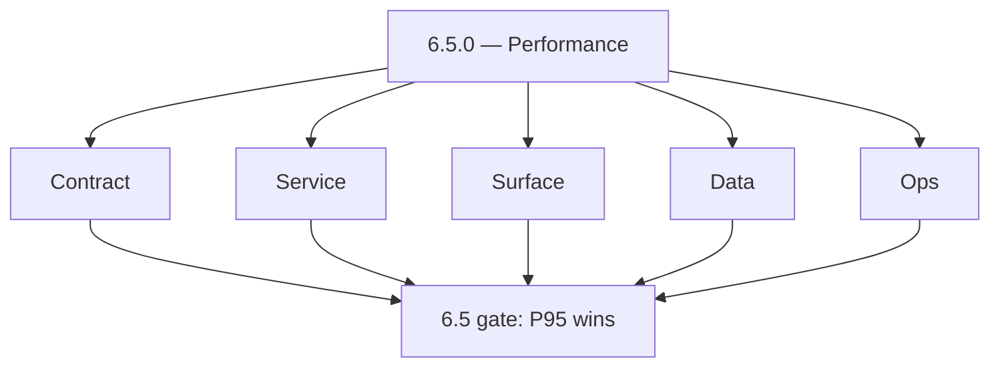
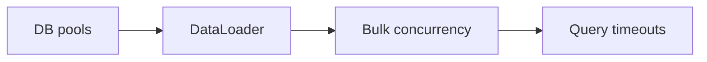
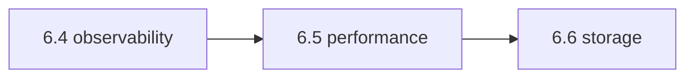
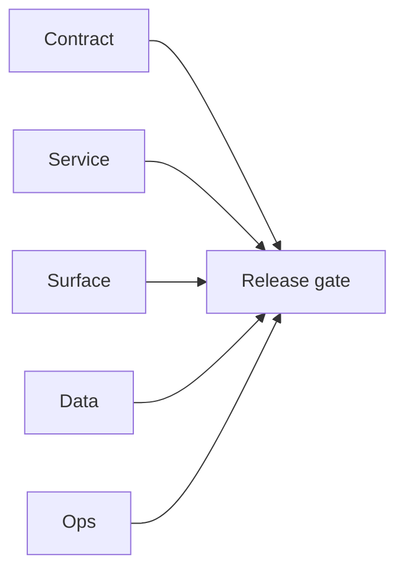

# Version 6.5

- **Status:** ✅ Completed
- **Target window:** TBD
- **Summary:** Performance and latency wave — API P95 targets, Connectra query P95 SLO, bulk concurrency caps, `DATABASE_POOL_SIZE`, DataLoader N+1 audits, `GRAPHQL_QUERY_TIMEOUT`, Emailapis circuit timeouts.
- **Scope:** Latency and throughput — **not** cost caps (6.7) or abuse walls (6.8).
- **Roadmap mapping:** Stage 6.5 — Performance optimization wave (`6.5.0`)
- **Owner:** Platform / service DRIs
- **Patch closure:** Every codenamed patch file includes **Micro-gate** + **Service task slices**. Era hub: [`versions.md`](../versions.md).

## Scope

- **In scope:** Hot path profiling, connection pool tuning, bulk send parallelism (`emailapis-codebase-analysis.md`), Connectra search GraphQL P95 (`connectra-codebase-analysis.md`), gateway query timeouts.
- **Out of scope:** S3 lifecycle (6.6); bill shock throttles (6.7).

## Flowchart — five-track delivery

### Runtime focus — latency

## Task tracks

### Contract
- ✅ Completed: 📌 Planned: **[appointment360]** — refine duplicate task (was: 📌 planned: **[appointment360]** — refine duplicate task (was…) | patch `6.5.0` band `0` | reason: specialize this file vs sibling patches; see docs/codebases/appointment360-codebase-analysis.md

- ✅ Completed: 📌 Planned: **[appointment360]** — refine duplicate task (was: 📌 planned: **[architecture]** — product **graphql** remains …) | patch `6.5.0` band `0` | reason: specialize this file vs sibling patches; see docs/codebases/appointment360-codebase-analysis.md
### Service — Connectra
- ✅ Completed: ✅ Completed: 📌 Planned: Query P95 SLO; ES vs PG path latency budgets (**Service task slices** in `6.x` patches — Connectra).

### Service — Appointment360
- ✅ Completed: ✅ Completed: 📌 Planned: `GRAPHQL_QUERY_TIMEOUT`, pool size, rate limit interplay documented.

### Service — extension / salesnavigator Lambda
- ✅ Completed: ✅ Completed: ⬜ Incomplete: **`save_service.py` chunk size** — `CHUNK_SIZE = 500` and `MAX_PARALLEL_CHUNKS = 3` are hardcoded constants; extract to `Settings` or environment variables so they can be tuned per Connectra capacity without code deploy.
- ✅ Completed: ✅ Completed: 📌 Planned: **`LambdaClient.js` batch tuning** — `OPTIMAL_BATCH_SIZE: 100`, `MIN_BATCH_SIZE: 10`, `batchTimeout: 1000ms` are hardcoded; expose via `constants.js` / `chrome.storage.local` to allow extension-side tuning.
- ✅ Completed: ✅ Completed: 📌 Planned: Add p95 target for `POST /v1/save-profiles` with 25-profile batch (< 3s) and 500-profile batch (< 15s); wire as CloudWatch alarm on `salesnavigator-api` Lambda.
- ✅ Completed: ✅ Completed: 📌 Planned: **Connectra cold-start** — Lambda cold start on first `POST /v1/save-profiles` may take > 5s; document warm-up strategy (scheduled EventBridge ping) or provisioned concurrency for production.

### Service — contact360.io/sync (Connectra)
- ✅ Completed: ✅ Completed: ⬜ Incomplete: **Rate limiter is global, not per-API-key** — `rateMiddleware.go` uses a single package-level token bucket shared by all callers; a single high-traffic client can exhaust the limit for all others; refactor to a per-API-key `sync.Map` of token buckets so each key has its own rate budget.
- ✅ Completed: ✅ Completed: ⬜ Incomplete: **Stale job recovery interval hardcoded** — `jobs.go` `StaleJobRecovery` uses `time.NewTicker(5 * time.Minute)` hardcoded; make this configurable via `conf.JobConfig` (e.g. `STALE_JOB_RECOVERY_INTERVAL_MINUTES` env var) so it can be tuned per environment.
- ✅ Completed: ✅ Completed: 📌 Planned: **Connectra `BulkUpsert` concurrency** — `batchInsertService.go` `UpsertBatch` runs companies and contacts in parallel goroutines; evaluate whether `BatchSize` tuning in `JobConfig` is aligned with PG connection pool size and ES bulk request limits; document recommended values.
- ✅ Completed: ✅ Completed: 📌 Planned: **Connectra `server.Shutdown` timeout** — `cmd/server.go` calls `srv.Shutdown(context.TODO())` with no timeout; add `context.WithTimeout(context.Background(), 30*time.Second)` to ensure graceful shutdown completes within a known bound.

### Service — Emailapis
- ✅ Completed: ✅ Completed: 📌 Planned: Concurrency limits, provider timeout matrix, circuit breaker tuning.
- ✅ Completed: ✅ Completed: 📌 Planned: **emailapigo** bulk finder — `sem := make(chan struct{}, 15)` is hardcoded; add `BULK_CONCURRENCY_LIMIT` env var to config and template (default 15) so it can be tuned per environment.
- ✅ Completed: ✅ Completed: 📌 Planned: **emailapis** query cache — `ENABLE_QUERY_CACHING=True` already in config but verify `QUERY_CACHE_TTL` and `QUERY_CACHE_MAX_SIZE` are wired in SAM template globals; add cache-hit rate metric log line.
- ✅ Completed: ✅ Completed: 📌 Planned: Add rate-limit middleware to `lambda/emailapis` (FastAPI) returning `X-RateLimit-Limit`, `X-RateLimit-Remaining`, `Retry-After` headers on bulk finder/verifier endpoints.
- ✅ Completed: ✅ Completed: 📌 Planned: Add rate-limit middleware to `lambda/emailapigo` (Gin) returning same headers on bulk endpoints; align per-API-key limits with Python adapter.

### Service — contact360.io/jobs
- ✅ Completed: ✅ Completed: ⬜ Incomplete: **contact360.io/jobs** — `rate_limit.py` `RateLimitMiddleware` uses a global token bucket (`rate_limiter`) shared by all API callers; a single high-volume client can exhaust the budget for all others; replace with a per-`X-API-Key` bucket map using `asyncio.Lock`-protected `dict[str, TokenBucketRateLimiter]` so each key has an isolated rate budget.
- ✅ Completed: ✅ Completed: ⬜ Incomplete: **contact360.io/jobs** — `rate_limit.py` 429 response contains no `X-RateLimit-Limit`, `X-RateLimit-Remaining`, or `Retry-After` headers; add these three headers to the 429 `JSONResponse` body and HTTP headers so clients can back off intelligently.
- ✅ Completed: ✅ Completed: ⬜ Incomplete: **contact360.io/jobs** — `scheduler.py` `_recovery_loop` runs every `TICKER_INTERVAL` seconds (default 30s) regardless of whether any stale jobs were found; add exponential backoff for idle recovery loops (no stale jobs → double interval up to max 10 min) and reset to `TICKER_INTERVAL` when stale jobs are found.
- ✅ Completed: ✅ Completed: 📌 Planned: **contact360.io/jobs** — benchmark `WorkerPool` throughput: measure jobs-per-second for `email_finder_export_stream` with `WORKER_POOL_SIZE_FIRST_TIME=10` vs 20 vs 50; document optimal values for `THREAD_POOL_SIZE`, `MAX_WORKERS_IO`, and `JOB_CHANNEL_SIZE` in `example.env`.
- ✅ Completed: ✅ Completed: 📌 Planned: **contact360.io/jobs** — add S3 multipart upload support to `clients/s3.py` for large export CSV files > 100MB; current `upload_bytes` loads the full file into memory which will OOM the container for large contact exports.
- ✅ Completed: ✅ Completed: ✅ Completed: **contact360.io/app (Dashboard)** — contacts and companies tables use `@tanstack/react-virtual` for virtualized row rendering; lazy-loaded modals (VQL builder, export modal, saved searches modal) use `next/dynamic` to split bundle weight.
- ✅ Completed: ✅ Completed: ⬜ Incomplete: **contact360.io/app (Dashboard)** — `useDashboardData` hook fetches activities, usage stats, and dashboard metrics on every mount with no caching or stale-while-revalidate strategy; navigating away and back to `/dashboard` triggers a full re-fetch — add a TTL-based cache (e.g., 60s stale window) in the hook or use SWR/React Query to avoid redundant API calls.
- ✅ Completed: ✅ Completed: ⬜ Incomplete: **contact360.io/app (Dashboard)** — `useBilling` hook fetches billing info, plans, addons, invoices, and payment instructions in a single `Promise.all` on every mount; the plans and addons data rarely changes — cache plans/addons client-side with a 5-minute TTL to reduce API load on the billing page.

### Service — logs.api
- ✅ Completed: ✅ Completed: 📌 Planned: Enable `ENABLE_CACHE_WARMING=true` in `lambda/logs.api` SAM template globals; verify warm Lambda hit rate on `GET /logs`.
- ✅ Completed: ✅ Completed: 📌 Planned: Replace offset-based `GET /logs` pagination with cursor (`created_at` + `log_id`); align with `lambda/logs.api/docs/LOG_EVENT_CONTRACT.md` pagination recommendation.
- ✅ Completed: ✅ Completed: 📌 Planned: Pre-compute hourly/daily aggregation buckets (DynamoDB or S3 JSON side-car) to serve `GET /logs/statistics` without full CSV scan.
- ✅ Completed: ✅ Completed: 📌 Planned: Evaluate S3 Select or prefix-based partitioning (`YYYY/MM/DD/HH`) for `GET /logs/search` to avoid full-file scans.

### Surface
- ✅ Completed: ✅ Completed: 📌 Planned: Frontend: defer heavy fetch; pagination; skeletons during slow queries.

### Data
- ✅ Completed: ✅ Completed: 📌 Planned: Read replicas, ES refresh tradeoffs; index hot spots.

- ✅ Completed: 📌 Planned: **[appointment360]** — refine duplicate task (was: 📌 planned: **[architecture]** — **postgresql-first** per `do…) | patch `6.5.0` band `0` | reason: specialize this file vs sibling patches; see docs/codebases/appointment360-codebase-analysis.md
- ✅ Completed: 📌 Planned: **[appointment360]** — refine duplicate task (was: 📌 planned: **[architecture]** — **redis exit**: campaign (as…) | patch `6.5.0` band `0` | reason: specialize this file vs sibling patches; see docs/codebases/appointment360-codebase-analysis.md
### Ops
- ✅ Completed: ✅ Completed: 📌 Planned: Perf regression dashboards; compare release-over-release P95.

- ✅ Completed: 📌 Planned: **[appointment360]** — refine duplicate task (was: 📌 planned: **[architecture]** — **observability**: correlate…) | patch `6.5.0` band `0` | reason: specialize this file vs sibling patches; see docs/codebases/appointment360-codebase-analysis.md
### Service

- ✅ Completed: 📌 Planned: **[appointment360]** — refine duplicate task (was: ✅ completed: 📌 planned: **[appointment360]** — service slice…) | patch `6.5.0` band `0` | reason: specialize this file vs sibling patches; see docs/codebases/appointment360-codebase-analysis.md
- ✅ Completed: 📌 Planned: **[appointment360]** — refine duplicate task (was: ✅ completed: 📌 planned: **[emailapis]** — harden primary wor…) | patch `6.5.0` band `0` | reason: specialize this file vs sibling patches; see docs/codebases/appointment360-codebase-analysis.md

- ✅ Completed: 📌 Planned: **[appointment360]** — refine duplicate task (was: 📌 planned: **[architecture]** — **go/gin satellites** in sco…) | patch `6.5.0` band `0` | reason: specialize this file vs sibling patches; see docs/codebases/appointment360-codebase-analysis.md
## Task Breakdown — acceptance

| KPI | Per roadmap 6.5 |
| --- | --- |
| API P95 latency | Measured improvement vs baseline |
| Throughput at steady load | Documented benchmark |

## Immediate next execution queue

- 📌 Planned: N+1 GraphQL audit checklist across top 10 operations.
- 📌 Planned: Emailapis provider degradation runbook (ties to **Service task slices** in `6.x` patches — emailapis).

## Cross-service ownership table

| Workstream | DRI |
| --- | --- |
| Connectra | Search |
| Gateway | API |
| Email delivery | Emailapis |

## References

- [docs/roadmap.md](../roadmap.md) — Stage 6.5
- [performance-storage-abuse.md](performance-storage-abuse.md)
- [connectra-codebase-analysis.md](../codebases/connectra-codebase-analysis.md)
- [emailapis-codebase-analysis.md](../codebases/emailapis-codebase-analysis.md)

## Backend API and Endpoint Scope

- GraphQL complexity/timeout; REST bulk; internal worker throughput settings.

## Database and Data Lineage Scope

- Pool sizing per service; Connectra PG + ES index maintenance windows.

## Frontend UX Surface Scope

- Perceived performance: skeletons, optimistic UI only where idempotent.

## UI Elements Checklist

- Progress for bulk operations; cancel/safe stop where supported.

## Flow/Graph Delta

## Release Gate and Evidence

- 📌 Planned: Before/after latency charts for agreed hot paths.
- 📌 Planned: No SEV caused by pool exhaustion during soak test.
- ✅ Completed: **contact360.io/api** — `app/core/config.py` exposes full DB connection pool tuning: `DATABASE_POOL_SIZE=25`, `DATABASE_MAX_OVERFLOW=50`, `DATABASE_POOL_TIMEOUT=10`, `DATABASE_POOL_RECYCLE=1800`, `DATABASE_POOL_PRE_PING` — production `.env` enables pre-ping and sets recycle to 1800s.
- ✅ Completed: **contact360.io/api** — `app/utils/query_cache.py` provides `get_query_cache()` with `ENABLE_QUERY_CACHE` / `QUERY_CACHE_TTL` controls; `usage` query, `billingInfo` query use the cache layer.
- ✅ Completed: **contact360.io/api** — Response compression enabled via `ENABLE_RESPONSE_COMPRESSION=True` with `COMPRESSION_MIN_SIZE=1000` (bytes minimum); Starlette `GZipMiddleware` active in production.
- ⬜ Incomplete: **contact360.io/api** — `USE_REPLICA=False` in both config default and production `.env` — read replica is supported in config (`DATABASE_REPLICA_URL`) but never used; for production scale, enable replica routing for read-heavy queries (contacts/companies list, analytics, usage).
- ⬜ Incomplete: **contact360.io/api** — `ENABLE_REDIS_CACHE=False` and `REDIS_URL=None` by default — in-process `CACHE_MAX_SIZE=1000` LRU is the only cache; this cache is not shared between Gunicorn workers (8 processes) — configure Redis for cross-worker cache consistency.
- 📌 Planned: **contact360.io/api** — `UPLOAD_SESSION_USE_REDIS=False` in production `.env` (line 89) — upload sessions stored in process memory, causing "Upload session not found" errors across Gunicorn workers; set `REDIS_URL` and `UPLOAD_SESSION_USE_REDIS=True` to fix multi-worker upload reliability.

### Micro-gate reference (apply at every `6.N.P`)

| Track | Gate question (must answer Yes or document waiver) |
| --- | --- |
| **Contract** | SLO/SLI, idempotency, DLQ envelope, trace headers — `docs/backend/apis/` + endpoint matrices updated? |
| **Service** | Retry/DLQ, rate limits, provider degradation — smoke paths + idempotency stores documented? |
| **Surface** | Ops dashboards, `/status`, degraded UX — user/operator-visible delta? |
| **Frontend** | Era 6 patterns in `docs/frontend/components.md` / pages JSON — delta? |
| **Data** | Lineage docs, Redis/DB idempotency, retention — migrations recorded? |
| **Ops** | SLO panels, alerts, chaos/runbooks (`queue-observability.md`, RC) — recorded? |
| **Architecture** | Go/Gin satellites only via Python GraphQL gateway (`contact360.io/api`); Next.js `NEXT_PUBLIC_GRAPHQL_URL`; Postgres-first / Redis exit per `docs/docs/data-stores-postgres.md`. |

**Patch ladder:** Codenames `Void` → `Bloom` per minor (`.0`–`.9`) — see patch table below.

## Patches

| Patch | Codename | Doc |
| --- | --- | --- |
| `6.5.0` | Void | [`6.5.0` — Void](6.5.0 — Void.md) |
| `6.5.1` | Seed | [`6.5.1` — Seed](6.5.1 — Seed.md) |
| `6.5.2` | Sprout | [`6.5.2` — Sprout](6.5.2 — Sprout.md) |
| `6.5.3` | Roots | [`6.5.3` — Roots](6.5.3 — Roots.md) |
| `6.5.4` | Soil | [`6.5.4` — Soil](6.5.4 — Soil.md) |
| `6.5.5` | Rain | [`6.5.5` — Rain](6.5.5 — Rain.md) |
| `6.5.6` | Stem | [`6.5.6` — Stem](6.5.6 — Stem.md) |
| `6.5.7` | Branch | [`6.5.7` — Branch](6.5.7 — Branch.md) |
| `6.5.8` | Leaf | [`6.5.8` — Leaf](6.5.8 — Leaf.md) |
| `6.5.9` | Bloom | [`6.5.9` — Bloom](6.5.9 — Bloom.md) |

## Patch ladder (6.5.0 - 6.5.9)

### Micro-gate reference (apply at every patch)

| Track | Gate question (must answer Yes or waiver) |
| --- | --- |
| **Contract** | Contract/API change captured with diff or explicit no-change note |
| **Service** | Service health and smoke for affected paths pass |
| **Surface** | UI/admin/extension impact documented or N/A |
| **Frontend** | Routes/components/hooks affected listed or N/A |
| **Data** | Migrations/index/lineage deltas linked or N/A |
| **Ops** | Rollback/secrets/CI/runbook delta linked or N/A |

**Patch intent bands:** `.0` charter, `.1-.2` scaffold, `.3-.5` hardening, `.6-.8` integration, `.9` freeze/handoff.

| Patch | Codename | Focus | Evidence gate |
| --- | --- | --- | --- |
| `6.5.0` | Void | patch focus | charter artifact linked |
| `6.5.1` | Seed | patch focus | closeout evidence attached |
| `6.5.2` | Sprout | patch focus | closeout evidence attached |
| `6.5.3` | Roots | patch focus | closeout evidence attached |
| `6.5.4` | Soil | patch focus | closeout evidence attached |
| `6.5.5` | Rain | patch focus | closeout evidence attached |
| `6.5.6` | Stem | patch focus | closeout evidence attached |
| `6.5.7` | Branch | patch focus | closeout evidence attached |
| `6.5.8` | Leaf | patch focus | closeout evidence attached |
| `6.5.9` | Bloom | patch focus | handoff documented |

## Flowchart

Five-track delivery (contract / service / surface / data / ops) for this doc:

**Master hub:** [`docs/docs/flowchart.md`](../docs/flowchart.md) — cross-system diagrams and era strip (`0.x` → `10.x`).
