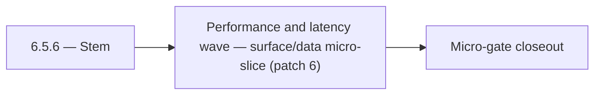

# 6.5.6 — Stem

- **Era:** `6.x` Reliability and Scaling — hub [`versions.md`](../versions.md) · minors start at [`6.0 — Reliability and Scaling era umbrella`](6.0%20%E2%80%94%20Reliability%20and%20Scaling%20era%20umbrella.md)
- **Minor:** [6.5 — Performance and latency wave](./6.5 — Performance and latency wave.md)
- **Codename:** Stem
- **Status:** planned

## Focus
Performance and latency wave — surface/data micro-slice (patch 6)

## Flowchart

## Micro-gate

| Track | Gate question | Answer / Evidence (fill at patch closeout) |
| --- | --- | --- |
| **Contract** | SLO/SLI, idempotency, DLQ envelope, trace propagation — `docs/backend/apis/` + matrices updated? | Document at patch closeout. |
| **Service** | Retry/DLQ, rate limits, abuse guards, HF/SMTP/provider paths — smoke + caps documented? | Document smoke paths. |
| **Surface** | Ops dashboards, `/status`, degraded-mode UX — delta for this patch? | Document UX delta or N/A. |
| **Frontend** | Dashboard/extension reliability patterns (`components.md` Era 6) touched? | Latency wave; Connectra / provider degradation runbooks. Document at closeout. |
| **Data** | Lineage, retention, Redis/DB-backed idempotency state — migrations recorded? | Document lineage or N/A. |
| **Ops** | SLO panels, alerts, chaos/runbook refs (`queue-observability.md`, RC) — delta? | Document ops delta or N/A. |

## Tasks
### Surface
- 📌 Planned: **[appointment360]** — refine duplicate task (was: 📌 planned: implement retry button: re-sends last failed mess…) | patch `6.5.6` band `6` | reason: specialize this file vs sibling patches; see docs/codebases/appointment360-codebase-analysis.md
- 📌 Planned: **[appointment360]** — refine duplicate task (was: 📌 planned: loading progress for long-running requests: indet…) | patch `6.5.6` band `6` | reason: specialize this file vs sibling patches; see docs/codebases/appointment360-codebase-analysis.md
- 📌 Planned: **[appointment360]** — refine duplicate task (was: 📌 planned: partial-save ux: show "18 saved, 2 failed" with p…) | patch `6.5.6` band `6` | reason: specialize this file vs sibling patches; see docs/codebases/appointment360-codebase-analysis.md
- 📌 Planned: **[appointment360]** — refine duplicate task (was: 📌 planned: loading state improvements: chunked progress upda…) | patch `6.5.6` band `6` | reason: specialize this file vs sibling patches; see docs/codebases/appointment360-codebase-analysis.md

### Data
- 📌 Planned: **[appointment360]** — refine duplicate task (was: 📌 planned: define and document ttl / archival strategy: chat…) | patch `6.5.6` band `6` | reason: specialize this file vs sibling patches; see docs/codebases/appointment360-codebase-analysis.md
- 📌 Planned: **[appointment360]** — refine duplicate task (was: 📌 planned: add `job_events` and `job_failures` tables.) | patch `6.5.6` band `6` | reason: specialize this file vs sibling patches; see docs/codebases/appointment360-codebase-analysis.md
- 📌 Planned: **[appointment360]** — refine duplicate task (was: 📌 planned: replay-safe ingest: same profile uuid + same data…) | patch `6.5.6` band `6` | reason: specialize this file vs sibling patches; see docs/codebases/appointment360-codebase-analysis.md

### Contract

- 📌 Planned: **[appointment360]** — Diff and document schema for operations like ConnectraClient, LAMBDA_AI_API_URL, LAMBDA_CONNECTRA_API_URL; align with roadmap | area: `backend-api` | files: `docs/backend/apis/*.md`, `contact360.io/api/app/graphql/schema.py` | reason: Keep GraphQL/REST contracts aligned for era 6.6 patch 6.5.6

### Service

- 📌 Planned: **[appointment360]** — refine duplicate task (was: 📌 planned: **[appointment360]** — service slice: - [x] ✅ com…) | patch `6.5.6` band `6` | reason: specialize this file vs sibling patches; see docs/codebases/appointment360-codebase-analysis.md

### Ops

- 📌 Planned: **[platform]** — Record smoke evidence, rollback, and alerts (patch band 6: surface/data) | area: `ops` | files: `docs/commands/`, `.github/workflows/` | reason: Smoke, rollback, and observability for patch 6.5.6

## Service task slices
> Merged from era `6.x` reliability/scaling task packs (P0→`.0`–`.2`, P1→`.3`–`.6`, Ops→`.7`–`.9`).

### Connectra
- Query P95 SLO baseline captured in dashboards.
- Batch-upsert idempotency test passes (duplicate submission).
- Drift detector runs on schedule with last success timestamp exported.
- CORS + per-tenant rate limit reviewed by security; no wildcard prod misconfig.

### emailapis / emailapigo
- SLO table row for Emailapis added in [`slo-idempotency.md`](slo-idempotency.md).
- `emailapis_endpoint_era_matrix.json` includes era `6.x` reliability notes (timeouts, circuits, concurrency).
- Provider degradation runbook reviewed in tabletop exercise.
- Staging load test: bulk job completes within **P95** target without OOM or goroutine leak.

### Salesnavigator
- Partial-save UX: show "18 saved, 2 failed" with per-failed-profile detail
- `SNRetryButton` — re-attempt only failed profiles (not full batch)
- `RetryAfterBanner` — show countdown when rate-limited
- Loading state improvements: chunked progress update (each chunk completion bumps progress)
- Error recovery: on Lambda timeout, show "Please try again — some profiles may have saved"
- Chunk idempotency key: store per chunk in Connectra request metadata to prevent replay duplication
- Replay-safe ingest: same profile UUID + same data → no-op at Connectra level (confirm Connectra upsert semantics)
- Partial success tracking: log `{session_id, total, saved, failed, timestamp}` per save session
- Implement `TokenBucketRateLimiter` middleware (or equivalent):
- Per-API-key: 100 req/min; configurable via env
- Return `429` with `Retry-After` header on exhaustion
- Add chunk-level idempotency token: generate per save session; pass as Connectra request context for replay safety
- Add circuit breaker / retry budget around Connectra calls:
- 3 retries with exponential backoff (already in `tenacity` config — confirm coverage)
- Circuit opens after 5 consecutive `ConnectraAPIError` in 60s window
- Tighten CORS from `*` to explicit allowed origins (extension origin + dashboard origin)
- Add `X-Request-ID` correlation header to all responses (generate UUID4 if not provided)
- Implement proper timeout escalation: confirm adaptive timeout formula is correct

### contact.ai
- Implement `AIErrorState` component: shows error type (timeout, rate limit, service unavailable) with retry CTA.
- Implement retry button: re-sends last failed message (cached in `AIChatContext`).
- Implement SSE reconnect in `useStreamMessage`: reconnect on stream abort with exponential backoff.
- Show `Retry-After` countdown in rate limit error state (use `RateLimitError.retryAfter`).
- Loading progress for long-running requests: indeterminate progress bar above chat input.
- Add `version` column to `ai_chats` for optimistic concurrency control.
- Define and document TTL / archival strategy: chats older than N days → archived or deleted.
- Add lineage note to `contact_ai_data_lineage.md`: archival lifecycle and compliance retention.
- Confirm `updated_at` timestamp is updated atomically with `messages` JSONB on every write.
- Add SSE stream error handling: catch Lambda timeout, HF stream abort; emit error event and close stream cleanly.
- Implement SSE client reconnect logic: `Last-Event-ID` support or state-based resume.
- Add optimistic lock (version column or ETag) to `ai_chats` to prevent concurrent message append races.
- Implement chat archival TTL: define max chat age; background Lambda to soft-delete stale chats.
- Add distributed tracing: AWS X-Ray or OTEL context propagation across Lambda invocations.
- Tune HF + Gemini retry budgets: max 2 retries on HF, then 1 Gemini attempt, then 503.
- Health endpoint improvements: `/health/db` must report connection pool state; add `/health/hf` for HF API reachability.

## Evidence gate
Patch closeout includes contract diff, smoke output, data lineage delta, and ops note
