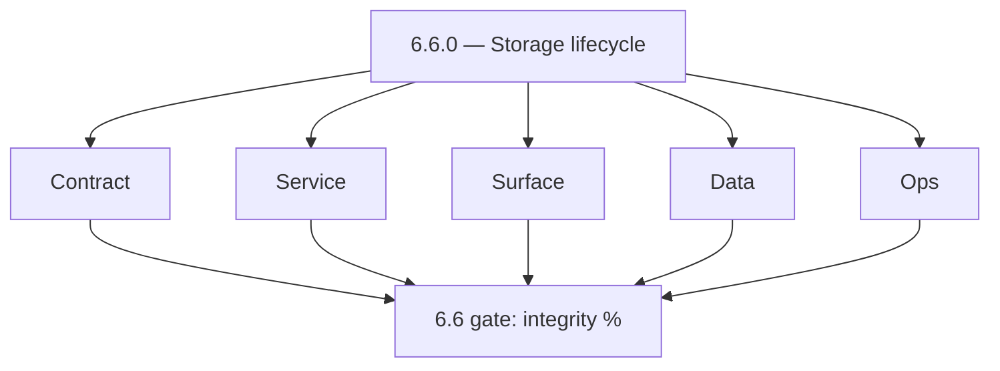

# Version 6.6

- **Status:** ✅ Completed
- **Target window:** TBD
- **Summary:** Storage lifecycle and artifact integrity — S3 multipart durable session store, metadata compare-and-swap (CAS), reconciliation S3 vs DB, lifecycle transitions, orphan artifact cleanup (`s3storage-codebase-analysis.md` 6.x section).
- **Scope:** Blobs and metadata — **not** GraphQL abuse (6.8) or queue replay (6.3).
- **Roadmap mapping:** Stage 6.6 — Storage and artifact lifecycle hardening (`6.6.0`)
- **Owner:** Storage / Data
- **Patch closure:** Every codenamed patch file includes **Micro-gate** + **Service task slices**. Era hub: [`versions.md`](../versions.md).

## Scope

- **In scope:** Multipart completion idempotency (`X-Idempotency-Key` on complete/abort), session durability, metadata CAS, reconciliation utilities, archive/restore lifecycle, dashboard targets (upload success, complete latency, metadata lag).
- **Out of scope:** Per-tenant deployment isolation (7.x).

## Flowchart — five-track delivery

### Runtime focus — uploads

## Task tracks

### Contract
- ✅ Completed: 📌 Planned: **[appointment360]** — refine duplicate task (was: 📌 planned: idempotency keys for complete/abort; expected sta…) | patch `6.6.0` band `0` | reason: specialize this file vs sibling patches; see docs/codebases/appointment360-codebase-analysis.md
- ✅ Completed: 📌 Planned: Metadata versioning rules (ETag/CAS).

### Service — s3storage
- ✅ Completed: 📌 Planned: Full five-track detail in **Service task slices** (`6.x` S3 patches).
- ✅ Completed: 📌 Planned: S3 lifecycle rules snippet in `performance-storage-abuse.md`.
- ✅ Completed: ⬜ Incomplete: Add upload/metadata SLO implementation — define P95 targets; create SLO dashboard (upload success rate, complete latency, metadata lag vs S3 object count).
- ✅ Completed: 📌 Planned: Broaden transient-failure retry wrappers in `S3Backend` — currently partial; ensure retries cover all S3 operations (list, delete, metadata update, worker invoke) with backoff.
- ✅ Completed: 📌 Planned: Add error-budget alert: S3 operation failure rate above threshold → SNS/CloudWatch alarm.

### Service — logs.api
- ✅ Completed: 📌 Planned: Scheduled Lambda (EventBridge cron) to delete `lambda/logs.api` S3 CSV objects older than `LOG_TTL_DAYS`; nightly; idempotent; audit log of deletions.
- ✅ Completed: 📌 Planned: Add Postman collection at `lambda/logs.api/postman/logsapp.json` (CRUD, batch, search, statistics, health).

### Surface
- ✅ Completed: 📌 Planned: Upload UIs: resumable behavior, user-visible failure recovery.

### Data
- ✅ Completed: 📌 Planned: Bucket policies, encryption, transition to IA/Glacier; orphan sweeper job.
- ✅ Completed: 📌 Planned: Verify S3 lifecycle expiration on logs bucket (e.g. `contact360logsbucket`): match `LOG_TTL_DAYS` (default 90) for orphaned prefixes the sweeper misses.

### Ops
- ✅ Completed: 📌 Planned: SLO dashboard: upload success rate, complete latency, metadata lag vs S3.

### Service

- ✅ Completed: 📌 Planned: **[appointment360]** — Service slice: - [x] ✅ Completed: complexity/timeout, idempotency, abuse-guard, and RED/SLO middleware foundations. | area: `backend-api` | files: `contact360.io/api/app/graphql/modules/`, `contact360.io/api/app/clients/` | reason: Implement or verify runtime behavior for - [x] ✅ Completed: complexity/timeout, idempotency, abuse-guard, and RED/SLO mid
- ✅ Completed: 📌 Planned: **[emailapis]** — Harden primary worker/gateway integration and failure envelopes | area: `backend-api` | files: `docs/codebases/emailapis-codebase-analysis.md` | reason: P0 band: critical path and idempotency

## Task Breakdown — acceptance

| KPI | Per roadmap 6.6 |
| --- | --- |
| Artifact integrity success rate | Measured; reconciler verifies sample |

## Immediate next execution queue

- 📌 Planned: Expand **Service task slices** (`6.x` S3 patches) to match emailcampaign pack depth.
- 📌 Planned: Schedule monthly reconciliation job + alert on drift.

## Cross-service ownership table

| Workstream | DRI |
| --- | --- |
| Multipart API | Storage |
| DB metadata | Data |
| Product upload UX | Frontend |

## References

- [docs/roadmap.md](../roadmap.md) — Stage 6.6
- [performance-storage-abuse.md](performance-storage-abuse.md)
- [s3storage-codebase-analysis.md](../codebases/s3storage-codebase-analysis.md)

## Backend API and Endpoint Scope

- Init/upload/complete/abort; internal reconciliation endpoints.

## Database and Data Lineage Scope

- File metadata tables; multipart session keys; retention job audit trail.

## Frontend UX Surface Scope

- Progress bars; retry stalled uploads; clear error when CAS conflict.

## UI Elements Checklist

- Chunk progress, cancel upload, dismissible errors.

## Flow/Graph Delta

## Release Gate and Evidence

- 📌 Planned: Chaos: kill worker mid-upload → session recoverable or cleanly fails.
- 📌 Planned: **KPI:** artifact integrity success rate on dashboard.

### Micro-gate reference (apply at every `6.N.P`)

| Track | Gate question (must answer Yes or document waiver) |
| --- | --- |
| **Contract** | SLO/SLI, idempotency, DLQ envelope, trace headers — `docs/backend/apis/` + endpoint matrices updated? |
| **Service** | Retry/DLQ, rate limits, provider degradation — smoke paths + idempotency stores documented? |
| **Surface** | Ops dashboards, `/status`, degraded UX — user/operator-visible delta? |
| **Frontend** | Era 6 patterns in `docs/frontend/components.md` / pages JSON — delta? |
| **Data** | Lineage docs, Redis/DB idempotency, retention — migrations recorded? |
| **Ops** | SLO panels, alerts, chaos/runbooks (`queue-observability.md`, RC) — recorded? |

**Patch ladder:** Codenames `Void` → `Bloom` per minor (`.0`–`.9`) — see patch table below.

## Patches

| Patch | Codename | Doc |
| --- | --- | --- |
| `6.6.0` | Void | [`6.6.0` — Void](6.6.0 — Void.md) |
| `6.6.1` | Seed | [`6.6.1` — Seed](6.6.1 — Seed.md) |
| `6.6.2` | Sprout | [`6.6.2` — Sprout](6.6.2 — Sprout.md) |
| `6.6.3` | Roots | [`6.6.3` — Roots](6.6.3 — Roots.md) |
| `6.6.4` | Soil | [`6.6.4` — Soil](6.6.4 — Soil.md) |
| `6.6.5` | Rain | [`6.6.5` — Rain](6.6.5 — Rain.md) |
| `6.6.6` | Stem | [`6.6.6` — Stem](6.6.6 — Stem.md) |
| `6.6.7` | Branch | [`6.6.7` — Branch](6.6.7 — Branch.md) |
| `6.6.8` | Leaf | [`6.6.8` — Leaf](6.6.8 — Leaf.md) |
| `6.6.9` | Bloom | [`6.6.9` — Bloom](6.6.9 — Bloom.md) |

## Patch ladder (6.6.0 - 6.6.9)

### Micro-gate reference (apply at every patch)

| Track | Gate question (must answer Yes or waiver) |
| --- | --- |
| **Contract** | Contract/API change captured with diff or explicit no-change note |
| **Service** | Service health and smoke for affected paths pass |
| **Surface** | UI/admin/extension impact documented or N/A |
| **Frontend** | Routes/components/hooks affected listed or N/A |
| **Data** | Migrations/index/lineage deltas linked or N/A |
| **Ops** | Rollback/secrets/CI/runbook delta linked or N/A |

**Patch intent bands:** `.0` charter, `.1-.2` scaffold, `.3-.5` hardening, `.6-.8` integration, `.9` freeze/handoff.

| Patch | Codename | Focus | Evidence gate |
| --- | --- | --- | --- |
| `6.6.0` | Void | patch focus | charter artifact linked |
| `6.6.1` | Seed | patch focus | closeout evidence attached |
| `6.6.2` | Sprout | patch focus | closeout evidence attached |
| `6.6.3` | Roots | patch focus | closeout evidence attached |
| `6.6.4` | Soil | patch focus | closeout evidence attached |
| `6.6.5` | Rain | patch focus | closeout evidence attached |
| `6.6.6` | Stem | patch focus | closeout evidence attached |
| `6.6.7` | Branch | patch focus | closeout evidence attached |
| `6.6.8` | Leaf | patch focus | closeout evidence attached |
| `6.6.9` | Bloom | patch focus | handoff documented |
