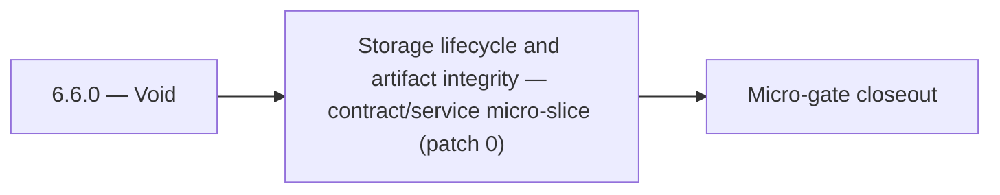

# 6.6.0 — Void

- **Era:** `6.x` Reliability and Scaling — hub [`versions.md`](../versions.md) · minors start at [`6.0 — Reliability and Scaling era umbrella`](6.0%20%E2%80%94%20Reliability%20and%20Scaling%20era%20umbrella.md)
- **Minor:** [6.6 — Storage lifecycle and artifact integrity](./6.6 — Storage lifecycle and artifact integrity.md)
- **Codename:** Void
- **Status:** ✅ Completed
## Focus
Storage lifecycle and artifact integrity — contract/service micro-slice (patch 0)

## Flowchart

## Micro-gate

| Track | Gate question | Answer / Evidence (fill at patch closeout) |
| --- | --- | --- |
| **Contract** | SLO/SLI, idempotency, DLQ envelope, trace propagation — `docs/backend/apis/` + matrices updated? | Document at patch closeout. |
| **Service** | Retry/DLQ, rate limits, abuse guards, HF/SMTP/provider paths — smoke + caps documented? | Document smoke paths. |
| **Surface** | Ops dashboards, `/status`, degraded-mode UX — delta for this patch? | Document UX delta or N/A. |
| **Frontend** | Dashboard/extension reliability patterns (`components.md` Era 6) touched? | S3 lifecycle, multipart durability, artifact integrity checks. Document at closeout. |
| **Data** | Lineage, retention, Redis/DB-backed idempotency state — migrations recorded? | Document lineage or N/A. |
| **Ops** | SLO panels, alerts, chaos/runbook refs (`queue-observability.md`, RC) — delta? | Document ops delta or N/A. |

## Tasks
### Contract
- ✅ Completed: 📌 Planned: **[appointment360]** — refine duplicate task (was: 📌 planned: idempotency keys for complete/abort; expected sta…) | patch `6.6.0` band `0` | reason: specialize this file vs sibling patches; see docs/codebases/appointment360-codebase-analysis.md
- ✅ Completed: 📌 Planned: **[appointment360]** — refine duplicate task (was: 📌 planned: define slo targets for contact.ai:) | patch `6.6.0` band `0` | reason: specialize this file vs sibling patches; see docs/codebases/appointment360-codebase-analysis.md
- ✅ Completed: 📌 Planned: **[appointment360]** — refine duplicate task (was: availability target: 99.5%) | patch `6.6.0` band `0` | reason: specialize this file vs sibling patches; see docs/codebases/appointment360-codebase-analysis.md
- ✅ Completed: 📌 Planned: **[appointment360]** — refine duplicate task (was: 📌 planned: define slos: p95 single verify latency, bulk comp…) | patch `6.6.0` band `0` | reason: specialize this file vs sibling patches; see docs/codebases/appointment360-codebase-analysis.md

### Service
- ✅ Completed: 📌 Planned: **[appointment360]** — refine duplicate task (was: 📌 planned: add sse stream error handling: catch lambda timeo…) | patch `6.6.0` band `0` | reason: specialize this file vs sibling patches; see docs/codebases/appointment360-codebase-analysis.md
- ✅ Completed: 📌 Planned: **[appointment360]** — refine duplicate task (was: 📌 planned: add distributed tracing: aws x-ray or otel contex…) | patch `6.6.0` band `0` | reason: specialize this file vs sibling patches; see docs/codebases/appointment360-codebase-analysis.md
- ✅ Completed: 📌 Planned: **[appointment360]** — refine duplicate task (was: 📌 planned: add idempotency key support on bulk create endpoi…) | patch `6.6.0` band `0` | reason: specialize this file vs sibling patches; see docs/codebases/appointment360-codebase-analysis.md
- ✅ Completed: 📌 Planned: **[appointment360]** — refine duplicate task (was: per-api-key: 100 req/min; configurable via env) | patch `6.6.0` band `0` | reason: specialize this file vs sibling patches; see docs/codebases/appointment360-codebase-analysis.md

### Surface

- ✅ Completed: 📌 Planned: **[connectra]** — Verify UX for route `/email` and bindings (patch 6.6.0 band 0) | area: `frontend-page` | files: `contact360.io/app/...` | reason: Dashboard/extension surface for era 6 must match gateway contracts

### Data

- ✅ Completed: 📌 Planned: **[appointment360]** — Update PostgreSQL/ES/S3 lineage notes if this patch touches persistence or exports | area: `data-lineage` | files: `docs/backend/database/`, `migrations/` | reason: Migrations, indexes, and lineage evidence for this patch

### Ops

- ✅ Completed: 📌 Planned: **[platform]** — Record smoke evidence, rollback, and alerts (patch band 0: charter/P0) | area: `ops` | files: `docs/commands/`, `.github/workflows/` | reason: Smoke, rollback, and observability for patch 6.6.0

## Service task slices
> Merged from era `6.x` reliability/scaling task packs (P0→`.0`–`.2`, P1→`.3`–`.6`, Ops→`.7`–`.9`).

### logs.api
- EventBridge + Lambda: delete CSV shards older than `LOG_TTL_DAYS`; runbook + dry-run in staging first.
- S3 lifecycle rule on logs bucket: 90-day expiration aligned with `LOG_TTL_DAYS` / `app/core/config.py`.
- Postman collection shipped under `lambda/logs.api/postman/logsapp.json` with prod base URL + `X-API-Key` preset.

### S3Storage
- Duplicate `complete` with same idempotency key does not double-charge storage or metadata.
- Crash test: mid-upload resume works or fails closed safely.
- CAS conflict path tested end-to-end.
- Reconciliation job shows zero unexplained drift post-cleanup on staging bucket.
- ⬜ Incomplete: SLO implementation: P95 upload complete latency and metadata freshness measured and dashboarded.
- 📌 Planned: Retry wrapper coverage for all `S3Backend` operations + error-budget alarm wiring (SNS/CloudWatch).

### Emailcampaign
- Campaign of 100k recipients completes within SLO on staging environment.
- Duplicate campaign enqueue is silently deduplicated.
- Failed campaigns can be resumed from last checkpoint without re-sending to already-sent recipients.
- Prometheus endpoint exposes campaign metrics.

### contact.ai
- Define SLO targets for contact.ai:
- Sync message response p95 < 3s
- SSE first-token latency p95 < 1s
- Utility AI endpoints p95 < 2s
- Availability target: 99.5%
- Document retry and timeout contract: max retries, backoff policy, `Retry-After` header behavior.
- Define SSE stream error format: `data: {"error": "<message>", "code": "<code>"}\n\n`.
- Document idempotency contract for `POST /message`: repeated calls with same payload must not create duplicate messages.
- Add SSE stream error handling: catch Lambda timeout, HF stream abort; emit error event and close stream cleanly.
- Implement SSE client reconnect logic: `Last-Event-ID` support or state-based resume.
- Add optimistic lock (version column or ETag) to `ai_chats` to prevent concurrent message append races.
- Implement chat archival TTL: define max chat age; background Lambda to soft-delete stale chats.
- Add distributed tracing: AWS X-Ray or OTEL context propagation across Lambda invocations.
- Tune HF + Gemini retry budgets: max 2 retries on HF, then 1 Gemini attempt, then 503.
- Health endpoint improvements: `/health/db` must report connection pool state; add `/health/hf` for HF API reachability.
- Add `version` column to `ai_chats` for optimistic concurrency control.
- Define and document TTL / archival strategy: chats older than N days → archived or deleted.
- Add lineage note to `contact_ai_data_lineage.md`: archival lifecycle and compliance retention.

### Jobs
- Idempotent create proven by duplicate POST test (staging).
- At least one DLQ message successfully replayed with audit trail.
- Stale-processing sweeper verified in soak test.
- SLO panels + alert routes live; chaos drill documented.

## Evidence gate
Primary charter artifact created and linked in the parent minor doc
