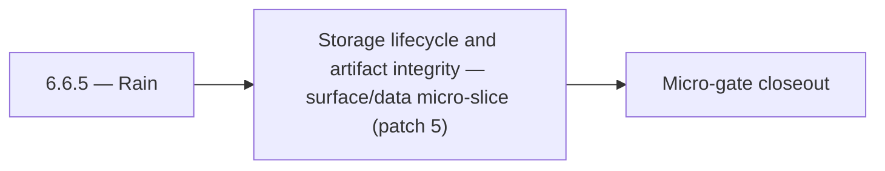

# 6.6.5 — Rain

- **Era:** `6.x` Reliability and Scaling — hub [`versions.md`](../versions.md) · minors start at [`6.0 — Reliability and Scaling era umbrella`](6.0%20%E2%80%94%20Reliability%20and%20Scaling%20era%20umbrella.md)
- **Minor:** [6.6 — Storage lifecycle and artifact integrity](./6.6 — Storage lifecycle and artifact integrity.md)
- **Codename:** Rain
- **Status:** planned

## Focus
Storage lifecycle and artifact integrity — surface/data micro-slice (patch 5)

## Flowchart

## Micro-gate

| Track | Gate question | Answer / Evidence (fill at patch closeout) |
| --- | --- | --- |
| **Contract** | SLO/SLI, idempotency, DLQ envelope, trace propagation — `docs/backend/apis/` + matrices updated? | Document at patch closeout. |
| **Service** | Retry/DLQ, rate limits, abuse guards, HF/SMTP/provider paths — smoke + caps documented? | Document smoke paths. |
| **Surface** | Ops dashboards, `/status`, degraded-mode UX — delta for this patch? | Document UX delta or N/A. |
| **Frontend** | Dashboard/extension reliability patterns (`components.md` Era 6) touched? | S3 lifecycle, multipart durability, artifact integrity checks. Document at closeout. |
| **Data** | Lineage, retention, Redis/DB-backed idempotency state — migrations recorded? | Document lineage or N/A. |
| **Ops** | SLO panels, alerts, chaos/runbook refs (`queue-observability.md`, RC) — delta? | Document ops delta or N/A. |

## Tasks
### Surface
- 📌 Planned: **[appointment360]** — refine duplicate task (was: 📌 planned: implement `aierrorstate` component: shows error t…) | patch `6.6.5` band `5` | reason: specialize this file vs sibling patches; see docs/codebases/appointment360-codebase-analysis.md
- 📌 Planned: **[appointment360]** — refine duplicate task (was: 📌 planned: show `retry-after` countdown in rate limit error …) | patch `6.6.5` band `5` | reason: specialize this file vs sibling patches; see docs/codebases/appointment360-codebase-analysis.md
- 📌 Planned: **[appointment360]** — refine duplicate task (was: 📌 planned: add per-job error summary panel.) | patch `6.6.5` band `5` | reason: specialize this file vs sibling patches; see docs/codebases/appointment360-codebase-analysis.md
- 📌 Planned: **[appointment360]** — refine duplicate task (was: 📌 planned: `retryafterbanner` — show countdown when rate-lim…) | patch `6.6.5` band `5` | reason: specialize this file vs sibling patches; see docs/codebases/appointment360-codebase-analysis.md

### Data
- 📌 Planned: **[appointment360]** — refine duplicate task (was: 📌 planned: add `version` column to `ai_chats` for optimistic…) | patch `6.6.5` band `5` | reason: specialize this file vs sibling patches; see docs/codebases/appointment360-codebase-analysis.md
- 📌 Planned: **[appointment360]** — refine duplicate task (was: 📌 planned: confirm `updated_at` timestamp is updated atomica…) | patch `6.6.5` band `5` | reason: specialize this file vs sibling patches; see docs/codebases/appointment360-codebase-analysis.md
- 📌 Planned: **[appointment360]** — refine duplicate task (was: 📌 planned: chunk idempotency key: store per chunk in connect…) | patch `6.6.5` band `5` | reason: specialize this file vs sibling patches; see docs/codebases/appointment360-codebase-analysis.md

### Contract

- 📌 Planned: **[appointment360]** — Diff and document schema for operations like ConnectraClient, LAMBDA_AI_API_URL, LAMBDA_CONNECTRA_API_URL; align with roadmap | area: `backend-api` | files: `docs/backend/apis/*.md`, `contact360.io/api/app/graphql/schema.py` | reason: Keep GraphQL/REST contracts aligned for era 6.5 patch 6.6.5

### Service

- 📌 Planned: **[appointment360]** — refine duplicate task (was: 📌 planned: **[appointment360]** — service slice: - [x] ✅ com…) | patch `6.6.5` band `5` | reason: specialize this file vs sibling patches; see docs/codebases/appointment360-codebase-analysis.md

### Ops

- 📌 Planned: **[platform]** — Record smoke evidence, rollback, and alerts (patch band 5: surface/data) | area: `ops` | files: `docs/commands/`, `.github/workflows/` | reason: Smoke, rollback, and observability for patch 6.6.5

## Service task slices
> Merged from era `6.x` reliability/scaling task packs (P0→`.0`–`.2`, P1→`.3`–`.6`, Ops→`.7`–`.9`).

### S3Storage
- Duplicate `complete` with same idempotency key does not double-charge storage or metadata.
- Crash test: mid-upload resume works or fails closed safely.
- CAS conflict path tested end-to-end.
- Reconciliation job shows zero unexplained drift post-cleanup on staging bucket.

### Emailcampaign
- Campaign of 100k recipients completes within SLO on staging environment.
- Duplicate campaign enqueue is silently deduplicated.
- Failed campaigns can be resumed from last checkpoint without re-sending to already-sent recipients.
- Prometheus endpoint exposes campaign metrics.

### contact.ai
- Implement `AIErrorState` component: shows error type (timeout, rate limit, service unavailable) with retry CTA.
- Implement retry button: re-sends last failed message (cached in `AIChatContext`).
- Implement SSE reconnect in `useStreamMessage`: reconnect on stream abort with exponential backoff.
- Show `Retry-After` countdown in rate limit error state (use `RateLimitError.retryAfter`).
- Loading progress for long-running requests: indeterminate progress bar above chat input.
- Add `version` column to `ai_chats` for optimistic concurrency control.
- Define and document TTL / archival strategy: chats older than N days → archived or deleted.
- Add lineage note to `contact_ai_data_lineage.md`: archival lifecycle and compliance retention.
- Confirm `updated_at` timestamp is updated atomically with `messages` JSONB on every write.
- Add SSE stream error handling: catch Lambda timeout, HF stream abort; emit error event and close stream cleanly.
- Implement SSE client reconnect logic: `Last-Event-ID` support or state-based resume.
- Add optimistic lock (version column or ETag) to `ai_chats` to prevent concurrent message append races.
- Implement chat archival TTL: define max chat age; background Lambda to soft-delete stale chats.
- Add distributed tracing: AWS X-Ray or OTEL context propagation across Lambda invocations.
- Tune HF + Gemini retry budgets: max 2 retries on HF, then 1 Gemini attempt, then 503.
- Health endpoint improvements: `/health/db` must report connection pool state; add `/health/hf` for HF API reachability.

### Jobs
- Idempotent create proven by duplicate POST test (staging).
- At least one DLQ message successfully replayed with audit trail.
- Stale-processing sweeper verified in soak test.
- SLO panels + alert routes live; chaos drill documented.

## Evidence gate
Patch closeout includes contract diff, smoke output, data lineage delta, and ops note
