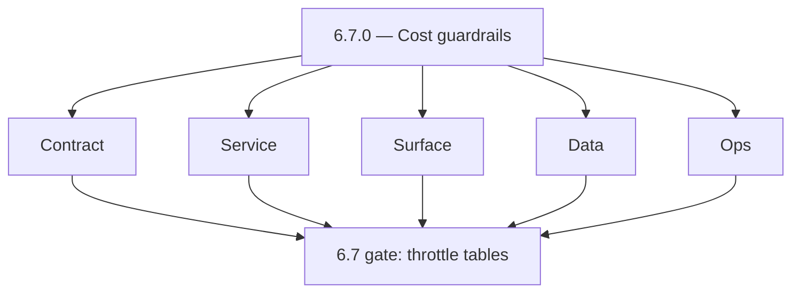
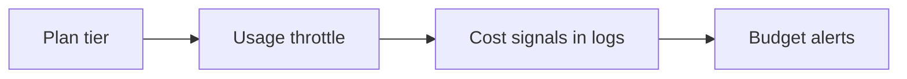
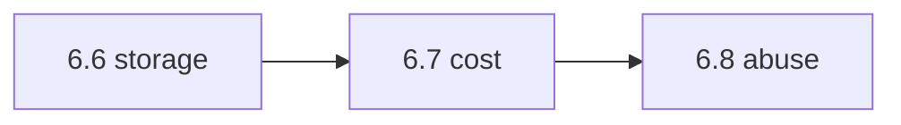

# Version 6.7

- **Status:** planned
- **Target window:** TBD
- **Summary:** Cost reliability and budget guardrails — usage-based throttle per plan, cost attribution fields in logs/metrics, tuning `MUTATION_ABUSE_GUARD_RPM` (and siblings) by commercial tier without locking legitimate tenants.
- **Scope:** Economic controls — **not** full abuse exploit coverage (6.8) or RC sign-off (6.9).
- **Roadmap mapping:** Stage 6.7 — Cost reliability and budget guardrails (`6.7.0`)
- **Owner:** Platform / FinOps liaison
- **Patch closure:** Every codenamed patch file includes **Micro-gate** + **Service task slices**. Era hub: [`versions.md`](../versions.md).

## Scope

- **In scope:** Plan-tier rate tables, mutation RPM guardrails, query cost signals, alerting on cost per active tenant/user (`docs/roadmap.md` KPI).
- **Out of scope:** SalesNavigator CORS hardening depth (6.8); DLQ mechanics (6.3).

## Flowchart — five-track delivery

### Runtime focus — budgets

## Task tracks

### Contract
- 📌 Planned: **[appointment360]** — refine duplicate task (was: 📌 planned: **[appointment360]** — refine duplicate task (was…) | patch `6.7.0` band `0` | reason: specialize this file vs sibling patches; see docs/codebases/appointment360-codebase-analysis.md

### Service — Appointment360
- 📌 Planned: **[appointment360]** — refine duplicate task (was: 📌 planned: relate `graphql_rate_limit_requests_per_minute`, …) | patch `6.7.0` band `0` | reason: specialize this file vs sibling patches; see docs/codebases/appointment360-codebase-analysis.md

### Service — logs.api / storage
- 📌 Planned: **[appointment360]** — refine duplicate task (was: 📌 planned: high-volume query/storage attribution; identify t…) | patch `6.7.0` band `0` | reason: specialize this file vs sibling patches; see docs/codebases/appointment360-codebase-analysis.md

### Surface
- 📌 Planned: **[appointment360]** — refine duplicate task (was: 📌 planned: customer-visible soft warnings approaching limits…) | patch `6.7.0` band `0` | reason: specialize this file vs sibling patches; see docs/codebases/appointment360-codebase-analysis.md

### Data
- 📌 Planned: **[appointment360]** — refine duplicate task (was: 📌 planned: aggregation jobs for usage rollups; pii-safe bill…) | patch `6.7.0` band `0` | reason: specialize this file vs sibling patches; see docs/codebases/appointment360-codebase-analysis.md

### Ops
- 📌 Planned: **[appointment360]** — refine duplicate task (was: 📌 planned: monthly cost review checklist tied to slo/error b…) | patch `6.7.0` band `0` | reason: specialize this file vs sibling patches; see docs/codebases/appointment360-codebase-analysis.md

### Service

- 📌 Planned: **[appointment360]** — refine duplicate task (was: 📌 planned: **[appointment360]** — service slice: - [x] ✅ com…) | patch `6.7.0` band `0` | reason: specialize this file vs sibling patches; see docs/codebases/appointment360-codebase-analysis.md
- 📌 Planned: **[appointment360]** — refine duplicate task (was: 📌 planned: **[emailapis]** — harden primary worker/gateway i…) | patch `6.7.0` band `0` | reason: specialize this file vs sibling patches; see docs/codebases/appointment360-codebase-analysis.md

## Task Breakdown — acceptance

| KPI | Per roadmap 6.7 |
| --- | --- |
| Cost per active tenant/user | Trending dashboard |

## Immediate next execution queue

- 📌 Planned: Fill **per-plan `MUTATION_ABUSE_GUARD_RPM`** guidance table in `performance-storage-abuse.md`.
- 📌 Planned: Partner with finance on chargeback tags.

## Cross-service ownership table

| Workstream | DRI |
| --- | --- |
| Gateway limits | API |
| Search/query cost | Connectra / logs |
| Storage cost | S3 storage |

## References

- [docs/roadmap.md](../roadmap.md) — Stage 6.7
- [performance-storage-abuse.md](performance-storage-abuse.md)
- [appointment360-codebase-analysis.md](../codebases/appointment360-codebase-analysis.md)

## Backend API and Endpoint Scope

- Config surfaces for tiered limits; optional `/usage` internal APIs.

## Database and Data Lineage Scope

- Usage rollups; no PII in FinOps exports without review.

## Frontend UX Surface Scope

- Transparent limit messaging; link to upgrade path if product supports.

## UI Elements Checklist

- Banners when approaching rate limits; admin toggles for temporary overrides (ops only).

## Flow/Graph Delta

## Release Gate and Evidence

- 📌 Planned: Table of RPM/rate plan defaults reviewed by product + finance.
- 📌 Planned: No significant false-positive surge on top tenants during rollout — monitor **6.8 KPI** early.

### Micro-gate reference (apply at every `6.N.P`)

| Track | Gate question (must answer Yes or document waiver) |
| --- | --- |
| **Contract** | SLO/SLI, idempotency, DLQ envelope, trace headers — `docs/backend/apis/` + endpoint matrices updated? |
| **Service** | Retry/DLQ, rate limits, provider degradation — smoke paths + idempotency stores documented? |
| **Surface** | Ops dashboards, `/status`, degraded UX — user/operator-visible delta? |
| **Frontend** | Era 6 patterns in `docs/frontend/components.md` / pages JSON — delta? |
| **Data** | Lineage docs, Redis/DB idempotency, retention — migrations recorded? |
| **Ops** | SLO panels, alerts, chaos/runbooks (`queue-observability.md`, RC) — recorded? |

**Patch ladder:** Codenames `Void` → `Bloom` per minor (`.0`–`.9`) — see patch table below.

## Patches

| Patch | Codename | Doc |
| --- | --- | --- |
| `6.7.0` | Void | [`6.7.0` — Void](6.7.0 — Void.md) |
| `6.7.1` | Seed | [`6.7.1` — Seed](6.7.1 — Seed.md) |
| `6.7.2` | Sprout | [`6.7.2` — Sprout](6.7.2 — Sprout.md) |
| `6.7.3` | Roots | [`6.7.3` — Roots](6.7.3 — Roots.md) |
| `6.7.4` | Soil | [`6.7.4` — Soil](6.7.4 — Soil.md) |
| `6.7.5` | Rain | [`6.7.5` — Rain](6.7.5 — Rain.md) |
| `6.7.6` | Stem | [`6.7.6` — Stem](6.7.6 — Stem.md) |
| `6.7.7` | Branch | [`6.7.7` — Branch](6.7.7 — Branch.md) |
| `6.7.8` | Leaf | [`6.7.8` — Leaf](6.7.8 — Leaf.md) |
| `6.7.9` | Bloom | [`6.7.9` — Bloom](6.7.9 — Bloom.md) |

## Patch ladder (6.7.0 - 6.7.9)

### Micro-gate reference (apply at every patch)

| Track | Gate question (must answer Yes or waiver) |
| --- | --- |
| **Contract** | Contract/API change captured with diff or explicit no-change note |
| **Service** | Service health and smoke for affected paths pass |
| **Surface** | UI/admin/extension impact documented or N/A |
| **Frontend** | Routes/components/hooks affected listed or N/A |
| **Data** | Migrations/index/lineage deltas linked or N/A |
| **Ops** | Rollback/secrets/CI/runbook delta linked or N/A |

**Patch intent bands:** `.0` charter, `.1-.2` scaffold, `.3-.5` hardening, `.6-.8` integration, `.9` freeze/handoff.

| Patch | Codename | Focus | Evidence gate |
| --- | --- | --- | --- |
| `6.7.0` | Void | patch focus | charter artifact linked |
| `6.7.1` | Seed | patch focus | closeout evidence attached |
| `6.7.2` | Sprout | patch focus | closeout evidence attached |
| `6.7.3` | Roots | patch focus | closeout evidence attached |
| `6.7.4` | Soil | patch focus | closeout evidence attached |
| `6.7.5` | Rain | patch focus | closeout evidence attached |
| `6.7.6` | Stem | patch focus | closeout evidence attached |
| `6.7.7` | Branch | patch focus | closeout evidence attached |
| `6.7.8` | Leaf | patch focus | closeout evidence attached |
| `6.7.9` | Bloom | patch focus | handoff documented |
