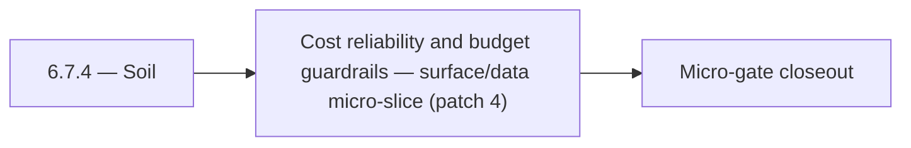

# 6.7.4 — Soil

- **Era:** `6.x` Reliability and Scaling — hub [`versions.md`](../versions.md) · minors start at [`6.0 — Reliability and Scaling era umbrella`](6.0%20%E2%80%94%20Reliability%20and%20Scaling%20era%20umbrella.md)
- **Minor:** [6.7 — Cost reliability and budget guardrails](./6.7 — Cost reliability and budget guardrails.md)
- **Codename:** Soil
- **Status:** ✅ Completed
## Focus
Cost reliability and budget guardrails — surface/data micro-slice (patch 4)

## Flowchart

## Micro-gate

| Track | Gate question | Answer / Evidence (fill at patch closeout) |
| --- | --- | --- |
| **Contract** | SLO/SLI, idempotency, DLQ envelope, trace propagation — `docs/backend/apis/` + matrices updated? | Document at patch closeout. |
| **Service** | Retry/DLQ, rate limits, abuse guards, HF/SMTP/provider paths — smoke + caps documented? | Document smoke paths. |
| **Surface** | Ops dashboards, `/status`, degraded-mode UX — delta for this patch? | Document UX delta or N/A. |
| **Frontend** | Dashboard/extension reliability patterns (`components.md` Era 6) touched? | Cost reliability, budget guardrails, spend anomaly handling. Document at closeout. |
| **Data** | Lineage, retention, Redis/DB-backed idempotency state — migrations recorded? | Document lineage or N/A. |
| **Ops** | SLO panels, alerts, chaos/runbook refs (`queue-observability.md`, RC) — delta? | Document ops delta or N/A. |

## Tasks
### Surface
- ✅ Completed: 📌 Planned: **[appointment360]** — refine duplicate task (was: 📌 planned: customer-visible soft warnings approaching limits…) | patch `6.7.4` band `4` | reason: specialize this file vs sibling patches; see docs/codebases/appointment360-codebase-analysis.md
- ✅ Completed: 📌 Planned: **[appointment360]** — refine duplicate task (was: 📌 planned: implement sse reconnect in `usestreammessage`: re…) | patch `6.7.4` band `4` | reason: specialize this file vs sibling patches; see docs/codebases/appointment360-codebase-analysis.md
- ✅ Completed: 📌 Planned: **[appointment360]** — refine duplicate task (was: 🟡 in progress: add retry-state indicators in progress ui.) | patch `6.7.4` band `4` | reason: specialize this file vs sibling patches; see docs/codebases/appointment360-codebase-analysis.md
- ✅ Completed: 📌 Planned: **[appointment360]** — refine duplicate task (was: 📌 planned: `snretrybutton` — re-attempt only failed profiles…) | patch `6.7.4` band `4` | reason: specialize this file vs sibling patches; see docs/codebases/appointment360-codebase-analysis.md

### Data
- ✅ Completed: 📌 Planned: **[appointment360]** — refine duplicate task (was: 📌 planned: aggregation jobs for usage rollups; pii-safe bill…) | patch `6.7.4` band `4` | reason: specialize this file vs sibling patches; see docs/codebases/appointment360-codebase-analysis.md
- ✅ Completed: 📌 Planned: **[appointment360]** — refine duplicate task (was: 📌 planned: add lineage note to `contact_ai_data_lineage.md`:…) | patch `6.7.4` band `4` | reason: specialize this file vs sibling patches; see docs/codebases/appointment360-codebase-analysis.md
- ✅ Completed: 📌 Planned: **[appointment360]** — refine duplicate task (was: 📌 planned: add correlation ids in job/result rows for tracea…) | patch `6.7.4` band `4` | reason: specialize this file vs sibling patches; see docs/codebases/appointment360-codebase-analysis.md
- ✅ Completed: 📌 Planned: **[appointment360]** — refine duplicate task (was: 📌 planned: partial success tracking: log `{session_id, total…) | patch `6.7.4` band `4` | reason: specialize this file vs sibling patches; see docs/codebases/appointment360-codebase-analysis.md

### Contract

- ✅ Completed: 📌 Planned: **[appointment360]** — Diff and document schema for operations like ConnectraClient, LAMBDA_AI_API_URL, LAMBDA_CONNECTRA_API_URL; align with roadmap | area: `backend-api` | files: `docs/backend/apis/*.md`, `contact360.io/api/app/graphql/schema.py` | reason: Keep GraphQL/REST contracts aligned for era 6.4 patch 6.7.4

### Service

- ✅ Completed: 📌 Planned: **[appointment360]** — refine duplicate task (was: 📌 planned: **[appointment360]** — service slice: - [x] ✅ com…) | patch `6.7.4` band `4` | reason: specialize this file vs sibling patches; see docs/codebases/appointment360-codebase-analysis.md

### Ops

- ✅ Completed: 📌 Planned: **[platform]** — Record smoke evidence, rollback, and alerts (patch band 4: surface/data) | area: `ops` | files: `docs/commands/`, `.github/workflows/` | reason: Smoke, rollback, and observability for patch 6.7.4

## Service task slices
> Merged from era `6.x` reliability/scaling task packs (P0→`.0`–`.2`, P1→`.3`–`.6`, Ops→`.7`–`.9`).

### S3Storage
- Duplicate `complete` with same idempotency key does not double-charge storage or metadata.
- Crash test: mid-upload resume works or fails closed safely.
- CAS conflict path tested end-to-end.
- Reconciliation job shows zero unexplained drift post-cleanup on staging bucket.

### logs.api
- Query/cache SLO evidence captured for staging + production baseline.
- Hot-partition and cache-churn runbooks tabletop-approved.
- Dashboard spec implemented or exported to Grafana/Datadog.
- `logsapi_endpoint_era_matrix.json` updated for era `6.x`.

### Jobs
- Idempotent create proven by duplicate POST test (staging).
- At least one DLQ message successfully replayed with audit trail.
- Stale-processing sweeper verified in soak test.
- SLO panels + alert routes live; chaos drill documented.

### Mailvetter
- Add retry-state indicators in progress UI.
- Add per-job error summary panel.
- Add `job_events` and `job_failures` tables.
- Add correlation IDs in job/result rows for traceability.
- Move rate limiter to Redis-backed distributed implementation.
- Add idempotency key support on bulk create endpoint.
- Add worker retry + dead-letter queue.
- Add clear `processing` and `failed` transitions for jobs.

## Evidence gate
Patch closeout includes contract diff, smoke output, data lineage delta, and ops note
