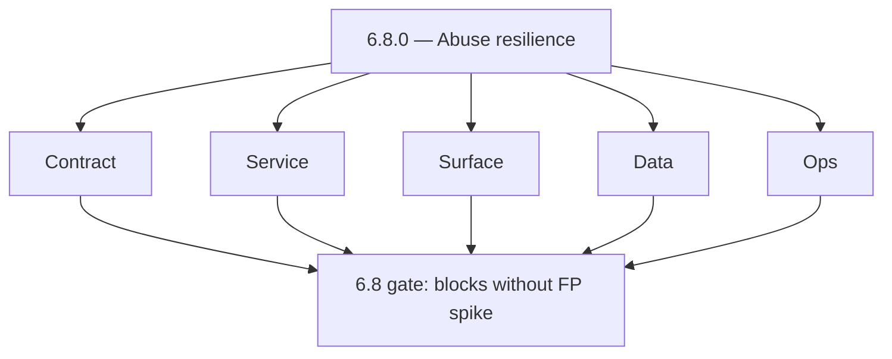
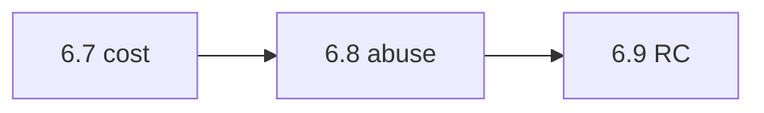

# Version 6.8

- **Status:** ✅ Completed
- **Target window:** TBD
- **Summary:** Security and abuse resilience at scale — `GraphQLMutationAbuseGuardMiddleware`, `GraphQLBodySizeMiddleware`, SalesNavigator CORS tightening, SN rate limiter, Mailvetter distributed Redis limiter, large payload defenses.
- **Scope:** Abuse and amplification — **not** RBAC role matrices (7.x) or deployment approvals (7.x).
- **Roadmap mapping:** Stage 6.8 — Security and abuse resilience at scale (`6.8.0`)
- **Owner:** Security / Platform
- **Patch closure:** Every codenamed patch file includes **Micro-gate** + **Service task slices**. Era hub: [`versions.md`](../versions.md).

## Scope

- **In scope:** Mutation RPM caps, max body bytes (`GRAPHQL_MAX_BODY_BYTES`), per-IP and per-tenant patterns, distributed rate limiting (`mailvetter-codebase-analysis.md`), SalesNavigator edge config (`salesnavigator-codebase-analysis.md`).
- **Out of scope:** FinOps cost dashboards (6.7) unless abuse spikes drive cost; RC checklist (6.9).

## Flowchart — five-track delivery

### Runtime focus — guardrails

## Task tracks

### Contract
- 📌 Planned: **[appointment360]** — refine duplicate task (was: 📌 planned: **[appointment360]** — refine duplicate task (was…) | patch `6.8.0` band `0` | reason: specialize this file vs sibling patches; see docs/codebases/appointment360-codebase-analysis.md
- ✅ Completed: 📌 Planned: **[appointment360]** — refine duplicate task (was: 📌 planned: abuse event logging schema (for soc review — not …) | patch `6.8.0` band `0` | reason: specialize this file vs sibling patches; see docs/codebases/appointment360-codebase-analysis.md

- 📌 Planned: **[appointment360]** — refine duplicate task (was: 📌 planned: **[architecture]** — product **graphql** remains …) | patch `6.8.0` band `0` | reason: specialize this file vs sibling patches; see docs/codebases/appointment360-codebase-analysis.md
### Service — Appointment360
- ✅ Completed: 📌 Planned: **[appointment360]** — refine duplicate task (was: 📌 planned: middleware ordering: trace → body size → auth → i…) | patch `6.8.0` band `0` | reason: specialize this file vs sibling patches; see docs/codebases/appointment360-codebase-analysis.md

### Service — Mailvetter
- ✅ Completed: 📌 Planned: **[appointment360]** — refine duplicate task (was: 📌 planned: redis distributed limiter correctness under failo…) | patch `6.8.0` band `0` | reason: specialize this file vs sibling patches; see docs/codebases/appointment360-codebase-analysis.md

### Service — SalesNavigator
- 📌 Planned: **[appointment360]** — refine duplicate task (was: 📌 planned: **[appointment360]** — refine duplicate task (was…) | patch `6.8.0` band `0` | reason: specialize this file vs sibling patches; see docs/codebases/appointment360-codebase-analysis.md

### Service — Connectra
- ✅ Completed: 📌 Planned: **[appointment360]** — refine duplicate task (was: 📌 planned: per-tenant rate limiter plan (**service task slic…) | patch `6.8.0` band `0` | reason: specialize this file vs sibling patches; see docs/codebases/appointment360-codebase-analysis.md

### Surface
- ✅ Completed: 📌 Planned: **[appointment360]** — refine duplicate task (was: 📌 planned: friendly “too many requests” ui; no infinite clie…) | patch `6.8.0` band `0` | reason: specialize this file vs sibling patches; see docs/codebases/appointment360-codebase-analysis.md

### Data
- ✅ Completed: 📌 Planned: **[appointment360]** — refine duplicate task (was: 📌 planned: redis cluster sizing for limiter cardinality.) | patch `6.8.0` band `0` | reason: specialize this file vs sibling patches; see docs/codebases/appointment360-codebase-analysis.md

- 📌 Planned: **[appointment360]** — refine duplicate task (was: 📌 planned: **[architecture]** — **postgresql-first** per `do…) | patch `6.8.0` band `0` | reason: specialize this file vs sibling patches; see docs/codebases/appointment360-codebase-analysis.md
- 📌 Planned: **[appointment360]** — refine duplicate task (was: 📌 planned: **[architecture]** — **redis exit**: campaign (as…) | patch `6.8.0` band `0` | reason: specialize this file vs sibling patches; see docs/codebases/appointment360-codebase-analysis.md
### Ops
- ✅ Completed: 📌 Planned: **[appointment360]** — refine duplicate task (was: 📌 planned: dashboard: blocked abuse attempts; false-positive…) | patch `6.8.0` band `0` | reason: specialize this file vs sibling patches; see docs/codebases/appointment360-codebase-analysis.md

- 📌 Planned: **[appointment360]** — refine duplicate task (was: 📌 planned: **[architecture]** — **observability**: correlate…) | patch `6.8.0` band `0` | reason: specialize this file vs sibling patches; see docs/codebases/appointment360-codebase-analysis.md
### Service

- ✅ Completed: 📌 Planned: **[appointment360]** — refine duplicate task (was: 📌 planned: **[appointment360]** — service slice: - [x] ✅ com…) | patch `6.8.0` band `0` | reason: specialize this file vs sibling patches; see docs/codebases/appointment360-codebase-analysis.md
- ✅ Completed: 📌 Planned: **[appointment360]** — refine duplicate task (was: 📌 planned: **[emailapis]** — harden primary worker/gateway i…) | patch `6.8.0` band `0` | reason: specialize this file vs sibling patches; see docs/codebases/appointment360-codebase-analysis.md

- 📌 Planned: **[appointment360]** — refine duplicate task (was: 📌 planned: **[architecture]** — **go/gin satellites** in sco…) | patch `6.8.0` band `0` | reason: specialize this file vs sibling patches; see docs/codebases/appointment360-codebase-analysis.md
## Task Breakdown — acceptance

| Check | Pass criteria |
| --- | --- |
| Load test abuse | Synthetic attack contained |
| Legit traffic | Top customers within error budget |

## Immediate next execution queue

- 📌 Planned: Red-team script catalog (internal) for GraphQL depth/size abuse.
- 📌 Planned: Tune limits per plan — cross-link `performance-storage-abuse.md` RPM table.

## Cross-service ownership table

| Workstream | DRI |
| --- | --- |
| Gateway | API |
| Mailvetter | Messaging |
| SalesNavigator | Growth |

## References

- [docs/roadmap.md](../roadmap.md) — Stage 6.8
- [performance-storage-abuse.md](performance-storage-abuse.md)
- [appointment360-codebase-analysis.md](../codebases/appointment360-codebase-analysis.md)
- [mailvetter-codebase-analysis.md](../codebases/mailvetter-codebase-analysis.md)
- [salesnavigator-codebase-analysis.md](../codebases/salesnavigator-codebase-analysis.md)

## Backend API and Endpoint Scope All

- GraphQL HTTP POST limits; REST equivalents; webhook verification (where applicable).

## Database and Data Lineage Scope

- Optional security event store; retention policy.

## Frontend UX Surface Scope

- Copy for abuse blocks; support escalation path without exposing internals.

## UI Elements Checklist

- Rate-limit toasts; captcha only if product requires.

## Flow/Graph Delta

## Release Gate and Evidence

- 📌 Planned: **KPI:** blocked abuse attempts tracked; FP rate within agreed bound.
- 📌 Planned: Security review sign-off for CORS and limiter changes.

### Micro-gate reference (apply at every `6.N.P`)

| Track | Gate question (must answer Yes or document waiver) |
| --- | --- |
| **Contract** | SLO/SLI, idempotency, DLQ envelope, trace headers — `docs/backend/apis/` + endpoint matrices updated? |
| **Service** | Retry/DLQ, rate limits, provider degradation — smoke paths + idempotency stores documented? |
| **Surface** | Ops dashboards, `/status`, degraded UX — user/operator-visible delta? |
| **Frontend** | Era 6 patterns in `docs/frontend/components.md` / pages JSON — delta? |
| **Data** | Lineage docs, Redis/DB idempotency, retention — migrations recorded? |
| **Ops** | SLO panels, alerts, chaos/runbooks (`queue-observability.md`, RC) — recorded? |
| **Architecture** | Go/Gin satellites only via Python GraphQL gateway (`contact360.io/api`); Next.js `NEXT_PUBLIC_GRAPHQL_URL`; Postgres-first / Redis exit per `docs/docs/data-stores-postgres.md`. |

**Patch ladder:** Codenames `Void` → `Bloom` per minor (`.0`–`.9`) — see patch table below.

## Patches

| Patch | Codename | Doc |
| --- | --- | --- |
| `6.8.0` | Void | [`6.8.0` — Void](6.8.0 — Void.md) |
| `6.8.1` | Seed | [`6.8.1` — Seed](6.8.1 — Seed.md) |
| `6.8.2` | Sprout | [`6.8.2` — Sprout](6.8.2 — Sprout.md) |
| `6.8.3` | Roots | [`6.8.3` — Roots](6.8.3 — Roots.md) |
| `6.8.4` | Soil | [`6.8.4` — Soil](6.8.4 — Soil.md) |
| `6.8.5` | Rain | [`6.8.5` — Rain](6.8.5 — Rain.md) |
| `6.8.6` | Stem | [`6.8.6` — Stem](6.8.6 — Stem.md) |
| `6.8.7` | Branch | [`6.8.7` — Branch](6.8.7 — Branch.md) |
| `6.8.8` | Leaf | [`6.8.8` — Leaf](6.8.8 — Leaf.md) |
| `6.8.9` | Bloom | [`6.8.9` — Bloom](6.8.9 — Bloom.md) |

## Patch ladder (6.8.0 - 6.8.9)

### Micro-gate reference (apply at every patch)

| Track | Gate question (must answer Yes or waiver) |
| --- | --- |
| **Contract** | Contract/API change captured with diff or explicit no-change note |
| **Service** | Service health and smoke for affected paths pass |
| **Surface** | UI/admin/extension impact documented or N/A |
| **Frontend** | Routes/components/hooks affected listed or N/A |
| **Data** | Migrations/index/lineage deltas linked or N/A |
| **Ops** | Rollback/secrets/CI/runbook delta linked or N/A |

**Patch intent bands:** `.0` charter, `.1-.2` scaffold, `.3-.5` hardening, `.6-.8` integration, `.9` freeze/handoff.

| Patch | Codename | Focus | Evidence gate |
| --- | --- | --- | --- |
| `6.8.0` | Void | patch focus | charter artifact linked |
| `6.8.1` | Seed | patch focus | closeout evidence attached |
| `6.8.2` | Sprout | patch focus | closeout evidence attached |
| `6.8.3` | Roots | patch focus | closeout evidence attached |
| `6.8.4` | Soil | patch focus | closeout evidence attached |
| `6.8.5` | Rain | patch focus | closeout evidence attached |
| `6.8.6` | Stem | patch focus | closeout evidence attached |
| `6.8.7` | Branch | patch focus | closeout evidence attached |
| `6.8.8` | Leaf | patch focus | closeout evidence attached |
| `6.8.9` | Bloom | patch focus | handoff documented |
