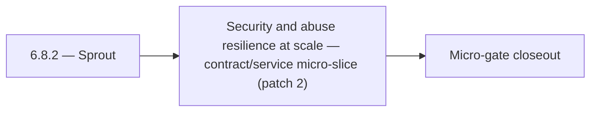

# 6.8.2 — Sprout

- **Era:** `6.x` Reliability and Scaling — hub [`versions.md`](../versions.md) · minors start at [`6.0 — Reliability and Scaling era umbrella`](6.0%20%E2%80%94%20Reliability%20and%20Scaling%20era%20umbrella.md)
- **Minor:** [6.8 — Security and abuse resilience at scale](./6.8 — Security and abuse resilience at scale.md)
- **Codename:** Sprout
- **Status:** ✅ Completed
## Focus
Security and abuse resilience at scale — contract/service micro-slice (patch 2)

## Flowchart

## Micro-gate

| Track | Gate question | Answer / Evidence (fill at patch closeout) |
| --- | --- | --- |
| **Contract** | SLO/SLI, idempotency, DLQ envelope, trace propagation — `docs/backend/apis/` + matrices updated? | Document at patch closeout. |
| **Service** | Retry/DLQ, rate limits, abuse guards, HF/SMTP/provider paths — smoke + caps documented? | Document smoke paths. |
| **Surface** | Ops dashboards, `/status`, degraded-mode UX — delta for this patch? | Document UX delta or N/A. |
| **Frontend** | Dashboard/extension reliability patterns (`components.md` Era 6) touched? | Abuse resilience, rate limits, security controls at scale. Document at closeout. |
| **Data** | Lineage, retention, Redis/DB-backed idempotency state — migrations recorded? | Document lineage or N/A. |
| **Ops** | SLO panels, alerts, chaos/runbook refs (`queue-observability.md`, RC) — delta? | Document ops delta or N/A. |

## Tasks
### Contract
- ✅ Completed: 📌 Planned: **[appointment360]** — refine duplicate task (was: 📌 planned: middleware ordering: trace → body size → auth → i…) | patch `6.8.2` band `2` | reason: specialize this file vs sibling patches; see docs/codebases/appointment360-codebase-analysis.md
- ✅ Completed: 📌 Planned: **[appointment360]** — refine duplicate task (was: 📌 planned: define slo targets for contact.ai:) | patch `6.8.2` band `2` | reason: specialize this file vs sibling patches; see docs/codebases/appointment360-codebase-analysis.md
- ✅ Completed: 📌 Planned: **[appointment360]** — refine duplicate task (was: availability target: 99.5%) | patch `6.8.2` band `2` | reason: specialize this file vs sibling patches; see docs/codebases/appointment360-codebase-analysis.md
- ✅ Completed: 📌 Planned: **[appointment360]** — refine duplicate task (was: 📌 planned: define slos: p95 single verify latency, bulk comp…) | patch `6.8.2` band `2` | reason: specialize this file vs sibling patches; see docs/codebases/appointment360-codebase-analysis.md

### Service
- ✅ Completed: 📌 Planned: **[appointment360]** — refine duplicate task (was: 📌 planned: add optimistic lock (version column or etag) to `…) | patch `6.8.2` band `2` | reason: specialize this file vs sibling patches; see docs/codebases/appointment360-codebase-analysis.md
- ✅ Completed: 📌 Planned: **[appointment360]** — refine duplicate task (was: 📌 planned: health endpoint improvements: `/health/db` must r…) | patch `6.8.2` band `2` | reason: specialize this file vs sibling patches; see docs/codebases/appointment360-codebase-analysis.md
- ✅ Completed: 📌 Planned: **[appointment360]** — refine duplicate task (was: 📌 planned: add clear `processing` and `failed` transitions f…) | patch `6.8.2` band `2` | reason: specialize this file vs sibling patches; see docs/codebases/appointment360-codebase-analysis.md
- ✅ Completed: 📌 Planned: **[appointment360]** — refine duplicate task (was: 📌 planned: add chunk-level idempotency token: generate per s…) | patch `6.8.2` band `2` | reason: specialize this file vs sibling patches; see docs/codebases/appointment360-codebase-analysis.md

### Surface

- ✅ Completed: 📌 Planned: **[connectra]** — Verify UX for route `/` and bindings (patch 6.8.2 band 2) | area: `frontend-page` | files: `contact360/dashboard/app/page.tsx` | reason: Dashboard/extension surface for era 6 must match gateway contracts

### Data

- ✅ Completed: 📌 Planned: **[appointment360]** — refine duplicate task (was: 📌 planned: **[appointment360]** — update postgresql/es/s3 li…) | patch `6.8.2` band `2` | reason: specialize this file vs sibling patches; see docs/codebases/appointment360-codebase-analysis.md

### Ops

- ✅ Completed: 📌 Planned: **[platform]** — Record smoke evidence, rollback, and alerts (patch band 2: charter/P0) | area: `ops` | files: `docs/commands/`, `.github/workflows/` | reason: Smoke, rollback, and observability for patch 6.8.2

## Service task slices
> Merged from era `6.x` reliability/scaling task packs (P0→`.0`–`.2`, P1→`.3`–`.6`, Ops→`.7`–`.9`).

### Connectra
- Query P95 SLO baseline captured in dashboards.
- Batch-upsert idempotency test passes (duplicate submission).
- Drift detector runs on schedule with last success timestamp exported.
- CORS + per-tenant rate limit reviewed by security; no wildcard prod misconfig.

### Appointment360 (gateway)
- Document SLO targets (error budget 1.0%, latency p99 < 2s) in docs/governance.md
- Define /health/slo endpoint contract: returns current error rate, budget consumed
- Define /health/db response schema: pool size, overflow, active connections
- Enable GraphQLRateLimitMiddleware: set GRAPHQL_RATE_LIMIT_REQUESTS_PER_MINUTE > 0 in production
- Enable GraphQLMutationAbuseGuardMiddleware: set ABUSE_GUARDED_MUTATIONS list
- Enable GraphQLIdempotencyMiddleware: set IDEMPOTENCY_REQUIRED_MUTATIONS list
- Enable QueryComplexityExtension: set GRAPHQL_COMPLEXITY_LIMIT to 100
- Enable QueryTimeoutExtension: set GRAPHQL_QUERY_TIMEOUT to 30s
- Add get_pool_stats() to db/session.py and expose via /health/db
- Add check_pool_health() and alert if overflow > 0
- Configure database pool: DATABASE_POOL_SIZE=25, DATABASE_MAX_OVERFLOW=50
- Retry-safe mutations: ensure billing/payment mutations send X-Idempotency-Key
- Instrument DB session events: log slow queries (> 500ms)
- Add request_id + trace_id to all log lines for correlation
- Add RED metrics (rate, error, duration) aggregation store
- Set GRAPHQL_MAX_BODY_BYTES=2097152 (2MB) in production

### Mailvetter
- Define SLOs: p95 single verify latency, bulk completion SLA, queue lag thresholds.
- Define idempotent bulk job-create behavior.
- Move rate limiter to Redis-backed distributed implementation.
- Add idempotency key support on bulk create endpoint.
- Add worker retry + dead-letter queue.
- Add clear `processing` and `failed` transitions for jobs.
- Add `job_events` and `job_failures` tables.
- Add correlation IDs in job/result rows for traceability.

### emailapis / emailapigo
- SLO table row for Emailapis added in [`slo-idempotency.md`](slo-idempotency.md).
- `emailapis_endpoint_era_matrix.json` includes era `6.x` reliability notes (timeouts, circuits, concurrency).
- Provider degradation runbook reviewed in tabletop exercise.
- Staging load test: bulk job completes within **P95** target without OOM or goroutine leak.

## Evidence gate
Patch closeout includes contract diff, smoke output, data lineage delta, and ops note
